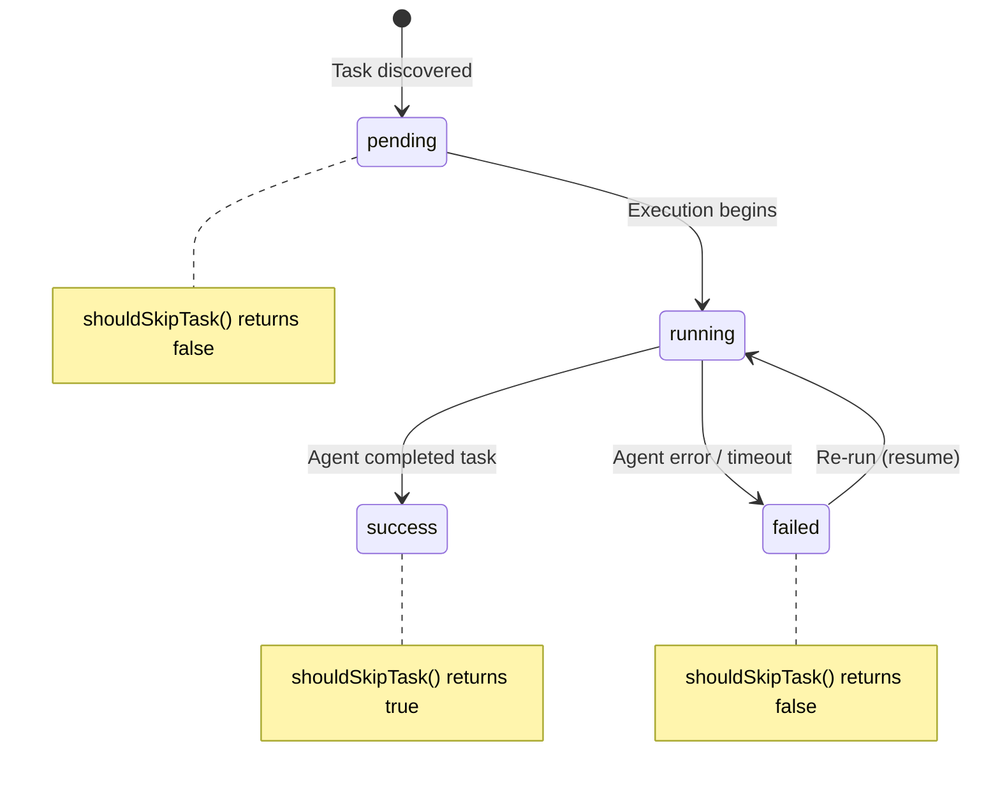

# Run State Persistence

The run-state module (`src/helpers/run-state.ts`) provides a lightweight
mechanism for persisting task execution status to disk. It enables a future
"resume" capability where a re-run of Dispatch skips tasks that already
completed successfully in a previous run.

## Current usage status

The run-state module is **exported via the helpers barrel** (`src/helpers/index.ts`)
but is **not yet consumed by the [orchestrator pipeline](../cli-orchestration/orchestrator.md)**. Its functions appear
only in test files. The interfaces and persistence logic are fully implemented
and ready for integration into the [dispatch pipeline](../planning-and-dispatch/overview.md) when the resume feature is
activated.

## Data model

### RunStateTask

Each task in a run is tracked by a `RunStateTask` record:

| Field | Type | Description |
|-------|------|-------------|
| `id` | `string` | Unique identifier in the format `<filename>:<line>` |
| `status` | `"pending" \| "running" \| "success" \| "failed"` | Current lifecycle state |
| `branch` | `string?` | Optional branch name associated with the task (validated by [branch validation](./branch-validation.md)) |

### RunState

The top-level state object for an entire run:

| Field | Type | Description |
|-------|------|-------------|
| `runId` | `string` | Unique identifier for this run (e.g., a UUID) |
| `preRunSha` | `string` | The git commit SHA at the start of the run, used to detect repository changes between runs |
| `tasks` | `RunStateTask[]` | Array of all tasks and their statuses |

## Task lifecycle state machine

A `RunStateTask` transitions through four states. The state machine is linear
with one branch: a task that starts running either succeeds or fails.



Key semantics:

- **pending → running**: The orchestrator picks up the task and starts an agent
  session.
- **running → success**: The agent completes the task without error.
- **running → failed**: The agent encounters an error, times out, or the
  process is interrupted.
- **failed → running**: On a subsequent run, failed tasks are eligible for
  re-execution (they are not skipped).
- **success is terminal**: Once a task reaches `success`, `shouldSkipTask`
  returns `true` and the task is not re-executed. There is no mechanism to
  reset a successful task without manually editing the state file.

## State file format

The state file is written to `.dispatch/run-state.json` relative to the
working directory. The constants `DISPATCH_DIR = ".dispatch"` and
`STATE_FILE = "run-state.json"` define this path.

Example file content:

```json
{
  "runId": "a1b2c3d4-e5f6-7890-abcd-ef1234567890",
  "preRunSha": "abc123def456789",
  "tasks": [
    {
      "id": "tasks.md:5",
      "status": "success",
      "branch": "john-doe/dispatch/123-fix-auth-bug"
    },
    {
      "id": "tasks.md:12",
      "status": "failed"
    },
    {
      "id": "backlog.md:3",
      "status": "pending"
    }
  ]
}
```

The JSON is pretty-printed with two-space indentation for human readability.

## Task ID construction

`buildTaskId(task)` constructs a task identifier from a parsed `Task` object
(see [Task Parsing — API Reference](../task-parsing/api-reference.md)):

```
<basename(task.file)>:<task.line>
```

For example, a task at line 5 of `path/to/tasks.md` produces the ID
`tasks.md:5`.

### Stability of task IDs

Task IDs depend on the **line number** of the checkbox in the source file. If
lines are inserted or deleted above a task between runs, the task's ID changes
and it will not match the stored state — causing it to be re-executed even if
it previously succeeded. This is a known limitation of the current design.

Mitigations for production use could include:

- Content-based hashing of the task text
- Embedding stable identifiers in the markdown (e.g., `<!-- id: xyz -->`)
- Fuzzy matching on task text when line numbers shift

None of these are currently implemented.

## Skip logic

`shouldSkipTask(taskId, state)` determines whether a task should be skipped
during a resume run:

1. If `state` is `null` (no previous state file), returns `false` — all tasks
   execute.
2. If no entry matches `taskId` in the `tasks` array, returns `false` — new
   tasks are not skipped.
3. If the matching entry has `status === "success"`, returns `true` — the task
   is skipped.
4. For any other status (`pending`, `running`, `failed`), returns `false` — the
   task is re-executed.

The `running` status in a loaded state file indicates a task that was in
progress when the previous run was interrupted. These tasks are **not** skipped
because their execution did not complete.

## Atomic write strategy

`saveRunState` uses a write-to-temp-then-rename pattern to prevent partial
writes from corrupting the state file:

1. Ensure the `.dispatch/` directory exists (`mkdir` with `{ recursive: true }`).
2. Write the JSON to `run-state.json.tmp`.
3. Rename `run-state.json.tmp` to `run-state.json`.

The `rename` operation is atomic on POSIX filesystems — it either completes
fully or has no effect. On Windows with NTFS, `rename` within the same
directory is also atomic. This means that `loadRunState` will never read a
partially-written file; it will either see the previous complete state or the
new complete state.

### Why mkdir is called on every save

The `.dispatch/` directory may not exist on the first run or after a clean
checkout. The `{ recursive: true }` option makes `mkdir` a no-op if the
directory already exists, avoiding a race between checking existence and
creating the directory.

## Loading state

`loadRunState(cwd)` reads and parses the state file:

1. Attempts to read `.dispatch/run-state.json` as UTF-8.
2. Parses the content as JSON and casts to `RunState`.
3. Returns the parsed state, or `null` if any error occurs (file not found,
   parse error, permission error).

The broad `catch` means that a corrupted state file is treated the same as a
missing one — all tasks will execute. This is a safe default: the worst case
is re-executing a previously successful task, which is wasteful but not
harmful.

### No schema validation

`loadRunState` casts the parsed JSON directly to `RunState` without runtime
validation. If the file contains valid JSON that does not match the `RunState`
shape (e.g., missing `tasks` array, wrong status strings), the behavior is
undefined — `shouldSkipTask` may return incorrect results or throw at runtime.

For a production resume feature, adding runtime validation (e.g., with a
schema library) would improve robustness.

## Relationship to preRunSha

The `preRunSha` field records the git commit SHA at the start of a run. This
enables a future implementation to detect whether the repository has changed
between runs:

- If the current HEAD matches `preRunSha`, the codebase is unchanged and resume
  is safe.
- If the current HEAD differs, tasks may need re-execution because the code
  they were based on has changed.

This check is not currently implemented. The field is stored but not read back
by any decision logic.

## Related documentation

- [Overview](./overview.md) — Group-level summary and design decisions
- [Worktree Management](./worktree-management.md) — The worktree lifecycle that
  run-state is designed to complement
- [Task Parsing — API Reference](../task-parsing/api-reference.md) — The `Task`
  interface whose `file` and `line` fields are used by `buildTaskId`
- [Shared Types — Integrations](../shared-types/integrations.md) — Node.js
  `fs/promises` patterns including atomic write discussion
- [Architecture & Concurrency](../task-parsing/architecture-and-concurrency.md) —
  The read-modify-write pattern and file I/O safety considerations
- [Orchestrator](../cli-orchestration/orchestrator.md) — The dispatch pipeline
  that will consume run-state when the resume feature is activated
- [Dispatcher](../planning-and-dispatch/dispatcher.md) — The execution phase
  whose task results drive state transitions
- [Configuration System](../cli-orchestration/configuration.md) — CLI flag and
  config file resolution that precedes pipeline execution
- [Testing Overview](../testing/overview.md) — Project-wide test suite
  including run-state tests
- [Dispatch Pipeline Tests](../testing/dispatch-pipeline-tests.md) — Tests
  for the pipeline that will integrate with run-state
