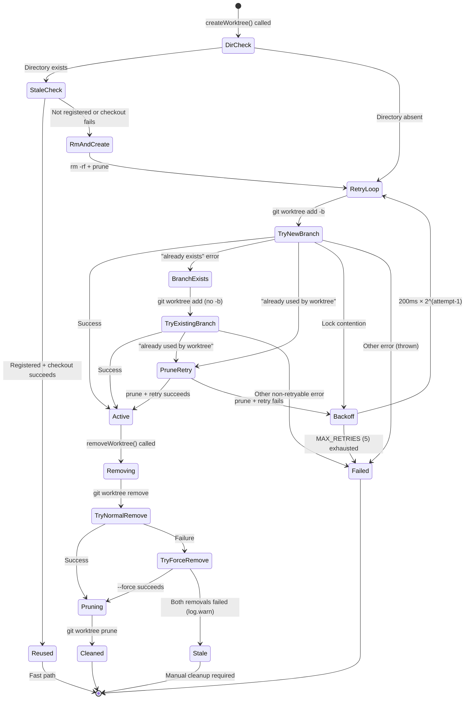

# Worktree Management

The worktree module (`src/helpers/worktree.ts`) manages the full lifecycle of
git worktrees used for parallel task execution. It provides four exported
functions — `worktreeName`, `createWorktree`, `removeWorktree`, and
`listWorktrees` — plus an internal `git()` helper that wraps `execFile`.

## Directory layout

All worktrees are created under a single base directory relative to the
repository root:

```
<repoRoot>/
├── .dispatch/
│   └── worktrees/
│       ├── 123-fix-auth-bug/      ← worktree for issue 123
│       ├── 456-add-search/        ← worktree for issue 456
│       └── ...
├── .gitignore                     ← contains ".dispatch/worktrees/"
└── (rest of repository)
```

The constant `WORKTREE_DIR = ".dispatch/worktrees"` defines this path. It is
not configurable at runtime.

## Worktree name derivation

`worktreeName(issueFilename)` converts an issue filename into a directory name:

1. Extract the basename (strip any leading path components via `path.basename`).
2. Remove the `.md` extension (case-insensitive regex `\.md$`).
3. Check for a leading numeric ID (regex `/^\d+/`).
    - **If found**: Return `issue-<id>` (e.g., `123-fix-auth-bug.md` → `issue-123`).
    - **If not found**: Pass the extension-stripped name through
      [`slugify()`](../shared-utilities/slugify.md) and return the result.

The slugify fallback applies when issue filenames lack a leading numeric ID
(e.g., `feature-request.md` → `feature-request`). The `slugify()` function
lowercases the input, replaces non-alphanumeric character runs with hyphens,
and trims leading/trailing hyphens. The call does **not** pass a `maxLength`
argument, so the default `MAX_SLUG_LENGTH` of 60 from `slugify.ts` is **not**
applied — the slug is unbounded. In practice, issue filenames are short enough
that this does not cause filesystem path-length issues.

Examples:

| Input | Derivation | Output |
|-------|-----------|--------|
| `123-fix-auth-bug.md` | Leading digits `123` found | `issue-123` |
| `/tmp/dispatch-abc/123-fix.md` | basename → `123-fix.md`, digits `123` | `issue-123` |
| `456-Add Search!.MD` | basename → `456-Add Search!.MD`, digits `456` | `issue-456` |
| `no-number-here.md` | No leading digits → slugify | `no-number-here` |
| `Feature Request!.md` | No leading digits → slugify | `feature-request` |

## Creating a worktree

`createWorktree(repoRoot, issueFilename, branchName, startPoint?)` creates a
worktree and returns its absolute path. The function implements a multi-stage
strategy that handles stale directories, existing branches, lock contention,
and stale worktree refs — all with retry and exponential backoff.

### Stale directory detection and reuse

Before attempting to create a new worktree, `createWorktree` checks whether the
target directory already exists on disk (`existsSync`). If it does:

1. **Validate registration**: Runs `git worktree list --porcelain` and checks
   whether the path appears as a registered worktree (substring match on
   `worktree <path>\n`).

2. **Reuse if registered**: If the directory is a registered worktree, attempts
   to reset it to a clean state:
   - `git checkout --force <branchName>` in the worktree directory
   - `git clean -fd` to remove untracked files
   - If both succeed, returns the existing path immediately (fastest path).
   - If checkout fails (wrong branch, corrupt state), falls through to
     removal and recreation.

3. **Remove stale directory**: If the directory exists but is **not** a
   registered worktree, or if reuse failed, the directory is removed with
   `rm -rf` (via `fs/promises.rm({ recursive: true, force: true })`) and a
   `git worktree prune` is run (errors silenced) before proceeding to creation.

### Retry loop with exponential backoff

After stale directory handling, creation enters a retry loop with the following
constants:

| Parameter | Value | Purpose |
|-----------|-------|---------|
| `MAX_RETRIES` | `5` | Total creation attempts before giving up |
| `BASE_DELAY_MS` | `200` | Base delay for exponential backoff |

The backoff delays are: 200ms, 400ms, 800ms, 1600ms, 3200ms (formula:
`BASE_DELAY_MS * 2^(attempt-1)`).

### Creation retry flowchart

```mermaid
flowchart TD
    Start([createWorktree called]) --> DirCheck{Directory exists<br/>on disk?}
    DirCheck -- No --> RetryLoop
    DirCheck -- Yes --> Porcelain["git worktree list --porcelain"]
    Porcelain --> Registered{Path is registered<br/>worktree?}
    Registered -- Yes --> Checkout["git checkout --force branch<br/>git clean -fd"]
    Checkout --> CheckoutOk{Checkout<br/>succeeded?}
    CheckoutOk -- Yes --> Reused([Return existing path])
    CheckoutOk -- No --> RmDir["rm -rf worktreePath<br/>git worktree prune"]
    Registered -- No --> RmDir
    RmDir --> RetryLoop

    RetryLoop["Retry loop<br/>(attempt 1..5)"] --> TryAdd["git worktree add path -b branch"]
    TryAdd --> AddOk{Success?}
    AddOk -- Yes --> Created([Return worktree path])
    AddOk -- No --> ErrType{Error type?}

    ErrType -- "already exists" --> TryNoBranch["git worktree add path branch<br/>(without -b)"]
    TryNoBranch --> NoBranchOk{Success?}
    NoBranchOk -- Yes --> Created
    NoBranchOk -- No --> UsedCheck{"already used<br/>by worktree"?}
    UsedCheck -- Yes --> Prune1["git worktree prune<br/>then retry add"]
    Prune1 --> PruneOk1{Success?}
    PruneOk1 -- Yes --> Created
    PruneOk1 -- No --> Backoff

    ErrType -- "already used<br/>by worktree" --> Prune2["git worktree prune<br/>then retry add"]
    Prune2 --> PruneOk2{Success?}
    PruneOk2 -- Yes --> Created
    PruneOk2 -- No --> Backoff

    ErrType -- "lock" or<br/>"already" --> Backoff["Wait BASE_DELAY * 2^(attempt-1)<br/>then next attempt"]
    Backoff --> RetryLoop

    ErrType -- Other error --> Throw([Throw immediately])
    UsedCheck -- No --> Throw
```

### Error classification

The retry loop classifies errors into three categories:

| Error message contains | Classification | Action |
|------------------------|---------------|--------|
| `"already exists"` | Branch already exists | Retry without `-b` flag; if that fails with "already used by worktree", prune and retry |
| `"already used by worktree"` | Stale worktree ref | `git worktree prune` then retry |
| `"lock"` or other `"already"` | Lock contention / race | Exponential backoff and retry |
| Anything else | Non-retryable | Throw immediately |

### Normal creation path

When no stale state exists, the function executes
`git worktree add <path> -b <branchName> [startPoint]` in the repository root.
The `-b` flag tells git to create a new branch and check it out in the
worktree. When `startPoint` is provided, the new branch is created at that
commit instead of `HEAD`. When omitted, the branch points to the current `HEAD`
of the main working tree.

### Branch-exists fallback

If the `git worktree add -b` command fails with an error message containing
`"already exists"`, the function retries with
`git worktree add <path> <branchName>` (without `-b`). This handles the case
where a previous run created the branch but the worktree was cleaned up or the
run was interrupted before the branch was deleted.

If the retry-without-`-b` also fails with `"already used by worktree"`, the
function prunes stale worktree refs and tries one more time. If this final
attempt also fails, the error feeds into the exponential backoff loop.

### What happens to the branch after removal

Git worktree removal (`git worktree remove`) does **not** delete the associated
branch. The branch persists in the repository's ref namespace. Dispatch does
not explicitly delete worktree branches after removal. Over many runs, stale
branches may accumulate and require manual cleanup:

```bash
# List branches created by Dispatch
git branch --list '*/dispatch/*'

# Delete a stale branch
git branch -d john-doe/dispatch/123-fix-auth-bug
```

### Minimum Git version

`git worktree add` has been available since Git 2.5 (July 2015).
`git worktree remove` requires Git 2.17 (April 2018).
`git worktree list --porcelain` requires Git 2.15 (October 2017).
Dispatch does not check the git version at runtime. If the installed git is
older than 2.17, the `removeWorktree` calls will fail (non-fatally, since
removal errors are logged as warnings). If older than 2.15, the stale
directory detection in `createWorktree` will fail and the function will fall
through to the retry loop.

The [prerequisite checks](../../src/helpers/prereqs.ts) verify that the `git`
binary is available but do not assert a minimum version.

## Removing a worktree

`removeWorktree(repoRoot, issueFilename)` uses a three-stage strategy:

1. **Normal remove**: `git worktree remove <path>`. Succeeds if the worktree
   directory is clean (no untracked files or uncommitted modifications).

2. **Force remove**: If normal remove fails (for any reason), retries with
   `git worktree remove --force <path>`. This removes the worktree even if it
   contains untracked files or uncommitted changes.

3. **Warn on failure**: If force remove also fails, the error is logged as a
   warning and the function returns normally. This is a deliberate design
   choice — a removal failure should not abort an otherwise successful run.

After a successful removal (either normal or forced), the function runs
`git worktree prune` to clean up stale administrative files in
`$GIT_DIR/worktrees/`. If pruning itself fails, a warning is logged and
execution continues.

### When normal remove fails

`git worktree remove` (without `--force`) refuses to remove a worktree that
has:

- Uncommitted modifications to tracked files
- Untracked files in the worktree directory
- Submodules checked out in the worktree

In Dispatch's usage, the most common cause of a normal-remove failure is
untracked files left by an AI agent (e.g., build artifacts, editor temp files).
The force fallback handles this gracefully.

### Stale worktree cleanup

Dispatch automatically detects and handles stale worktrees during
`createWorktree`. If a worktree directory exists on disk but is not registered
in `git worktree list --porcelain`, or if a registered worktree cannot be
checked out to the desired branch, the directory is removed and recreated.

For worktrees left behind by `SIGKILL` (which cannot be caught) or system
crashes that are not detected by `createWorktree` (e.g., worktrees for
different issue files), manual cleanup is available:

```bash
# List all worktrees (including stale ones)
git worktree list

# Prune stale administrative references
git worktree prune

# Remove a stale directory manually
rm -rf .dispatch/worktrees/<name>
git worktree prune
```

The registered cleanup handler (via `registerCleanup`) ensures that `SIGINT`
and `SIGTERM` both trigger worktree removal. See
[Cleanup Registry](../shared-types/cleanup.md) for details.

## Listing worktrees

`listWorktrees(repoRoot)` returns the raw output of `git worktree list` (human-
readable format). Each line has the format:

```
<path>  <commit-hash>  [<branch>]
```

Note: the `createWorktree` stale-detection path uses `git worktree list
--porcelain` (machine-readable format) instead, which outputs structured
key-value pairs for reliable path matching.

Both forms are used because they serve different purposes: the human-readable
format is adequate for diagnostics, while the porcelain format provides
reliable substring matching for path validation.

This function is intended for diagnostics. If the command fails, it returns an
empty string and logs a warning.

## Error handling philosophy

All four exported functions follow the same principle: **worktree operations are
best-effort and non-fatal**. The functions either succeed or log a warning. This
is because:

- Worktree operations are infrastructure supporting the real work (task
  execution). A cleanup failure should not mask a successful task result.
- The orchestrator registers cleanup handlers as a safety net. The explicit
  `removeWorktree` call after task completion is the happy path; the cleanup
  handler catches the unhappy path.
- Git worktree state is self-healing: `git worktree prune` can always clean up
  stale references, and stale directories can be manually removed.

## Concurrency considerations

When `useWorktrees` is enabled, the orchestrator runs `processIssueFile` for
each issue file concurrently via `Promise.all`. Each invocation calls
`createWorktree` with a different issue filename, so worktree paths never
collide (assuming issue filenames are unique, which is guaranteed by the
filesystem).

The internal `git()` helper executes `git` as a child process. Multiple
concurrent git commands targeting the **same repository** are generally safe for
worktree operations because each worktree has its own index and working
directory. However, operations that modify shared refs (e.g., branch creation)
use git's internal locking (`$GIT_DIR/refs/` lock files) to serialize access.

## Generating feature branch names

`generateFeatureBranchName()` produces a branch name for tasks that do not
originate from an issue tracker (e.g., the `--feature` CLI flag):

```
dispatch/feature-<8-hex-chars>
```

The 8 hex characters are the first segment of a `crypto.randomUUID()` output,
split on the first hyphen. This provides 32 bits of entropy (4.3 billion
possible values), which is sufficient to avoid collisions in practice. A
typical Dispatch session creates at most a handful of feature branches.

The generated name always passes [`isValidBranchName()`](./branch-validation.md)
because it contains only lowercase hex characters, hyphens, and a single slash.

### UUID entropy considerations

Using only the first 8 hex characters of a UUID (32 bits) rather than the full
128 bits is a deliberate tradeoff:

- **Readability**: Short branch names are easier to read in `git log` and
  `git branch` output.
- **Collision probability**: With 32 bits, collisions become likely around
  ~65,000 branches (birthday bound). Since Dispatch branches are cleaned up
  regularly, the active set is typically under 100.
- **Runtime requirement**: `crypto.randomUUID()` is available in Node.js 19+
  and is a built-in API — no polyfill is needed. The project's minimum Node.js
  version requirement covers this.

## Worktree lifecycle state diagram

The following diagram shows the states a worktree passes through from creation
to removal, including all error recovery paths:



**Key observations:**

- **Stale directory reuse**: When a worktree directory already exists and is
  registered with git, the function attempts to reuse it via
  `checkout --force` + `clean -fd`. This is the fastest path and avoids
  unnecessary directory recreation.

- **Exponential backoff**: Lock contention and race conditions between
  concurrent worktree operations are handled with up to 5 retries using
  exponential backoff (200ms base, doubling each attempt).

- **Branch-exists fallback**: When the `-b` flag fails because the branch
  already exists, the retry uses `git worktree add <path> <branch>` which
  checks out the existing branch at **its current HEAD** — not at the commit
  where `createWorktree` was called. If the branch has been advanced by a
  previous run, the worktree will reflect those changes.

- **Prune-then-retry**: When git reports a path or branch is "already used by
  worktree" (a stale ref from a crashed process), the function prunes and
  retries before falling back to exponential backoff.

- **Non-fatal removal**: Both removal paths (normal and force) catch errors
  and log warnings rather than throwing. This ensures that a removal failure
  never masks a successful task execution result.

- **Branch persistence**: Neither `removeWorktree` nor `git worktree remove`
  deletes the branch. Branches accumulate across runs and require manual
  cleanup (see [branch cleanup](#what-happens-to-the-branch-after-removal)).

## Related documentation

- [Overview](./overview.md) — Group-level summary and worktree lifecycle
  flowchart
- [Authentication](./authentication.md) — OAuth pre-authentication that runs
  before worktree creation in the pipeline
- [Branch Validation](./branch-validation.md) — Validation rules applied to
  branch names before worktree creation
- [Integrations](./integrations.md) — Git CLI, `execFile`, and `fs/promises`
  details
- [Gitignore Helper](./gitignore-helper.md) — Keeps `.dispatch/worktrees/`
  out of version control
- [Run State Persistence](./run-state.md) — Task status persistence that
  complements the worktree lifecycle
- [Testing](./testing.md) — 25 worktree tests covering creation, removal,
  naming, and feature branch generation
- [Shared Utilities — Slugify](../shared-utilities/slugify.md) — The slug
  algorithm used by `worktreeName`
- [Cleanup Registry](../shared-types/cleanup.md) — Safety-net cleanup on
  signals and errors
- [Dispatch Pipeline](../cli-orchestration/dispatch-pipeline.md) — The execution
  engine that creates and removes worktrees during parallel issue processing
- [Worktree Lifecycle](../dispatch-pipeline/worktree-lifecycle.md) — Pipeline-level
  worktree lifecycle with retry logic and feature branch integration
