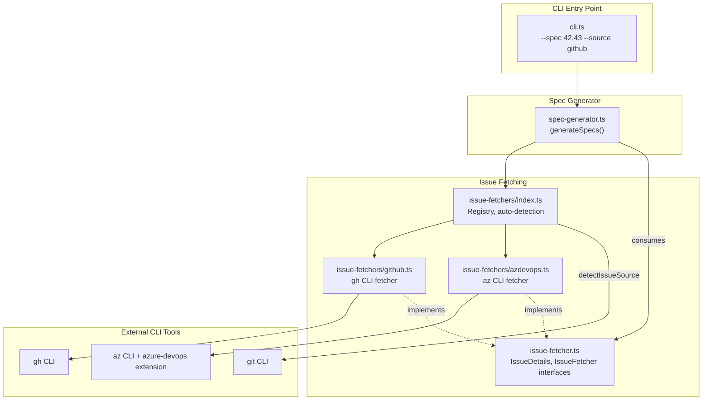
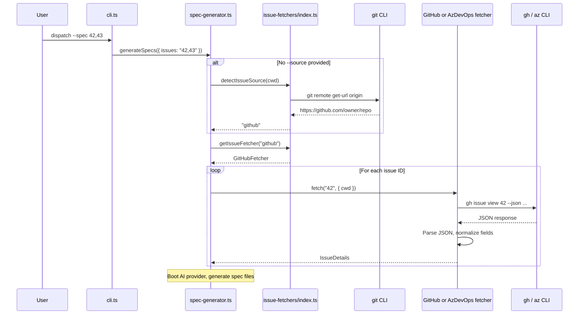

# Issue Fetching

> **Deprecated.** The `IssueFetcher` interface and the `src/issue-fetchers/`
> modules described on this page are deprecated compatibility shims. The actual
> implementation now lives in `src/datasources/` using the `Datasource`
> interface. The shims delegate all calls to the new datasource layer via
> `.bind()` and contain no business logic. See the
> [Deprecated Compatibility Layer](../deprecated-compat/overview.md) for
> migration guidance and removal assessment.

The issue fetching subsystem retrieves issues and work items from external
trackers (GitHub Issues, Azure DevOps Work Items) and normalizes them into a
common `IssueDetails` structure consumed by the
[spec generator](../spec-generation/overview.md). It is the data-ingestion
layer of the `--spec` pipeline.

## What it does

When a user runs `dispatch --spec 42,43,44`, the system needs to fetch the
details of each issue from the appropriate tracker. The issue fetching group:

1. **Detects the issue source** by inspecting the git `origin` remote URL
   (or accepts an explicit `--source` flag).
2. **Selects the correct fetcher** from a strategy-pattern registry.
3. **Fetches issue data** by shelling out to the platform's official CLI tool
   (`gh` for GitHub, `az` for Azure DevOps).
4. **Normalizes the response** into a common `IssueDetails` interface that
   the spec generator consumes.

## Why it exists

Different teams use different issue trackers. Rather than coupling the spec
generator to a single tracker's API, the issue fetching layer provides a
uniform interface so the rest of the pipeline operates on the same data
structure regardless of where the issue originated.

The system uses CLI tools (`gh`, `az`) instead of HTTP APIs or SDKs for three
reasons:

1. **Authentication reuse.** Users authenticate once via `gh auth login` or
   `az login`. The CLI tools manage token storage, refresh, and multi-account
   switching. Using HTTP APIs directly would require dispatch to
   implement its own credential management.
2. **Zero additional dependencies.** No GitHub REST/GraphQL client library or
   Azure DevOps SDK is added to the dependency tree. The only runtime
   requirement is that the CLI tool is installed.
3. **Simplicity.** A single `execFile` call with JSON output replaces
   dozens of lines of API client setup, pagination handling, and error
   mapping. The trade-off is a runtime dependency on external binaries.

## Architecture



## Data flow

The following sequence shows how issue data flows from an external tracker
through the fetching layer into the spec generator:



## Key source files

| File | Role |
|------|------|
| `src/issue-fetcher.ts` | Defines `IssueDetails`, `IssueFetcher`, `IssueFetchOptions`, and `IssueSourceName` |
| `src/issue-fetchers/index.ts` | Fetcher registry, `ISSUE_SOURCE_NAMES`, `getIssueFetcher()`, and `detectIssueSource()` |
| `src/issue-fetchers/github.ts` | GitHub fetcher -- shells out to `gh issue view` |
| `src/issue-fetchers/azdevops.ts` | Azure DevOps fetcher -- shells out to `az boards work-item show` |

## The IssueDetails interface

All fetchers normalize tracker-specific data into this common structure
(defined in `src/issue-fetcher.ts:20-37`). The same structure is used by the
[Datasource interface](../datasource-system/overview.md#the-issuedetails-interface):

| Field | Type | Description | GitHub source | Azure DevOps source |
|-------|------|-------------|--------------|-------------------|
| `number` | `string` | Issue or work item ID | `issue.number` | `item.id` |
| `title` | `string` | Title | `issue.title` | `fields["System.Title"]` |
| `body` | `string` | Description (may contain HTML or markdown) | `issue.body` (markdown) | `fields["System.Description"]` (HTML) |
| `labels` | `string[]` | Tags or labels | `issue.labels[].name` | `fields["System.Tags"]` split by `;` |
| `state` | `string` | Current state | `issue.state` (e.g., `"OPEN"`) | `fields["System.State"]` (e.g., `"Active"`) |
| `url` | `string` | Web UI link | `issue.url` | `item._links.html.href` |
| `comments` | `string[]` | Discussion comments as `**author:** text` | From `issue.comments` array | From `az boards work-item relation list-comment` |
| `acceptanceCriteria` | `string` | Acceptance criteria text | Always `""` (see [design note](#acceptance-criteria-on-github)) | `fields["Microsoft.VSTS.Common.AcceptanceCriteria"]` |

### Body content format

The `body` field may contain either markdown (GitHub) or HTML (Azure DevOps).
The spec generator passes this content directly into the AI prompt without
sanitization or conversion. The AI agent is expected to interpret both formats
when generating the spec. This is documented in the `IssueDetails` interface:
`"Full description / body (may contain HTML or markdown)"`.

If HTML content from Azure DevOps causes issues in spec generation, a
markdown-conversion step could be added to the Azure DevOps fetcher. This is
not currently implemented.

### Acceptance criteria on GitHub

The GitHub fetcher always returns an empty string for `acceptanceCriteria`
(`src/issue-fetchers/github.ts:51`). This is intentional -- GitHub Issues do
not have a dedicated acceptance criteria field. Azure DevOps provides this as
the `Microsoft.VSTS.Common.AcceptanceCriteria` work item field.

If your GitHub workflow uses a convention for acceptance criteria (e.g., an
`## Acceptance Criteria` section in the issue body, or a specific label), you
would need to extend the GitHub fetcher to parse the body or inspect labels.
Currently, the spec generator's AI prompt includes an "Acceptance Criteria"
section only when `acceptanceCriteria` is non-empty
(`src/spec-generator.ts:245-247`), so the empty string causes the section to
be omitted entirely for GitHub issues.

## Auto-detection of issue source

When the user omits `--source`, the spec generator calls
`detectIssueSource(cwd)` which:

1. Runs `git remote get-url origin` in the working directory.
2. Tests the URL against patterns in order (first match wins):

| Pattern | Detected source | Example URLs |
|---------|----------------|-------------|
| `/github\.com/i` | `github` | `https://github.com/owner/repo`, `git@github.com:owner/repo.git` |
| `/dev\.azure\.com/i` | `azdevops` | `https://dev.azure.com/org/project` |
| `/visualstudio\.com/i` | `azdevops` | `https://org.visualstudio.com/project` |

3. Returns `null` if no pattern matches, causing the spec generator to exit
   with an error message listing supported sources.

### Detection limitations

**Multiple remotes.** `detectIssueSource()` only inspects the `origin` remote.
If a repository has multiple remotes (e.g., `origin` pointing to GitHub and
`azure` pointing to Azure DevOps), only `origin` is checked. Use `--source` to
override when the origin remote does not point to the desired tracker.

**GitHub Enterprise.** Repositories hosted on GitHub Enterprise Server (e.g.,
`github.mycompany.com`) will not match the `github.com` pattern. The current
pattern is a case-insensitive match against the literal string `github.com`.
Use `--source github` to force GitHub detection for Enterprise hosts.

**SSH vs HTTPS.** Both URL formats are supported because the regex tests for
the presence of the hostname string anywhere in the URL:
- HTTPS: `https://github.com/owner/repo` -- matches `github.com`
- SSH: `git@github.com:owner/repo.git` -- matches `github.com`

**Custom domains or proxies.** A repository behind a custom domain that proxies
to both GitHub and Azure DevOps would not be auto-detected. Use `--source`.

**Pattern ordering.** The `SOURCE_PATTERNS` array
(`src/issue-fetchers/index.ts:52-56`) uses first-match-wins semantics. The
ordering is: GitHub first, then Azure DevOps (both `dev.azure.com` and
`visualstudio.com`). A URL matching multiple patterns (unlikely in practice
but possible with a custom domain containing both strings) would resolve to
the first match. The ordering is deliberate -- GitHub is the more common
platform.

### Git failures

If `git remote get-url origin` fails (e.g., the directory is not a git
repository, or no `origin` remote is configured), the `catch` block returns
`null`. The spec generator then logs a clear error message suggesting the user
specify `--source` explicitly.

## The fetcher registry

The registry in `src/issue-fetchers/index.ts` maps `IssueSourceName` values
to `IssueFetcher` implementations:

```
FETCHERS: Record<IssueSourceName, IssueFetcher> = {
  github: githubFetcher,
  azdevops: azdevopsFetcher,
}
```

It exports:
- **`ISSUE_SOURCE_NAMES`** -- array of registered source names, used by the CLI
  for `--source` validation and help text.
- **`getIssueFetcher(name)`** -- returns the fetcher or throws if the name is
  not registered.

### The IssueSourceName type

`IssueSourceName` is defined as `"github" | "azdevops"` -- a TypeScript string
literal union in `src/issue-fetcher.ts:15`. This type is manually maintained
and must be kept in sync with the `FETCHERS` registry. When adding a new
fetcher, you must update both the union type and the registry map. See the
[Adding a Fetcher guide](./adding-a-fetcher.md) for the complete checklist.

Deriving the type automatically from the `FETCHERS` registry keys (e.g.,
`type IssueSourceName = keyof typeof FETCHERS`) would eliminate this manual
sync step, but would require restructuring the imports since `IssueSourceName`
is defined in `issue-fetcher.ts` while `FETCHERS` is defined in
`issue-fetchers/index.ts`. The current design keeps the interface file free
of implementation imports.

## CLI invocation

Issue fetching is triggered via the `--spec` flag in the CLI:

```bash
# Auto-detect source from git remote
dispatch --spec 42,43,44

# Explicit source
dispatch --spec 42,43 --source github

# Azure DevOps with org and project
dispatch --spec 100,200 --source azdevops \
  --org https://dev.azure.com/myorg --project MyProject
```

The CLI passes options through to `generateSpecs()` in the spec generator,
which handles source detection, fetcher selection, and the AI spec generation
pipeline.

See [CLI argument parser](../cli-orchestration/cli.md) for full option
documentation and the `--spec` invocation details.

## Cross-group dependencies

- **[Spec Generation](../spec-generation/overview.md)** -- consumes
  `IssueDetails` to build AI prompts for spec file generation.
- **[CLI Entry Point](../cli-orchestration/cli.md)** -- parses `--spec`,
  `--source`, `--org`, `--project`, and `--output-dir` flags and delegates to
  the spec generator.

## Component index

- [GitHub Fetcher](./github-fetcher.md) -- GitHub CLI integration, setup,
  and troubleshooting
- [Azure DevOps Fetcher](./azdevops-fetcher.md) -- Azure CLI integration,
  setup, and troubleshooting
- [Integrations & Troubleshooting](../datasource-system/integrations.md) -- External CLI tool
  dependencies, subprocess behavior, and error handling
- [Adding a Fetcher](./adding-a-fetcher.md) -- Step-by-step guide for
  implementing a new issue tracker integration

## Related documentation

- [Deprecated Compatibility Layer](../deprecated-compat/overview.md) -- Migration
  guidance, removal safety assessment, and adapter pattern details
- [Datasource Overview](../datasource-system/overview.md) -- The current
  `Datasource` interface that supersedes `IssueFetcher`
- [Spec Generation](../spec-generation/overview.md) -- How the spec pipeline
  consumes `IssueDetails` for AI prompt construction
- [CLI Argument Parser](../cli-orchestration/cli.md) -- `--spec`, `--source`,
  `--org`, and `--project` flag documentation
- [Provider Abstraction](../provider-system/provider-overview.md) -- AI provider
  boot and session model used by the spec pipeline
- [Shared Types Overview](../shared-types/overview.md) -- Foundational type
  definitions shared across the pipeline
