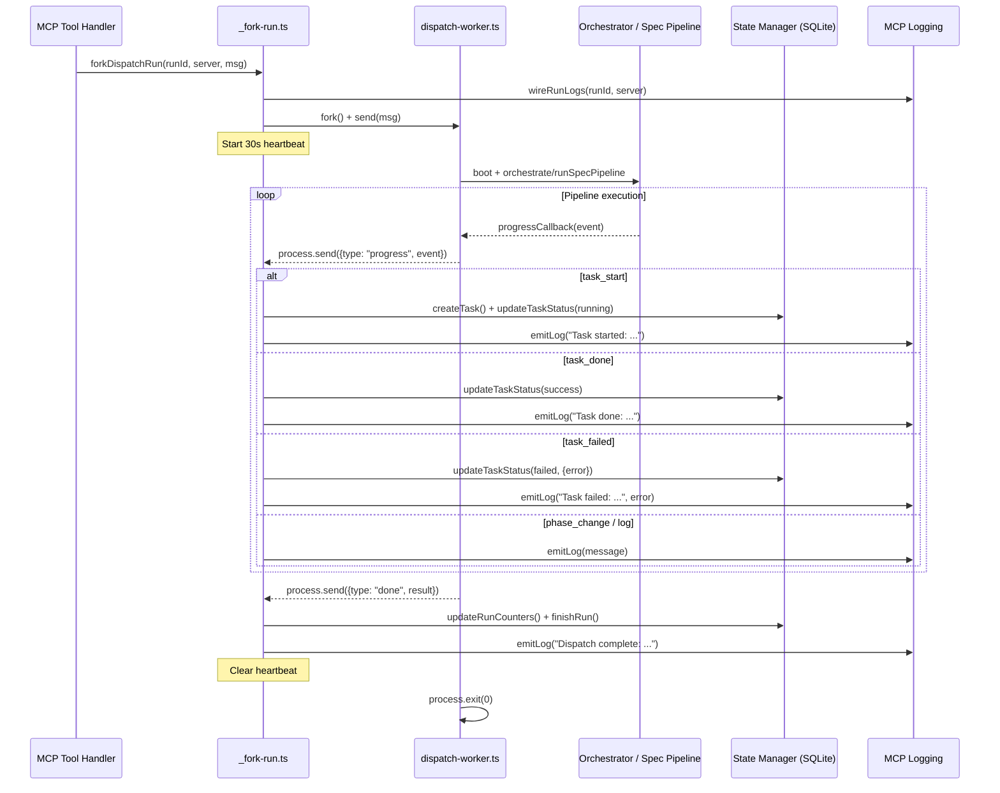

# Dispatch Worker

The dispatch worker is a child process entry point that executes Dispatch
pipelines (dispatch and spec generation) in isolation from the MCP server
process. It receives configuration via IPC, runs the appropriate
pipeline, and sends progress events back to the parent process.

## Why fork a child process

Pipeline execution involves long-running AI operations that can take minutes
or hours. Running these in the MCP server's main process would block the event
loop, preventing the server from handling monitoring requests, health checks,
or requests from other clients. Forking provides three guarantees:

1. **Crash isolation**: If a pipeline throws an unhandled exception or the AI
   provider hangs, the worker process exits without bringing down the MCP
   server. The parent detects the non-zero exit code and marks the run as
   failed.

2. **Non-blocking monitoring**: While a pipeline runs in the worker, the MCP
   server can still respond to `getRun()`, `listRuns()`, and
   `waitForRunCompletion()` tool calls from other clients.

3. **Resource isolation**: The worker has its own V8 heap and event loop. A
   memory leak or CPU spike in the pipeline does not degrade the server.

## Architecture

The worker process consists of a single module (`src/mcp/dispatch-worker.ts`)
and is orchestrated by the `_fork-run.ts` helper in the parent process.



## Worker message protocol

The parent sends exactly one message to the worker after forking. The message
type determines which pipeline the worker executes.

### Inbound messages (parent to worker)

| Type | Fields | Pipeline |
|------|--------|----------|
| `dispatch` | `cwd`, `opts` | Boots the orchestrator runner and calls `orchestrate()` |
| `spec` | `cwd`, `opts` | Calls `runSpecPipeline()` from `src/orchestrator/spec-pipeline.ts` |

All message types include `cwd` (the working directory) and `opts` (a
configuration object passed through from the tool handler). The `opts` object
is spread into the pipeline call, with a `progressCallback` injected by the
worker to relay events back to the parent.

### Outbound messages (worker to parent)

| Type | Fields | Meaning |
|------|--------|---------|
| `progress` | `event` | A dispatch pipeline progress event (task lifecycle, phase change, or log) |
| `spec_progress` | `event` | A spec pipeline progress event (item start, done, failed, or log) |
| `done` | `result` | Pipeline completed successfully; result contains outcome data |
| `error` | `message` | Pipeline threw an exception; message is the error string |

### Progress event subtypes

**Dispatch progress** (`type: "progress"`, `event.type`):

| Event type | Fields | State manager action |
|------------|--------|---------------------|
| `task_start` | `taskId`, `taskText`, `file?`, `line?` | `createTask()` then `updateTaskStatus(running)` |
| `task_done` | `taskId`, `taskText` | `updateTaskStatus(success)` |
| `task_failed` | `taskId`, `taskText`, `error` | `updateTaskStatus(failed, {error})` |
| `phase_change` | `phase`, `message?` | `emitLog(message)` — no DB write |
| `log` | `message` | `emitLog(message)` — no DB write |

**Spec progress** (`type: "spec_progress"`, `event.type`):

| Event type | Fields | Action |
|------------|--------|--------|
| `item_start` | `itemId`, `itemTitle?` | `emitLog()` |
| `item_done` | `itemId`, `itemTitle?` | `emitLog()` |
| `item_failed` | `itemId`, `itemTitle?`, `error` | `emitLog(error)` |
| `log` | `message` | `emitLog()` |

### Done message handling

The `_fork-run.ts` handler inspects the `done` result to determine the
appropriate final state:

- **Dispatch result** (has `completed` field): Updates run counters with
  `total`, `completed`, and `failed` values. Marks the run as `failed` if
  `result.failed > 0`, otherwise `completed`.

- **Custom handler**: If `options.onDone` is provided, the done result is
  delegated to that callback instead of the default handling. This is used
  by tool handlers that need custom result processing.

### Error message handling

If the pipeline throws an exception, the worker catches it and sends an
`error` message with the stringified error. The parent marks the run as
`failed` with the error message and emits an error-level log notification.

## Worker lifecycle

### Startup

1. `_fork-run.ts` calls `fork(WORKER_PATH, [], { stdio: [..., "ipc"] })` to
   spawn the worker as a child process with IPC enabled.

2. The parent immediately sends the worker message (dispatch or spec)
   via `worker.send(workerMessage)`.

3. The worker listens for the message via `process.on("message", ...)` and
   calls `handleMessage()`.

### Execution

4. `handleMessage()` routes to the appropriate pipeline based on `msg.type`:
    - `dispatch`: Calls `bootOrchestrator({ cwd })` then
      `orchestrator.orchestrate({...opts, progressCallback})`.
    - `spec`: Calls `runSpecPipeline({...opts, progressCallback})`.

5. Each pipeline receives a `progressCallback` that relays events to the
   parent via `process.send!()`.

### Completion

6. On success, the worker sends `{type: "done", result}` and calls
   `process.exit(0)`.

7. On error, the worker sends `{type: "error", message}` and calls
   `process.exit(0)`. Note: the worker exits with code 0 even on pipeline
   errors — the error is communicated via the IPC message. A non-zero exit
   code indicates an unexpected crash (e.g., unhandled rejection before the
   try/catch).

### Crash handling

8. If the worker exits with a non-zero code (or null, indicating a signal
   kill), the `exit` event handler in `_fork-run.ts`:
    - Clears the heartbeat interval.
    - Calls `finishRun(runId, "failed", "Worker process exited with code N")`.
    - Emits an error-level log: `"Worker process exited unexpectedly (code N)"`.

This ensures that orphaned runs are always moved to a terminal state, even
if the worker crashes before sending a done or error message.

## Heartbeat

`_fork-run.ts` sets up a 30-second heartbeat interval that calls
`emitLog(runId, "Run {runId} still in progress...")`. This serves two
purposes:

1. **Client keep-alive**: Some MCP clients may have idle timeouts on SSE
   connections. The heartbeat prevents the connection from being closed
   during long-running operations.

2. **Liveness indicator**: Clients can distinguish between a run that is
   actively executing and one that has silently stalled by checking whether
   heartbeat messages are still arriving.

The heartbeat is cleared when the worker exits (in the `exit` event handler).

## Integration with Node.js child_process

The worker uses `child_process.fork()` which:

- Spawns a new Node.js process executing the specified module file.
- Establishes an IPC channel between parent and child for structured message
  passing via `process.send()` and `process.on("message", ...)`.
- Provides separate stdio streams — the worker's stdout/stderr do not
  interfere with the parent's MCP protocol streams.

The `stdio` option is set to `["pipe", "pipe", "pipe", "ipc"]`, which pipes
all standard streams and enables the IPC channel as the fourth file
descriptor.

### Worker path resolution

The worker path is resolved at module load time using `import.meta.url`:

```
const __filename = fileURLToPath(import.meta.url);
const __dirname = dirname(__filename);
const WORKER_PATH = join(__dirname, "..", "dispatch-worker.js");
```

This resolves to the compiled `.js` file relative to `_fork-run.ts`, ensuring
correct path resolution regardless of the working directory.

## Related documentation

- [Overview](./overview.md) — MCP server architecture and process model
- [State Management](./state-management.md) — The CRUD functions called by
  the IPC message handler
- [Server Transports](./server-transports.md) — How log notifications reach
  connected MCP clients
- [Operations Guide](./operations-guide.md) — Monitoring and crash recovery
  procedures
- [Fork-Run IPC Bridge](../mcp-tools/fork-run-ipc.md) — The parent-side
  orchestration that forks this worker and handles IPC messages
- [Orchestrator](../cli-orchestration/orchestrator.md) — The orchestrator
  runner that the dispatch worker delegates to
- [Spec Generation](../spec-generation/overview.md) — The spec pipeline
  invoked by the spec worker message type
