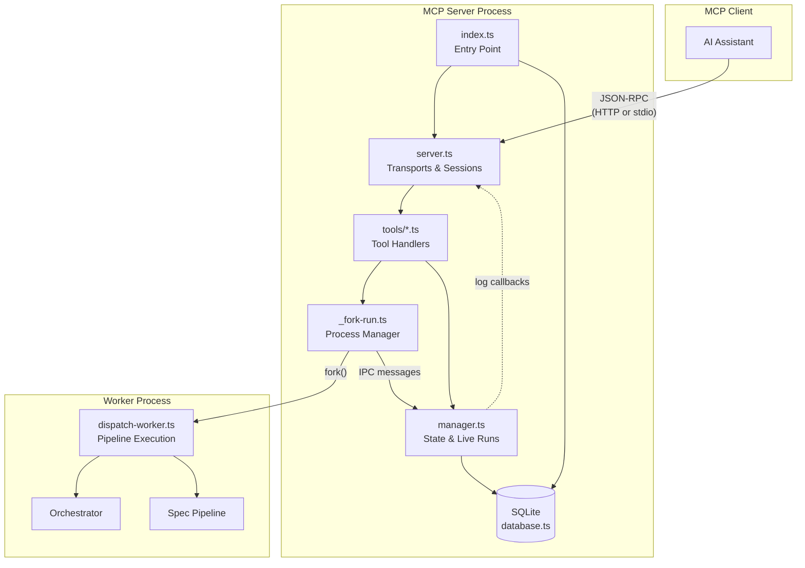

# MCP Server

The MCP server exposes Dispatch's capabilities — dispatching tasks, generating
specs, monitoring runs, and recovering from failures — as tools that any
Model Context Protocol (MCP) client can invoke. This enables AI assistants
(Claude Desktop, GitHub Copilot, or any MCP-compatible client) to drive
Dispatch operations through a structured JSON-RPC interface instead of
shelling out to the CLI.

## Why MCP

The standard `dispatch` CLI communicates via human-readable terminal output.
While effective for interactive use, this output is difficult for AI agents to
parse reliably. MCP provides a typed, tool-oriented protocol over JSON-RPC
that gives AI clients structured inputs and outputs, progress notifications
via logging messages, and session-scoped state management. By implementing an
MCP server, Dispatch becomes a first-class tool that any MCP client can
discover and invoke without brittle text parsing.

## Architecture

The MCP server consists of five source modules organised into two layers:

```
src/mcp/
  index.ts            ← Entry point: database init, server startup, signal handling
  server.ts           ← MCP server creation, HTTP/stdio transports, session management
  dispatch-worker.ts  ← Child process entry point for pipeline execution
  state/
    database.ts       ← SQLite lifecycle, schema creation, WAL configuration
    manager.ts        ← CRUD operations, live-run registry, log callback system
```

These modules interact with six tool registration modules under `src/mcp/tools/`:
`spec.ts`, `dispatch.ts`, `monitor.ts`, `recovery.ts`, and `config.ts`.
A shared helper, `_fork-run.ts`, bridges tool handlers to the
dispatch worker by forking child processes and wiring IPC messages to database
updates and MCP logging notifications.



## How it works

### Startup sequence

1. The CLI command `dispatch mcp` (or `dispatch mcp --http`) calls either
   `startStdioMcpServer()` or `startMcpServer()` from `src/mcp/index.ts`.

2. The entry point opens the SQLite database at `{cwd}/.dispatch/dispatch.db`,
   creating the `.dispatch/` directory and schema tables if they do not exist.

3. It creates an `McpServer` instance from the `@modelcontextprotocol/sdk`,
   registers all tool groups, and connects the appropriate transport
   (stdio or HTTP).

4. Signal handlers for `SIGINT` and `SIGTERM` are installed for graceful
   shutdown — closing transports, the MCP server, and the SQLite database
   in order.

### Transport modes

The server supports two transport modes, selected at startup:

- **Stdio** (default): The MCP client launches `dispatch mcp` as a subprocess.
  JSON-RPC messages flow over stdin/stdout. All diagnostic output goes to
  stderr to avoid corrupting the protocol stream. This is the standard mode
  for local MCP integrations.

- **HTTP** (`--http` flag): The server listens on a configurable TCP port
  (default 9110, bind address 127.0.0.1). It uses the MCP SDK's
  `StreamableHTTPServerTransport` for stateful session management with
  per-session transport instances keyed by `mcp-session-id`. Supports
  `POST /mcp` for requests, `GET /mcp` for SSE notification streams,
  `DELETE /mcp` for session teardown, and `GET /health` for health checks.

See [Server Transports](./server-transports.md) for the full session lifecycle,
routing logic, and HTTP endpoint reference.

### Tool execution pipeline

When an MCP client invokes a tool (e.g., `dispatch_run`), the following
sequence occurs:

1. The tool handler in `src/mcp/tools/` validates inputs and creates a run
   record in SQLite via `createRun()` from the state manager.

2. `forkDispatchRun()` from `_fork-run.ts` wires MCP logging notifications
   to the run, then forks `dispatch-worker.ts` as a child process.

3. The worker receives configuration over IPC `process.send()` and runs the
   appropriate pipeline (dispatch orchestrator or spec pipeline).

4. As the pipeline progresses, the worker sends IPC messages (`progress`,
   `spec_progress`, `done`, `error`) back to the parent.

5. `_fork-run.ts` translates each IPC message into database mutations
   (task creation, status updates, run completion) and MCP logging
   notifications that flow to connected clients.

6. A 30-second heartbeat keeps clients informed of long-running operations.

See [Dispatch Worker](./dispatch-worker.md) for the full IPC message protocol
and pipeline integration, and the Fork-IPC-DB pipeline sequence diagram below.

### State persistence

All run and task state is persisted to a SQLite database at
`{cwd}/.dispatch/dispatch.db`. The database uses WAL journal mode and
`NORMAL` synchronous writes for a balance of performance and durability.
Schema is created on first open and versioned via a `schema_version` table
for forward-compatible migrations.

Three tables track state: `runs` for dispatch runs, `tasks` for per-run task
records, and `spec_runs` for spec generation runs. An in-memory live-run
registry supplements the database to provide instant event-driven notifications
when runs complete.

See [State Management](./state-management.md) for the full schema, record
types, migration strategy, and live-run registry design.

## Tool groups

The MCP server registers tool groups that cover the full Dispatch workflow:

| Group | Module | Purpose |
|-------|--------|---------|
| Spec | `tools/spec.ts` | Generate specs from issues via AI-driven codebase exploration |
| Dispatch | `tools/dispatch.ts` | Plan and execute tasks with full git lifecycle management |
| Monitor | `tools/monitor.ts` | Query run/task status, list runs, wait for completion |
| Recovery | `tools/recovery.ts` | Cancel runs, retry failed tasks, clean up orphaned state |
| Config | `tools/config.ts` | Read and update Dispatch configuration |

These tool modules are documented in the [MCP Tools](../mcp-tools/) section
of the documentation.

## Key design decisions

### Process isolation via fork

Pipeline execution runs in a forked child process rather than in-process. This
provides crash isolation (a pipeline failure cannot bring down the MCP server),
prevents blocking the event loop during long-running AI operations, and allows
the server to handle monitoring requests from other clients while a pipeline
runs. The trade-off is the complexity of IPC message routing and the need for
explicit crash handling when the worker exits with a non-zero code.

### Synchronous database writes

The state manager uses `better-sqlite3`'s synchronous API rather than an async
database driver. This is intentional: all database writes happen on the main
thread in response to IPC messages, which arrive sequentially for a given run.
Synchronous writes simplify the code (no async coordination needed) and
guarantee immediate consistency — a query for run status always reflects the
latest IPC update. The performance cost is negligible because writes are
infrequent (one per task state transition) and WAL mode allows concurrent
reads.

### 120-second wait timeout

The `waitForRunCompletion()` function caps its wait time at 120 seconds. This
prevents MCP tool calls from blocking indefinitely when a run takes a long
time. Clients that need to wait longer should poll using the monitor tools
instead. The wait function uses a hybrid approach: event-driven wakeup via
completion callbacks for instant notification, with a 2-second DB poll as a
safety net against race conditions.

### Logging notifications as progress

MCP logging notifications (level + logger + data) serve as the real-time
progress channel. The `wireRunLogs()` function connects the in-memory live-run
log callback system to `mcpServer.sendLoggingMessage()`, translating Dispatch's
internal log levels (`info`, `warn`, `error`) to MCP-standard levels (`info`,
`warning`, `error`). This avoids polling for progress — clients receive
server-sent events as they happen.

## Related documentation

- [Server Transports](./server-transports.md) — HTTP and stdio transport
  configuration, session lifecycle, and endpoint reference
- [State Management](./state-management.md) — SQLite schema, CRUD operations,
  live-run registry, and migration strategy
- [Dispatch Worker](./dispatch-worker.md) — Child process entry point, IPC
  message protocol, and pipeline integration
- [Operations Guide](./operations-guide.md) — Startup, shutdown, crash
  recovery, and monitoring procedures
- [Architecture Overview](../architecture.md) — System-wide design and
  component interactions
- [CLI and Orchestration](../cli-orchestration/overview.md) — The `dispatch mcp`
  command entry point
- [Orchestrator](../cli-orchestration/orchestrator.md) — The pipeline runner
  that the dispatch worker delegates to
- [Spec Generation](../spec-generation/overview.md) — The spec pipeline invoked
  by the spec worker message type
