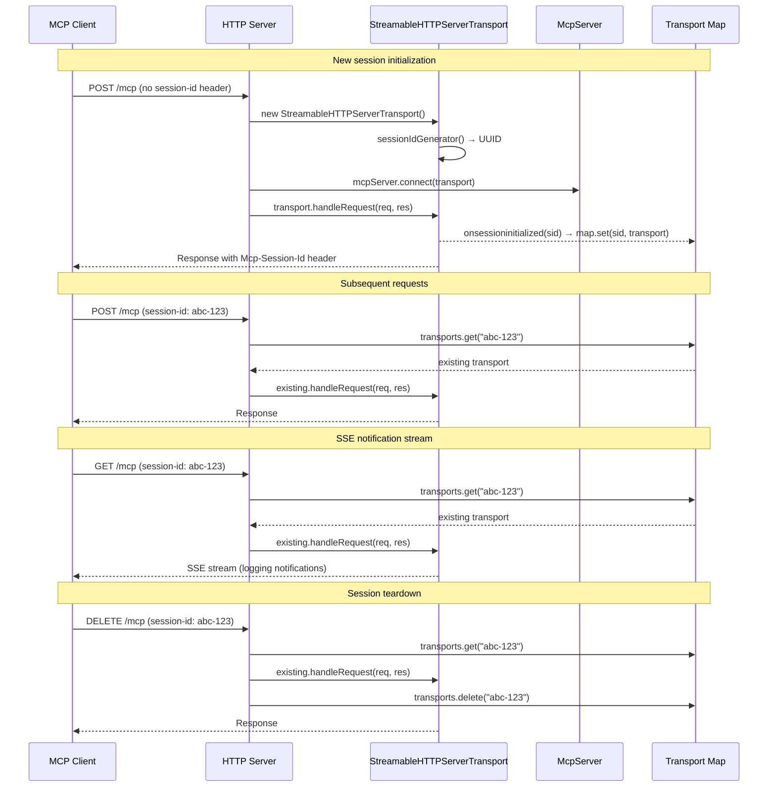

# Server Transports and Sessions

The MCP server supports two transport modes for client communication: stdio
for subprocess-based integrations and HTTP for network-accessible service
mode. Both transports use the `@modelcontextprotocol/sdk` library's transport
abstractions, which handle JSON-RPC framing, session lifecycle, and
Server-Sent Events (SSE) streaming.

## Why two transports

Different MCP client integrations have different connectivity requirements:

- **Stdio** is the standard MCP transport for local integrations. The client
  launches the server as a subprocess and communicates over stdin/stdout. This
  is how Claude Desktop, Cursor, and most MCP-compatible editors connect to
  MCP servers. It requires no port configuration and works behind firewalls.

- **HTTP** enables remote or multi-client access. The server listens on a TCP
  port and handles stateful sessions via the MCP SDK's
  `StreamableHTTPServerTransport`. This is useful for scenarios where the MCP
  client runs in a different process or on a different machine, or when
  multiple clients need concurrent access to the same server.

## Stdio transport

### Configuration

The stdio transport is the default mode. It is started by calling
`startStdioMcpServer({ cwd })` from `src/mcp/index.ts`, which the CLI
invokes via `dispatch mcp` (without `--http`).

### Protocol

The `StdioServerTransport` from `@modelcontextprotocol/sdk/server/stdio.js`
reads newline-delimited JSON-RPC messages from `process.stdin` and writes
responses to `process.stdout`. Per the MCP specification:

- Each message is a complete JSON-RPC request, response, or notification.
- Messages are delimited by newlines and must not contain embedded newlines.
- The server must not write anything to stdout that is not a valid MCP message.

All diagnostic output (startup messages, shutdown messages, error reports) is
written to `process.stderr` to avoid corrupting the protocol stream.

### Lifecycle

1. `createStdioMcpServer(cwd)` creates an `McpServer` with logging capability
   enabled.
2. All six tool groups are registered.
3. A `StdioServerTransport` is created and connected to the server via
   `mcpServer.connect(transport)`.
4. The server is ready — the `StdioServerTransport` holds `process.stdin` open,
   keeping the event loop alive.
5. On shutdown, the transport is closed first (flushing any pending output),
   then the `McpServer` is closed.

### Error handling

Both `transport.close()` and `mcpServer.close()` errors are caught and
reported to stderr. This prevents shutdown errors from propagating as
unhandled rejections while still providing diagnostic information.

## HTTP transport

### Configuration

The HTTP transport is started by calling `startMcpServer({ port, host, cwd })`
from `src/mcp/index.ts`, which the CLI invokes via `dispatch mcp --http`.
Default values:

| Parameter | Default | Description |
|-----------|---------|-------------|
| `port` | 9110 | TCP port to listen on |
| `host` | `127.0.0.1` | Bind address (localhost only by default) |
| `cwd` | Current directory | Working directory for Dispatch commands |

### Endpoints

The HTTP server exposes the following endpoints:

| Method | Path | Purpose |
|--------|------|---------|
| `GET` | `/health` | Health check, returns `{"status":"ok"}` |
| `POST` | `/mcp` | JSON-RPC request (initialize or tool call) |
| `GET` | `/mcp` | Open SSE stream for server-to-client notifications |
| `DELETE` | `/mcp` | Terminate session |

Any other path returns 404. Any unsupported method on `/mcp` returns 405.

### Session management

The HTTP transport implements stateful sessions using the MCP SDK's
`StreamableHTTPServerTransport`. Each connected client gets its own transport
instance, keyed by a session ID.



#### Session creation

When a `POST /mcp` arrives without an `mcp-session-id` header, the server
creates a new `StreamableHTTPServerTransport` with:

- `sessionIdGenerator: () => randomUUID()` — generates a cryptographically
  secure v4 UUID as the session identifier.
- `onsessioninitialized: (sid) => transports.set(sid, transport)` — registers
  the transport in the in-memory session map once the MCP handshake completes.

The transport's `onclose` handler removes it from the map when the transport
is closed (by either the client or server).

After creation, `mcpServer.connect(transport)` binds the server to the new
transport, and `transport.handleRequest(req, res)` processes the initialisation
request.

#### Session routing

Subsequent `POST /mcp` and `GET /mcp` requests carrying an `mcp-session-id`
header are routed to the existing transport via the session map. If the session
ID is not found, the server returns 404 with `{"error":"Session not found"}`.

#### SSE streams

`GET /mcp` requests open an SSE (Server-Sent Events) stream for server-to-client
notifications. This is how MCP logging messages (pipeline progress, task status
changes) reach connected clients in real-time. Clients may have multiple SSE
streams open simultaneously.

A `GET /mcp` without a session ID creates a new transport — this supports
SSE-only clients that want to receive notifications without first sending a
POST request.

#### Session termination

`DELETE /mcp` with a valid session ID delegates to
`transport.handleRequest()` for protocol-level cleanup, then removes the
transport from the session map. If the session ID is not found, 404 is
returned.

### Transport map cleanup

The transport map (`Map<string, StreamableHTTPServerTransport>`) is a
plain in-memory map. Entries are added on session initialisation and removed
on:

- Client-initiated `DELETE /mcp`
- Transport `onclose` (e.g., connection dropped)
- Server shutdown (all transports are closed and the map is cleared)

There is no session timeout or garbage collection. Sessions remain active
until explicitly terminated or the server shuts down. This is acceptable
because the server is designed for use by a small number of concurrent MCP
clients (typically one or two AI assistants), not for high-concurrency
public-facing use.

### Shutdown

The HTTP server shutdown sequence:

1. Close all active transports (iterating the map, catching errors per
   transport).
2. Clear the transport map.
3. Close the `McpServer`.
4. Close the `http.Server` via `httpServer.close()`.

This ordering ensures that connected clients receive transport-level close
notifications before the HTTP server stops accepting connections.

## MCP SDK integration

### McpServer configuration

Both transport modes create the `McpServer` with identical configuration:

```
name: "dispatch"
version: "1.0.0"
capabilities: { logging: {} }
```

The `logging` capability enables `sendLoggingMessage()`, which is how
pipeline progress events reach connected clients as MCP logging notifications.

### Tool registration

After creating the `McpServer`, both modes register the same five tool groups
by calling:

1. `registerSpecTools(mcpServer, cwd)`
2. `registerDispatchTools(mcpServer, cwd)`
3. `registerMonitorTools(mcpServer, cwd)`
4. `registerRecoveryTools(mcpServer, cwd)`
5. `registerConfigTools(mcpServer, cwd)`

Each registration function calls `mcpServer.tool()` to define tools with
typed input schemas (using Zod for validation), descriptions, and handler
functions. The tool handlers interact with the state manager for CRUD
operations and fork dispatch workers for pipeline execution.

### Logging notification wiring

The `wireRunLogs()` function in `server.ts` connects the in-memory live-run
log callback system to MCP logging notifications:

1. When a tool handler creates a run, it calls `wireRunLogs(runId, server)`.
2. This registers a `LogCallback` via `addLogCallback(runId, cb)` in the
   state manager.
3. The callback translates log events to MCP logging messages:
    - `info` → `info`
    - `warn` → `warning`
    - `error` → `error`
4. The logger name is `dispatch.run.{runId}`, allowing clients to filter
   notifications by run.
5. `sendLoggingMessage()` errors are caught and logged to stderr (they should
   not crash the pipeline).

## Node.js http module

The HTTP transport uses Node.js's built-in `http.createServer()` for the TCP
listener. No framework (Express, Koa, Fastify) is used — the server handles
routing directly in the request handler with method/path matching. This
minimises dependencies and keeps the server lightweight.

The health check endpoint (`GET /health`) bypasses the MCP transport layer
entirely, returning a static JSON response for load balancer or monitoring
integration.

## Node.js crypto.randomUUID()

Session IDs are generated using `crypto.randomUUID()` from the Node.js
standard library. This produces v4 UUIDs with 122 bits of cryptographic
randomness, satisfying the MCP specification's requirement that session IDs
be globally unique and cryptographically secure.

## Related documentation

- [Overview](./overview.md) — MCP server architecture and startup sequence
- [State Management](./state-management.md) — How log callbacks connect to
  the live-run registry
- [Dispatch Worker](./dispatch-worker.md) — The pipeline execution that
  generates logging events
- [Operations Guide](./operations-guide.md) — Port configuration and
  connection troubleshooting
- [MCP Tools Overview](../mcp-tools/overview.md) — The five tool groups
  registered with the McpServer during startup
- [Dispatch Tools](../mcp-tools/dispatch-tools.md) — `dispatch_run` and
  `dispatch_dry_run` tool handlers registered via `registerDispatchTools()`
- [Recovery Tools](../mcp-tools/recovery-tools.md) — `run_retry` and
  `task_retry` tool handlers registered via `registerRecoveryTools()`
- [Configuration](../cli-orchestration/configuration.md) — config file format
  used by `registerConfigTools()` for the `config_get` tool
