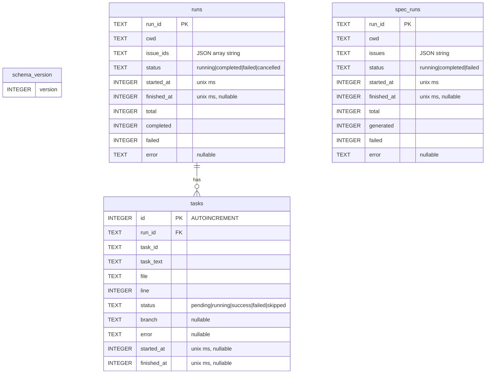
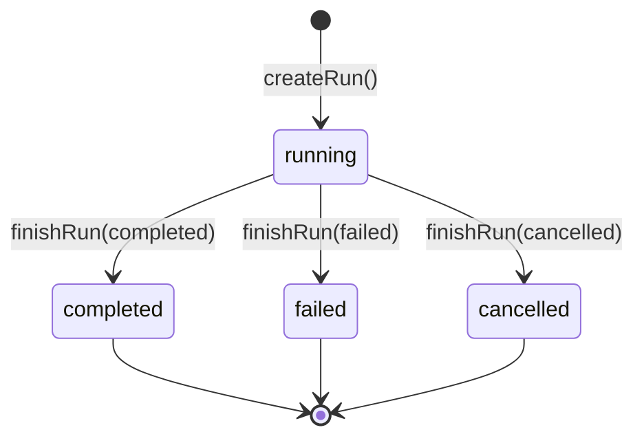
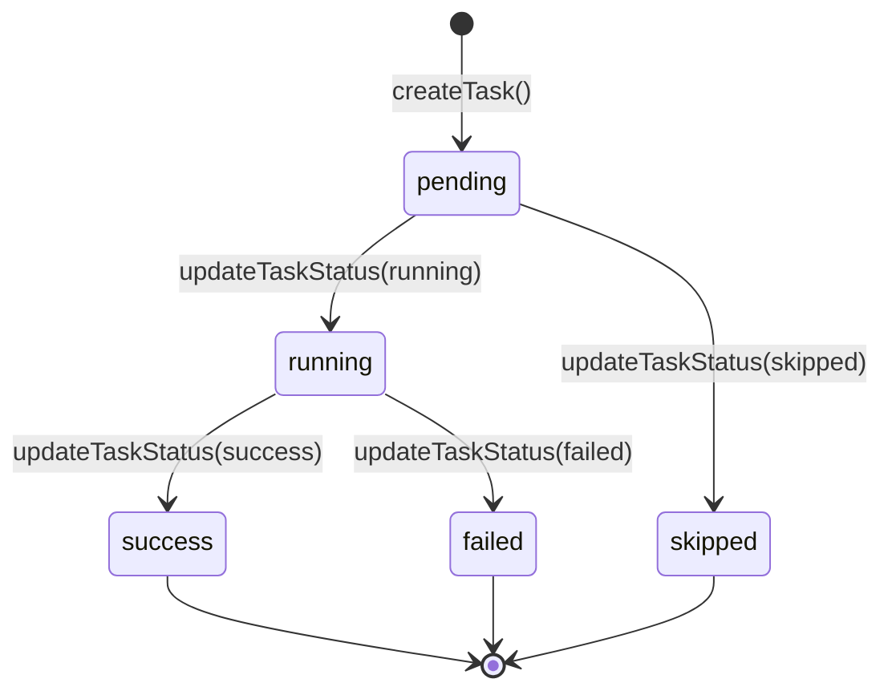

# State Management

The MCP server persists all run and task state to a SQLite database and
maintains an in-memory live-run registry for real-time event-driven
notifications. Two modules implement this layer: `database.ts` manages the
database lifecycle and schema, while `manager.ts` provides CRUD operations
and the live-run notification system.

## Why SQLite

Dispatch pipelines can be long-running (minutes to hours). Persisting state to
SQLite ensures that run history, task progress, and error information survive
server restarts, process crashes, and reconnecting clients. SQLite was chosen
over alternatives for three reasons:

1. **Zero configuration**: No external database server to install or manage.
   The database file lives at `{cwd}/.dispatch/dispatch.db` alongside other
   Dispatch artifacts.

2. **Synchronous API via better-sqlite3**: The `better-sqlite3` library
   provides a synchronous C-binding API, which eliminates async coordination
   for database writes that arrive sequentially over IPC. This simplifies the
   state manager code and guarantees immediate consistency.

3. **Single-writer model**: The MCP server is the only writer. Pipeline workers
   communicate via IPC to the parent process, which applies all database
   mutations sequentially. This avoids the need for database-level
   concurrency control beyond what WAL mode provides for concurrent reads.

## Database lifecycle

### Opening

`openDatabase(cwd)` in `src/mcp/state/database.ts` is called once during
server startup. It:

1. Creates the `.dispatch/` directory under the working directory if it does
   not exist (`mkdirSync` with `recursive: true`).

2. Opens (or creates) `dispatch.db` using the `better-sqlite3` `Database`
   constructor. The constructor is synchronous — the database is ready for
   queries immediately after the call returns.

3. Configures three performance pragmas:
    - `journal_mode = WAL` — Write-Ahead Logging allows concurrent readers
      while a write is in progress and improves write throughput by batching
      writes to a separate WAL file that is periodically checkpointed.
    - `synchronous = NORMAL` — A compromise between `FULL` (safest, slowest)
      and `OFF` (fastest, risk of corruption). `NORMAL` syncs at critical
      moments but not after every transaction, which is acceptable because
      Dispatch state is recoverable (a worst-case crash loses at most the
      last in-flight state transition).
    - `foreign_keys = ON` — Enforces the `tasks.run_id → runs.run_id`
      foreign key constraint at the database level.

4. Creates the schema tables via `createSchema()` if they do not already
   exist (`CREATE TABLE IF NOT EXISTS`).

5. Stores the database handle in a module-level singleton (`_db`). Subsequent
   calls to `openDatabase()` return the cached handle without re-opening.

### Closing

`closeDatabase()` calls `db.close()` on the singleton and sets it to `null`.
This is called during graceful shutdown (signal handler). After closing, any
call to `getDb()` throws `"Database not open"`.

### Testing reset

`resetDatabase()` sets the singleton to `null` without calling `close()`. This
is intended for test teardown where the underlying database may already be
closed or is an in-memory instance.

## Schema

The database contains four tables. The schema is created idempotently on first
open.

### Table descriptions

**`schema_version`**: Tracks the current schema version as a single-row table.
Used for forward-compatible migrations. The current version is `1`. On first
open, if no row exists, version `1` is inserted. Future versions will add
`ALTER TABLE` migrations gated on the stored version number.

**`runs`**: One row per dispatch run. The `run_id` is a `crypto.randomUUID()`
generated at creation time. `issue_ids` stores the input issue identifiers as
a JSON array string (e.g., `'["1","2"]'`). Counter columns (`total`,
`completed`, `failed`) are updated as tasks complete. `status` transitions
through the run state machine (see below).

**`tasks`**: One row per task within a run. Uses `AUTOINCREMENT` for ordered
retrieval. The `task_id` is a string identifier from the pipeline
(typically `file:line`). `file` and `line` provide source location for the
task definition. `branch` records the git branch created for the task (set on
completion). Foreign key references `runs.run_id`.

**`spec_runs`**: One row per spec generation run. Similar structure to `runs`
but with `generated` instead of `completed` (counting successfully generated
specs) and `issues` instead of `issue_ids` (storing the raw input which may
be a single string or array).

### Indexes

Two indexes accelerate common queries:

- `idx_tasks_run_id` on `tasks(run_id)` — Used by `getTasksForRun()` to
  retrieve all tasks for a given run.
- `idx_tasks_task_id` on `tasks(task_id)` — Used by `updateTaskStatus()` to
  locate a specific task within a run.

## Schema migration

The schema uses a version-tracked migration strategy:

1. `createSchema()` creates all tables with `CREATE TABLE IF NOT EXISTS`,
   making the initial schema creation idempotent.

2. After table creation, it reads `schema_version`. If no row exists (fresh
   database), it inserts the current version number.

3. Future migrations will check the stored version and apply incremental
   `ALTER TABLE` statements to bring the schema up to date. The
   `CURRENT_SCHEMA_VERSION` constant (currently `1`) defines the target.

This approach avoids the complexity of a full migration framework while
supporting additive schema changes (adding columns, tables, or indexes).

## State manager (CRUD layer)

`src/mcp/state/manager.ts` provides typed CRUD functions over the raw SQLite
tables. All functions use `getDb()` to access the singleton database handle
and prepared statements for parameterised queries.

### Row-to-record mapping

Raw SQLite rows use `snake_case` column names. The manager maps these to
`camelCase` TypeScript record types (`RunRecord`, `TaskRecord`,
`SpecRunRecord`) via explicit mapper functions (`rowToRun`, `rowToTask`,
`rowToSpecRun`). Status fields are validated at runtime against const arrays
(`RUN_STATUSES`, `TASK_STATUSES`, `SPEC_STATUSES`) to catch database
corruption early.

### Run operations

| Function | Purpose |
|----------|---------|
| `createRun({ cwd, issueIds })` | Insert a new run with status `running`, register it as a live run, return the generated `runId` |
| `updateRunCounters(runId, total, completed, failed)` | Update the counter columns for a run |
| `finishRun(runId, status, error?)` | Set the terminal status, `finished_at` timestamp, and optional error; unregister the live run |
| `getRun(runId)` | Fetch a single run by ID |
| `listRuns(limit?)` | List runs newest-first, default limit 50 |
| `listRunsByStatus(status, limit?)` | List runs filtered by status, default limit 20 |

### Task operations

| Function | Purpose |
|----------|---------|
| `createTask({ runId, taskId, taskText, file, line })` | Insert a task with status `pending` |
| `updateTaskStatus(runId, taskId, status, opts?)` | Update task status with timestamp handling: sets `started_at` on `running`, sets `finished_at`/`error`/`branch` on terminal statuses |
| `getTasksForRun(runId)` | Retrieve all tasks for a run ordered by insertion order |

### Spec run operations

| Function | Purpose |
|----------|---------|
| `createSpecRun({ cwd, issues })` | Insert a new spec run with status `running`, register as live, return `runId` |
| `finishSpecRun(runId, status, counters, error?)` | Set terminal status with counter values |
| `listSpecRuns(limit?)` | List spec runs newest-first |
| `getSpecRun(runId)` | Fetch a single spec run by ID |

## Run and task state machines

Runs and tasks follow defined state machines enforced by the status type
unions.

### Run states

Valid run statuses: `running`, `completed`, `failed`, `cancelled`.

A run starts in `running` and transitions to one of three terminal states.
The `completed` vs `failed` decision is made by the `_fork-run.ts` handler
based on the worker result: if `failed > 0`, the run is marked `failed`.
The `cancelled` status is set by the recovery tools when a user explicitly
cancels a run.

### Task states

Valid task statuses: `pending`, `running`, `success`, `failed`, `skipped`.

Tasks start as `pending`, transition to `running` when the worker begins
execution, and reach a terminal state of `success`, `failed`, or `skipped`.
The `skipped` status is used when a task is not executed (e.g., a dependency
failed in serial mode).

## Live-run registry

The in-memory live-run registry (`liveRuns` Map in `manager.ts`) tracks
runs that are currently in-flight. It serves two purposes:

1. **Log callback distribution**: When `emitLog(runId, message, level)` is
   called, it iterates the registered callbacks for that run and invokes each
   one. The `wireRunLogs()` function in `server.ts` registers a callback that
   forwards log messages as MCP logging notifications to connected clients.

2. **Completion notification**: `addCompletionCallback(runId, cb)` registers
   a callback that fires when `unregisterLiveRun()` is called (which happens
   inside `finishRun()`). The `waitForRunCompletion()` function uses this
   for event-driven wakeup instead of pure polling.

### Callback error isolation

All callback invocations are wrapped in try/catch to prevent notification
errors from crashing the pipeline. Log callback errors are only reported
when the `DEBUG` environment variable is set. Completion callback errors
are silently swallowed (the run is already finished — there is nothing to
recover).

### waitForRunCompletion

This function implements a hybrid wait strategy:

1. **Immediate check**: If the run is already in a terminal status (checked
   via the `getStatus` callback), returns `true` immediately.

2. **Event-driven wakeup**: If the run is live, registers a completion
   callback for instant notification when the run finishes.

3. **DB poll safety net**: Polls the database every 2 seconds as a fallback
   against race conditions (e.g., the run finished between the immediate
   check and callback registration) or orphaned runs (where the live-run
   registry entry was lost).

4. **Timeout**: Caps at `min(waitMs, 120_000)` milliseconds (120 seconds
   maximum). Returns `false` if the timeout expires before the run completes.
   Clients needing longer waits should use the monitor tools to poll.

The 120-second cap exists because MCP tool calls should not block
indefinitely. Long-running pipelines can take minutes or hours; a stuck
wait would make the MCP client unresponsive.

## Integrations

### better-sqlite3

The database layer uses `better-sqlite3` (v11+) for synchronous SQLite access
from Node.js. Key characteristics:

- **Synchronous API**: All reads and writes are blocking calls. There is no
  callback or promise overhead. This is safe in the MCP server context because
  database operations are fast (sub-millisecond for single-row writes) and the
  event loop is not blocked appreciably.

- **Native binding**: `better-sqlite3` includes a native C++ addon
  (`better_sqlite3.node`) that links directly to SQLite. This provides
  significantly better performance than JavaScript-only SQLite
  implementations.

- **Prepared statements**: The `db.prepare(sql).run(...)` and
  `db.prepare(sql).get(...)` patterns create parameterised prepared
  statements, preventing SQL injection and enabling SQLite's statement cache.

- **WAL mode**: Set via `db.pragma("journal_mode = WAL")`. WAL (Write-Ahead
  Logging) allows concurrent readers while a write is in progress. This is
  important because MCP monitoring tools may query run status while a
  pipeline is actively updating task records.

### crypto.randomUUID()

Both `createRun()` and `createSpecRun()` generate run IDs using Node.js's
`crypto.randomUUID()`, which produces cryptographically secure v4 UUIDs.
These IDs are used as primary keys in the `runs` and `spec_runs` tables and
as keys in the live-run registry.

## Related documentation

- [Overview](./overview.md) — MCP server architecture and design decisions
- [Server Transports](./server-transports.md) — How log notifications reach
  connected clients
- [Dispatch Worker](./dispatch-worker.md) — The IPC message protocol that
  drives state transitions
- [Operations Guide](./operations-guide.md) — Database location, backup, and
  recovery procedures
- [Fork-Run IPC Bridge](../mcp-tools/fork-run-ipc.md) — The parent-side
  handler that calls CRUD functions based on IPC messages
- [Database Tests](../testing/database-tests.md) — Test coverage for the
  SQLite database layer and state manager CRUD operations
