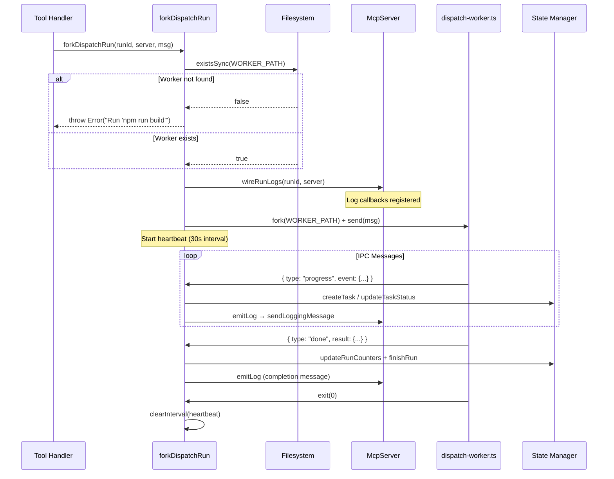
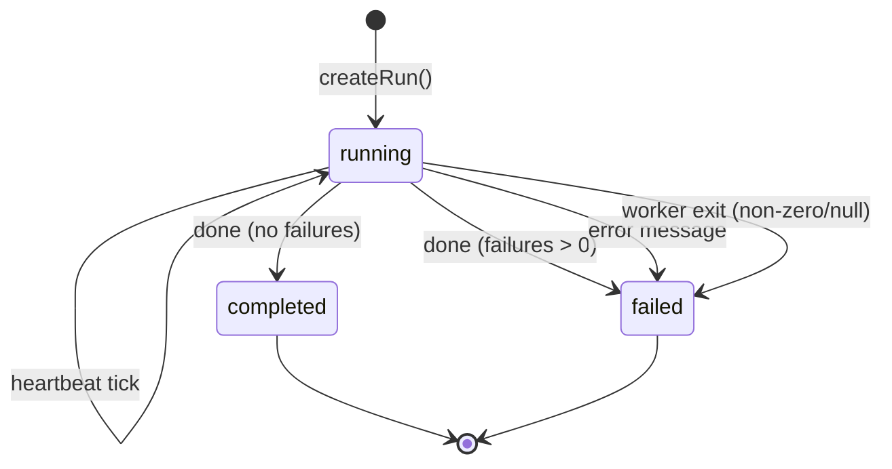

# Fork-Run IPC Bridge

The `_fork-run.ts` module provides `forkDispatchRun()`, the shared utility that
bridges MCP tool handlers to the dispatch worker child process. It is the
central coordination point for all async tools — handling process lifecycle,
IPC message translation, heartbeat keep-alive, and crash recovery.

**Source file:** `src/mcp/tools/_fork-run.ts`

## Function signature

```
forkDispatchRun(
  runId: string,
  server: McpServer,
  workerMessage: Record<string, unknown>,
  options?: ForkRunOptions,
): ChildProcess
```

**Parameters:**

- `runId` — The UUID of the run record already created in SQLite.
- `server` — The `McpServer` instance, used to wire logging notifications.
- `workerMessage` — The IPC message sent to the child process on startup.
  Contains `type` (`"dispatch"` or `"spec"`), `cwd`, and
  pipeline-specific `opts`.
- `options` — Optional callbacks. Currently supports `onDone` for custom
  result handling (used by `spec_generate` to call `finishSpecRun`).

**Returns:** The `ChildProcess` handle from `node:child_process.fork()`.

## Execution sequence

The function performs six steps in order:



### Step 1: Verify compiled worker exists

Before any other work, the function checks whether the compiled worker file
(`dispatch-worker.js`) exists on disk using `existsSync()`. The worker path
is resolved at module load time relative to the compiled output directory:

```
const WORKER_PATH = join(__dirname, "..", "dispatch-worker.js");
```

If the file is missing, the function throws immediately with a message
directing users to run `npm run build`. This prevents a confusing
`MODULE_NOT_FOUND` error from `child_process.fork()` and provides a clear
remediation step. This check is necessary because MCP tools run against the
compiled JavaScript output, not the TypeScript sources.

### Step 2: Wire logging notifications

Calls `wireRunLogs(runId, server)` from `src/mcp/server.ts`, which registers
a log callback on the in-memory live-run registry. All subsequent `emitLog()`
calls for this `runId` are forwarded to connected MCP clients as
`sendLoggingMessage()` notifications with the logger name
`dispatch.run.{runId}`.

### Step 3: Fork the worker

Forks `dispatch-worker.js` (resolved relative to the compiled output
directory) with `stdio: ["pipe", "pipe", "pipe", "ipc"]`. The fourth element
enables the Node.js IPC channel. The startup message is sent immediately via
`worker.send(workerMessage)`.

### Step 4: Start the heartbeat

An `setInterval` timer emits a log message every 30 seconds
(`HEARTBEAT_INTERVAL_MS = 30_000`):

> Run {runId} still in progress...

This prevents MCP clients from assuming the run has stalled during long AI
operations. The heartbeat is cleared when the worker exits.

### Step 5: Handle IPC messages

The `message` event handler processes four top-level message types, each with
sub-types. The full protocol is documented below.

### Step 6: Clean up on exit

The `exit` event handler clears the heartbeat timer. If the worker exits with
a non-zero code or a `null` code (indicating termination by a signal, such as
`SIGKILL` or `SIGTERM`), it marks the run as failed via `finishRun()` and
emits an error-level log message.

## IPC message protocol

The worker process sends messages via `process.send()` and the parent receives
them on the `message` event. All messages are plain objects with a `type` field.

### Message type: `progress`

Sent during dispatch pipeline execution. Contains an `event` object with its
own `type` sub-field:

| Sub-type | Database action | Log message |
|----------|----------------|-------------|
| `task_start` | `createTask()` + `updateTaskStatus("running")` | "Task started: {taskText}" |
| `task_done` | `updateTaskStatus("success")` | "Task done: {taskText}" |
| `task_failed` | `updateTaskStatus("failed", { error })` | "Task failed: {taskText} -- {error}" (error level) |
| `phase_change` | None | Custom message or "Phase: {phase}" |
| `log` | None | Verbatim message forwarding |

The `task_start` sub-type extracts `taskId`, `taskText`, `file`, and `line`
from the event object. If `file` or `line` are missing, they are derived from
the `taskId` by splitting on `:`.

### Message type: `spec_progress`

Sent during spec generation pipeline execution. Contains an `event` object:

| Sub-type | Database action | Log message |
|----------|----------------|-------------|
| `item_start` | None | "Generating spec for: {itemTitle or itemId}" |
| `item_done` | None | "Spec done: {itemTitle or itemId}" |
| `item_failed` | None | "Spec failed: {itemTitle or itemId} -- {error}" (error level) |
| `log` | None | Verbatim message forwarding |

Spec progress events do not create task records because spec runs track
aggregate counters (total/generated/failed) rather than individual tasks.

### Message type: `done`

Sent when the pipeline completes (success or failure). Contains a `result`
object. Processing depends on the `options.onDone` callback and the result
shape:

1. **If `options.onDone` is set**: Delegates to the callback. Used by
   `spec_generate` to call `finishSpecRun()` with spec-specific counters.

2. **If result has `completed` field**: Dispatch result. Calls
   `updateRunCounters()` with `total`, `completed`, `failed` counts, then
   `finishRun()` with status based on whether `failed > 0`.

### Message type: `error`

Sent when the pipeline throws an unhandled exception. Calls
`finishRun(runId, "failed", message)` and emits an error-level log.

## Run state machine

A run transitions through the following states based on IPC messages and
process lifecycle events:



The `cancelled` status exists in the database schema but is not set by the
fork-run bridge — it is reserved for future manual cancellation support or
external state manipulation.

## Heartbeat design

The 30-second heartbeat serves two purposes:

1. **Client liveness**: MCP clients (especially those using SSE notification
   streams) may time out connections that receive no data. The heartbeat
   ensures at least one notification per 30-second window.

2. **Observability**: When monitoring a run via `status_get`, the heartbeat
   log entries provide evidence that the pipeline is still executing rather
   than hung.

The heartbeat is a simple `setInterval` that calls `emitLog()`. It does not
check whether the run is still alive — the `exit` event handler handles
cleanup if the worker crashes.

## Process isolation rationale

Pipeline execution runs in a forked child process rather than in-process. This
provides:

- **Crash isolation**: A pipeline failure (e.g., unhandled exception in the
  orchestrator) cannot bring down the MCP server. The server continues to
  serve monitoring requests and accept new tool calls.

- **Event loop freedom**: Long-running synchronous operations in the pipeline
  (e.g., `better-sqlite3` writes in the orchestrator's own state tracking)
  do not block the MCP server's event loop.

- **Concurrency**: Multiple pipelines can run simultaneously in separate
  child processes while the server handles interleaved monitoring requests.

The trade-off is the complexity of IPC message routing and the need to handle
worker crashes explicitly. If the worker exits with a non-zero or null exit
code without sending a `done` or `error` message, the `exit` handler marks
the run as failed with the exit code.

## Related documentation

- [MCP Tools Overview](./overview.md) — Tool catalog and registration architecture
- [Config Resolution](./config-resolution.md) — Shared config loading used before forking
- [Dispatch Tools](./dispatch-tools.md) — `dispatch_run` which forks via this utility
- [Spec Tools](./spec-tools.md) — `spec_generate` which uses the `onDone` callback
- [Recovery Tools](./recovery-tools.md) — `run_retry` and `task_retry` which fork via this utility
- [MCP Server Overview](../mcp-server/overview.md) — Server lifecycle and `wireRunLogs()`
- [Dispatch Worker](../mcp-server/dispatch-worker.md) — The child-side IPC protocol and pipeline execution
- [State Management](../mcp-server/state-management.md) — SQLite database and CRUD operations driven by IPC messages
- [Database Tests](../testing/database-tests.md) — Tests covering the state
  manager functions called by IPC handlers
