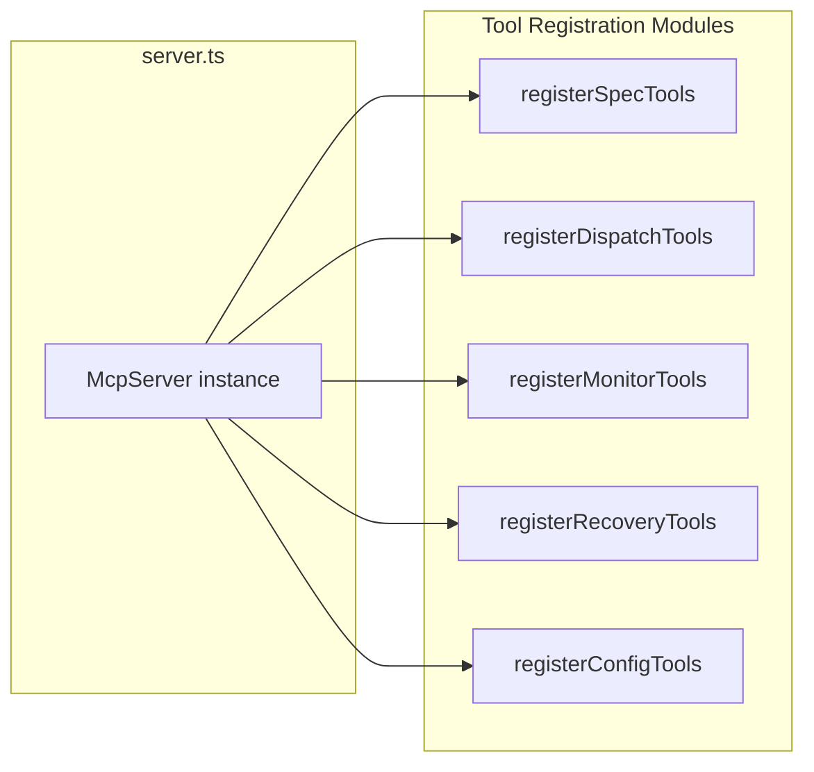
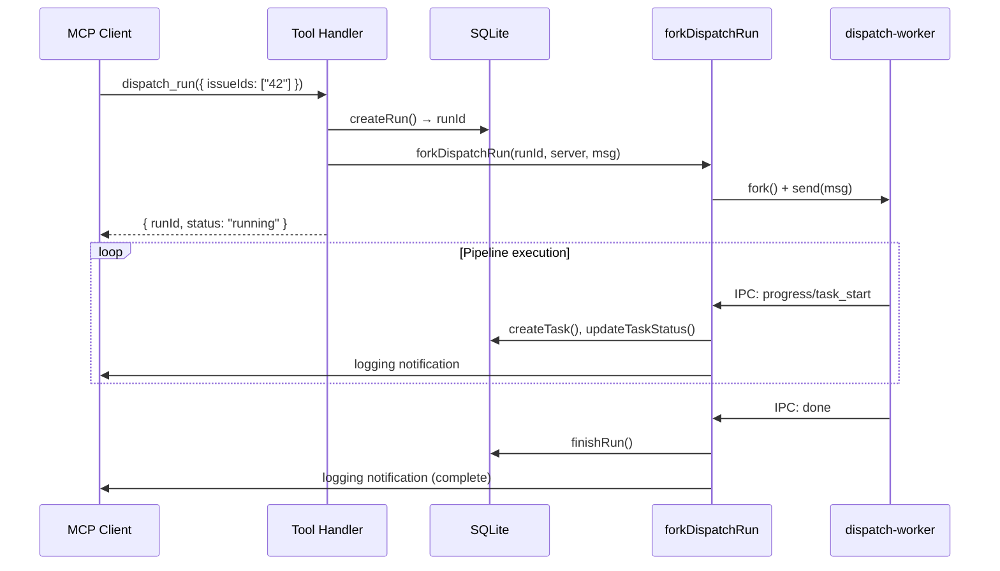
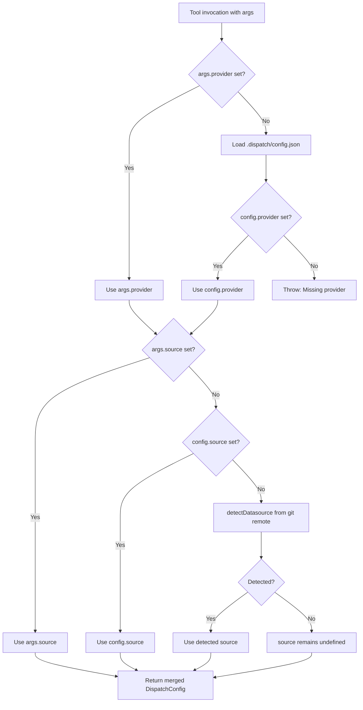

# MCP Tools

The MCP tools layer registers Dispatch's core capabilities as MCP-callable tools
on a shared `McpServer` instance. Each tool group is a standalone registration
module that receives the server instance and the working directory, defines one
or more tools with Zod-validated input schemas, and returns structured JSON
responses. Together they expose 16 tools across five groups covering the full
Dispatch workflow: dispatching tasks, generating specs, monitoring runs,
recovering from failures, and managing configuration.

## Tool registration architecture

Tool registration follows a uniform pattern. Each module exports a single
`register*Tools(server, cwd)` function that calls `server.tool()` for each
tool it owns. The MCP server in
[`src/mcp/server.ts`](../mcp-server/overview.md) calls all six registration
functions during startup, in both stdio and HTTP transport modes:

Each `server.tool()` call provides three arguments: the tool name (a unique
string identifier), a human-readable description, and a Zod schema defining
the tool's input parameters. The MCP SDK uses these to generate the
`tools/list` response that clients use for tool discovery.

## Tool catalog

### Dispatch tools

| Tool | Type | Module | Description |
|------|------|--------|-------------|
| `dispatch_run` | Async | [`tools/dispatch.ts`](./dispatch-tools.md) | Execute the dispatch pipeline for issue IDs; returns a `runId` immediately |
| `dispatch_dry_run` | Sync | [`tools/dispatch.ts`](./dispatch-tools.md) | Preview tasks without executing anything |

### Spec tools

| Tool | Type | Module | Description |
|------|------|--------|-------------|
| `spec_generate` | Async | [`tools/spec.ts`](./spec-tools.md) | Generate spec files from issues, globs, or inline text |
| `spec_list` | Sync | [`tools/spec.ts`](./spec-tools.md) | List `.md` files in `.dispatch/specs/` |
| `spec_read` | Sync | [`tools/spec.ts`](./spec-tools.md) | Read a spec file's contents (path-traversal guarded) |
| `spec_runs_list` | Sync | [`tools/spec.ts`](./spec-tools.md) | List recent spec generation runs |
| `spec_run_status` | Sync | [`tools/spec.ts`](./spec-tools.md) | Get status of a spec run with optional long-poll |

### Monitor tools

| Tool | Type | Module | Description |
|------|------|--------|-------------|
| `status_get` | Sync | [`tools/monitor.ts`](./monitor-tools.md) | Get run status with per-task details and optional long-poll |
| `runs_list` | Sync | [`tools/monitor.ts`](./monitor-tools.md) | List recent dispatch runs, optionally filtered by status |
| `issues_list` | Sync | [`tools/monitor.ts`](./monitor-tools.md) | List open issues from the configured datasource |
| `issues_fetch` | Sync | [`tools/monitor.ts`](./monitor-tools.md) | Fetch full details for one or more issues |

### Recovery tools

| Tool | Type | Module | Description |
|------|------|--------|-------------|
| `run_retry` | Async | [`tools/recovery.ts`](./recovery-tools.md) | Re-run all failed tasks from a previous dispatch run |
| `task_retry` | Async | [`tools/recovery.ts`](./recovery-tools.md) | Retry a single failed task by `taskId` |

### Config tools

| Tool | Type | Module | Description |
|------|------|--------|-------------|
| `config_get` | Sync | [`tools/config.ts`](./config-tools.md) | Read the current `.dispatch/config.json` |
| `config_set` | Sync | [`tools/config.ts`](./config-tools.md) | Set a configuration value with validation |

**Async** tools fork a child process via `forkDispatchRun()` and return a
`runId` immediately. Progress is pushed to clients as MCP logging notifications.
**Sync** tools execute in-process and return their result directly.

## Async vs sync execution model

The tools divide into two categories based on how they execute:

**Sync tools** (e.g., `config_get`, `status_get`, `spec_list`) execute entirely
within the MCP server process. They read from the SQLite database, the
filesystem, or in-memory state and return the result in the tool response. These
tools block the event loop only briefly and complete in milliseconds to low
seconds.

**Async tools** (e.g., `dispatch_run`, `spec_generate`) delegate
long-running work to a forked child process. They follow a three-step pattern:

1. **Create a run record** in SQLite via the [state manager](../mcp-server/state-management.md)
   (`createRun()` or `createSpecRun()`), which returns a UUID `runId`.
2. **Fork a worker** via [`forkDispatchRun()`](./fork-run-ipc.md), which
   starts `dispatch-worker.ts` as a child process and wires IPC message handling.
3. **Return immediately** with `{ runId, status: "running" }`.

The client then monitors progress through MCP logging notifications (pushed
automatically) or by polling with `status_get` / `spec_run_status`.

## Configuration resolution

All tools that interact with the dispatch or spec pipelines resolve
configuration through the shared [`loadMcpConfig()`](./config-resolution.md)
utility in `_resolve-config.ts`. This function loads `.dispatch/config.json`,
merges caller-provided overrides (e.g., `provider` from tool args), and
auto-detects the datasource from the git remote when not explicitly configured.

The critical difference from CLI configuration is that MCP tools **require
explicit provider configuration** — they throw an error if no provider is set,
rather than falling back to an interactive wizard. This is intentional because
MCP tools run in a headless context where interactive prompts are not possible.

## Shared utilities

Two shared modules in `src/mcp/tools/` provide cross-cutting functionality
used by multiple tool groups:

### _fork-run.ts

The [`forkDispatchRun()`](./fork-run-ipc.md) function is the bridge between
MCP tool handlers and the dispatch worker process. It handles:

- Wiring MCP logging notifications to the run via `wireRunLogs()`
- Forking the `dispatch-worker.ts` child process with IPC channels
- Running a 30-second heartbeat that emits "still in progress" log messages
- Translating five IPC message types (`progress`, `spec_progress`, `done`,
  `error`, plus sub-types) into database mutations and MCP logging notifications
- Cleaning up the heartbeat timer and marking runs as failed on abnormal exit

### _resolve-config.ts

The [`loadMcpConfig()`](./config-resolution.md) function provides strict
configuration loading for the headless MCP context. It differs from the CLI's
`loadConfig()` by enforcing that a provider must be explicitly configured —
no interactive wizard fallback.

## Cross-group dependencies

The MCP tools layer sits at the boundary between the MCP server infrastructure
and the core Dispatch system. Key dependencies:

| Dependency | Direction | Purpose |
|-----------|-----------|---------|
| [`src/mcp/server.ts`](../mcp-server/overview.md) | Imports tools | Registration functions called during server startup |
| [`src/mcp/state/manager.ts`](../mcp-server/state-management.md) | Tools import | CRUD operations for runs, tasks, spec runs; live-run registry |
| [`src/mcp/state/database.ts`](../mcp-server/state-management.md) | Via manager | SQLite schema, status types, database singleton |
| [`src/mcp/dispatch-worker.ts`](../mcp-server/overview.md) | Forked by tools | Child process entry point for pipeline execution |
| [`src/config.ts`](../cli-orchestration/configuration.md) | Tools import | `loadConfig`, `saveConfig`, `validateConfigValue`, `CONFIG_KEYS` |
| [`src/orchestrator/runner.ts`](../orchestrator/overview.md) | Worker imports | `boot()` function to initialize the orchestrator |
| [`src/orchestrator/spec-pipeline.ts`](../spec-generation/overview.md) | Worker imports | `runSpecPipeline()` for spec generation |
| [`src/providers/interface.ts`](../provider-system/overview.md) | Tools import | `PROVIDER_NAMES` for Zod enum validation |
| [`src/datasources/interface.ts`](../datasource-system/overview.md) | Tools import | `DATASOURCE_NAMES` for Zod enum validation |
| [`src/datasources/index.ts`](../datasource-system/overview.md) | Tools import | `getDatasource()`, `detectDatasource()` |

## Error handling

All tool handlers follow a consistent error reporting pattern:

1. **Validation errors** from Zod schemas are handled automatically by the MCP
   SDK, which returns a structured error before the handler executes.

2. **Configuration errors** (e.g., missing provider) are caught in try/catch
   blocks and returned as `{ content: [{ type: "text", text: "Error: ..." }], isError: true }`.

3. **Runtime errors** during tool execution follow the same pattern, wrapping
   the error message in the standard MCP error response structure.

4. **Worker crashes** are detected by the `exit` event handler in
   `_fork-run.ts`, which marks the run as failed with the exit code and emits
   an error-level log message.

The `isError: true` flag in the MCP response allows clients to distinguish
error responses from successful results without parsing the text content.

## Source files

| File | Purpose |
|------|---------|
| [`src/mcp/tools/dispatch.ts`](./dispatch-tools.md) | `dispatch_run`, `dispatch_dry_run` |
| [`src/mcp/tools/spec.ts`](./spec-tools.md) | `spec_generate`, `spec_list`, `spec_read`, `spec_runs_list`, `spec_run_status` |
| [`src/mcp/tools/monitor.ts`](./monitor-tools.md) | `status_get`, `runs_list`, `issues_list`, `issues_fetch` |
| [`src/mcp/tools/recovery.ts`](./recovery-tools.md) | `run_retry`, `task_retry` |
| [`src/mcp/tools/config.ts`](./config-tools.md) | `config_get`, `config_set` |
| [`src/mcp/tools/_fork-run.ts`](./fork-run-ipc.md) | Shared fork/IPC bridge |
| [`src/mcp/tools/_resolve-config.ts`](./config-resolution.md) | Shared config resolution |

## Related documentation

- [MCP Server Overview](../mcp-server/overview.md) — Server creation, transport
  modes, session management, and startup sequence
- [Architecture Overview](../architecture.md) — System-wide design and
  component interactions
- [CLI and Orchestration](../cli-orchestration/overview.md) — The `dispatch mcp`
  command that starts the server
- [Configuration](../cli-orchestration/configuration.md) — Config file format,
  validation rules, and the interactive wizard
