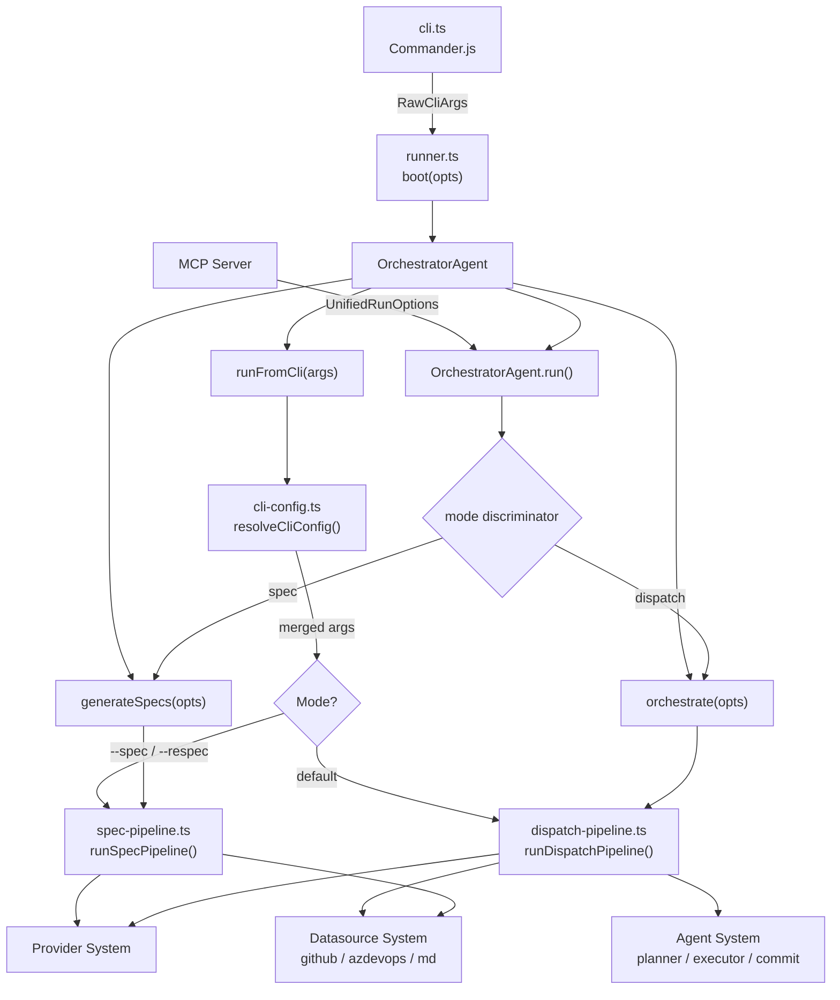

# Orchestrator & Pipelines

The orchestrator is the coordination layer of Dispatch. It receives structured
options from the [CLI](../cli-orchestration/cli.md), resolves configuration,
and delegates execution to one of three mutually exclusive pipelines: **dispatch**
(AI-driven task execution with full git lifecycle), **spec** (AI-driven spec
generation from issues), and **respec** (re-generation of existing specs).

The orchestrator owns no domain logic. It is a thin routing and configuration
layer that merges CLI flags with persisted config, enforces mode mutual
exclusion, checks prerequisites, and hands off to pipeline modules that handle
all AI, git, and datasource interaction.

## What it does

1. **Resolves configuration**: Merges CLI flags over config-file defaults over
   auto-detected values using a three-tier precedence model. The `explicitFlags`
   set ensures CLI flags always win when provided.
2. **Routes to pipelines**: The `runFromCli()` method inspects mode flags
   (`--spec`, `--respec`, or default dispatch) and delegates to
   the correct pipeline module.
3. **Enforces constraints**: Validates mutual exclusion of mode flags, checks
   prerequisites (git, Node.js, CLI tools), and confirms large batches before
   processing.

## Why it exists

Without the orchestrator layer, the CLI would need to contain pipeline
execution logic, configuration resolution, and mode routing in a single module.
The orchestrator separation provides:

- **Testability**: Each pipeline is independently testable without CLI argument
  parsing overhead.
- **Dual entry points**: The `OrchestratorAgent` interface supports both CLI
  invocation (`runFromCli`) and programmatic use (`run`, `orchestrate`,
  `generateSpecs`) — enabling the MCP server to drive pipelines without the CLI.
- **Thin coordination**: The runner contains no AI, git, or datasource logic,
  making the routing layer simple to reason about.

## Key source files

| File | Role |
|------|------|
| [`src/orchestrator/runner.ts`](../../src/orchestrator/runner.ts) | `boot()` factory, `OrchestratorAgent` interface, mode routing |
| [`src/orchestrator/cli-config.ts`](../../src/orchestrator/cli-config.ts) | Three-tier config resolution: CLI flags > config file > auto-detection |
| [`src/orchestrator/dispatch-pipeline.ts`](../../src/orchestrator/dispatch-pipeline.ts) | Core dispatch lifecycle: discover, parse, plan, execute, commit, PR |
| [`src/orchestrator/spec-pipeline.ts`](../../src/orchestrator/spec-pipeline.ts) | Spec generation: fetch issues, generate specs via AI, sync to datasource |
| [`src/orchestrator/datasource-helpers.ts`](../../src/orchestrator/datasource-helpers.ts) | Shared utilities: issue fetching, PR body/title generation, git operations |

## Architecture

The orchestrator sits between the CLI entry point and the domain-specific
pipeline modules. Each pipeline interacts with the provider, agent, and
datasource systems independently.

## Pipeline modes at a glance

| Mode | Flag | Pipeline | Input | Output |
|------|------|----------|-------|--------|
| Dispatch | _(default)_ | `runDispatchPipeline()` | Issue IDs or datasource listing | `DispatchSummary` with per-task results |
| Spec | `--spec` | `runSpecPipeline()` | Issue numbers, file globs, or inline text | `SpecSummary` with generated file paths |
| Respec | `--respec` | `runSpecPipeline()` | Existing spec IDs or all existing specs | `SpecSummary` (regenerated specs) |

## Cross-group dependencies

The orchestrator depends on most other groups in the project:

- **[Agent System](../agent-system/overview.md)**: Boots and drives planner,
  executor, commit, and spec agents.
- **[Provider System](../provider-system/overview.md)**: `bootProvider()`,
  `ProviderPool` for failover, session lifecycle.
- **[Datasource System](../datasource-system/overview.md)**: Issue fetching,
  CRUD operations, git lifecycle (branch, commit, push, PR), username resolution.
- **[Task Parsing](../task-parsing/overview.md)**: `parseTaskFile()`,
  `groupTasksByMode()`, `buildTaskContext()`, `Task` and `TaskFile` types.
- **[Shared Utilities](../shared-utilities/overview.md)**: `withTimeout()`,
  `withRetry()`, `runWithConcurrency()`, slugification.
- **[Git & Worktree](../git-and-worktree/overview.md)**: `createWorktree()`,
  `removeWorktree()`, branch validation, `.gitignore` management.
- **[Prerequisites & Safety](../prereqs-and-safety/overview.md)**: `checkPrereqs()`,
  `confirmLargeBatch()`.
- **[CLI & Configuration](../cli-orchestration/overview.md)**: `loadConfig()`,
  `resolveAgentProviderConfig()`, `DispatchConfig` type.

## Reading guide

Start with [Runner](../cli-orchestration/orchestrator.md) to understand the entry points and mode routing.
Then read [CLI Config](../cli-orchestration/configuration.md) for configuration resolution. The three
pipeline pages cover each execution mode in depth:

- [Dispatch Pipeline](../cli-orchestration/dispatch-pipeline.md) — the most complex module, covering
  worktree isolation, provider pools, task groups, feature branch merging, and
  commit agent integration
- [Spec Pipeline](spec-pipeline.md) — three-mode input resolution (tracker,
  file, inline), AI-driven generation, and datasource sync
- [Datasource Helpers](../datasource-system/datasource-helpers.md) — shared git and PR utilities
  used across pipelines
- [Integrations](integrations.md) — external dependencies and operational
  considerations

## Related Documentation

- [CLI Entry Point](../cli-orchestration/cli.md) — Commander.js CLI that produces `RawCliArgs` consumed by `boot()`
- [MCP Server Overview](../mcp-server/overview.md) — programmatic entry point via `OrchestratorAgent.run()`
- [Agent System Overview](../agent-system/overview.md) — planner, executor, commit, and spec agent architecture
- [Provider System Overview](../provider-system/overview.md) — `bootProvider()`, `ProviderPool`, session lifecycle
- [Datasource System Overview](../datasource-system/overview.md) — issue CRUD, git lifecycle, PR creation
- [Task Parsing Overview](../task-parsing/overview.md) — `parseTaskFile()`, `groupTasksByMode()`, task types
- [Shared Utilities Overview](../shared-utilities/overview.md) — `withTimeout()`, `withRetry()`, `runWithConcurrency()`
- [Git & Worktree Overview](../git-and-worktree/overview.md) — worktree isolation, branch validation
- [Prerequisites & Safety Overview](../prereqs-and-safety/overview.md) — `checkPrereqs()`, `confirmLargeBatch()`
- [CLI & Configuration Overview](../cli-orchestration/overview.md) — `loadConfig()`, `resolveAgentProviderConfig()`
- [Pipeline Lifecycle](../dispatch-pipeline/pipeline-lifecycle.md) — detailed phase-by-phase pipeline flow
- [Commit and PR Generation](../dispatch-pipeline/commit-and-pr-generation.md) — commit agent and PR creation
- [Task Recovery](../dispatch-pipeline/task-recovery.md) — pause/recovery flow for failed tasks
