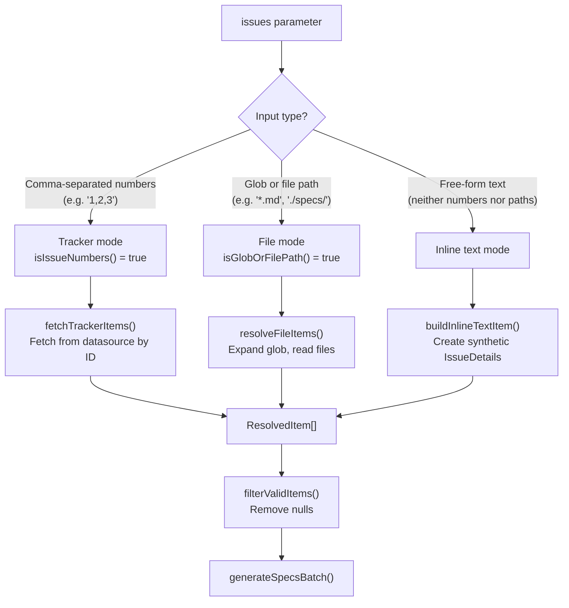

# Spec Pipeline

The spec pipeline (`src/orchestrator/spec-pipeline.ts`) generates structured
specification documents from issues, file globs, or inline text. It boots an
AI provider and [spec agent](../agent-system/spec-agent.md), processes
items through a concurrent generation loop, syncs generated specs back to the
originating datasource, and reports results.

## What it does

The spec pipeline:

1. **Resolves the datasource** from the input mode and configured source.
2. **Pre-authenticates** the datasource so device-code prompts appear before
   batch processing begins.
3. **Determines the input mode** (tracker, file, or inline text) and fetches
   or reads items accordingly.
4. **Boots the AI provider and spec agent** for generation.
5. **Generates specs in parallel batches** using sliding-window concurrency.
6. **Syncs generated specs** back to the datasource (update existing issues
   or create new ones).
7. **Cleans up** the spec agent and provider.
8. **Logs a summary** with a dispatch command hint for running the generated
   specs.

## Why it exists

Spec generation was extracted from the runner into its own pipeline module for
the same reasons as the dispatch pipeline — independent testability, clear
separation of routing from execution, and the ability to evolve the spec
generation logic without modifying the runner.

## Key source file

| File | Lines |
|------|-------|
| [`src/orchestrator/spec-pipeline.ts`](../../src/orchestrator/spec-pipeline.ts) | 727 |

## Input resolution

The spec pipeline supports three input modes, determined by inspecting the
`issues` parameter:

### Tracker mode

When the input is a comma-separated list of issue numbers:

- Fetches each issue from the configured datasource in concurrent batches.
- Each fetch is wrapped in a 30-second timeout (`FETCH_TIMEOUT_MS`).
- Failed fetches produce a warning but do not abort the pipeline.
- Successfully fetched items include title, body, labels, and comments.

### File mode

When the input is a glob pattern or file path:

- Expands the glob via the `glob` npm package against the working directory.
- Reads each matched file, extracting the title from the first H1 heading
  (via `extractTitle()` from the md datasource).
- Failed reads produce an error item (included in the failure count).

### Inline text mode

When the input is free-form text (neither issue numbers nor file paths):

- Creates a synthetic `IssueDetails` with the text as both title and body.
- Generates a slug from the text for the output filename.
- The output path is `{outputDir}/{slug}.md`.

## Generation loop

The `generateSpecsBatch()` function processes valid items through
`runWithConcurrency()` — the same sliding-window model used by the
[dispatch pipeline](../cli-orchestration/dispatch-pipeline.md#task-execution-groups-and-concurrency).

For each item, the generation loop:

1. Calls `specAgent.generate()` with the issue details (or file content),
   output path, and timebox configuration.
2. Wraps the call in `withRetry()` and `withTimeout()` for resilience.
3. On success, renames the output file based on the spec's H1 heading (the
   spec may produce a better title than the original issue).
4. Syncs to the datasource based on the input mode and datasource type.

### Datasource sync logic

After generating a spec, the pipeline syncs it to the datasource:

| Input mode | Datasource | Action |
|-----------|-----------|--------|
| Tracker | Any | Update the issue with spec content, delete local file |
| File | `md` (with existing ID) | Update the existing spec in-place |
| File | `md` (new file) | Create a new spec, delete original file |
| File | GitHub/AzDevOps | Create a new issue from spec, delete local file |
| Inline | `md` | Create a new spec from generated content |

The sync step is wrapped in a try/catch — sync failures produce a warning but
do not fail the spec generation.

## Timebox configuration

Spec generation uses a two-phase timebox:

- **Warn timeout** (`--spec-warn-timeout`): After this duration, the spec
  agent receives a warning signal to wrap up. Default: defined by
  `DEFAULT_SPEC_WARN_MIN` in `src/spec-generator.ts`.
- **Kill timeout** (`--spec-kill-timeout`): After warn + kill duration, the
  generation is forcibly terminated. Default: defined by
  `DEFAULT_SPEC_KILL_MIN`.
- **Total timeout**: The outer `withTimeout()` uses `specWarnMs + specKillMs`
  as the hard deadline.

Both timeouts are configured in minutes and converted to milliseconds at
pipeline startup.

## TUI integration

The spec pipeline integrates with the TUI in two modes:

- **Interactive mode** (default): Creates a full `createTui()` instance with
  animated rendering. Task entries track `"pending"`, `"generating"`,
  `"syncing"`, `"done"`, and `"failed"` statuses.
- **Verbose mode**: Creates a silent state container with no-op `update()` and
  `stop()` methods. The header banner is printed inline, and progress is logged
  via the standard logger.

The TUI state is populated with one entry per valid item, using the task's
title as the display text. During generation, the TUI shows real-time feedback
from the spec agent's `onProgress` callback.

## Respec discovery flow

The respec mode (`--respec`) is handled by the runner's `runFromCli()` method
before calling `generateSpecs()`. When `--respec` is invoked without arguments:

1. The runner resolves the datasource.
2. Calls `datasource.list()` to discover all existing specs.
3. Extracts identifiers from the listing.
4. Confirms the batch size with `confirmLargeBatch()`.
5. Passes the discovered identifiers to `generateSpecs()` as if they were
   `--spec` arguments.

When `--respec` has arguments, they are passed directly to `generateSpecs()`
(identical to `--spec` behavior).

## Output directory

Generated spec files are written to `{cwd}/.dispatch/specs/` by default.
This can be overridden with `--output-dir`. The directory is created
automatically if it does not exist.

## Summary and dispatch hint

After generation completes, the pipeline logs a summary line with counts of
generated and failed specs, total duration, and a dispatch command hint:

- If all identifiers are numeric: `dispatch 1,2,3`
- If any identifier is non-numeric: `dispatch "path/to/file" "other/file"`

This hint allows the user to immediately run the generated specs through the
dispatch pipeline.

## Related documentation

- [Spec Generation Overview](../spec-generation/overview.md) -- broader context
  on the spec generation system, including agent prompts and output format
- [Spec Agent](../agent-system/spec-agent.md) -- the AI agent that generates
  spec content from issue details
- [CLI & Orchestration](../cli-orchestration/overview.md) -- `--spec` and
  `--respec` flag routing
- [Datasource System](../datasource-system/overview.md) -- datasource
  abstraction used for issue fetching and spec syncing
- [Concurrency Utility](../shared-utilities/concurrency.md) --
  `runWithConcurrency()` sliding-window model used by `generateSpecsBatch()`
- [Timeout Utility](../shared-utilities/timeout.md) -- `withTimeout()` wrapper
  used for spec generation deadlines
- [Configuration](../cli-orchestration/configuration.md) --
  `--spec-warn-timeout` and `--spec-kill-timeout` flag resolution
- [Spec Agent Tests](../testing/spec-agent-tests.md) -- unit tests covering
  the spec agent invoked by this pipeline
