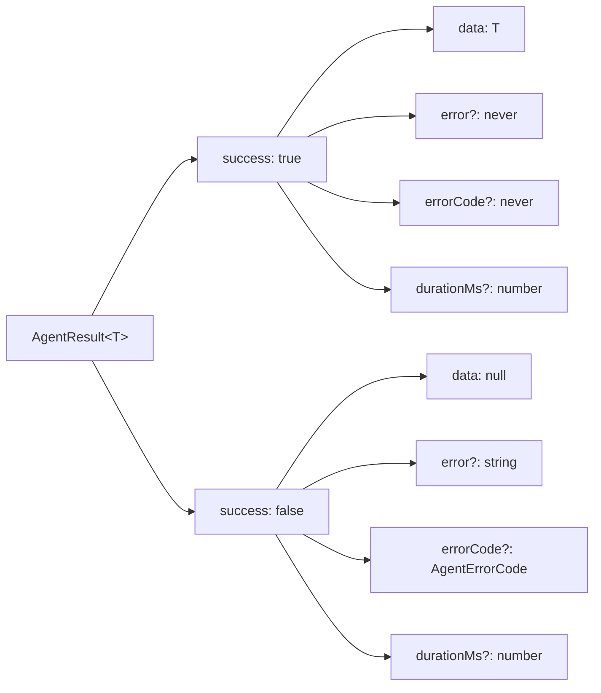
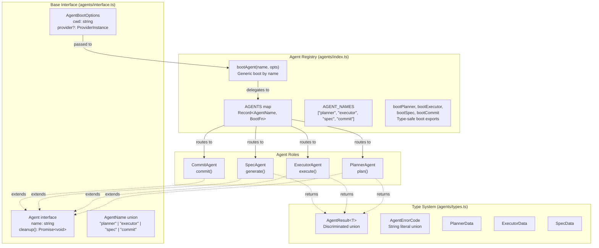

# Agent Result Types

The agent type system (`src/agents/types.ts`) provides a generic
`AgentResult<T>` discriminated union and concrete data type aliases for each
agent role. These types standardize success/failure handling, duration
tracking, and error classification across the entire planning and execution
pipeline.

## What it does

The type system provides three capabilities:

1. **Generic result envelope** — `AgentResult<T>` wraps every agent return
   value in a discriminated union on `success`, giving callers type-safe
   access to `data` (on success) or `error` (on failure) without non-null
   assertions.
2. **Machine-readable error codes** — `AgentErrorCode` classifies failures
   for programmatic retry and logging decisions.
3. **Domain-specific payloads** — `PlannerData`, `ExecutorData`, and
   `SpecData` define the shape of each agent role's success payload.

## Why it exists

Without a shared result type, each agent would define its own success/failure
pattern, leading to inconsistent error handling at call sites. The
`AgentResult<T>` union solves this by:

- Eliminating `null` checks via TypeScript's control-flow narrowing: when
  `result.success` is `true`, `result.data` is guaranteed to be `T` (not
  `null`)
- Providing a single place to add cross-cutting concerns like `durationMs`
  and `errorCode` that all agents benefit from
- Making the orchestrator's error-handling logic uniform across planner,
  executor, and spec agents

## `AgentResult<T>`

The core generic type, defined as a discriminated union on the `success` field:



### Success branch

| Field | Type | Description |
|-------|------|-------------|
| `success` | `true` | Discriminant — operation succeeded |
| `data` | `T` | Domain-specific payload, guaranteed non-null |
| `error` | `never` | Absent on success (allows `result.error` without narrowing) |
| `errorCode` | `never` | Absent on success |
| `durationMs` | `number?` | Elapsed wall-clock time in milliseconds |

### Failure branch

| Field | Type | Description |
|-------|------|-------------|
| `success` | `false` | Discriminant — operation failed |
| `data` | `null` | Always null on failure |
| `error` | `string?` | Human-readable error message |
| `errorCode` | `AgentErrorCode?` | Machine-readable error classification |
| `durationMs` | `number?` | Elapsed wall-clock time in milliseconds |

### Usage pattern

The discriminated union enables clean narrowing at call sites:

```typescript
const result = await planner.plan(task, fileContext);
if (result.success) {
  // TypeScript knows: result.data is PlannerData, result.error is never
  const plan = result.data.prompt;
} else {
  // TypeScript knows: result.data is null, result.error is string | undefined
  log.error(`Planning failed: ${result.error}`);
}
```

## `AgentErrorCode`

A string literal union for machine-readable error classification:

| Code | Meaning | Typical trigger |
|------|---------|-----------------|
| `TIMEOUT` | The operation exceeded a time limit | `withTimeout()` wrapper around planner |
| `NO_RESPONSE` | The provider returned null or empty | `prompt()` returned null |
| `VALIDATION_FAILED` | Output did not pass structural validation | Spec agent validation checks |
| `PROVIDER_ERROR` | The provider SDK threw an error | `createSession()` or `prompt()` rejection |
| `UNKNOWN` | Unclassified error | Catch-all for unexpected exceptions |

### Current usage status

The `AgentErrorCode` type is defined and available but **not currently set by
the planner or executor agents**. Both agents return failures with `error`
(human-readable message) and `durationMs`, but do not populate `errorCode`.

The error codes are designed for future use by the orchestrator to implement
differentiated retry strategies:

| Error code | Suggested retry strategy |
|------------|------------------------|
| `TIMEOUT` | Retry with increased timeout |
| `NO_RESPONSE` | Retry immediately (transient provider issue) |
| `VALIDATION_FAILED` | Do not retry (deterministic failure) |
| `PROVIDER_ERROR` | Retry with backoff (provider may be overloaded) |
| `UNKNOWN` | Do not retry (unknown root cause) |

Currently, retry decisions are made at the orchestrator level based on error
type (timeout vs. non-timeout) rather than `errorCode`. See the
[orchestrator's retry logic](../cli-orchestration/orchestrator.md) for current
behavior.

## Concrete data types

### `PlannerData`

Domain payload for the [planner agent](./planner.md):

| Field | Type | Description |
|-------|------|-------------|
| `prompt` | `string` | The system prompt produced for the executor agent |

The `prompt` field contains the full execution plan text that the planner
generated after exploring the codebase. This text is passed verbatim to the
[dispatcher's `buildPlannedPrompt()`](./dispatcher.md#planned-prompt-buildplannedprompt)
function.

### `ExecutorData`

Domain payload for the [executor agent](./executor.md):

| Field | Type | Description |
|-------|------|-------------|
| `dispatchResult` | [`DispatchResult`](./dispatcher.md#dispatchresult) | The underlying dispatch result from `dispatchTask()` |

The `DispatchResult` contains the original `Task`, a `success` boolean, and
an optional `error` message. The executor wraps this in `ExecutorData` so the
orchestrator can access both the dispatch outcome and the agent-level
metadata (`durationMs`, `errorCode`).

### `SpecData`

Domain payload for the [spec agent](../agent-system/spec-agent.md):

| Field | Type | Description |
|-------|------|-------------|
| `content` | `string` | The cleaned spec content after extraction and post-processing |
| `valid` | `boolean` | Whether the spec passed structural validation |
| `validationReason` | `string?` | Validation failure reason, if `valid` is `false` |

Note that `valid: false` does **not** imply `success: false`. A spec with
minor formatting issues is still written to disk and counted as successful.
See [spec validation](../spec-generation/overview.md#validatespecstructure--3-check-validation)
for the validation criteria.

## Agent boot and registry system

The agents are registered in a static map and booted via factory functions.
The following diagram shows how the four agent roles share a common interface,
are registered in `src/agents/index.ts`, and produce role-specific sub-interfaces:



### How agent boot works

1. The orchestrator calls `bootPlanner(opts)` or `bootExecutor(opts)` with
   an `AgentBootOptions` containing `cwd` and an optional `provider`.
2. Both agents validate that `provider` is non-null (throwing if absent).
3. The boot function returns a role-specific agent object (`PlannerAgent` or
   `ExecutorAgent`) that closes over the provider reference.
4. The returned agent uses the provider for the duration of the pipeline.
   The agent does **not** own the provider lifecycle — cleanup is a no-op.

### The generic `bootAgent()` function

The `bootAgent(name, opts)` function in `src/agents/index.ts` provides
name-based routing for cases where the agent type is determined at runtime.
It looks up the `name` in the `AGENTS` map and calls the corresponding boot
function. If the name is not registered, it throws with a descriptive error
listing all available agent names.

For compile-time known roles, prefer the typed exports (`bootPlanner`,
`bootExecutor`, `bootSpec`, `bootCommit`) which return the specific
sub-interface rather than the generic `Agent` base type.

## Cross-group usage

The `AgentResult<T>` type is consumed by:

- **Orchestrator** (`src/orchestrator/dispatch-pipeline.ts`) — checks
  `result.success` to decide whether to continue or mark tasks failed
- **TUI** (`src/tui.ts`) — displays task status based on agent results
- **Spec pipeline** (`src/orchestrator/spec-pipeline.ts`) — processes
  `AgentResult<SpecData>` from the spec agent

The `agents/types.ts` file is shared between the
[planning-and-execution](./overview.md) and
[agent-framework](../agent-system/overview.md) groups, serving as the
contract between agent implementations and their consumers. See also the
[Agent Framework overview](../agent-system/overview.md) for the full
registry architecture, boot lifecycle, and provider session management.

## Related documentation

- [Pipeline Overview](./overview.md) — How agents fit into the pipeline
- [Planner Agent](./planner.md) — Returns `AgentResult<PlannerData>`
- [Executor Agent](./executor.md) — Returns `AgentResult<ExecutorData>`
- [Dispatcher](./dispatcher.md) — The `DispatchResult` wrapped by
  `ExecutorData`
- [Spec Agent](../agent-system/spec-agent.md) — Returns
  `AgentResult<SpecData>`
- [Provider Interface](../shared-types/provider.md) — The
  `ProviderInstance` passed via `AgentBootOptions`
- [Orchestrator](../cli-orchestration/orchestrator.md) — How agent results
  drive retry and failure decisions
- [Planner & Executor Tests](../testing/planner-executor-tests.md) — Unit
  tests that exercise `AgentResult` narrowing
- [Agent Framework](../agent-system/overview.md) — Registry, boot
  lifecycle, and provider session management for all agents
- [Testing Overview](../testing/overview.md) — Project-wide test framework
  and coverage map
