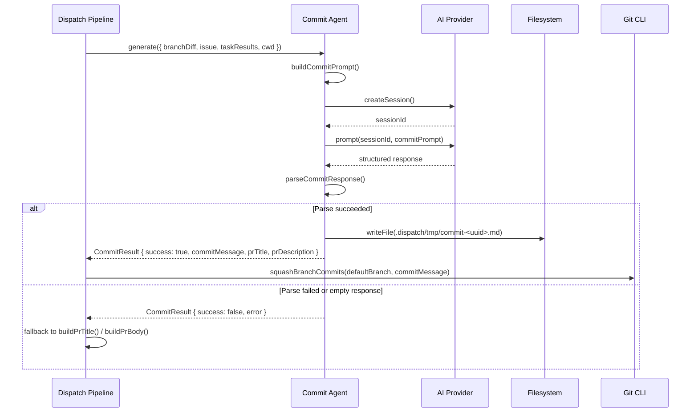
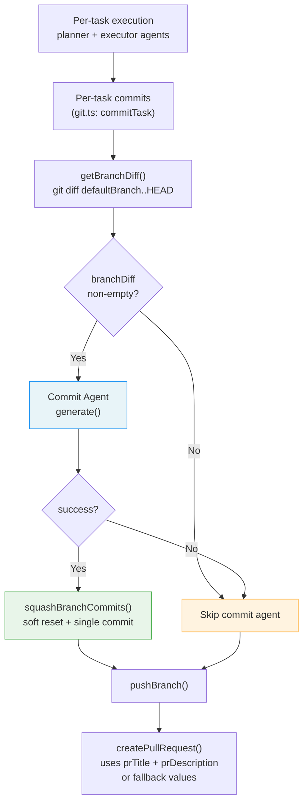

# Commit Agent

The commit agent (`src/agents/commit.ts`) generates AI-powered conventional
commit messages, PR titles, and PR descriptions by analyzing the cumulative
branch diff after all tasks complete. It runs as the final agent phase in the
[dispatch pipeline](../cli-orchestration/orchestrator.md), between task
execution and the push/PR creation step.

## What it does

The commit agent receives the full branch diff (relative to the default branch),
the originating issue context, and the results of all dispatched tasks. It
sends a structured prompt to the configured AI provider, parses the response
into three components, and returns them as a `CommitResult`:

1. **Commit message** -- a
   [Conventional Commits](https://www.conventionalcommits.org/) v1.0.0 compliant
   message used to squash all per-task commits into a single commit.
2. **PR title** -- a concise summary for the pull request.
3. **PR description** -- a markdown explanation referencing the issue context.

If generation fails for any reason, the pipeline falls back to
`buildPrTitle()` and `buildPrBody()` from
`src/orchestrator/datasource-helpers.ts`, which produce simpler titles and
descriptions without AI involvement.

## Why it exists

Without the commit agent, each task produces its own conventional commit via
the [per-task commit system](./git.md) in `src/git.ts`. While useful for
incremental auditability, these per-task commits result in a noisy git history
when the branch is merged. The commit agent solves this by:

1. **Squashing into a single meaningful commit** -- after all tasks complete,
   the branch's per-task commits are squashed into one commit with an
   AI-generated message that summarizes the entire change set.
2. **Producing coherent PR metadata** -- the PR title and description are
   generated from the actual diff rather than from task text heuristics,
   resulting in more accurate summaries.
3. **Maintaining conventional commit compliance** -- the AI is instructed to
   follow the Conventional Commits spec, producing structured messages that
   work with changelog generators and commit-lint tooling.

### Relationship to per-task commits

The commit agent is **complementary** to the per-task commit system, not a
replacement. During execution:

1. The [spec agent](../spec-generation/overview.md) embeds commit instructions
   in task descriptions (e.g., "commit with a conventional commit message"),
   driving per-task commits during execution.
2. After all tasks complete, the commit agent squashes those per-task commits
   into a single commit via `squashBranchCommits()`.

This two-layer approach preserves per-task granularity during development while
delivering a clean single-commit history on the final branch.

## How it works

### Boot and lifecycle

The commit agent is booted via `boot(opts)` from `src/agents/commit.ts`.
It requires a `provider` (a `ProviderInstance`) in the boot options; booting
without a provider throws immediately.

The returned `CommitAgent` object has two methods:

- **`generate(opts)`** -- the core method that produces commit messages and PR
  metadata.
- **`cleanup()`** -- a no-op. The commit agent owns no resources; provider
  lifecycle is managed externally by the pipeline.

### Generation flow

### Pipeline integration

The commit agent is integrated into the dispatch pipeline at
`src/orchestrator/dispatch-pipeline.ts`:

1. **Boot** (line 214): `bootCommit({ provider: instance, cwd })` -- booted
   alongside planner and executor agents. Also booted per-worktree at line 298
   for isolated execution contexts.

2. **Invocation guard** (line 467): the agent is only called when all of the
   following are true:
    - `--no-branch` was **not** passed
    - A branch name and default branch are available
    - Issue details exist
    - The branch diff is non-empty

3. **Squash on success** (line 477): if `result.success`, the pipeline calls
   `squashBranchCommits(defaultBranch, result.commitMessage, issueCwd)` to
   replace all per-task commits with a single commit.

4. **PR metadata fallback** (lines 501-511): the pipeline uses
   `commitAgentResult?.prTitle || buildPrTitle(...)` and
   `commitAgentResult?.prDescription || buildPrBody(...)`, so non-AI fallbacks
   always exist.

5. **Cleanup** (line 574): `await commitAgent?.cleanup()` -- called alongside
   other agent cleanups.

### Data flow through the pipeline

### Prompt construction

`buildCommitPrompt()` assembles a structured prompt with the following
sections:

| Section | Content | Limits |
|---------|---------|--------|
| Role instruction | Instructs AI to act as a "commit message agent" | -- |
| Conventional Commits guidelines | Spec v1.0.0 rules, allowed types, formatting rules | -- |
| Issue context | Issue number, title, truncated body, labels | Body truncated to **500 characters** |
| Tasks | Completed and failed task lists from `DispatchResult[]` | -- |
| Git diff | Full branch diff in a fenced code block | Truncated to **50,000 characters** |
| Output format | Required `COMMIT_MESSAGE`, `PR_TITLE`, `PR_DESCRIPTION` sections | -- |

The prompt references the
[Conventional Commits specification v1.0.0](https://www.conventionalcommits.org/)
and instructs the AI to use the types: `feat`, `fix`, `docs`, `refactor`,
`test`, `chore`, `style`, `perf`, `ci`.

### Response parsing

`parseCommitResponse()` extracts three sections from the AI response using
regex patterns:

| Section | Regex | Terminator |
|---------|-------|-----------|
| `COMMIT_MESSAGE` | `/###\s*COMMIT_MESSAGE\s*\n([\s\S]*?)(?=###\s*PR_TITLE\|$)/i` | Next section or end of string |
| `PR_TITLE` | `/###\s*PR_TITLE\s*\n([\s\S]*?)(?=###\s*PR_DESCRIPTION\|$)/i` | Next section or end of string |
| `PR_DESCRIPTION` | `/###\s*PR_DESCRIPTION\s*\n([\s\S]*?)$/i` | End of string |

The regexes are case-insensitive and tolerate minor whitespace variations.
Each matched group is trimmed before assignment.

**Validation gap**: the parser does not validate that the extracted commit
message actually conforms to the Conventional Commits spec. If the AI produces
a non-compliant message (e.g., missing type prefix, wrong casing), it is
accepted as-is and used for the squash commit. There is no runtime validation
layer between the AI response and the git commit.

### Output file

On success, the agent writes a formatted markdown file to
`.dispatch/tmp/commit-<uuid>.md` containing the parsed commit message, PR
title, and PR description. The UUID is generated via `crypto.randomUUID()`
(requires Node.js >= 16.7.0; the project requires >= 20.12.0).

This file serves as an audit trail and can be inspected for debugging. The
path is returned in `CommitResult.outputPath`.

### Squash mechanism

When the commit agent succeeds, the pipeline calls `squashBranchCommits()`
from `src/orchestrator/datasource-helpers.ts`. This function uses a **soft
reset approach** (not interactive rebase):

1. `git merge-base <defaultBranch> HEAD` -- find the common ancestor
2. `git reset --soft <merge-base>` -- undo all commits but keep changes staged
3. `git commit -m <message>` -- create a single commit with the AI-generated
   message

The branch diff used by the commit agent is obtained via
`getBranchDiff()` which runs `git diff <defaultBranch>..HEAD` with a 10 MB
`maxBuffer` to handle large diffs.

## Error handling

The commit agent uses a **catch-and-continue** pattern. The entire `generate()`
method is wrapped in a try/catch that returns `{ success: false, error }` on
any exception. Errors are never thrown to the caller.

| Failure scenario | Behavior |
|-----------------|----------|
| Provider returns empty/null response | Returns `success: false` with "empty response" error |
| Response parsing finds no commit message or PR title | Returns `success: false` with "no commit message or PR title found" |
| Provider `prompt()` throws | Caught; returns `success: false` with extracted error message |
| Session creation fails | Caught; returns `success: false` with extracted error message |
| File write fails | Caught; returns `success: false` with extracted error message |
| AI produces non-compliant commit format | **Not caught** -- accepted and used as-is |

When the commit agent returns `success: false`, the pipeline skips the squash
step and falls back to heuristic PR metadata. Per-task commits remain intact
on the branch.

### Session lifecycle

The commit agent creates a provider session via `provider.createSession()` and
sends a single prompt via `provider.prompt()`. There is **no explicit session
cleanup** after the prompt completes. Sessions are managed server-side by the
provider; no client-side teardown is needed per session. The provider-level
`cleanup()` (called at pipeline end) handles overall resource teardown.

## Interfaces

### CommitGenerateOptions

Passed to `generate()`:

| Field | Type | Description |
|-------|------|-------------|
| `branchDiff` | `string` | Git diff of the branch relative to the default branch |
| `issue` | `IssueDetails` | Issue details for context (number, title, body, labels) |
| `taskResults` | `DispatchResult[]` | Results from all dispatched tasks |
| `cwd` | `string` | Working directory |

### CommitResult

Returned from `generate()`:

| Field | Type | Description |
|-------|------|-------------|
| `commitMessage` | `string` | Generated conventional commit message (empty on failure) |
| `prTitle` | `string` | Generated PR title (empty on failure) |
| `prDescription` | `string` | Generated PR description (empty on failure) |
| `success` | `boolean` | Whether generation succeeded |
| `error` | `string?` | Error message if generation failed |
| `outputPath` | `string?` | Path to the temp markdown output file |

### CommitAgent

Extends `Agent` with a `generate()` method:

| Method | Signature | Description |
|--------|-----------|-------------|
| `generate` | `(opts: CommitGenerateOptions) => Promise<CommitResult>` | Generate commit message and PR metadata |
| `cleanup` | `() => Promise<void>` | No-op; provider lifecycle managed externally |
| `name` | `"commit"` | Agent identifier |

## Testing

The commit agent has a dedicated unit test file at
`src/tests/commit-agent.test.ts` (42 lines) covering the `boot()` function
and `cleanup()` method:

| Test | What it verifies |
|------|-----------------|
| `boot` throws without provider | `boot({ cwd })` rejects with "requires a provider instance" |
| `boot` returns agent with name "commit" | `agent.name === "commit"` |
| `boot` returns agent with cleanup method | `typeof agent.cleanup === "function"` |
| `cleanup` resolves without error | `agent.cleanup()` resolves to `undefined` |

### Test coverage gaps

The following functions are **not unit tested**:

- `generate()` -- the core generation flow (session creation, prompting,
  parsing, file writing)
- `buildCommitPrompt()` -- prompt construction with truncation logic
- `parseCommitResponse()` -- regex-based response parsing

Integration-level coverage exists in `src/tests/dispatch-pipeline.test.ts`
(lines 823-980), which tests the commit agent within the full pipeline context
across six scenarios.

## Limitations and known gaps

1. **No runtime validation of conventional commit format** -- the AI's commit
   message is accepted as-is without checking conformance to the Conventional
   Commits spec. A malformed message will be used for the squash commit.

2. **No session cleanup** -- sessions created by `createSession()` are not
   explicitly closed after use. This relies on server-side session management
   by the provider.

3. **Diff truncation at 50,000 characters** -- large diffs are truncated,
   potentially losing context for changes that appear later in the diff. The
   AI may produce less accurate messages for large changesets.

4. **Issue body truncation at 500 characters** -- long issue descriptions are
   clipped, which may omit relevant context for complex issues.

5. **No retry on failure** -- unlike the planner agent which has configurable
   retries via `--plan-retries`, the commit agent makes a single attempt with
   no retry mechanism.

## Related documentation

- [Pipeline Overview](./overview.md) -- where the commit agent fits in the
  dispatch pipeline stages
- [Git Operations](./git.md) -- per-task conventional commits that the commit
  agent squashes
- [Dispatcher](./dispatcher.md) -- the execution phase that precedes the commit
  agent
- [Planner Agent](./planner.md) -- the planning phase that precedes dispatch
  and commit
- [Orchestrator](../cli-orchestration/orchestrator.md) -- pipeline phases,
  cleanup, and error recovery
- [Datasource Helpers](../datasource-system/datasource-helpers.md) --
  `squashBranchCommits()`, `getBranchDiff()`, `buildPrTitle()`, `buildPrBody()`
- [Provider Overview](../provider-system/provider-overview.md) -- provider
  interface, session model, and cleanup
- [Spec Generation](../spec-generation/overview.md) -- spec agent that embeds
  per-task commit instructions
- [Architecture Overview](../architecture.md) -- system-level agent registry
  and pipeline topology
- [Testing Overview](../testing/overview.md) -- test suite structure and
  commit agent test coverage
