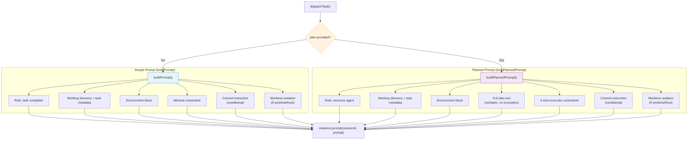
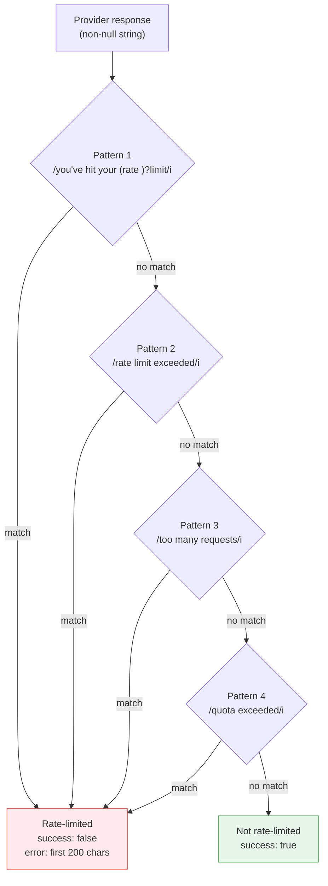

# Dispatcher

The dispatcher (`src/dispatcher.ts`) sends individual tasks to an AI agent
provider in isolated sessions. It is the execution phase of the pipeline,
responsible for constructing the prompt, invoking the provider, and returning
a structured result.

## What it does

The dispatcher receives a [`Task`](../task-parsing/api-reference.md#task) object, an optional execution plan (produced
by the [planner](./planner.md)), and an optional `worktreeRoot` path for
[worktree isolation](#worktree-isolation) (see also [Git & Worktree Management](../git-and-worktree/overview.md)). It constructs an appropriate prompt,
creates a fresh [provider session](../provider-system/overview.md#session-isolation-model), sends the prompt, and returns a `DispatchResult`
indicating success or failure.

## Why it exists

The dispatcher exists to enforce **context isolation**: each task gets its own
session so that conversation history from one task cannot influence another. It
also serves as the boundary between the Dispatch pipeline logic and the
[provider abstraction](../provider-system/overview.md), keeping prompt construction separate from provider
protocol details.

## How it works

### Session isolation

Every call to `dispatchTask()` begins by calling `instance.createSession()`,
which returns an opaque session identifier. This session is used for exactly one
`prompt()` call and is never reused. See
[Provider session isolation](../provider-system/overview.md#session-isolation-model)
for how each backend implements session boundaries.

**What guarantees does `createSession()` offer?**

Session isolation is implemented by the concrete provider backends:

- **OpenCode** (`src/providers/opencode.ts`): Calls `client.session.create()`
  on the OpenCode SDK, which creates a brand-new server-side session with its
  own conversation history, tool state, and context window. Each session ID maps
  to an independent conversation on the OpenCode server.

- **Copilot** (`src/providers/copilot.ts`): Calls `client.createSession()` on
  the Copilot SDK, which returns a new `CopilotSession` object tracked in a
  local `Map`. Each session is an independent interaction with the Copilot
  backend.

In both cases, the provider SDK manages the session boundary. There is no
shared mutable state between sessions at the Dispatch application level.
The guarantee is: **one session = one task = one conversation**. Context from
task A's session cannot leak into task B's session because they are separate
server-side objects.

### Prompt construction

The dispatcher builds one of two prompt variants depending on whether a plan
is available (`src/dispatcher.ts:43`):

#### Simple prompt (`buildPrompt`)

Used when [`--no-plan`](../cli-orchestration/cli.md) is active or when no plan is provided. Contains:

- Working directory path
- Source file path and line number
- [Task](../task-parsing/api-reference.md#task) text
- Constraints: complete only this task, make minimal changes
- Commit instruction (conditional -- see [Commit instruction detection](#commit-instruction-detection))
- Confirmation request: "When finished, confirm by saying 'Task complete.'"

#### Planned prompt (`buildPlannedPrompt`)

Used when the [planner](./planner.md) has produced an execution plan. Contains
everything in the simple prompt, plus:

- The full plan text in an "Execution Plan" section
- An "Executor Constraints" section with six rules (see
  [executor constraints](#executor-constraints))

The plan text from `planTask()` is embedded verbatim -- there is no truncation
or validation of plan size before it reaches the executor. See
[Maximum prompt size](#maximum-prompt-size) for implications.

### Commit instruction detection

The dispatcher dynamically adjusts the commit instruction in the prompt based
on the task text, using `taskRequestsCommit()` and `buildCommitInstruction()`
(`src/dispatcher.ts:107-123`).

**Detection logic**: `taskRequestsCommit()` tests the task text against
`/\bcommit\b/i` — a case-insensitive word-boundary match for the word "commit".

| Task text | Match? | Reason |
|-----------|--------|--------|
| `"Commit the database migration"` | Yes | Word "commit" present |
| `"Add auth and commit changes"` | Yes | Word "commit" present |
| `"Update the uncommitted files list"` | No | "commit" is part of "uncommitted" — word boundary fails |
| `"Fix the recommit logic"` | No | "commit" is part of "recommit" — word boundary fails |

**When matched**: The prompt includes an instruction to stage all changes and
create a conventional commit using one of the standard types (`feat`, `fix`,
`docs`, `refactor`, `test`, `chore`, `style`, `perf`, `ci`).

**When not matched**: The prompt explicitly instructs the agent **not** to
commit — the orchestrator handles commits externally.

**False-positive risk**: The word-boundary regex is simple and could match
task descriptions that mention "commit" in a non-instructional context (e.g.,
`"Review the last commit message format"`). In such cases, the agent would be
instructed to create a commit when none was intended. Since the regex operates
on the raw task text with no semantic understanding, task authors should be
aware that including the word "commit" triggers this behavior.

### Executor constraints

When a plan is provided, `buildPlannedPrompt()` appends six constraint rules
(`src/dispatcher.ts:93-98`) that restrict the executor agent's behavior:

1. **Follow the plan precisely** — do not deviate, skip steps, or reorder.
2. **Complete only this task** — do not work on other tasks.
3. **Minimal changes** — do not refactor unrelated code.
4. **No exploration** — do not read or modify files not referenced in the plan.
   The planner has already done all necessary research.
5. **No re-planning** — do not question or revise the plan. Trust it as given.
6. **No search tools** — do not use `grep`, `find`, or similar tools unless the
   plan explicitly instructs it.

These constraints exist because the two-phase planner-executor model assumes
the planner has already explored the codebase. Allowing the executor to explore
independently would negate the benefits of planning (focused context, reduced
token usage) and risk the executor making decisions that conflict with the plan.

**Enforcement is prompt-only.** Neither the OpenCode nor Copilot SDKs expose
capability restrictions (e.g., read-only file access, tool whitelisting). The
constraints rely entirely on the AI agent following the prompt instructions.
An agent that ignores prompt instructions could explore, re-plan, or modify
files outside the plan's scope.

### Worktree isolation

When operating inside a git worktree, the optional `worktreeRoot` parameter
(`src/dispatcher.ts:28`) triggers additional prompt instructions via
`buildWorktreeIsolation()` (`src/dispatcher.ts:132-139`). Both `buildPrompt()`
and `buildPlannedPrompt()` append these instructions when a worktree root is
provided.

The instructions tell the agent:

- It is operating inside a git worktree at the specified root directory
- It **must not** read, write, or execute commands that access files outside
  that directory
- All file paths must resolve within the worktree root

**Enforcement is prompt-only**, like the [executor constraints](#executor-constraints)
and [planner read-only enforcement](./planner.md#read-only-enforcement). The
provider backends do not support filesystem sandboxing. If the agent ignores the
instruction, it could access files outside the worktree.

**When is `worktreeRoot` provided?** The [orchestrator](../cli-orchestration/orchestrator.md)
passes `worktreeRoot` when tasks are dispatched into isolated git worktrees
(created for `(I)` mode tasks). In non-worktree mode, the parameter is
`undefined` and no isolation instructions are appended.

### Planned vs unplanned dispatch outcomes

The choice between planned and unplanned prompts affects what the agent sees and
how it behaves:

| Aspect | Unplanned (`--no-plan`) | Planned (default) |
|--------|------------------------|-------------------|
| Prompt function | `buildPrompt()` | `buildPlannedPrompt()` |
| Agent role | General-purpose executor | Plan follower |
| Codebase exploration | Agent explores freely | Agent told not to explore |
| Plan section | Absent | Full plan embedded verbatim |
| Constraint strictness | Minimal ("complete only this task") | Strict ("do not deviate, skip, or reorder") |
| Prompt size | Smaller (task text only) | Larger (task text + plan text) |

Unplanned dispatch is simpler and gives the agent more autonomy, but the agent
has no pre-researched context. Planned dispatch is more deterministic but
depends on plan quality and adds prompt size overhead.

### Rate-limit detection

After receiving a non-null response from the provider, the dispatcher scans the
response body against four regex patterns to detect rate-limit messages that
the AI provider may have embedded in the response text rather than signaled via
HTTP status codes (`src/dispatcher.ts:19-24`).

The four patterns are:

| # | Pattern | Example match |
|---|---------|---------------|
| 1 | `/you[''\u2019]?ve hit your (rate )?limit/i` | "You've hit your rate limit" |
| 2 | `/rate limit exceeded/i` | "Rate limit exceeded" |
| 3 | `/too many requests/i` | "Too many requests" |
| 4 | `/quota exceeded/i` | "Quota exceeded" |

**Detection is response-body-based, not HTTP-status-based.** The dispatcher
does not check HTTP status codes (e.g., 429 Too Many Requests). Instead, it
relies on the AI provider's response text containing rate-limit language. This
is a fragile heuristic with known limitations:

- **False positives**: If the agent's legitimate response discusses rate limits
  (e.g., "I added rate limit exceeded handling to the API controller"), the
  dispatcher will incorrectly classify it as a rate-limit error.
- **False negatives**: If the provider uses different phrasing not covered by
  the four patterns (e.g., "request throttled", "capacity exceeded"), the
  rate limit will go undetected and the response will be treated as a success.
- **Provider-specific language**: The patterns assume English-language error
  messages. Non-English provider responses will not be caught.

When a rate limit is detected, the response is truncated to 200 characters and
included in the error message. Both the console logger and the file logger
record the truncated response for debugging.

**Why response-body matching?** The `ProviderInstance.prompt()` interface
returns `string | null`, abstracting away HTTP-level details. By the time the
dispatcher sees the response, any HTTP 429 status has already been handled (or
not) by the provider SDK layer. Some providers embed rate-limit messages in the
response body even when the HTTP response is 200 OK, making body-level
detection the only reliable approach at this abstraction layer.

### Success verification

**How does the system verify the agent actually completed the task?**

It does not verify task completion at the content level. When `dispatchTask`
returns `{ success: true }`, it means only that:

1. `createSession()` did not throw
2. `instance.prompt()` returned a non-null string
3. The response did not match any [rate-limit patterns](#rate-limit-detection)

The dispatcher does **not** inspect the agent's response content beyond
rate-limit detection. It does not check whether the agent said "Task complete,"
whether files were actually modified, or whether the changes are correct. The
`success: true` result indicates the agent responded without a detected
rate-limit error, not that the task was correctly implemented.

**Why this design?** Verifying task correctness would require understanding the
task semantics, running tests, or diffing expected outcomes -- all of which are
beyond the scope of a single dispatch call. The current design treats the AI
agent as a best-effort executor. If verification is needed, it should be added
at the orchestrator level (e.g., running tests after each task) rather than
inside the dispatcher.

After a successful dispatch, the [orchestrator](../cli-orchestration/orchestrator.md) (`src/orchestrator.ts:144-146`)
calls [`markTaskComplete()`](../task-parsing/api-reference.md#marktaskcomplete) and [`commitTask()`](./git.md#the-committask-function) unconditionally, trusting the
agent's response as an indication of completion.

### Error handling

All errors thrown during session creation or prompting are caught and returned
as `{ success: false, error: message }` in the `DispatchResult`. The error
does not propagate -- the [orchestrator](../cli-orchestration/orchestrator.md) receives a structured result and marks
the task as failed in the [TUI](../cli-orchestration/tui.md).

If the provider's `prompt()` call returns `null` (indicating no response was
generated), this is treated as a failure with the message "No response from
agent."

### Provider prompt model differences

The dispatcher calls `instance.prompt(sessionId, prompt)` uniformly regardless
of the backend. However, the underlying execution differs significantly:

- **OpenCode**: The `prompt()` method uses a 5-step asynchronous flow involving
  `promptAsync()`, SSE event streaming, and post-completion message fetching. See
  [OpenCode async prompt model](../provider-system/opencode-backend.md#asynchronous-prompt-model).
- **Copilot**: The `prompt()` method uses an event-based pattern: `session.send()`
  fires the prompt, then event listeners wait for `session.idle` or
  `session.error` within a 300-second timeout. See
  [Copilot event-based model](../provider-system/copilot-backend.md#event-based-prompt-model).

The dispatcher is unaware of these differences -- the `ProviderInstance`
interface abstracts them away. From the dispatcher's perspective, `prompt()` is
always an async call that eventually resolves with a string or null.

## Timeout and cancellation

**What happens if the provider's `prompt()` call times out or hangs
indefinitely?**

The dispatcher itself has **no timeout or cancellation mechanism**. The
`await instance.prompt(sessionId, prompt)` call will block indefinitely if the
provider does not respond.

Timeout behavior depends entirely on the provider backend:

- **OpenCode**: The `@opencode-ai/sdk` HTTP client may have default request
  timeouts, but these are not configured by Dispatch. A hung OpenCode server
  will cause the dispatch to hang. See [OpenCode prompt timeouts](../provider-system/overview.md#prompt-timeouts-and-cancellation).

- **Copilot**: The `session.send()` call fires the prompt asynchronously, and
  event listeners wait for `session.idle` or `session.error`. The Copilot
  provider wraps this in a **300-second timeout** via `withTimeout()`. See
  [Copilot prompt timeouts](../provider-system/overview.md#prompt-timeouts-and-cancellation).

**Mitigation**: If an OpenCode task hangs, the only recourse is to kill the
Dispatch process (Ctrl+C / SIGINT). The Copilot provider's 300-second timeout
provides automatic recovery for individual prompts.
This is a known limitation. To add timeout support, wrap the `prompt()` call
with [`Promise.race()`](../shared-utilities/timeout.md) against a timer, or use the `AbortSignal` option
supported by Node.js `fetch` if the provider SDK exposes it.

## Maximum prompt size

**Could the planner's output combined with the task file context exceed the
provider's context window?**

Yes. There is no size validation or truncation at any point in the prompt
construction chain:

1. [`buildTaskContext()`](../task-parsing/api-reference.md#buildtaskcontext) can produce arbitrarily large output if the markdown
   file is large
2. The planner agent's response (the execution plan) has no size limit
3. `buildPlannedPrompt()` concatenates the plan verbatim into the prompt
4. The combined prompt is sent directly to `instance.prompt()`

The practical limits depend on the provider:

- **OpenCode**: Context window is determined by the underlying model configured
  in the OpenCode server (e.g., Claude models typically support 100K-200K
  tokens).
- **Copilot**: Context window depends on the GitHub Copilot backend model.

If the prompt exceeds the provider's context window, the behavior is
provider-specific -- it may truncate, return an error, or produce degraded
output. Dispatch does not detect or handle this condition.

**Mitigation**: Keep task files focused and concise. If planner output is
consistently too large, consider adding a size check in `dispatchTask()` before
calling `prompt()`, or configuring the planner prompt to request concise output.

## Interfaces

### `DispatchResult`

Returned by `dispatchTask()`:

| Field | Type | Description |
|-------|------|-------------|
| `task` | [`Task`](../task-parsing/api-reference.md#task) | The task that was dispatched |
| `success` | `boolean` | Whether the agent produced a non-null response |
| `error` | `string?` | Error message if `success` is `false` |

## Related documentation

- [Pipeline Overview](./overview.md) -- Full pipeline flow and state machine
- [Planner Agent](./planner.md) -- How plans are generated
- [Git Operations](./git.md) -- What happens after successful dispatch
- [Task Context & Lifecycle](./task-context-and-lifecycle.md) -- How tasks are
  parsed and marked complete
- [Provider Abstraction](../provider-system/overview.md) -- The `ProviderInstance`
  interface and backend implementations
- [Orchestrator](../cli-orchestration/orchestrator.md) -- How the orchestrator
  coordinates dispatch within the batch loop
- [Logger](../shared-types/logger.md) -- Logger interface used during dispatch
- [Timeout Utility](../shared-utilities/timeout.md) -- `withTimeout` function
  used for plan generation timeout
- [Architecture & Concurrency](../task-parsing/architecture-and-concurrency.md) --
  File I/O safety relevant to `markTaskComplete` after dispatch
- [Executor Agent](./executor.md) -- How the executor wraps `dispatchTask()`
  with task completion marking, forming the dispatch-then-complete coupling
- [Agent Types](./agent-types.md) -- `AgentResult<T>`, `AgentErrorCode`, and
  `ExecutorData` type definitions
- [Datasource Helpers](../datasource-system/datasource-helpers.md) -- Helper
  utilities for datasource operations; `DispatchResult` from the dispatcher
  drives the auto-close logic in `closeCompletedSpecIssues()`
- [Git & Worktree Management](../git-and-worktree/overview.md) -- Worktree
  creation and isolation model that provides the `worktreeRoot` parameter
- [Run State & Lifecycle](../git-and-worktree/run-state.md) -- State
  transitions for worktree-isolated task dispatch
- [Markdown Syntax Reference](../task-parsing/markdown-syntax.md) -- Checkbox
  format and mode prefixes that affect prompt construction
- [Dispatch Pipeline Tests](../testing/dispatch-pipeline-tests.md) -- Tests
  verifying dispatch pipeline behavior including worktree mode
- [Provider Interface](../shared-types/provider.md) -- `ProviderInstance` type
  definition consumed by `dispatchTask()`
