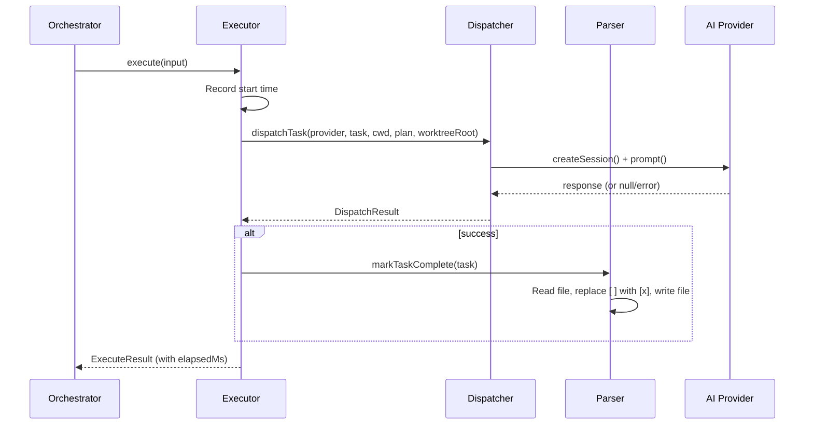

# Executor Agent

The executor agent (`src/agents/executor.ts`) ties together task dispatch and
task completion into a single operation. It is the final stage of the pipeline
for each task: it calls the [dispatcher](./dispatcher.md) to send the task to
an AI agent, then calls [`markTaskComplete()`](../task-parsing/api-reference.md#marktaskcomplete) on
success.

## What it does

The executor receives an `ExecuteInput` containing a [`Task`](../task-parsing/api-reference.md#task), a working
directory, an optional plan (from the [planner](./planner.md)), and an optional
`worktreeRoot` for [worktree isolation](../git-and-worktree/overview.md).
It:

1. Calls `dispatchTask()` to send the task to the AI provider
2. If the dispatch succeeds, calls `markTaskComplete()` to check off the task
   in the source markdown file
3. Returns a structured `ExecuteResult` with timing information

## Why it exists

The executor exists to encapsulate the **dispatch + mark-complete** coupling.
Without it, the [orchestrator](../cli-orchestration/orchestrator.md) would need
to call `dispatchTask()` and `markTaskComplete()` separately, handling errors
and timing for each. The executor makes this a single atomic-looking operation
from the orchestrator's perspective.

The executor also conforms to the [`Agent`](../shared-types/overview.md)
interface, which means it follows the standard boot/cleanup lifecycle used by
all agents in the system. This uniformity allows the orchestrator to manage
planner and executor agents identically.

## How it works

### Boot and provider requirement

The executor is created via the `boot()` function
(`src/agents/executor.ts:68`), which requires an `AgentBootOptions` with a
non-null `provider` field. If no provider is supplied, `boot()` throws
immediately.

The booted executor retains a reference to the provider but does **not** own
its lifecycle. The provider is created and cleaned up by the orchestrator. The
executor's `cleanup()` method is a no-op (`src/agents/executor.ts:108-110`).

### Execution flow

### Plan passthrough

The executor does not generate or validate plans. It receives the plan as a
string (or `null` if `--no-plan`) from the orchestrator and passes it directly
to `dispatchTask()`. A non-null plan triggers the
[planned prompt path](./dispatcher.md#planned-prompt-buildplannedprompt) in the
dispatcher; a null plan triggers the
[simple prompt path](./dispatcher.md#simple-prompt-buildprompt).

### Worktree isolation passthrough

The optional `worktreeRoot` field in `ExecuteInput` is forwarded directly to
`dispatchTask()` (`src/agents/executor.ts:85`). The executor does not use this
value itself — it is consumed by the dispatcher's
[`buildWorktreeIsolation()`](./dispatcher.md#worktree-isolation) function to
add filesystem confinement instructions to the prompt.

### Error handling

All errors are caught and returned as structured results — the executor never
throws. Two error paths exist:

1. **Dispatch failure**: If `dispatchTask()` returns `{ success: false }`, the
   executor skips `markTaskComplete()` and returns the error. The task remains
   unchecked in the source file.

2. **Unexpected exception**: If `dispatchTask()` or `markTaskComplete()` throws,
   the catch block uses `log.extractMessage(err)` to extract a message and
   returns a failed `ExecuteResult`. This covers scenarios like filesystem
   errors during `markTaskComplete()` (e.g., `ENOENT`, `EACCES`).

In both cases, the orchestrator receives a structured result and updates the
[TUI](../cli-orchestration/tui.md) accordingly.

### Timing

The executor records wall-clock elapsed time (`Date.now()` at start and end)
in the `elapsedMs` field of `ExecuteResult`. This includes both the dispatch
time (AI provider round-trip) and the `markTaskComplete()` file I/O time.
The orchestrator uses this for TUI display.

## Interfaces

### `ExecuteInput`

Input to the executor for a single task:

| Field | Type | Description |
|-------|------|-------------|
| `task` | [`Task`](../task-parsing/api-reference.md#task) | The task to execute |
| `cwd` | `string` | Working directory for the AI agent |
| `plan` | `string \| null` | Planner output, or `null` if planning was skipped |
| `worktreeRoot` | `string?` | Worktree root directory for isolation, if applicable |

### `ExecuteResult`

Structured result of executing a single task:

| Field | Type | Description |
|-------|------|-------------|
| `dispatchResult` | [`DispatchResult`](./dispatcher.md#dispatchresult) | The underlying dispatch result |
| `success` | `boolean` | Whether the task completed successfully |
| `error` | `string?` | Error message if execution failed |
| `elapsedMs` | `number` | Elapsed wall-clock time in milliseconds |

### `ExecutorAgent`

The booted executor agent interface:

| Method | Signature | Description |
|--------|-----------|-------------|
| `execute` | `(input: ExecuteInput) => Promise<ExecuteResult>` | Execute a single task |
| `cleanup` | `() => Promise<void>` | No-op — provider lifecycle is external |
| `name` | `string` | Always `"executor"` |

## Related documentation

- [Pipeline Overview](./overview.md) -- Full pipeline flow and state machine
- [Dispatcher](./dispatcher.md) -- Prompt construction and session isolation
- [Planner Agent](./planner.md) -- How plans are generated before execution
- [Task Context & Lifecycle](./task-context-and-lifecycle.md) -- How
  `markTaskComplete` fits in the pipeline
- [Task Parsing API Reference](../task-parsing/api-reference.md) --
  `markTaskComplete` function contract
- [Orchestrator](../cli-orchestration/orchestrator.md) -- How the orchestrator
  creates and calls the executor
- [Provider Abstraction](../provider-system/provider-overview.md) -- The
  `ProviderInstance` interface consumed by the executor
- [Agent Interface](../shared-types/overview.md) -- The `Agent` base interface
  that `ExecutorAgent` extends
- [Git Worktree Helpers](../git-and-worktree/overview.md) -- Worktree isolation
  model consumed via the `worktreeRoot` passthrough
- [Testing Overview](../testing/overview.md) -- Project-wide test suite
  (note: the executor agent has no unit tests)
- [Datasource Helpers](../datasource-system/datasource-helpers.md) -- The
  orchestration bridge that consumes `DispatchResult` for issue lifecycle
  operations like `closeCompletedSpecIssues`
