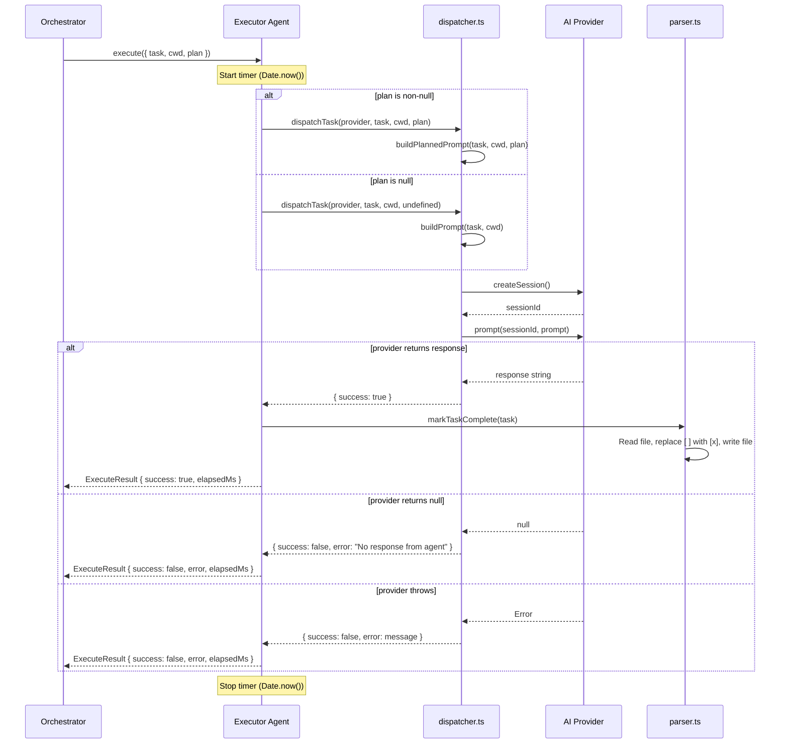
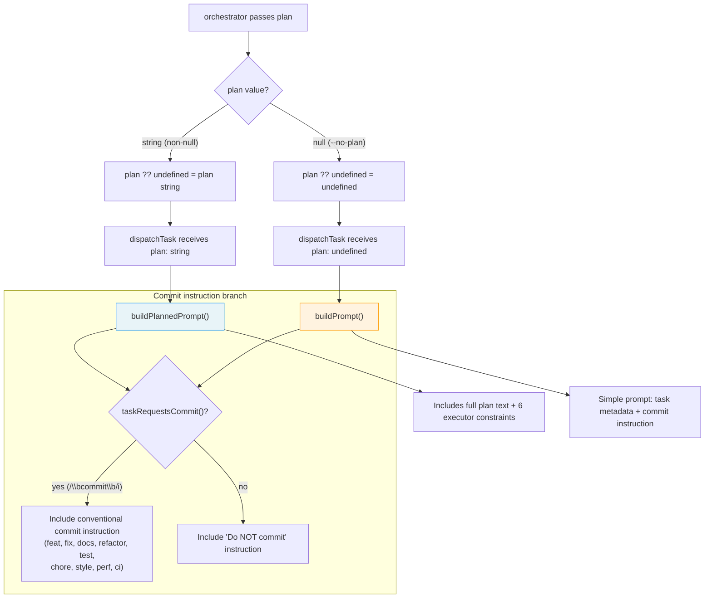

# Executor Agent

The executor agent (`src/agents/executor.ts`) is the final execution stage of
the Dispatch pipeline. It receives a parsed task and an optional execution plan,
dispatches the task to an AI provider via the [dispatcher](./dispatcher.md),
marks the task complete on success, and returns a structured result to the
[orchestrator](../cli-orchestration/orchestrator.md).

## What it does

The executor wraps the lower-level `dispatchTask()` function with:

- **Boot-time validation** -- Ensures a provider instance is available before
  any work begins.
- **Plan-to-prompt routing** -- Converts the orchestrator's `plan: string | null`
  into the dispatcher's `plan?: string` parameter, triggering either the planned
  or generic prompt path.
- **Task completion tracking** -- Calls `markTaskComplete()` to check off the
  task in the source markdown file when dispatch succeeds.
- **Wall-clock timing** -- Records `elapsedMs` for each execution, used by the
  orchestrator for TUI display and performance reporting.
- **Structured error handling** -- Catches all exceptions and returns them as
  `ExecuteResult` objects rather than letting errors propagate.

## Why it exists

Without the executor agent, the orchestrator would need to coordinate
`dispatchTask()`, `markTaskComplete()`, timing, and error handling inline. The
executor encapsulates this per-task lifecycle into a single `execute()` call,
keeping the orchestrator's batch loop simple.

The executor also enforces the boundary between **plan ownership** (orchestrator
and planner) and **plan consumption** (executor and dispatcher). The executor
never calls the planner itself -- the plan is treated as authoritative input.

## How it works

### Multi-service execution flow

The following diagram shows how a single task flows through the executor,
dispatcher, provider, and parser during execution:



### Boot process

`boot(opts)` (`src/agents/executor.ts:66`) validates that `opts.provider` is
present and returns an `ExecutorAgent` object. If no provider is supplied, boot
throws immediately -- this is a programming error, not a runtime condition.

```typescript
// From src/agents/executor.ts:69-71
if (!provider) {
  throw new Error("Executor agent requires a provider instance in boot options");
}
```

The returned agent object closes over the provider instance. The provider is
not owned by the executor -- its lifecycle (creation, cleanup) is managed by
the [orchestrator](../cli-orchestration/orchestrator.md).

### Plan-to-prompt routing

The executor receives `plan: string | null` from the orchestrator. The
dispatcher's `dispatchTask()` function accepts `plan?: string` (optional, not
nullable). The executor bridges this with a null-coalescing conversion
(`src/agents/executor.ts:83`):

```
dispatchTask(provider, task, cwd, plan ?? undefined)
```

This triggers the dispatcher's ternary at `src/dispatcher.ts:32`:



See [Dispatcher -- Prompt construction](./dispatcher.md#prompt-construction) for
the full prompt templates and [Executor constraints](./dispatcher.md#executor-constraints)
for the six rules enforced in planned mode.

### Task completion marking

On successful dispatch (`result.success === true`), the executor calls
`markTaskComplete(task)` (`src/parser.ts:117`). This function performs a
**filesystem read-modify-write cycle**:

1. Reads the task's source markdown file
2. Splits the content into lines
3. Replaces `[ ]` with `[x]` at the task's line number
4. Writes the modified content back to disk

**Idempotency warning**: `markTaskComplete()` is **not idempotent**. If called
on an already-completed task (one that has `[x]` instead of `[ ]`), the line
will not match the unchecked pattern and the function will throw. The executor
does not guard against this -- it trusts that the orchestrator only dispatches
uncompleted tasks.

See [Task Context & Lifecycle](./task-context-and-lifecycle.md) for details on
the file format, concurrent write safety, and the `markTaskComplete` contract.

### Elapsed time tracking

The executor records wall-clock time around each execution
(`src/agents/executor.ts:78, 93, 101`):

```
startTime = Date.now()
// ... dispatch + markTaskComplete ...
elapsedMs = Date.now() - startTime
```

`elapsedMs` includes the full dispatch round-trip (session creation, AI prompt,
response) plus the `markTaskComplete` file write. The orchestrator uses this
value for TUI progress display.

**Why wall-clock time?** The executor has no access to provider-internal timing.
The `ProviderInstance` interface does not expose per-prompt latency metrics.
Wall-clock measurement captures the end-to-end time including network latency,
AI processing, and filesystem I/O.

### Cleanup

The executor's `cleanup()` method is a **no-op** (`src/agents/executor.ts:106-108`).
The executor does not own any resources -- the provider instance is created and
destroyed by the orchestrator. This is intentional: having a single owner for
provider lifecycle prevents double-cleanup bugs.

See [Orchestrator -- Provider lifecycle](../cli-orchestration/orchestrator.md)
for how provider cleanup is coordinated at the process level.

### Error handling

All errors during execution are caught and returned as structured
`ExecuteResult` objects. Errors never propagate from `execute()`:

| Error source | Handling |
|-------------|----------|
| `dispatchTask()` throws | Caught by try/catch, `log.extractMessage(err)` extracts message |
| `dispatchTask()` returns `{ success: false }` | Forwarded directly in `ExecuteResult` |
| `markTaskComplete()` throws | Caught by the same try/catch (runs only on success path) |
| Non-Error exceptions (strings, numbers) | `log.extractMessage()` converts via `String()` |

The `log.extractMessage()` function (`src/helpers/logger.ts`) handles three
cases: `Error` instances (returns `.message`), truthy non-Error values (returns
`String(value)`), and null/undefined (returns `""`).

See [Logger](../shared-types/logger.md) for the full `extractMessage` and
`formatErrorChain` API.

## Interfaces

### `ExecuteInput`

Input to the executor for a single task (`src/agents/executor.ts:23-30`):

| Field | Type | Description |
|-------|------|-------------|
| `task` | [`Task`](../task-parsing/api-reference.md#task) | The task to execute |
| `cwd` | `string` | Working directory path |
| `plan` | `string \| null` | Planner output, or `null` if planning was skipped (`--no-plan`) |

### `ExecuteResult`

Structured result returned by `execute()` (`src/agents/executor.ts:38-47`):

| Field | Type | Description |
|-------|------|-------------|
| `dispatchResult` | [`DispatchResult`](./dispatcher.md#dispatchresult) | The underlying dispatch result |
| `success` | `boolean` | Whether the task completed successfully |
| `error` | `string?` | Error message if execution failed |
| `elapsedMs` | `number` | Wall-clock elapsed time in milliseconds |

### `ExecutorAgent`

The booted agent interface (`src/agents/executor.ts:52-58`), extends `Agent`:

| Member | Type | Description |
|--------|------|-------------|
| `name` | `string` | Always `"executor"` |
| `execute(input)` | `(ExecuteInput) => Promise<ExecuteResult>` | Execute a single task |
| `cleanup()` | `() => Promise<void>` | No-op -- provider lifecycle managed externally |

## Troubleshooting

### Provider returns null responses

If the AI provider's `prompt()` call returns `null`, the executor reports
`{ success: false, error: "No response from agent" }`. This can occur when:

- The provider backend is overloaded or rate-limited
- The session was invalidated between creation and prompting
- A network error produced a null response instead of throwing

**To debug**: Enable verbose logging (`--verbose` flag) to see the dispatcher's
debug output, which logs prompt size, plan presence, and response length. Check
the provider backend logs (OpenCode: `~/.opencode/logs/`, Copilot: process
stderr) for upstream errors.

### Commit instruction vs commit agent double-commit risk

When a task's text contains the word "commit" (matched by `/\bcommit\b/i`),
the dispatcher instructs the AI agent to create a conventional commit. However,
the [orchestrator](../cli-orchestration/orchestrator.md) also calls
`commitTask()` after every successful dispatch.

This creates a **potential double-commit**: the AI agent commits inside the
session, and then the orchestrator commits again externally. The second commit
may be empty (if the agent already committed everything) or may capture
additional files the agent missed.

**Mitigation**: The orchestrator's `commitTask()` uses `git diff --cached --stat`
to check if anything is staged before committing. If the agent already committed
all changes, the external commit will be a no-op. However, if the agent
committed only some files, the orchestrator will create a second commit for the
remainder.

### Executor cleanup gap

The executor's `cleanup()` is a no-op because the provider lifecycle is managed
by the orchestrator. If a caller creates an executor but forgets to clean up
the provider separately, the provider's resources (open connections, child
processes) will leak.

**Expected usage**: The orchestrator calls `provider.cleanup()` during shutdown,
not `executor.cleanup()`. The executor is a stateless wrapper -- it does not
need cleanup.

### markTaskComplete fails on already-completed task

If `markTaskComplete()` is called on a task whose checkbox is already `[x]`,
it will throw because the line does not match the `[ ]` pattern. This should
not happen in normal operation because the orchestrator filters out completed
tasks before dispatching. If it does occur, the executor catches the error and
returns a failure result.

## Related documentation

- [Dispatcher](./dispatcher.md) -- Session isolation, prompt construction, and
  dispatch mechanics
- [Pipeline Overview](./overview.md) -- Full pipeline flow and stage diagram
- [Planner Agent](./planner.md) -- How plans are generated before execution
- [Task Context & Lifecycle](./task-context-and-lifecycle.md) -- `markTaskComplete`
  contract and concurrent write safety
- [Orchestrator](../cli-orchestration/orchestrator.md) -- How the orchestrator
  coordinates executor within the batch loop
- [Provider Abstraction](../provider-system/provider-overview.md) -- The
  `ProviderInstance` interface and backend implementations
- [Logger](../shared-types/logger.md) -- `extractMessage` and `formatErrorChain`
  used by the executor
- [Executor & Dispatcher Tests](../testing/executor-and-dispatcher-tests.md) --
  Test coverage for the executor agent and dispatcher
- [Git Operations](./git.md) -- Conventional commits after task execution
- [Integrations & Troubleshooting](./integrations.md) -- Provider health
  monitoring and in-flight crash recovery
