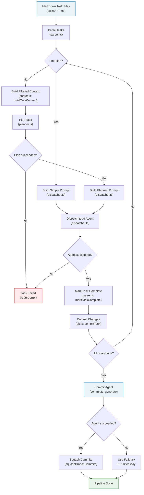
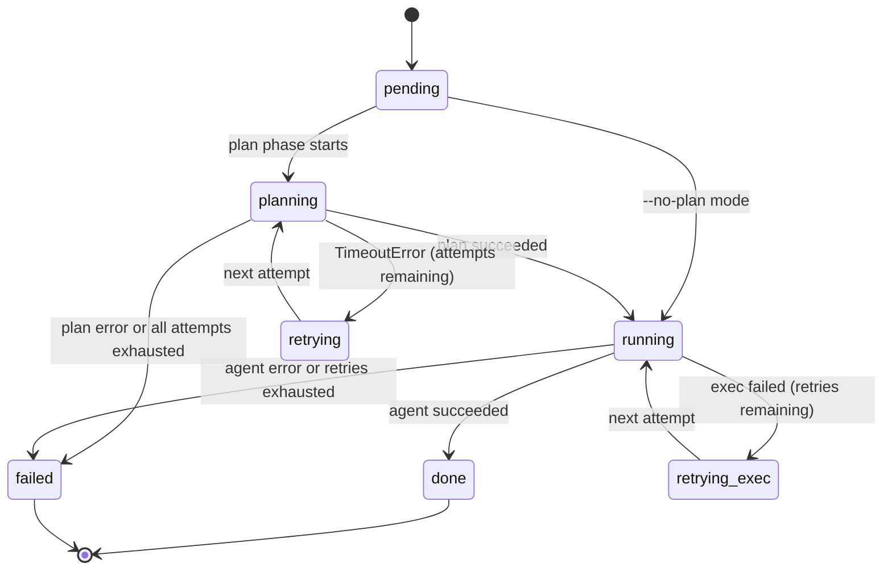
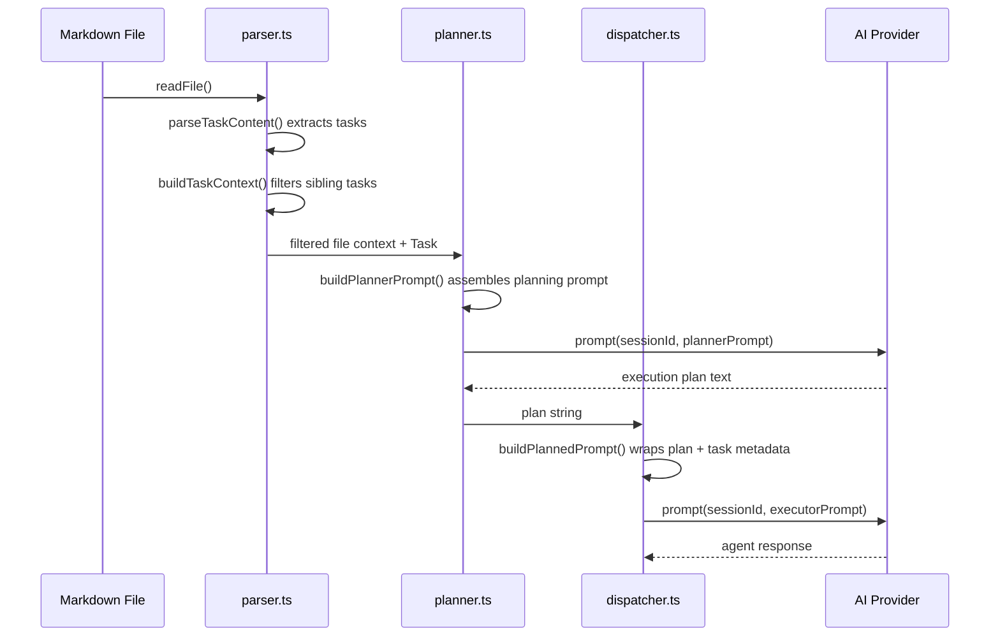

# Planning & Dispatch Pipeline

The planning and dispatch pipeline is the core task execution engine of the
Dispatch tool. It transforms markdown task files into completed, committed work
by routing each task through a series of stages: parsing, optional planning,
AI-driven execution, file mutation, and version control.

## Why this pipeline exists

Dispatch automates multi-task software engineering work by delegating individual
tasks to AI agents. The pipeline exists to solve three problems:

1. **Context isolation** -- Each task must be executed in a fresh AI session so
   that context from one task does not leak into or confuse another.
2. **Precision through planning** -- A two-phase planner-then-executor
   architecture allows a read-only planning agent to explore the codebase first,
   producing a detailed execution plan that a separate executor agent follows.
3. **Automated record-keeping** -- After each task completes, the pipeline marks
   it done in the source markdown and creates a conventional commit, maintaining
   a clean, auditable git history.

## Pipeline stages

## Task state machine

Each task transitions through well-defined states during processing. The
`--no-plan` flag causes the `planning` state to be skipped entirely.

State transitions are managed by the [orchestrator](../cli-orchestration/orchestrator.md)
(`src/orchestrator.ts`) and reflected in the [TUI](../cli-orchestration/tui.md) via `TaskState` updates.

## Prompt construction chain

Understanding which data flows into which prompt template is critical for
debugging and extending the pipeline.

When `--no-plan` is active, the planner step is skipped entirely and
`buildPrompt()` in `dispatcher.ts` constructs a simpler prompt containing
only the task metadata and working directory.

## Module responsibilities

| Module | Responsibility | Source |
|--------|---------------|--------|
| `parser.ts` | Extract tasks from markdown; build filtered context; mark tasks complete | `src/parser.ts` — see [Task Parsing](../task-parsing/overview.md) and [API Reference](../task-parsing/api-reference.md) |
| `planner.ts` | Run a read-only AI session to produce an execution plan | `src/planner.ts` — see [Planner Agent](./planner.md) |
| `dispatcher.ts` | Send tasks to an AI agent in isolated sessions | `src/dispatcher.ts` — see [Dispatcher](./dispatcher.md) |
| `executor.ts` | Wrap dispatch with task completion, timing, and error handling | `src/agents/executor.ts` — see [Executor Agent](./executor.md) |
| `git.ts` | Stage changes and create conventional commits | `src/git.ts` — see [Git Operations](./git.md) |
| `commit.ts` | Generate AI commit message, PR title/description; squash per-task commits | `src/agents/commit.ts` — see [Commit Agent](./commit-agent.md) |

See the [Testing Guide](../task-parsing/testing-guide.md) for how the parser
functions are tested, the [Parser Tests](../testing/parser-tests.md) for
a detailed breakdown of all 62 test cases, and the
[Executor & Dispatcher Tests](../testing/executor-and-dispatcher-tests.md) for
the 16 tests covering the executor agent and dispatcher.

## Key design decisions

### Two-phase planner-then-executor (optional)

The pipeline supports an optional planning phase where a separate AI session
explores the codebase before the executor acts. This produces higher-quality
results because the executor receives a detailed, context-rich plan rather than
just the raw task text. The `--no-plan` CLI flag bypasses this phase for speed
when tasks are simple or the user prefers direct execution.

See [Planner Agent](./planner.md) for details on when to use `--no-plan`.

### Session isolation per task

Every task -- whether in the planning or execution phase -- gets a fresh
provider session via `createSession()`. This prevents context rot and ensures
one task's conversation history cannot influence another.

See [Dispatcher](./dispatcher.md#session-isolation) for details on isolation
guarantees.

### Prompt-only planner read-only enforcement

The planner agent is instructed to be read-only via prompt instructions, not
via provider-level tool restrictions. This is a deliberate trade-off.

See [Planner Agent](./planner.md#read-only-enforcement) for the rationale and
limitations.

### Automatic conventional commit type inference

After task completion, `git.ts` infers a commit type from the task text using
regex pattern matching, following the
[Conventional Commits](https://www.conventionalcommits.org/) specification.

See [Git Operations](./git.md#commit-type-inference) for the full type mapping.

## Concurrency model

The [orchestrator](../cli-orchestration/orchestrator.md) processes tasks in batches controlled by `--concurrency N`
(default: 1). Within a batch, tasks run in parallel via `Promise.all()`. This
has important implications for both git operations and file mutations.

See [Git Operations](./git.md#concurrency-and-git-add--a) and
[Task Parsing](./task-context-and-lifecycle.md#concurrent-write-safety) for
concurrency-related concerns.

## Worktree-based parallel execution

When the pipeline processes multiple issue files it can run them in parallel,
each in its own [git worktree](https://git-scm.com/docs/git-worktree). The
decision is made at `src/orchestrator/dispatch-pipeline.ts:186`:

    useWorktrees = !noWorktree && !noBranch && tasksByFile.size > 1

All three conditions must hold:

1. The `--no-worktree` flag was **not** passed.
2. The `--no-branch` flag was **not** passed.
3. More than one issue file is being processed.

When worktrees are active, each issue file receives its own:

- Git worktree (isolated working directory)
- Provider instance (separate AI session)
- Planner, executor, and commit agent

Issues are dispatched in parallel via `Promise.all`
(`src/orchestrator/dispatch-pipeline.ts:553`). Within each issue the
individual tasks still follow the
[group-aware batch-sequential model](#concurrency-model).

When worktrees are **not** active (single issue or opted out), the pipeline
falls back to a `for...of` loop that processes issues one at a time
(`src/orchestrator/dispatch-pipeline.ts:559`). A single shared provider,
planner, executor, and commit agent are used for all issues.

See the [Orchestrator](../cli-orchestration/orchestrator.md#worktree-based-parallel-execution)
for the full worktree decision diagram and per-issue lifecycle.

## Executor retry mechanism

The executor wraps each task dispatch with a hardcoded retry count of 2
(`src/orchestrator/dispatch-pipeline.ts:384`). `withRetry()` from
`src/helpers/retry.ts` re-invokes the executor up to 2 additional times
(3 total attempts) whenever the executor returns `success: false`. If all
attempts fail, the final error is surfaced in the dispatch result.

| Parameter | Value | Configurable? |
|-----------|-------|---------------|
| `execRetries` | `2` | No (hardcoded) |
| Total attempts | `3` | No |

> **Note:** Executor retries are **not** configurable via CLI flags. Only
> planner retries can be adjusted at the command line (see below). The
> executor retry count can only be changed in source.

See [Executor Agent](./executor.md) for details on what constitutes a
successful execution.

## Planner timeout and retry behavior

Two constants in `src/orchestrator/dispatch-pipeline.ts` control planner
resilience:

| Constant | Default | CLI override | Meaning |
|----------|---------|-------------|---------|
| `DEFAULT_PLAN_TIMEOUT_MIN` | `10` (minutes) | `--plan-timeout` | Maximum wall-clock time for a single plan attempt |
| `DEFAULT_PLAN_RETRIES` | `1` | `--retries` / `--plan-retries` | Number of **retries** after the initial attempt (2 total attempts) |

The effective maximum attempts are computed as `retries + 1`
(`src/orchestrator/dispatch-pipeline.ts:74`).

Retry behavior differs by error type:

- **`TimeoutError`** -- the attempt is retried if attempts remain. The
    planner enters the `retrying` state (see the
    [task state machine](#task-state-machine) above) and a warning is logged.
- **Any other error** -- the retry loop breaks immediately and a failure
    result is produced. No further attempts are made
    (`src/orchestrator/dispatch-pipeline.ts:347-354`).

If all attempts are exhausted due to timeouts, the pipeline produces a
failure result that includes the timeout duration and attempt count
(`src/orchestrator/dispatch-pipeline.ts:359-367`).

See [Planner Agent](./planner.md) for details on the planning prompt and
read-only enforcement.

## Datasource sync failure tolerance

After a task succeeds, the pipeline attempts to sync the checked-off state
back to the originating datasource (e.g., update a GitHub issue body). This
sync can fail -- for example, due to network errors or permission issues.

When the sync fails (`src/orchestrator/dispatch-pipeline.ts:417-419`):

1. The error is caught and logged as a **warning** (not an error).
2. The task is still marked as `done`
   (`src/orchestrator/dispatch-pipeline.ts:421`).
3. The task counts toward the completed total.

This is intentional: a datasource communication failure should not invalidate
work that was successfully executed and committed locally. The user can
manually sync the datasource state afterward if needed.

## Related documentation

- [Dispatcher](./dispatcher.md) -- Session isolation, prompt construction,
  success verification
- [Executor Agent](./executor.md) -- Task execution wrapper with completion
  tracking and timing
- [Commit Agent](./commit-agent.md) -- AI-generated commit messages, PR
  metadata, and branch squashing
- [Planner Agent](./planner.md) -- Two-phase architecture, read-only
  enforcement, file context
- [Git Operations](./git.md) -- Conventional commits, staging behavior,
  troubleshooting
- [Task Context & Lifecycle](./task-context-and-lifecycle.md) -- Markdown
  format, context filtering, concurrent writes
- [Integrations & Troubleshooting](./integrations.md) -- Provider system,
  Node.js child_process, fs operations
- [CLI & Orchestration](../cli-orchestration/overview.md) -- Orchestrator loop and CLI flags
- [CLI Argument Parser](../cli-orchestration/cli.md) -- `--no-plan`,
  `--concurrency`, and `--dry-run` flag documentation
- [Configuration System](../cli-orchestration/configuration.md) -- Persistent
  defaults for `--concurrency`, `--provider`, and other pipeline options
- [Provider Abstraction](../provider-system/provider-overview.md) -- Provider interface and backends
- [OpenCode Backend](../provider-system/opencode-backend.md) -- OpenCode
  provider setup and async prompt model
- [Copilot Backend](../provider-system/copilot-backend.md) -- Copilot
  provider setup and synchronous prompt model
- [Cleanup Registry](../shared-types/cleanup.md) -- Process-level cleanup
  for graceful shutdown during pipeline execution
- [Shared Interfaces & Utilities](../shared-types/overview.md) -- `Task`, `TaskFile`, and
  `ProviderInstance` type definitions
- [Shared Parser Types](../shared-types/parser.md) -- Summary of `Task`,
  `TaskFile`, and exported parser functions
- [Task Parsing API Reference](../task-parsing/api-reference.md) --
  `parseTaskFile`, `buildTaskContext`, `markTaskComplete`, and `groupTasksByMode`
  function contracts
- [Task Parsing Testing Guide](../task-parsing/testing-guide.md) -- How to
  run and extend parser tests
- [Spec Generation](../spec-generation/overview.md) -- How the spec pipeline
  produces the markdown task files consumed by this pipeline
- [Testing Overview](../testing/overview.md) -- Test suite structure (the
  dispatcher and executor agent are unit-tested; planner and git modules are not
  currently unit-tested)
- [Executor & Dispatcher Tests](../testing/executor-and-dispatcher-tests.md) --
  Detailed breakdown of the 16 executor and dispatcher tests
- [Parser Tests](../testing/parser-tests.md) -- Detailed breakdown of all 62
  parser tests covering the functions this pipeline depends on
