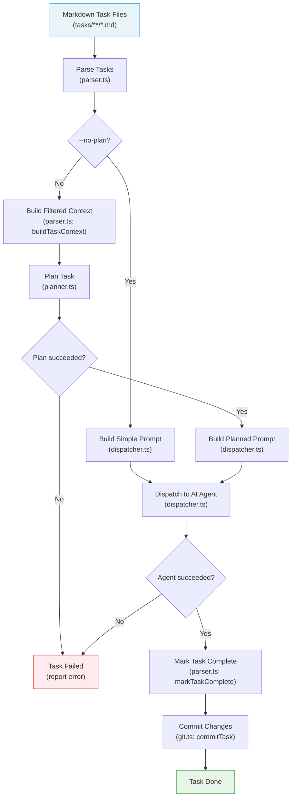
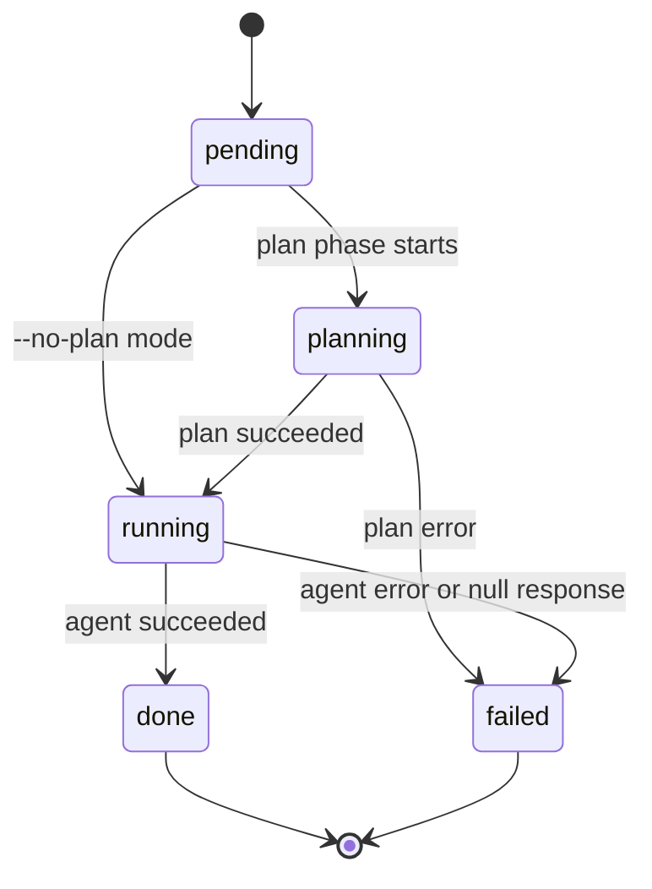
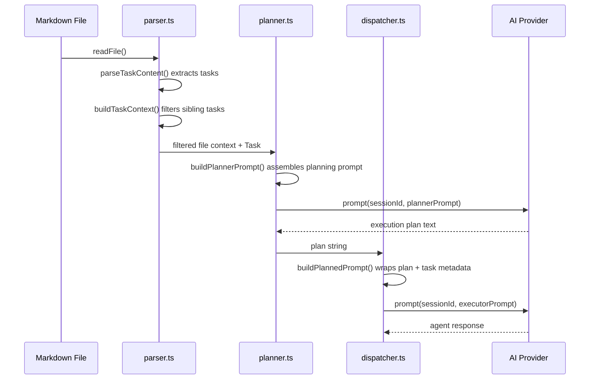

# Planning & Dispatch Pipeline

The planning and dispatch pipeline is the core task execution engine of the
Dispatch tool. It transforms markdown task files into completed, committed work
by routing each task through a series of stages: parsing, optional planning,
AI-driven execution, file mutation, and version control.

## Why this pipeline exists

Dispatch automates multi-task software engineering work by delegating individual
tasks to AI agents. The pipeline exists to solve three problems:

1. **Context isolation** -- Each task must be executed in a fresh AI session so
   that context from one task does not leak into or confuse another.
2. **Precision through planning** -- A two-phase planner-then-executor
   architecture allows a read-only planning agent to explore the codebase first,
   producing a detailed execution plan that a separate executor agent follows.
3. **Automated record-keeping** -- After each task completes, the pipeline marks
   it done in the source markdown and creates a conventional commit, maintaining
   a clean, auditable git history.

## Pipeline stages

## Task state machine

Each task transitions through well-defined states during processing. The
`--no-plan` flag causes the `planning` state to be skipped entirely.

State transitions are managed by the [orchestrator](../cli-orchestration/orchestrator.md)
(`src/orchestrator.ts`) and reflected in the [TUI](../cli-orchestration/tui.md) via `TaskState` updates.

## Prompt construction chain

Understanding which data flows into which prompt template is critical for
debugging and extending the pipeline.

When `--no-plan` is active, the planner step is skipped entirely and
`buildPrompt()` in `dispatcher.ts` constructs a simpler prompt containing
only the task metadata and working directory.

## Module responsibilities

| Module | Responsibility | Source |
|--------|---------------|--------|
| `parser.ts` | Extract tasks from markdown; build filtered context; mark tasks complete | `src/parser.ts` — see [Task Parsing](../task-parsing/overview.md) and [API Reference](../task-parsing/api-reference.md) |
| `planner.ts` | Run a read-only AI session to produce an execution plan | `src/agents/planner.ts` — see [Planner Agent](./planner.md) |
| `dispatcher.ts` | Send tasks to an AI agent in isolated sessions | `src/dispatcher.ts` — see [Dispatcher](./dispatcher.md) |
| `executor.ts` | Coordinate dispatch + task completion for a single task | `src/agents/executor.ts` — see [Executor Agent](./executor.md) |
| `git.ts` | Stage changes and create conventional commits | `src/git.ts` — see [Git Operations](./git.md) |

See the [Testing Guide](../task-parsing/testing-guide.md) for how the parser
functions are tested, and the [Parser Tests](../testing/parser-tests.md) for
a detailed breakdown of all 62 test cases.

## Key design decisions

### Two-phase planner-then-executor (optional)

The pipeline supports an optional planning phase where a separate AI session
explores the codebase before the executor acts. This produces higher-quality
results because the executor receives a detailed, context-rich plan rather than
just the raw task text. The `--no-plan` CLI flag bypasses this phase for speed
when tasks are simple or the user prefers direct execution.

See [Planner Agent](./planner.md) for details on when to use `--no-plan`.

### Session isolation per task

Every task -- whether in the planning or execution phase -- gets a fresh
provider session via `createSession()`. This prevents context rot and ensures
one task's conversation history cannot influence another.

See [Dispatcher](./dispatcher.md#session-isolation) for details on isolation
guarantees.

### Prompt-only planner read-only enforcement

The planner agent is instructed to be read-only via prompt instructions, not
via provider-level tool restrictions. This is a deliberate trade-off.

See [Planner Agent](./planner.md#read-only-enforcement) for the rationale and
limitations.

### Automatic conventional commit type inference

After task completion, `git.ts` infers a commit type from the task text using
regex pattern matching, following the
[Conventional Commits](https://www.conventionalcommits.org/) specification.

See [Git Operations](./git.md#commit-type-inference) for the full type mapping.

### Worktree isolation for `(I)` mode tasks

When tasks are marked with the `(I)` isolated mode prefix, the orchestrator
creates a dedicated git worktree and passes a `worktreeRoot` path through the
pipeline. Both the [planner](./planner.md#worktree-isolation) and
[dispatcher](./dispatcher.md#worktree-isolation) append prompt instructions
that confine the agent to the worktree directory. The
[executor](./executor.md) passes the `worktreeRoot` through to the dispatcher
via its `ExecuteInput`.

This ensures isolated tasks cannot interfere with files outside their worktree,
which is critical when multiple isolated tasks run in parallel across different
worktrees. Enforcement is prompt-only — see the planner and dispatcher docs for
limitations.

## Concurrency model

The [orchestrator](../cli-orchestration/orchestrator.md) processes tasks in batches controlled by `--concurrency N`
(default: 1). Within a batch, tasks run in parallel via `Promise.all()`. This
has important implications for both git operations and file mutations.

See [Git Operations](./git.md#concurrency-and-git-add--a) and
[Task Parsing](./task-context-and-lifecycle.md#concurrent-write-safety) for
concurrency-related concerns.

## Related documentation

- [Dispatcher](./dispatcher.md) -- Session isolation, prompt construction,
  success verification
- [Executor Agent](./executor.md) -- Orchestration of dispatch + task completion
- [Planner Agent](./planner.md) -- Two-phase architecture, read-only
  enforcement, file context
- [Git Operations](./git.md) -- Conventional commits, staging behavior,
  troubleshooting
- [Task Context & Lifecycle](./task-context-and-lifecycle.md) -- Markdown
  format, context filtering, concurrent writes
- [Integrations & Troubleshooting](./integrations.md) -- Provider system,
  Node.js child_process, fs operations
- [CLI & Orchestration](../cli-orchestration/overview.md) -- Orchestrator loop and CLI flags
- [CLI Argument Parser](../cli-orchestration/cli.md) -- `--no-plan`,
  `--concurrency`, and `--dry-run` flag documentation
- [Configuration System](../cli-orchestration/configuration.md) -- Persistent
  defaults for `--concurrency`, `--provider`, and other pipeline options
- [Provider Abstraction](../provider-system/provider-overview.md) -- Provider interface and backends
- [OpenCode Backend](../provider-system/opencode-backend.md) -- OpenCode
  provider setup and async prompt model
- [Copilot Backend](../provider-system/copilot-backend.md) -- Copilot
  provider setup and synchronous prompt model
- [Cleanup Registry](../shared-types/cleanup.md) -- Process-level cleanup
  for graceful shutdown during pipeline execution
- [Shared Interfaces & Utilities](../shared-types/overview.md) -- `Task`, `TaskFile`, and
  `ProviderInstance` type definitions
- [Shared Parser Types](../shared-types/parser.md) -- Summary of `Task`,
  `TaskFile`, and exported parser functions
- [Task Parsing API Reference](../task-parsing/api-reference.md) --
  `parseTaskFile`, `buildTaskContext`, `markTaskComplete`, and `groupTasksByMode`
  function contracts
- [Task Parsing Testing Guide](../task-parsing/testing-guide.md) -- How to
  run and extend parser tests
- [Spec Generation](../spec-generation/overview.md) -- How the spec pipeline
  produces the markdown task files consumed by this pipeline
- [Datasource System](../datasource-system/overview.md) -- The datasource
  abstraction that provides work items to the pipeline and manages git
  lifecycle operations (branching, committing, pushing, PR creation)
- [Datasource Helpers](../datasource-system/datasource-helpers.md) -- Temp file
  writing, issue ID extraction, and auto-close logic bridging the datasource
  layer with the orchestrator
- [Testing Overview](../testing/overview.md) -- Test suite structure (note:
  planner, dispatcher, and git modules are not currently unit-tested)
- [Parser Tests](../testing/parser-tests.md) -- Detailed breakdown of all 62
  parser tests covering the functions this pipeline depends on
- [Prerequisites & Safety Checks](../prereqs-and-safety/overview.md) --
  Environment validation (Node.js, git, CLI tools) that runs before this
  pipeline starts
- [Git & Worktree Management](../git-and-worktree/overview.md) -- Worktree
  lifecycle and isolation model used by `(I)` mode tasks in this pipeline
