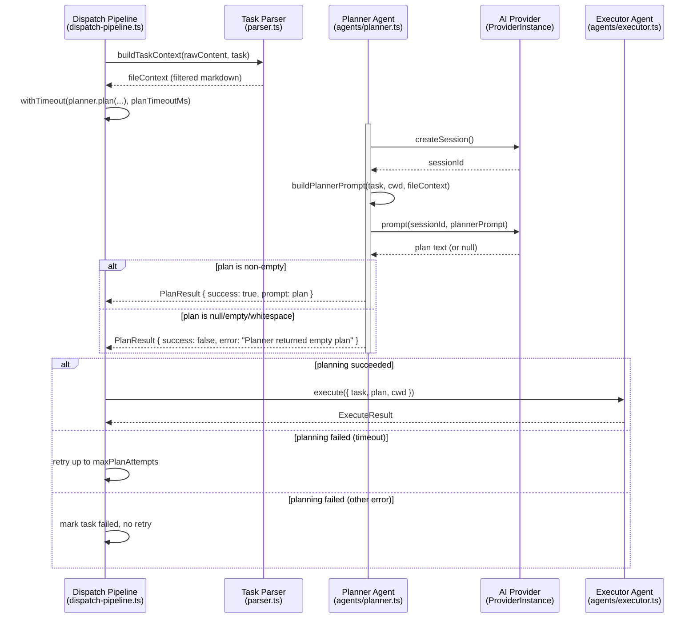
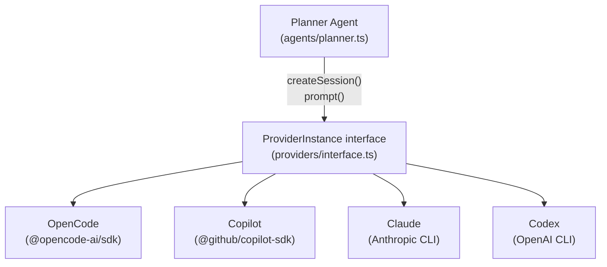

# Planner Agent

The planner agent (`src/agents/planner.ts`) runs a read-only AI session that
explores the codebase and produces a detailed execution plan for a task. The
plan is then passed to the [executor](./dispatcher.md) as context-rich
instructions for implementing code changes.

## What it does

The planner receives a [`Task`](../task-parsing/api-reference.md#task) and
optional filtered file context, creates an isolated
[provider session](../provider-system/provider-overview.md#session-isolation-model),
sends a planning prompt, and returns the agent's response as a `PlanResult`.
The plan text becomes the executor agent's sole source of implementation
guidance.

## Why it exists

### The two-phase architecture

The planner exists to solve a fundamental problem with AI-driven code changes:
**an agent that writes code needs context about the codebase, but gathering that
context and executing changes in a single pass often leads to poor results**.

The two-phase planner-then-executor pattern separates concerns:

1. **Planner** (read-only): Explores the codebase, reads relevant files,
   searches for symbols, and reasons about the task. Produces a detailed,
   step-by-step execution plan with specific file paths, code patterns, and
   implementation guidance.

2. **Executor** (write): Receives the plan verbatim and follows it to make
   precise edits. The executor does not need to explore -- it has a blueprint.

This separation improves quality because:

- The planner can take its time exploring without the pressure to produce code
- The executor receives pre-digested context rather than raw codebase data
- Failed plans can be detected before any files are modified

### When to use `--no-plan`

The [`--no-plan`](../cli-orchestration/cli.md) CLI flag skips the planning
phase entirely, sending tasks directly to the executor with a simple prompt.
Use `--no-plan` when:

- Tasks are simple and self-explanatory (e.g., "add a comment to function X")
- You want faster execution and are willing to trade plan quality
- You are debugging the executor and want to isolate its behavior
- The provider has limited context window and you want to avoid doubling
  token usage (planning + execution each consume a full session)

Avoid `--no-plan` when:

- Tasks require understanding multiple files or complex dependencies
- Tasks reference architectural patterns that the agent needs to discover
- The markdown file contains implementation guidance in non-task prose that
  the planner would incorporate into its plan

## Data flow

The planner sits between the dispatch pipeline and the executor agent in a
plan-then-execute flow. The dispatch pipeline provides a Task and file context,
the planner creates a provider session and generates an execution prompt, and
the executor consumes that prompt to make code changes. The dispatch pipeline
wraps planner calls with timeout and retry logic.



## How it works

### Session isolation

**Why does the planner create a new provider session for every `plan()` call
rather than reusing a session across multiple tasks?**

The planner creates a fresh session via `provider.createSession()`
(`src/agents/planner.ts:65`) for every `plan()` invocation. This is a
deliberate design choice aligned with the dispatch system's
[session-per-task isolation model](../provider-system/provider-overview.md#session-isolation-model):

- **Conversation isolation**: Each session has its own conversation history.
  If the planner reused a session across tasks, exploration context from task A
  (file paths read, symbols searched, reasoning about the codebase) would
  contaminate the planning context for task B. This could cause the planner to
  skip exploration it assumes was already done, or to confuse requirements from
  different tasks.
- **Consistent behavior**: A fresh session ensures every plan starts from the
  same baseline -- the planner has zero prior context and must explore the
  codebase anew for each task. This makes planning deterministic relative to
  the task input.
- **Failure isolation**: If a session enters an error state (e.g., the
  provider encounters an internal error), that state does not propagate to
  subsequent tasks.

The trade-off is that repeated exploration across tasks may duplicate work
(reading the same files multiple times). This is accepted because the
alternative -- context bleed between tasks -- produces harder-to-diagnose
failures.

### File context filtering

When the dispatch pipeline calls `planner.plan()`, it passes `fileContext` -- a
filtered view of the markdown file produced by
[`buildTaskContext()`](../task-parsing/api-reference.md#buildtaskcontext) in
`src/parser.ts`. This filtered context:

- **Keeps** all non-task lines (headings, prose, notes, blank lines, checked
  tasks)
- **Keeps** the specific unchecked task line being planned
- **Removes** all other unchecked `[ ]` task lines

This filtering exists to prevent the planner from being confused by sibling
tasks that belong to different agents or execution batches.

**How does the planner know about task dependencies if sibling tasks are
removed?**

It does not. The filtering deliberately hides sibling unchecked tasks from the
planner because showing them would risk the planner (or downstream executor)
attempting to work on multiple tasks simultaneously. If tasks have dependencies
on each other, this must be managed externally:

- Order dependent tasks sequentially in separate batch runs
- Express dependencies as prose in the markdown file (prose lines are preserved
  in the filtered context)
- Use checked `[x]` tasks as documentation of completed prerequisites (checked
  tasks are preserved)

The design rationale (documented in `src/parser.ts:36-44`) is that preventing
cross-task confusion is more valuable than preserving inter-task visibility.

**Why is the file context passed as a markdown block rather than a structured
data format?**

The `buildPlannerPrompt()` function wraps `fileContext` in a fenced markdown
code block (`src/agents/planner.ts:115-117`):

```
```markdown
<fileContext content>
```​
```

This is a deliberate prompt engineering choice:

1. **LLM readability**: Large language models are trained predominantly on
   natural language and markdown. A fenced code block with a `markdown` language
   tag is a format the model recognizes and can parse without additional
   instructions. Structured formats (JSON, YAML) would require the model to
   deserialize the structure before reasoning about the content.
2. **Source fidelity**: The file context is already markdown (headings, prose,
   checkbox items). Embedding it in its original format preserves the
   hierarchical structure (heading levels, list nesting) that the planner uses
   to understand implementation guidance.
3. **Simplicity**: No serialization/deserialization code is needed. The raw
   markdown content flows directly from the parser through the planner prompt
   to the AI model.

### Planner prompt structure

The `buildPlannerPrompt()` function (`src/agents/planner.ts:95-152`) assembles
a prompt with these sections:

1. **Role**: "You are a planning agent" -- establishes the agent's identity
2. **Task metadata**: Working directory, source file, task text with line number
3. **Task File Contents** (when `fileContext` is provided): The filtered markdown
   embedded in a fenced code block, with instructions to review non-task prose
   for implementation details
4. **Instructions**: A five-step process:
    1. Explore the codebase (read files, search symbols)
    2. Review task file contents for implementation details
    3. Identify files to create or modify
    4. Research the implementation (patterns, imports, types, APIs)
    5. **DO NOT make any changes** -- planning only
5. **Output Format**: Instructions to produce a system prompt for the executor
   agent, including context, files to modify, step-by-step implementation, and
   constraints

### Conventional commit instruction

The planner prompt instructs the executor to use conventional commit types when
the task description mentions committing (`src/agents/planner.ts:145`). The
supported types are:

| Type | Purpose |
|------|---------|
| `feat` | New feature |
| `fix` | Bug fix |
| `docs` | Documentation changes |
| `refactor` | Code restructuring without behavior change |
| `test` | Adding or modifying tests |
| `chore` | Maintenance tasks |
| `style` | Code style/formatting changes |
| `perf` | Performance improvements |
| `ci` | CI/CD configuration changes |

These types follow the [Conventional Commits](https://www.conventionalcommits.org/)
specification. The same set of types is used by the
[commit agent](../planning-and-dispatch/git.md) (`src/agents/commit.ts`) for
generating commit messages after task execution. The planner includes this
instruction conditionally: if the task description includes a commit
instruction, the plan tells the executor to commit; otherwise, it tells the
executor **not** to commit (the pipeline handles commits externally).

### Expected plan output structure and executor validation

**What is the expected quality/structure of the planner's output prompt, and
how does the executor validate that the plan is actionable?**

The planner prompt (`src/agents/planner.ts:133-149`) explicitly requests
output in this structure:

1. **Context** -- summary of project structure, conventions, and patterns
2. **Files to modify** -- exact file paths with rationale
3. **Step-by-step implementation** -- precise, ordered steps with code snippets,
   type signatures, and import statements
4. **Constraints** -- commit instructions, minimal changes, follow existing style

The final line of the prompt reinforces specificity: "Be specific and concrete.
Reference actual code you found during exploration. The executor has no prior
context about this codebase -- your prompt is all it gets."

The executor (`src/agents/executor.ts`) does **not** validate the plan's
structure, completeness, or actionability. It passes the plan text verbatim to
`buildPlannedPrompt()` in `src/dispatcher.ts`, which embeds it in the executor
prompt. There is no parsing, schema validation, or length check on the plan
text. The executor treats the plan as authoritative input and attempts to
follow it regardless of quality. If the plan is vague, incomplete, or
contradictory, the executor will produce correspondingly poor results.

### Read-only enforcement

**What actually prevents the planner agent from making changes to the
filesystem?**

**Nothing at the provider level.** The planner's read-only behavior is enforced
solely through prompt instructions:

> "DO NOT make any changes -- you are only planning, not executing."

The provider backends ([OpenCode](../provider-system/opencode-backend.md),
[Copilot](../provider-system/copilot-backend.md), Claude, Codex) do not
restrict the planner session's tool access or filesystem permissions. The
planner agent has the same capabilities as the executor agent. If the AI model
ignores the prompt instruction, it could make filesystem changes during the
planning phase.

**Why prompt-only enforcement?**

None of the provider SDKs expose a mechanism to create sessions with restricted
tool access (e.g., read-only filesystem access). The
[`ProviderInstance`](../shared-types/provider.md#providerinstance-interface)
interface (`src/providers/interface.ts`) defines only `createSession()` and
`prompt()` -- there is no parameter for capability restrictions.

Adding provider-level enforcement would require:

1. Extending the `ProviderInstance` interface with a session options parameter
   (e.g., `createSession({ readOnly: true })`)
2. Implementing tool/permission scoping in each provider backend
3. Verifying that the underlying SDKs support such restrictions

Until the provider SDKs support capability restrictions, prompt-based
enforcement is the only available mechanism. In practice, modern AI models
follow these instructions reliably, but it is not a hard guarantee.

### Working directory override and worktrees

The `plan()` method accepts an optional `cwd` parameter that overrides the
boot-time working directory in the planning prompt
(`src/agents/planner.ts:63,66`):

```
const prompt = buildPlannerPrompt(task, cwdOverride ?? cwd, fileContext);
```

The fallback logic is: if `cwdOverride` is provided, use it; otherwise, fall
back to the `cwd` captured at boot time via `boot({ cwd })`.

**How does the `cwdOverride` interact with git worktrees?**

When the dispatch pipeline uses worktrees (`.dispatch/worktrees/`), each issue
gets its own worktree directory with a dedicated branch checkout. The pipeline
passes the worktree's absolute path as the `cwdOverride` to `planner.plan()`
(`src/orchestrator/dispatch-pipeline.ts:334`). This changes **both** the prompt
text (the planner sees the worktree path as its working directory) **and** the
actual filesystem context, because the provider session operates in the
worktree directory.

When worktrees are used, the pipeline boots a separate provider instance
per worktree (`src/orchestrator/dispatch-pipeline.ts:289-298`), so the
provider's `cwd` is set to the worktree path at boot time. The `cwdOverride`
ensures the planner prompt reflects the same path the provider is actually
operating in.

When worktrees are not used, all tasks share a single provider and the
`cwdOverride` matches the repository root `cwd`. The override mechanism exists
so the same planner code works in both modes without conditional logic.

### Plan validation and context window limits

**What happens when the planner's output (the executor prompt) is too long or
exceeds the provider's context window?**

No. The plan text returned by `plan()` is passed directly to
`buildPlannedPrompt()` in `src/dispatcher.ts` with no size check, format
validation, or truncation. The combined prompt (task metadata + plan text) is
sent to the provider as-is.

If the plan is excessively long, it may exceed the provider's context window.
The behavior is provider-specific:

| Provider | Context window | Behavior on overflow |
|----------|---------------|---------------------|
| OpenCode | Determined by the underlying model (e.g., 100K-200K tokens for Claude models) | Model-dependent -- may truncate, error, or degrade |
| Copilot | Determined by GitHub Copilot backend model | Model-dependent |
| Claude | Determined by Anthropic model configuration | May return an API error |
| Codex | Determined by OpenAI Codex model | May truncate or error |

Neither condition (overflow or poor formatting) is detected or handled by
dispatch.

**Mitigation strategies**:

- The planner prompt explicitly requests a structured output format (context,
  files, steps, constraints), which encourages concise output
- If plan quality is a recurring issue, add a size check in `dispatchTask()`
  before calling `prompt()`, or add a post-processing step that validates the
  plan structure
- Consider configuring the planner prompt to set explicit length constraints
  (e.g., "limit your response to 2000 words")

## Timeout, retry, and failure handling

The dispatch pipeline wraps `planner.plan()` calls in a timeout and retry
loop (`src/orchestrator/dispatch-pipeline.ts:331-367`).

### Timeout configuration

| Setting | CLI flag | Config key | Default |
|---------|----------|------------|---------|
| Planning timeout | `--plan-timeout` | `planTimeout` | **10 minutes** |
| Planning retries | `--plan-retries` | `planRetries` | **1** (2 total attempts) |

The timeout is converted to milliseconds:
`planTimeoutMs = (planTimeout ?? 10) * 60_000`
(`src/orchestrator/dispatch-pipeline.ts:73`).

The retry count is converted to total attempts:
`maxPlanAttempts = (planRetries ?? 1) + 1`
(`src/orchestrator/dispatch-pipeline.ts:74`).

### Retry behavior

The retry loop in the dispatch pipeline works as follows:

1. For each attempt (up to `maxPlanAttempts`), the pipeline calls
   `withTimeout(planner.plan(task, fileContext, issueCwd), planTimeoutMs, "planner.plan()")`.
2. If the call succeeds (returns a `PlanResult`), the loop breaks immediately.
3. If a `TimeoutError` is thrown, the pipeline logs a warning and retries (if
   attempts remain).
4. If a **non-timeout error** is thrown, the pipeline does **not** retry --
   it wraps the error in a failed `PlanResult` and breaks immediately.
5. If all timeout-based attempts are exhausted, a failure result is produced:
   `"Planning timed out after Nm (K attempts)"`.

**Key behavior**: Only `TimeoutError` triggers retries. Other exceptions (e.g.,
provider connection failures, authentication errors) cause an immediate failure
with no retry. This distinction exists because timeouts are often transient
(the model is slow but will eventually respond), while other errors typically
indicate a misconfiguration that would not resolve on retry.

### How the pipeline handles plan failure

When `planResult.success` is `false` (`src/orchestrator/dispatch-pipeline.ts:369-376`):

1. The task's TUI entry is marked `"failed"` with the error message.
2. The `failed` counter is incremented.
3. A failed `DispatchResult` is returned for that task.
4. The executor is **never called** for that task.

There is **no fallback to unplanned execution**. A planning failure is a hard
stop for that task. The pipeline continues to the next task in the batch --
a failure in one task does not block other tasks in the same batch or
subsequent groups.

## Provider interaction

The planner interacts with the AI provider through the
[`ProviderInstance`](../shared-types/provider.md#providerinstance-interface)
interface, which can be backed by four different AI backends:



Each provider has different session semantics, model capabilities, and failure
modes:

| Provider | Session model | Prompt model | Failure modes |
|----------|--------------|-------------|---------------|
| OpenCode | Server-side sessions via SDK | Async fire-and-forget + SSE events | SSE stream stall, server crash, connection refused |
| Copilot | Client-side session map | Synchronous `sendAndWait()` | JSON-RPC timeout, authentication failure |
| Claude | CLI-based sessions | CLI invocation | CLI not found, API rate limits |
| Codex | CLI-based sessions | CLI invocation | CLI not found, API errors |

All providers normalize their responses to `string | null` through the
`ProviderInstance` interface, so the planner's code is backend-agnostic.

### Monitoring provider sessions

**How do I monitor whether provider sessions created by the planner are
properly cleaned up or leaked?**

Provider sessions created by `createSession()` are managed by the provider
backend, not by the planner. The planner creates a session, uses it for one
`prompt()` call, and does not track or close it afterward. Session lifecycle
is governed by the provider:

- **OpenCode**: Sessions are server-side objects. Inspect active sessions via
  the OpenCode server's HTTP API: `curl http://localhost:4096/session`. When
  the provider's `cleanup()` stops the server, all sessions are destroyed.
- **Copilot**: Sessions are tracked in a client-side `Map`. The provider's
  `cleanup()` calls `destroy()` on each tracked session, then stops the client.
- **Claude / Codex**: Sessions are tied to CLI process lifetime.

There is no per-session cleanup in the planner -- the provider's top-level
`cleanup()` (called by the pipeline on completion or by the
[cleanup registry](../shared-types/cleanup.md) on signal exit) is responsible
for tearing down all sessions.

**How do I observe the raw prompt and response exchanged between the planner
and the provider for debugging?**

Use `--verbose` to enable debug-level logging. The planner does not log the
full prompt or response text directly, but:

1. The dispatch pipeline logs planning status messages
   (`src/orchestrator/dispatch-pipeline.ts:325,342,345`).
2. OpenCode's SSE events include streaming deltas that are logged at debug
   level (`src/providers/opencode.ts`).
3. For OpenCode, you can also inspect the full session transcript via the
   server API: `curl http://localhost:4096/session/<session-id>`.

For deeper debugging, consider adding temporary `log.debug()` calls in
`buildPlannerPrompt()` to log the assembled prompt, or in `plan()` to log the
raw response.

### Troubleshooting empty plans

**How do I troubleshoot a planner that consistently returns empty plans?**

The planner treats `null`, empty string (`""`), and whitespace-only responses
as failures (`src/agents/planner.ts:70-71`). If the planner consistently
returns empty plans, investigate these potential causes:

1. **Provider connectivity**: Verify the provider is running and reachable.
   For OpenCode: `curl http://localhost:4096/global/health`. For Copilot:
   ensure `gh auth status` shows a valid token.
2. **Model configuration**: Ensure the provider has a valid model configured.
   An unconfigured or unreachable LLM will produce null responses.
3. **Prompt size**: If the combined prompt (task metadata + file context)
   exceeds the model's input limit, the provider may return an empty response
   rather than an error.
4. **Rate limiting**: Some providers throttle requests. If the planner creates
   many sessions in rapid succession (high concurrency), rate limits may cause
   empty responses. Reduce `--concurrency` and retry.
5. **Provider logs**: Check the provider's own logs. For OpenCode, the server
   logs are available via `opencode serve --verbose`. For Copilot, check the
   `gh copilot` output.

### Rate limits for parallel planning

**What provider-specific rate limits apply when the planner creates many
sessions in rapid succession?**

Each `plan()` call creates a new session and sends a prompt. With
`--concurrency N`, up to N planning sessions may be created simultaneously.
Rate limits are provider-specific:

- **OpenCode**: No built-in rate limiting. The underlying LLM provider
  (Anthropic, OpenAI, etc.) may have API rate limits that surface as errors.
- **Copilot**: GitHub Copilot has usage limits that depend on the user's
  subscription tier.
- **Claude**: Anthropic API rate limits apply based on the API key's tier.
- **Codex**: OpenAI API rate limits apply.

If rate limiting is a concern, reduce `--concurrency` to lower the parallelism.

## Null vs empty string handling

The planner uses `plan?.trim()` (`src/agents/planner.ts:70`) to detect empty
responses. This expression handles all four cases uniformly:

| Provider returns | `plan?.trim()` result | Treated as | `PlanResult` |
|-----------------|----------------------|------------|-------------|
| `null` | `undefined` (falsy) | Failure | `{ success: false, error: "Planner returned empty plan" }` |
| `""` (empty string) | `""` (falsy) | Failure | `{ success: false, error: "Planner returned empty plan" }` |
| `"   \n  \t  "` (whitespace) | `""` (falsy) | Failure | `{ success: false, error: "Planner returned empty plan" }` |
| `"Step 1: ..."` (content) | `"Step 1: ..."` (truthy) | Success | `{ success: true, prompt: plan }` |

Both `null` and empty string are treated identically as failures. This is
correct behavior: the `ProviderInstance.prompt()` contract
(`src/providers/interface.ts:59`) specifies `string | null` as the return type,
where `null` means "no response was produced." An empty or whitespace-only
string is equally unusable as an execution plan.

## The cleanup() no-op

The planner's `cleanup()` method (`src/agents/planner.ts:81-83`) is an empty
function:

```
async cleanup(): Promise<void> {
  // Planner has no owned resources — provider lifecycle is managed externally
}
```

**Why does the planner not close the sessions it creates?**

The planner creates provider sessions but does not explicitly close them
because:

1. **No close API**: The `ProviderInstance` interface does not expose a
   `closeSession()` or `destroySession()` method. Once `createSession()`
   returns a session ID, the only operations available are `prompt()` and the
   top-level `cleanup()`.
2. **Provider-managed lifecycle**: Sessions are destroyed when the provider's
   `cleanup()` is called. For OpenCode, this stops the server (destroying all
   sessions). For Copilot, this calls `destroy()` on each tracked session.
3. **No owned resources**: The planner holds no file handles, network
   connections, or child processes. The provider instance (which owns these
   resources) is managed by the dispatch pipeline, which calls
   `provider.cleanup()` at the end of the run.

This design means sessions accumulate on the provider until `cleanup()` is
called. For long-running dispatch operations with many tasks, this could
increase memory usage on the provider side, but in practice providers are
designed to handle multiple concurrent sessions.

## Interfaces

### `PlanResult`

Returned by `plan()`:

| Field | Type | Description |
|-------|------|-------------|
| `prompt` | `string` | The execution plan (system prompt for the executor) |
| `success` | `boolean` | Whether planning succeeded |
| `error` | `string?` | Error message if `success` is `false` |

An empty or whitespace-only plan is treated as a failure with the message
"Planner returned empty plan."

### `PlannerAgent`

Extends the base [`Agent`](../shared-types/provider.md) interface with a
`plan()` method:

| Method | Signature | Description |
|--------|-----------|-------------|
| `plan` | `(task: Task, fileContext?: string, cwd?: string) => Promise<PlanResult>` | Run the planner for a single task |
| `cleanup` | `() => Promise<void>` | No-op -- provider lifecycle is managed externally |
| `name` | `readonly string` | Always `"planner"` |

## Error handling

All errors from `createSession()` or `prompt()` are caught and returned as a
failed `PlanResult` (`src/agents/planner.ts:75-78`). The error message is
extracted via `log.extractMessage(err)`, which handles both `Error` instances
(extracting `.message`) and non-Error thrown values (converting via
`String(err)`). The error does not propagate up the call stack.

The dispatch pipeline (`src/orchestrator/dispatch-pipeline.ts:369-376`) detects
a failed plan and marks the task as failed without proceeding to the execution
phase. There is no fallback to unplanned execution.

## Logger integration

The planner uses the shared [`log`](../shared-types/logger.md) object from
`src/helpers/logger.ts` for error message extraction
(`src/agents/planner.ts:76`). The planner itself does not produce log output
directly -- all planning-related log messages come from the dispatch pipeline:

- `log.info`: Task planning status when `--verbose` is active
- `log.warn`: Timeout warnings during retry
- `log.debug`: Retry attempt details

**Where are planner error logs written?**

All log output goes to `stderr` (via `console.error` for `log.error`) or
`stdout` (via `console.log` for all other levels). There is no file-based
logging. Use shell redirection to capture output:

```bash
dispatch 42 --verbose 2>&1 | tee dispatch.log
```

**How do I increase log verbosity?**

Pass `--verbose` on the command line. This sets `log.verbose = true`, enabling
`log.debug()` messages throughout the pipeline including planning timeout and
retry details.

## Test coverage

The planner agent has comprehensive test coverage in
`src/tests/planner.test.ts` (208 lines) using Vitest with mock providers.

### Boot tests

| Test | Verifies |
|------|----------|
| Throws when provider is not supplied | `boot({ cwd })` rejects with descriptive error |
| Returns agent with name `"planner"` | Identity field is correct |
| Returns agent with `plan` and `cleanup` | Interface contract is satisfied |

### Plan tests

| Test | Verifies |
|------|----------|
| Creates session and prompts provider | `createSession` and `prompt` are called |
| Includes task metadata in prompt | Working directory, file path, line number, task text appear in prompt |
| Includes file context when provided | `"Task File Contents"` section appears in prompt |
| Omits file context when not provided | Section is absent from prompt |
| Returns failure for empty string | `success: false`, error message is `"Planner returned empty plan"` |
| Returns failure for whitespace-only | Same as empty string |
| Returns failure for null | Same as empty string |
| Catches provider exceptions | `createSession` rejection is caught and returned as failure |
| Catches prompt exceptions | `prompt` rejection is caught and returned as failure |
| Handles non-Error exceptions | Raw string throws are handled via `log.extractMessage()` |
| Uses cwd override in prompt | Worktree path replaces boot-time cwd |
| Falls back to boot-time cwd | Without override, boot-time cwd is used |

### Cleanup test

| Test | Verifies |
|------|----------|
| Resolves without error | `cleanup()` is a safe no-op |

## Related documentation

- [Pipeline Overview](./overview.md) -- Full pipeline flow and state machine
- [Dispatcher](./dispatcher.md) -- How plans are consumed by the executor
- [Task Context & Lifecycle](./task-context-and-lifecycle.md) -- How
  `buildTaskContext()` produces filtered context
- [Provider Abstraction](../provider-system/provider-overview.md) -- The
  `ProviderInstance` interface and session isolation model
- [Orchestrator](../cli-orchestration/orchestrator.md) -- How the orchestrator
  calls `planner.plan()` and handles plan failures
- [CLI Options](../cli-orchestration/cli.md) -- The `--no-plan` flag,
  `--plan-timeout`, `--plan-retries`, and other CLI arguments
- [Configuration](../cli-orchestration/configuration.md) -- Persistent
  `planTimeout` and `planRetries` config keys
- [Markdown Syntax Reference](../task-parsing/markdown-syntax.md) -- Accepted
  checkbox formats consumed by the planner's context
- [Architecture & Concurrency](../task-parsing/architecture-and-concurrency.md) --
  File I/O safety and concurrency analysis relevant to context filtering
- [Timeout Utility](../shared-utilities/timeout.md) -- `withTimeout()` function
  wrapping `planner.plan()` calls in the dispatch pipeline
- [Cleanup Registry](../shared-types/cleanup.md) -- Process-level cleanup that
  ensures provider sessions are terminated on exit
- [Logger](../shared-types/logger.md) -- Structured logging interface used for
  planning status and error messages
- [Git Operations](./git.md) -- Conventional commit types referenced in the
  planner prompt
