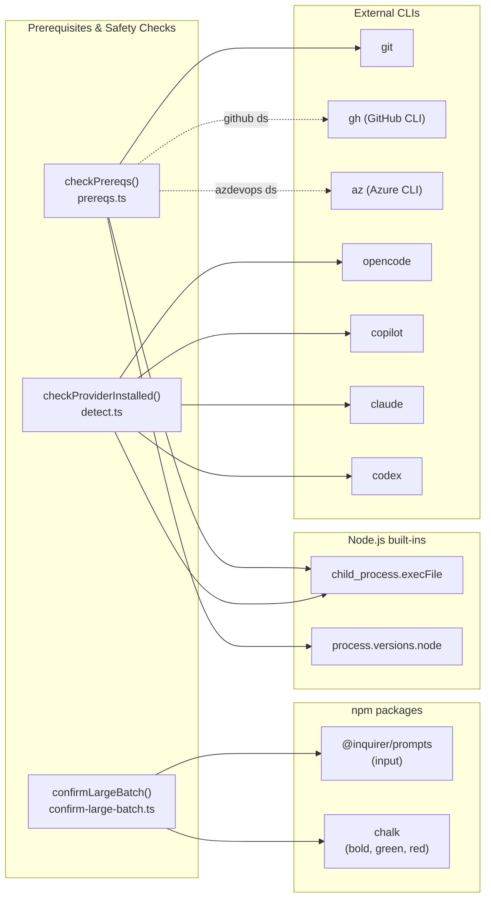

# External Integrations

This page documents how the prerequisites and safety checks subsystem
integrates with its external dependencies: npm packages, Node.js built-in
modules, and external CLI tools.

## npm package dependencies

### @inquirer/prompts

**Used by:** `src/helpers/confirm-large-batch.ts`
**Import:** `import { input } from "@inquirer/prompts"`
**Version:** `^8.x` (as declared in `package.json`)

The `input()` function renders a free-text prompt on the terminal and
returns the user's typed response as a string. The batch confirmation
module uses it to require the user to type "yes" before proceeding with
large operations.

#### How it is used

The module calls `input({ message: ... })` with a single configuration
object containing the prompt message. No validation function, default value,
or transformer is passed -- all validation is done after the response is
returned (trim, lowercase, compare to "yes").

#### Non-TTY behavior

`@inquirer/prompts` reads from `process.stdin` and writes to `process.stdout`
by default. Its behavior varies by environment:

| Environment | Behavior |
|-------------|----------|
| Interactive terminal (TTY) | Normal prompt/response cycle |
| Piped stdin (`echo "yes" \| dispatch ...`) | Reads piped input as the answer |
| No stdin data (CI, background) | Hangs indefinitely waiting for input |
| stdin closed / EOF | Throws `ExitPromptError` |

The library supports overriding the input/output streams via a second
options argument: `input(config, { input: stream, output: stream })`. It
also supports cancellation via `AbortSignal`. The current implementation
does not use either feature.

For CI environments where the batch might exceed the threshold, the
recommended workaround is to pipe input:

```
echo "yes" | dispatch --respec
```

Or to ensure the item count stays below the threshold so the prompt is
never triggered.

#### Ctrl+C handling

When the user presses Ctrl+C during an `@inquirer/prompts` prompt, the
library rejects the prompt promise with an `ExitPromptError`. The batch
confirmation module does not catch this error, so it propagates up to the
caller. In practice, Node.js handles the uncaught rejection by terminating
the process, which is the expected behavior for a Ctrl+C interrupt.

### chalk

**Used by:** `src/helpers/confirm-large-batch.ts`, `src/config-prompts.ts`
**Import:** `import chalk from "chalk"`

Chalk provides ANSI color and style formatting for terminal output. It is
used in two ways within this subsystem:

1.  **Batch confirmation prompt:** `chalk.bold()` highlights the item count
    and the word "yes" in the warning message and prompt text.

2.  **Configuration wizard:** `chalk.green("●")` and `chalk.red("●")`
    render the provider installation status indicators.

#### Auto-detection

Chalk automatically detects whether the terminal supports colors by checking
`process.stdout.isTTY`, the `TERM` environment variable, and the `NO_COLOR`
/ `FORCE_COLOR` environment variables. When color is not supported, chalk
functions return plain strings without ANSI escape codes. No explicit
configuration is needed.

## Node.js built-in modules

### node:child_process (execFile)

**Used by:** `src/helpers/prereqs.ts`, `src/providers/detect.ts`
**Import:** `import { execFile } from "node:child_process"` (promisified via `node:util`)

Both the prerequisite checker and provider detection module use the same
pattern: `promisify(execFile)` to create an async wrapper, then call it with
a binary name and `["--version"]` as arguments.

#### Behavior characteristics

| Scenario | Result |
|----------|--------|
| Binary found, exits 0 | Promise resolves with `{ stdout, stderr }` |
| Binary not found | Promise rejects with `ENOENT` error |
| Binary found, exits non-zero | Promise rejects with error (code in `error.code`) |
| Binary hangs | Promise hangs (no built-in timeout) |

Neither module sets a timeout on the `execFile` call. In practice, `--version`
commands return immediately for all supported binaries. If a binary were to
hang (e.g., a broken installation), the Dispatch process would hang too.
This is an accepted risk given the very low probability.

#### Security considerations

The `execFile` function does not use a shell -- it invokes the binary
directly. This avoids shell injection risks. The binary name comes from
a hardcoded constant (`PROVIDER_BINARIES` map or literal strings "git",
"gh", "az"), not from user input.

### process.versions.node

**Used by:** `src/helpers/prereqs.ts`

The prerequisite checker reads `process.versions.node` to get the current
Node.js version string. This is a built-in property that returns the
version in `MAJOR.MINOR.PATCH` format (e.g., `"20.12.0"`). It is compared
against the `MIN_NODE_VERSION` constant using a simplified semver
comparison.

## External CLI tool dependencies

### Git CLI

**Required by:** `src/helpers/prereqs.ts` (checked always)
**Detection command:** `git --version`
**Install URL:** https://git-scm.com
**Minimum version:** None enforced (presence check only)

Git is universally required because every Dispatch pipeline mode performs
git operations. The prerequisite checker verifies that `git` is on PATH
but does not enforce a minimum version.

Git is also used extensively throughout the datasource layer for branching,
committing, pushing, and pull request operations. See the
[datasource system documentation](../datasource-system/overview.md) for
details on git usage patterns.

### GitHub CLI (gh)

**Required by:** `src/helpers/prereqs.ts` (checked when datasource is `github`)
**Detection command:** `gh --version`
**Install URL:** https://cli.github.com/
**Minimum version:** None enforced (presence check only)

The GitHub CLI is required only when the datasource is `github`. The
GitHub datasource implementation delegates all GitHub API calls to `gh`
rather than making REST calls directly. This means authentication is
handled by `gh auth login` and the user must be authenticated before
running Dispatch.

See [GitHub datasource](../datasource-system/github-datasource.md) for
the full set of `gh` commands used.

### Azure CLI (az)

**Required by:** `src/helpers/prereqs.ts` (checked when datasource is `azdevops`)
**Detection command:** `az --version`
**Install URL:** https://learn.microsoft.com/en-us/cli/azure/
**Minimum version:** None enforced (presence check only)

The Azure CLI is required only when the datasource is `azdevops`. Like
the GitHub datasource, the Azure DevOps datasource delegates API calls
to `az` rather than using REST directly.

See [Azure DevOps datasource](../datasource-system/azdevops-datasource.md)
for details.

### AI provider binaries

**Checked by:** `src/providers/detect.ts` (during config wizard only)
**Detection command:** `<binary> --version`

| Provider | Binary | Installation |
|----------|--------|-------------|
| OpenCode | `opencode` | https://opencode.ai (npm: `@opencode-ai/opencode`) |
| GitHub Copilot | `copilot` | https://github.com/github/copilot-cli |
| Claude | `claude` | https://claude.ai/cli (npm: `@anthropic-ai/claude-code`) |
| Codex | `codex` | https://github.com/openai/codex-cli (npm: `@openai/codex`) |

Provider binaries are checked only during the interactive configuration
wizard and are not checked during normal pipeline execution. An uninstalled
provider can be selected -- the detection is informational only (green/red
dot in the selection menu).

During actual pipeline execution, the provider is booted via `bootProvider()`
in the provider layer, which will fail with its own error if the binary is
not available. The prerequisite checker does not check provider binaries
because the selected provider is not yet known at prerequisite-check time
(it comes from config resolution, which has already completed by that point).

## Integration diagram

The following diagram shows which external dependencies are used by each
component in this subsystem:



Dashed lines indicate conditional dependencies (only checked when the
corresponding datasource is selected).

## Related documentation

-   [Overview](./overview.md) -- Group overview with pipeline integration
    diagram.
-   [Prerequisite Checker](./prereqs.md) -- Detailed documentation for
    environment validation.
-   [Batch Confirmation Prompt](./confirm-large-batch.md) -- Safety prompt
    documentation.
-   [Provider Binary Detection](./provider-detection.md) -- Provider
    availability probing.
-   [Datasource System Integrations](../datasource-system/integrations.md) --
    How datasources use git, gh, and az at runtime.
-   [Shared Types Integrations](../shared-types/integrations.md) --
    Logger integration used by the batch confirmation prompt.
-   [CLI Orchestration Integrations](../cli-orchestration/integrations.md) --
    How the CLI entry point integrates with external tools.
-   [Adding a Provider](../provider-system/adding-a-provider.md) -- Guide for
    adding new provider backends; new providers may require additional binary
    detection in `src/providers/detect.ts` following the same `execFile`
    pattern documented above.
-   [Adding a Fetcher](../issue-fetching/adding-a-fetcher.md) -- Guide for
    adding new issue tracker integrations; new fetchers that shell out to CLI
    tools should follow the same prerequisite detection pattern.
