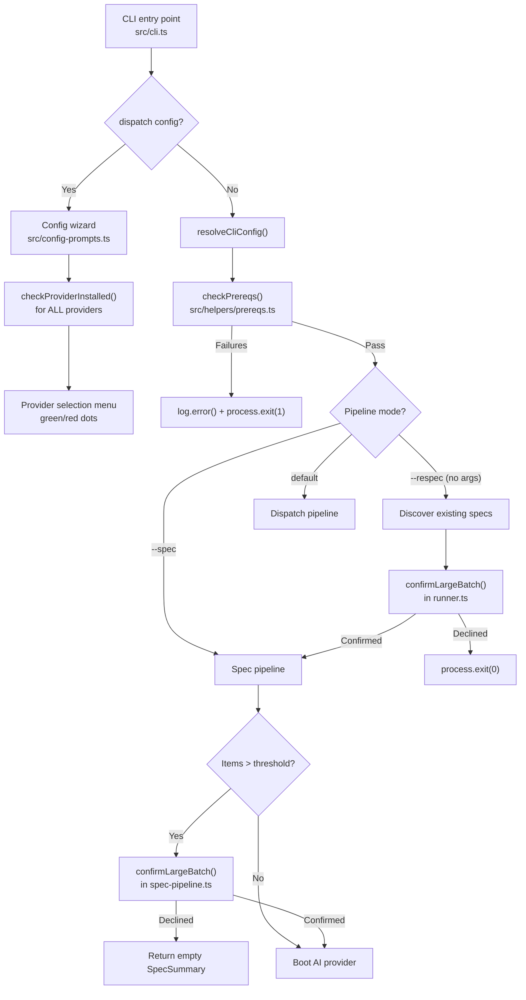

# Prerequisites and Safety Checks

The prerequisites and safety checks subsystem ensures that the Dispatch CLI can
operate correctly before any pipeline logic begins. It validates the runtime
environment, confirms dangerous batch operations with the user, and probes for
installed AI provider binaries to surface availability in the configuration
wizard.

## Why this subsystem exists

Dispatch depends on several external CLI tools (git, gh, az) and AI provider
binaries (opencode, copilot, claude, codex) that must be present on the
system PATH. Without pre-flight validation, missing tools would cause cryptic
errors deep inside pipeline execution, after partial side effects may have
already occurred. The subsystem solves three problems:

1.  **Fail fast on missing tools.** The prerequisite checker runs before any
    pipeline logic, so a missing `git` or `gh` binary produces a clear error
    message with installation instructions rather than an opaque `ENOENT`
    later in the pipeline.

2.  **Prevent accidental large operations.** The batch confirmation prompt
    requires the user to explicitly type "yes" before processing more items
    than a safety threshold, protecting against unintentional runs that
    would consume significant AI resources.

3.  **Inform provider selection.** The provider detection module probes all
    known provider binaries and surfaces their availability as visual
    indicators (green/red dots) in the interactive configuration wizard,
    helping users choose a provider that is actually installed.

## Components

| Component | Source file | Purpose |
|-----------|------------|---------|
| Prerequisite checker | `src/helpers/prereqs.ts` | Validates git, Node.js version, and datasource-specific CLIs |
| Batch confirmation prompt | `src/helpers/confirm-large-batch.ts` | Requires explicit "yes" for large batch operations |
| Provider binary detection | `src/providers/detect.ts` | Checks whether AI provider CLI binaries are on PATH |

## How the checks fit into the pipeline

The following diagram shows where each check runs relative to the overall CLI
flow. Prerequisite checks run first and block all pipeline execution on
failure. The batch confirmation prompt runs after issue/spec discovery but
before provider boot. Provider detection runs independently during the
configuration wizard.

### Key observations from the diagram

-   **Prerequisite checks are a hard gate.** They run in `runFromCli()`
    at `src/orchestrator/runner.ts:142-148` before any pipeline logic.
    Failure causes `process.exit(1)` with no partial side effects.

-   **Batch confirmation has two call sites** with different abort
    behaviors:
    -   In `runner.ts:206-208` (respec path): declined causes
        `process.exit(0)` (clean exit).
    -   In `spec-pipeline.ts:199-202` (spec path): declined returns an
        empty `SpecSummary` with all-zero counts (no side effects since
        it runs before provider boot).

-   **Provider detection is independent** of the main pipeline. It runs
    only during the interactive configuration wizard and has no bearing
    on whether a provider can actually be used -- even uninstalled
    providers can be selected.

## What each component checks

### Prerequisite checker (`checkPrereqs`)

| Check | Condition | When |
|-------|-----------|------|
| git on PATH | `git --version` succeeds | Always |
| Node.js version | `process.versions.node >= 20.12.0` | Always |
| GitHub CLI on PATH | `gh --version` succeeds | Datasource is `github` |
| Azure CLI on PATH | `az --version` succeeds | Datasource is `azdevops` |
| *(No check)* | -- | Datasource is `md` |

### Batch confirmation (`confirmLargeBatch`)

| Parameter | Default | Effect |
|-----------|---------|--------|
| `count` | *(required)* | Number of items to process |
| `threshold` | `100` (`LARGE_BATCH_THRESHOLD`) | Prompt only if `count > threshold` |

### Provider detection (`checkProviderInstalled`)

| Provider | Binary | Detection method |
|----------|--------|------------------|
| opencode | `opencode` | `opencode --version` |
| copilot | `copilot` | `copilot --version` |
| claude | `claude` | `claude --version` |
| codex | `codex` | `codex --version` |

## Detailed documentation

-   [Prerequisite Checker](./prereqs.md) -- Full details on environment
    validation, the semver comparison logic, datasource-conditional checks,
    and failure message format.

-   [Batch Confirmation Prompt](./confirm-large-batch.md) -- The safety
    prompt that guards large operations, including threshold behavior,
    input validation, and non-TTY considerations.

-   [Provider Binary Detection](./provider-detection.md) -- How provider
    availability is probed and surfaced in the configuration wizard.

-   [External Integrations](./integrations.md) -- Integration details for
    `@inquirer/prompts`, chalk, Git CLI, GitHub CLI, Azure CLI, Node.js
    runtime, and provider binaries.

## Related documentation

-   [Architecture Overview](../architecture.md) -- System-level topology
    (note: the "External tool dependencies" section currently states that
    Dispatch "performs no pre-flight checks" -- this is stale since
    `checkPrereqs` was added).
-   [CLI Orchestration](../cli-orchestration/overview.md) -- The CLI entry
    point that routes to pipelines.
-   [Configuration](../cli-orchestration/configuration.md) -- Three-tier
    config merge that runs before prerequisite checks.
-   [Spec Generation](../spec-generation/overview.md) -- The spec pipeline
    that uses `confirmLargeBatch`.
-   [Datasource System](../datasource-system/overview.md) -- Datasource
    names that drive conditional prerequisite checks.
-   [Provider System](../provider-system/provider-overview.md) -- Provider
    lifecycle that `checkProviderInstalled` probes.
-   [CLI Argument Parser](../cli-orchestration/cli.md) -- CLI flags including
    `--provider` and `--source` that interact with prerequisite checks.
-   [Git Worktree Helpers](../git-and-worktree/overview.md) --
    `ensureGitignoreEntry()` runs alongside prerequisite checks in the
    orchestrator startup sequence.
-   [Testing Overview](../testing/overview.md) -- Project-wide test suite
    (note: prerequisite checks have no dedicated unit tests).
