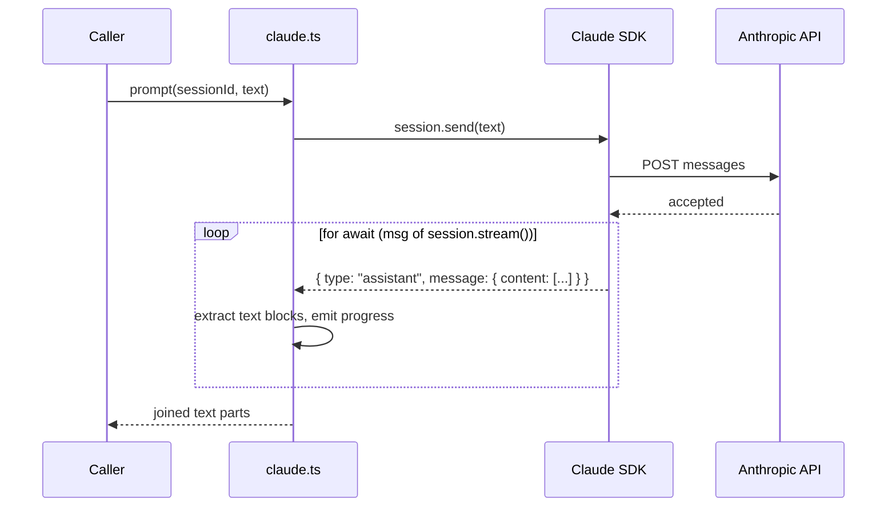

# Claude Backend

The Claude provider wraps the
[`@anthropic-ai/claude-agent-sdk`](https://docs.anthropic.com/en/docs/claude-code/sdk)
V2 preview API to conform to the
[`ProviderInstance`](../provider-system/overview.md) interface, enabling Dispatch
to use Anthropic's Claude as its AI agent runtime.

## Why use Claude

Claude provides direct API access to Anthropic's models with built-in tool
execution (file reads, edits, shell commands, web search). When used as a
Dispatch backend, it offers:

- Full control over model selection (Haiku, Sonnet, Opus variants)
- Session-based conversation isolation with synchronous streaming
- Built-in tool execution without requiring a separate CLI binary
- Direct API access billed through your Anthropic account

## Prerequisites

1. **Install the Claude Agent SDK**:

    ```sh
    npm install @anthropic-ai/claude-agent-sdk
    ```

2. **Set your API key**:

    ```sh
    export ANTHROPIC_API_KEY=your-api-key
    ```

    Get an API key from the
    [Anthropic Console](https://platform.claude.com/).

    The SDK also supports authentication via third-party API providers:

    - **Amazon Bedrock**: Set `CLAUDE_CODE_USE_BEDROCK=1` and configure AWS
      credentials.
    - **Google Vertex AI**: Set `CLAUDE_CODE_USE_VERTEX=1` and configure Google
      Cloud credentials.
    - **Microsoft Azure**: Set `CLAUDE_CODE_USE_FOUNDRY=1` and configure Azure
      credentials.

    See the Anthropic documentation for
    [Bedrock](https://docs.anthropic.com/en/amazon-bedrock),
    [Vertex AI](https://docs.anthropic.com/en/google-vertex-ai), or
    [Azure AI Foundry](https://docs.anthropic.com/en/microsoft-foundry) setup.

3. **Install the Claude CLI** (required for
   [provider detection](../provider-system/binary-detection.md)):

    ```sh
    npm install -g @anthropic-ai/claude-code
    ```

4. **Verify installation**:

    ```sh
    claude --version
    ```

## Authentication

The Claude provider does not explicitly reference any API key in its code -- the
`@anthropic-ai/claude-agent-sdk` reads the `ANTHROPIC_API_KEY` environment
variable automatically. There is no validation of the API key at boot time; an
invalid or missing key will surface as an error on the first `session.send()`
call.

The provider code at `src/providers/claude.ts` never touches credentials
directly. All authentication is delegated to the SDK, which checks the following
environment variables in order:

| Variable | Purpose |
|----------|---------|
| `ANTHROPIC_API_KEY` | Direct API key authentication (most common) |
| `CLAUDE_CODE_USE_BEDROCK` | When set to `1`, authenticates via AWS credentials |
| `CLAUDE_CODE_USE_VERTEX` | When set to `1`, authenticates via Google Cloud credentials |
| `CLAUDE_CODE_USE_FOUNDRY` | When set to `1`, authenticates via Azure credentials |

## How the provider works

### Boot

The `boot()` function (`src/providers/claude.ts:55-152`) creates a provider
instance with the specified model (defaulting to `claude-sonnet-4`) and an
in-memory `Map<string, SDKSession>` for tracking sessions.

Unlike the [Copilot](../provider-system/copilot-backend.md) and
[OpenCode](../provider-system/opencode-backend.md) providers, Claude does not
spawn a child process or connect to a server. The SDK communicates directly with
Anthropic's API (or a configured third-party endpoint). This means boot is
lightweight -- no server startup timeout, no port allocation, no process
management.

### The V2 preview API

The provider uses `unstable_v2_createSession` (imported at
`src/providers/claude.ts:12`), which is the V2 session-based API. The
`unstable_` prefix signals that this API surface is in preview and may change
in future SDK versions.

The V2 session API provides:

- **`unstable_v2_createSession(opts)`**: Creates a new session with the
  specified model and options, returning an `SDKSession` object.
- **`session.send(text)`**: Queues a message for processing.
- **`session.stream()`**: Returns an async iterator of response messages.
- **`session.close()`**: Tears down the session.

The project targets ES2022, which does not include the `Disposable` lib
required for `await using` syntax. This is why session cleanup uses explicit
`session.close()` calls rather than the automatic disposal pattern
(`src/providers/claude.ts:7-8`).

### Session creation

Each `createSession()` call (`src/providers/claude.ts:66-83`):

1. Creates an `SDKSession` via `unstable_v2_createSession()` with:
    - The configured model
    - `permissionMode: "bypassPermissions"` (see
      [security implications](./authentication-and-security.md#permission-bypass-rationale))
    - `allowDangerouslySkipPermissions: true`
    - Optional `cwd` if a working directory was provided at boot
2. Generates a client-side UUID via `crypto.randomUUID()` as the session
   identifier (the SDK does not return a session ID).
3. Stores the session in the internal map keyed by the UUID.

### Prompt model: synchronous send + async stream

The `prompt()` method (`src/providers/claude.ts:86-122`) uses a synchronous
send followed by an async stream iterator:



1. **Send**: `session.send(text)` queues the prompt for processing.
2. **Stream**: The provider iterates `session.stream()` with `for await...of`.
   Each message with `type === "assistant"` has its `content` array filtered
   for blocks with `type === "text"`, and the `.text` values are collected.
3. **Progress**: Each text chunk is emitted via the progress reporter for
   real-time status updates.
4. **Result**: All text parts are joined into a single string. If no text was
   produced, `null` is returned.

This is the most straightforward prompt pattern among the four providers -- the
async iterator naturally completes when the agent finishes, with no timeout
wrapping or event listener management needed.

### Follow-up messages

The Claude provider implements the optional `send()` method
(`src/providers/claude.ts:124-137`), which calls `session.send(text)` to inject
a follow-up message into a running session. This is used by the orchestrator
to send time-warning nudges to the agent during long-running tasks.

Unlike the [Codex provider](./codex-backend.md#why-follow-up-messages-are-ignored),
Claude supports mid-session messaging because `session.send()` is
non-blocking -- it queues the message without waiting for the current stream
to complete.

### Model listing

The `listModels()` function (`src/providers/claude.ts:27-50`) uses the V1
`query()` API to dynamically discover available models:

1. Creates a temporary `query` instance with `permissionMode: "bypassPermissions"`.
2. Calls `q.supportedModels()` to fetch the model list from the SDK.
3. Extracts model `.value` strings and sorts them alphabetically.
4. Closes the query instance in a `finally` block.

If the dynamic query fails (e.g., no API key configured), the function falls
back to a hardcoded list:

- `claude-haiku-3-5`
- `claude-opus-4-6`
- `claude-sonnet-4`
- `claude-sonnet-4-5`

## Cleanup behavior

The `cleanup()` method (`src/providers/claude.ts:139-151`):

1. Iterates all sessions in the internal map.
2. Calls `session.close()` on each, awaiting the result via
   `Promise.resolve(session.close())` -- the `Promise.resolve()` wrapper
   handles cases where `close()` may or may not return a promise.
3. Logs and swallows any errors from individual session closures.
4. Clears the session map.

The Claude provider does not have an explicit idempotency guard (unlike the
[OpenCode provider](../provider-system/opencode-backend.md#idempotency-guard)).
However, double-cleanup is safe because the second call iterates an empty map
(cleared on the first call) and performs no operations.

Since Claude communicates directly with the API (no spawned server process),
there is no server to stop during cleanup. Only the SDK session objects need
to be released.

## Monitoring and costs

The Claude provider does not emit usage or token metrics. The only observability
is debug-level logging of character counts (`src/providers/claude.ts:116`).

To monitor Claude API usage and costs:

- Use the [Anthropic Console](https://platform.claude.com/) to view API usage,
  token counts, and billing information.
- Enable `--verbose` in Dispatch to see debug logs with prompt and response
  character counts.

## Error handling

Errors from `session.send()` and `session.stream()` propagate naturally to the
caller. The provider logs the error chain at debug level and re-throws.

When Claude API returns a rate-limit or capacity error, the error propagates
to the [ProviderPool](../provider-system/pool-and-failover.md), which checks for throttle patterns
(429, 503, "throttl", "capacity", etc.) via `isThrottleError()` in
`src/providers/errors.ts`. If failover providers are configured, the pool
automatically routes to the next available provider.

## Troubleshooting

### Missing API key

**Symptom**: First prompt fails with an authentication error.

**Resolution**: Set `ANTHROPIC_API_KEY` in your environment:

```sh
export ANTHROPIC_API_KEY=sk-ant-...
```

Get a key from [platform.claude.com](https://platform.claude.com/).

### Rate limiting

**Symptom**: Prompts fail with 429 or "rate limit" errors.

**Possible causes**:

- API rate limits exceeded for your account tier.
- High concurrency (`--concurrency > 1`) consuming quota faster than the limit
  allows.

**Resolution**:

- Reduce `--concurrency` to lower the request rate.
- Check your account's rate limits in the Anthropic Console.
- If using the [ProviderPool](../provider-system/pool-and-failover.md), configure fallback providers
  so throttled requests automatically fail over.

### V2 API instability

The `unstable_v2_createSession` function name signals a preview API. If the SDK
is updated and this function is renamed or its signature changes, the provider
will fail at import time. Check the
[Claude Agent SDK changelog](https://github.com/anthropics/claude-agent-sdk-typescript/blob/main/CHANGELOG.md)
for breaking changes when upgrading the SDK.

## External references

- [Claude Agent SDK overview](https://docs.anthropic.com/en/docs/claude-code/sdk) --
  full SDK documentation including sessions, tools, and permissions
- [Claude Agent SDK TypeScript](https://docs.anthropic.com/en/agent-sdk/typescript) --
  TypeScript API reference
- [Claude Agent SDK changelog](https://github.com/anthropics/claude-agent-sdk-typescript/blob/main/CHANGELOG.md) --
  SDK version history and breaking changes
- [Anthropic Console](https://platform.claude.com/) -- API key management
  and usage monitoring

## Related documentation

- [Provider Implementations Overview](./overview.md) -- comparison of all four
  providers
- [Codex Backend](./codex-backend.md) -- the OpenAI Codex provider
- [Copilot Backend](../provider-system/copilot-backend.md) -- the GitHub
  Copilot provider
- [OpenCode Backend](../provider-system/opencode-backend.md) -- the OpenCode
  provider
- [Authentication & Security](./authentication-and-security.md) -- credentials,
  permission bypass, and trust model
- [Pool Failover](../provider-system/pool-and-failover.md) -- throttle detection and automatic
  failover
- [Provider System Overview](../provider-system/overview.md) -- interface
  contract and lifecycle
- [Adding a New Provider](../provider-system/adding-a-provider.md) -- guide
  for new backends
- [Binary Detection](../provider-system/binary-detection.md) -- how the config
  wizard detects whether the `claude` binary is installed
- [Configuration](../cli-orchestration/configuration.md) -- CLI flag resolution
  for `--provider claude` selection
- [Cleanup Registry](../shared-types/cleanup.md) -- process-level cleanup
  mechanism used for provider teardown
