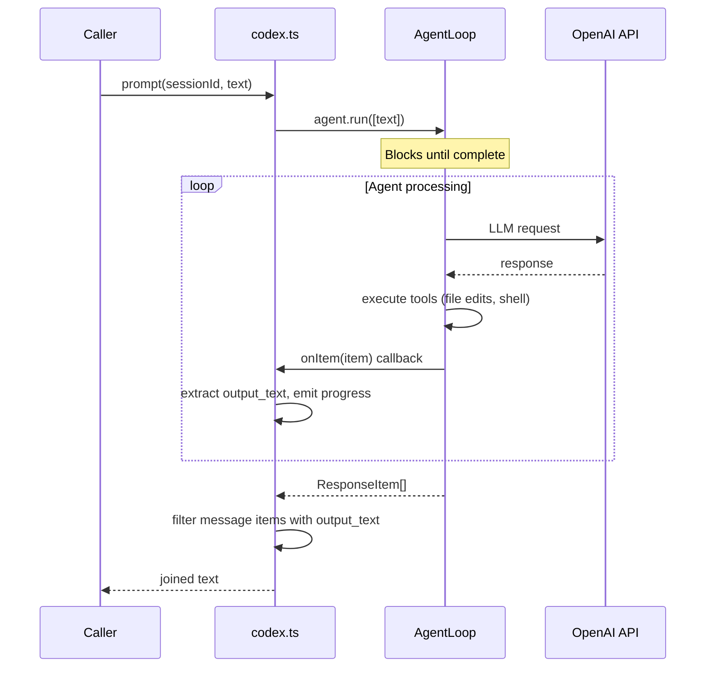

# Codex Backend

The Codex provider wraps the
[`@openai/codex`](https://github.com/openai/codex) SDK to conform to the
[`ProviderInstance`](../provider-system/overview.md) interface, enabling Dispatch
to use OpenAI's Codex agent as its AI runtime.

## Why use Codex

Codex is OpenAI's coding agent that runs locally. When used as a Dispatch
backend, it offers:

- Access to OpenAI models (o4-mini, o3-mini, codex-mini-latest)
- Local execution with full-auto approval for file edits and shell commands
- Integration with your existing OpenAI API key or ChatGPT subscription

## Prerequisites

1. **Install the Codex CLI**:

    ```sh
    # npm (recommended)
    npm install -g @openai/codex

    # Homebrew (macOS)
    brew install --cask codex
    ```

2. **Authenticate** using one of these methods:

    - **ChatGPT sign-in** (recommended): Run `codex` and select "Sign in with
      ChatGPT". This uses your existing Plus, Pro, Business, Edu, or Enterprise
      plan.
    - **API key**: Set `OPENAI_API_KEY` in your environment:

      ```sh
      export OPENAI_API_KEY=sk-...
      ```

3. **Verify installation**:

    ```sh
    codex --version
    ```

## Authentication

The Codex provider does not explicitly reference any API key in its code. The
`@openai/codex` SDK handles authentication internally. The SDK supports two
authentication methods:

| Method | How to configure |
|--------|-----------------|
| ChatGPT sign-in | Run `codex` interactively and select "Sign in with ChatGPT" |
| API key | Set `OPENAI_API_KEY` environment variable |

There is no validation of credentials at boot time. An invalid or missing key
will surface as an error when `agent.run()` is first called during a prompt.

## How the provider works

### The dynamic import workaround

The `@openai/codex` package ships as a CLI bundle without proper library
entry-points -- its `package.json` does not define `main`, `module`, or
`exports` fields. A top-level static `import` would cause Vite's import analysis
to fail at test time for every test file that transitively touches the provider
registry.

The provider solves this with a dynamic import (`src/providers/codex.ts:29-31`):

```ts
async function loadAgentLoop(): Promise<typeof import("@openai/codex")> {
  return import("@openai/codex");
}
```

This defers module resolution to runtime, so only code paths that actually
exercise the Codex provider pay the cost. If the dynamic import fails (e.g.,
the package is not installed), the error surfaces as an unhandled rejection at
boot time when `loadAgentLoop()` is first called.

### Ambient type declarations

Because `@openai/codex` does not ship type declarations, Dispatch provides
ambient type declarations in `src/codex.d.ts` that manually type the subset
of the API surface used:

- `AgentLoopOptions` -- constructor options including model, approval policy,
  and callbacks
- `ResponseItem` -- the shape of items returned by `agent.run()`
- `AgentLoop` class -- the `run()` and `terminate()` methods

These declarations are minimal and may need updating if the Codex SDK changes
its internal API surface.

### Boot

The `boot()` function (`src/providers/codex.ts:50-206`) loads the `AgentLoop`
class via dynamic import and creates a provider instance with:

- The specified model (defaulting to `o4-mini`)
- An in-memory `Map<string, CodexSessionState>` for tracking sessions

Unlike the [OpenCode](../provider-system/opencode-backend.md) and
[Copilot](../provider-system/copilot-backend.md) providers, Codex does not
spawn a server process. Each session creates its own `AgentLoop` instance
that communicates directly with the OpenAI API.

### Session creation

Each `createSession()` call (`src/providers/codex.ts:75-133`):

1. Generates a client-side UUID via `crypto.randomUUID()`.
2. Creates an `AgentLoop` instance with:
    - The configured model
    - `approvalPolicy: "full-auto"` (see
      [security implications](./authentication-and-security.md#permission-bypass-rationale))
    - `getCommandConfirmation` callback that always returns `{ approved: true }`
    - `onItem` callback that extracts `output_text` content for progress
      reporting
    - `onLoading` callback that emits a "thinking" status once per prompt
    - Optional `rootDir` if a working directory was provided at boot
3. Stores the session state (agent instance, progress reporter) in the map.

The `AgentLoop` is created during session creation (not during prompt) because
it encapsulates the full agent lifecycle including tool execution context.

### Prompt model: blocking `agent.run()`

The `prompt()` method (`src/providers/codex.ts:135-181`) calls `agent.run([text])`
which blocks until the agent completes all processing:



1. **Run**: `agent.run([text])` sends the prompt and blocks until the agent
   finishes all tool calls and produces a final response.
2. **Progress**: During execution, the `onItem` callback fires for each
   response item, extracting text from `output_text` content blocks and
   emitting progress updates.
3. **Result**: The returned `ResponseItem[]` array is filtered for items with
   `type === "message"` and `output_text` content blocks. Text is extracted
   and joined. If no text was produced, `null` is returned.

### Why follow-up messages are ignored

The `send()` method (`src/providers/codex.ts:183-194`) is implemented but
**intentionally does nothing**. It logs a debug message and returns without
sending:

> "Codex provider does not support non-blocking send -- agent.run() is blocking.
> Ignoring follow-up for session {sessionId}"

This is a fundamental limitation of the `AgentLoop.run()` API: once called,
it blocks the event loop until the agent completes. There is no way to inject
a message into a running agent loop. The `send()` method on
`ProviderInstance` is optional (`src/providers/interface.ts:80-81`) specifically
for this reason.

**Impact on callers**: The orchestrator uses `send()` to deliver time-warning
nudges to agents during long-running tasks. With the Codex provider, these
nudges are silently dropped. The agent will not receive any mid-task warnings
and will continue working until `agent.run()` completes or the pipeline-level
timeout fires.

### Model listing

The `listModels()` function (`src/providers/codex.ts:39-45`) returns a hardcoded
list because the Codex SDK does not expose a model listing API:

- `codex-mini-latest`
- `o3-mini`
- `o4-mini`

This list may become stale as OpenAI adds or removes compatible models. It
should be updated when new models are known to work with the `AgentLoop` API.

## Cleanup behavior

The `cleanup()` method (`src/providers/codex.ts:196-205`):

1. Iterates all session states in the map.
2. Calls `agent.terminate()` on each, swallowing any errors with an empty
   `catch {}` block.
3. Clears the session map.

The Codex provider does not have an explicit idempotency guard. However,
double-cleanup is safe because the second call iterates an empty map (cleared
on the first call) and performs no operations.

Since Codex does not spawn a server process, cleanup only terminates the
`AgentLoop` instances. The `terminate()` method cancels any in-flight API
requests and stops tool execution.

## No provider-level timeout

The Codex provider does not implement a session-level timeout. The blocking
`agent.run()` call will run until the agent completes, which could take an
arbitrary amount of time for complex tasks.

Pipeline-level deadlines (e.g., `--plan-timeout`, `--spec-timeout`) are the
mechanism that bounds Codex execution time. These deadlines wrap the entire
provider interaction from the caller side and will reject with a `TimeoutError`
if exceeded.

## Error handling

Errors from `agent.run()` propagate naturally to the caller. The provider logs
the error chain at debug level and re-throws.

When the OpenAI API returns a rate-limit or capacity error, the error propagates
to the [ProviderPool](./pool-failover.md), which checks for throttle patterns
(429, 503, "too many requests", etc.) via `isThrottleError()` in
`src/providers/errors.ts`. If failover providers are configured, the pool
automatically routes to the next available provider.

## Troubleshooting

### Dynamic import failure

**Symptom**: `boot()` throws with a module resolution error when the Codex
provider is first used.

**Resolution**:

1. Verify `@openai/codex` is installed: `npm list @openai/codex`.
2. If not installed, run `npm install @openai/codex`.
3. The dynamic import at `src/providers/codex.ts:29-31` defers resolution
   to runtime -- the error will only surface when the Codex provider is
   actually selected (not when other providers are used).

### Missing API key

**Symptom**: `agent.run()` fails with an authentication error on the first
prompt.

**Resolution**:

- Sign in via `codex` interactively (ChatGPT sign-in), or
- Set `OPENAI_API_KEY` in your environment.

### Agent hangs

**Symptom**: A prompt appears stuck with no progress updates.

**Possible causes**:

- The agent is performing extensive tool calls (file edits, shell commands).
- The OpenAI API is responding slowly.
- The agent entered a loop of tool calls.

**Resolution**:

- The `onItem` callback emits progress updates during processing. Enable
  `--verbose` to see these in the debug logs.
- Pipeline-level timeouts will eventually terminate the stuck operation.
- Reduce task complexity or use a simpler model to speed up execution.

### Full-auto approval policy

The `full-auto` approval policy (`src/providers/codex.ts:88`) combined with
the always-approving `getCommandConfirmation` callback
(`src/providers/codex.ts:91`) means the agent can:

- Read and write any file within its `rootDir`
- Execute arbitrary shell commands
- Install packages or modify the environment

This is by design for Dispatch's automated pipeline. See the
[authentication and security guide](./authentication-and-security.md#permission-bypass-rationale)
for the full trust model rationale.

## External references

- [OpenAI Codex CLI](https://github.com/openai/codex) -- source repository,
  installation, and documentation
- [Codex documentation](https://developers.openai.com/codex) -- official
  OpenAI Codex documentation
- [Codex authentication](https://developers.openai.com/codex/auth) -- API key
  and ChatGPT sign-in setup

## Related documentation

- [Provider Implementations Overview](./overview.md) -- comparison of all four
  providers
- [Claude Backend](./claude-backend.md) -- the Anthropic Claude provider
- [Copilot Backend](../provider-system/copilot-backend.md) -- the GitHub
  Copilot provider
- [OpenCode Backend](../provider-system/opencode-backend.md) -- the OpenCode
  provider
- [Authentication & Security](./authentication-and-security.md) -- credentials,
  permission bypass, and trust model
- [Pool Failover](./pool-failover.md) -- throttle detection and automatic
  failover
- [Provider System Overview](../provider-system/overview.md) -- interface
  contract and lifecycle
- [Adding a New Provider](../provider-system/adding-a-provider.md) -- guide
  for new backends
- [Provider Tests](../testing/provider-tests.md) -- detailed breakdown of all
  provider unit tests including Codex
