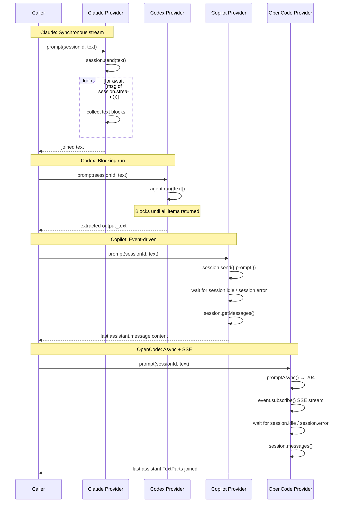

# Provider Implementations

The provider implementations group contains the four AI agent backend modules
that Dispatch uses to drive coding tasks. Each module wraps a different AI agent
SDK behind the shared
[`ProviderInstance`](../provider-system/overview.md) interface, enabling the
orchestrator to work with any backend without coupling to a specific vendor.

## Why four providers exist

Different teams and developers prefer different AI agent runtimes. Some have
GitHub Copilot subscriptions, others use Anthropic's Claude API, and some prefer
OpenAI's Codex or the open-source OpenCode platform. Rather than forcing a single
backend, Dispatch implements a Strategy pattern that lets users select their
preferred agent at the CLI level (`--provider claude`) while the
[orchestrator](../cli-orchestration/orchestrator.md),
[planner](../agent-system/planner-agent.md), and
[dispatcher](../planning-and-dispatch/dispatcher.md) remain agnostic.

## Provider comparison

| Provider | SDK | Default model | Session ID source | Prompt model | Follow-up (`send()`) support |
|----------|-----|---------------|-------------------|--------------|------------------------------|
| [Claude](./claude-backend.md) | `@anthropic-ai/claude-agent-sdk` | `claude-sonnet-4` | Client-generated UUID | Synchronous send + async stream iterator | Yes |
| [Codex](./codex-backend.md) | `@openai/codex` | `o4-mini` | Client-generated UUID | Blocking `agent.run()` | No (silently ignored) |
| [Copilot](../provider-system/copilot-backend.md) | `@github/copilot-sdk` | Auto-detected via RPC | Server-assigned | Fire-and-forget + event listeners | Yes |
| [OpenCode](../provider-system/opencode-backend.md) | `@opencode-ai/sdk` | Read from SDK config | Server-assigned | Fire-and-forget + SSE stream | Yes |

## Three distinct prompt/response patterns

Each provider uses a fundamentally different concurrency model for prompt
execution. Understanding these differences is essential for troubleshooting and
for contributors adding new providers.

### Claude: synchronous send + async stream iterator

The Claude provider (`src/providers/claude.ts:98-113`) calls `session.send(text)`
to queue the prompt, then iterates `session.stream()` using `for await...of`.
Each message with `type === "assistant"` has its text content blocks extracted and
concatenated. This is the most straightforward pattern -- the stream naturally
completes when the agent finishes.

### Codex: blocking `agent.run()`

The Codex provider (`src/providers/codex.ts:153`) calls `agent.run([text])`,
which blocks until the agent completes all processing. The returned array of
`ResponseItem` objects is filtered for `type === "message"` items with
`output_text` content blocks. This is the simplest pattern but prevents
mid-session interaction (see
[why follow-ups are ignored](./codex-backend.md#why-follow-up-messages-are-ignored)).

### Copilot: fire-and-forget + event listeners

The Copilot provider (`src/providers/copilot.ts:142-160`) calls
`session.send({ prompt })` as a fire-and-forget operation, then subscribes to
`session.idle` and `session.error` events. The wait is bounded by a 10-minute
timeout via `withTimeout()`. On success, `session.getMessages()` retrieves the
completed conversation.

### OpenCode: fire-and-forget + SSE event stream

The OpenCode provider (`src/providers/opencode.ts:173-238`) calls
`promptAsync()` which returns 204 immediately, then subscribes to a global SSE
event stream. Events are filtered by session ID using `isSessionEvent()`, which
must check three different property paths depending on the event type. The wait
is bounded by a 10-minute timeout.

## Authentication summary

Each provider authenticates differently. See the
[authentication and security guide](./authentication-and-security.md) for
detailed configuration instructions.

| Provider | Authentication method | Environment variable(s) |
|----------|-----------------------|-------------------------|
| Claude | API key via SDK | `ANTHROPIC_API_KEY` (also supports Bedrock, Vertex, Azure) |
| Codex | API key or ChatGPT sign-in via SDK | `OPENAI_API_KEY` or ChatGPT OAuth |
| Copilot | GitHub OAuth or token | `COPILOT_GITHUB_TOKEN`, `GH_TOKEN`, `GITHUB_TOKEN` |
| OpenCode | Configured per LLM provider | Provider-specific (e.g., `ANTHROPIC_API_KEY`, `OPENAI_API_KEY`) |

## Permission bypass and security model

All four providers bypass permission and approval checks for file operations and
shell commands. This is a deliberate design choice documented in the
[authentication and security guide](./authentication-and-security.md#permission-bypass-rationale).

| Provider | Permission mechanism | Source |
|----------|---------------------|--------|
| Claude | `permissionMode: "bypassPermissions"` + `allowDangerouslySkipPermissions: true` | `src/providers/claude.ts:71-72` |
| Codex | `approvalPolicy: "full-auto"` + `getCommandConfirmation: () => ({ approved: true })` | `src/providers/codex.ts:88-91` |
| Copilot | `onPermissionRequest: approveAll` | `src/providers/copilot.ts:101` |
| OpenCode | No explicit permission config (inherits OpenCode defaults) | `src/providers/opencode.ts` |

## Session ID generation

Providers differ in how session IDs are created:

- **Claude and Codex**: Generate UUIDs client-side via `crypto.randomUUID()`
  (`src/providers/claude.ts:76`, `src/providers/codex.ts:78`). These SDKs do not
  return session identifiers, so the provider creates opaque IDs to map sessions
  internally.
- **Copilot**: Uses the server-assigned `session.sessionId` returned by
  `client.createSession()` (`src/providers/copilot.ts:103`).
- **OpenCode**: Uses the server-assigned `session.id` returned by
  `client.session.create()` (`src/providers/opencode.ts:154`).

UUIDv4 collision probability is negligible -- this is a non-issue for the
client-generated IDs.

## Model selection and defaults

Model selection varies by provider. See each backend's documentation for format
details.

| Provider | Default model | Format | Dynamic listing |
|----------|---------------|--------|-----------------|
| Claude | `claude-sonnet-4` | Bare model name (e.g., `claude-opus-4-6`) | Yes, via `query().supportedModels()` with hardcoded fallback |
| Codex | `o4-mini` | Bare model name (e.g., `codex-mini-latest`) | No, hardcoded list |
| Copilot | Auto-detected via RPC | Bare model ID (e.g., `claude-sonnet-4-5`) | Yes, via `client.listModels()` |
| OpenCode | Read from SDK config | `provider/model` format (e.g., `anthropic/claude-sonnet-4`) | Yes, via `client.config.providers()` |

## Timeouts

Two providers implement session-level timeouts via `withTimeout()`:

| Provider | Timeout | Constant | Source |
|----------|---------|----------|--------|
| Copilot | 10 minutes (600,000 ms) | `SESSION_READY_TIMEOUT_MS` | `src/providers/copilot.ts:24` |
| OpenCode | 10 minutes (600,000 ms) | `SESSION_READY_TIMEOUT_MS` | `src/providers/opencode.ts:36` |

Claude and Codex do not implement provider-level timeouts. Claude's stream
iterator naturally completes, and Codex's `agent.run()` blocks until done.
Pipeline-level deadlines (e.g., `--plan-timeout`, `--spec-timeout`) still bound
these operations from the caller side.

When the 10-minute timeout fires, a `TimeoutError` is thrown with a descriptive
label (e.g., `"copilot session ready"`). This error propagates to the
orchestrator, which records the task as failed. The timeout value is hardcoded
with no configuration knob.

## Related documentation

- [Claude Backend](./claude-backend.md) -- Claude provider setup and internals
- [Codex Backend](./codex-backend.md) -- Codex provider setup and internals
- [Copilot Backend](../provider-system/copilot-backend.md) -- Copilot provider
  setup and internals
- [OpenCode Backend](../provider-system/opencode-backend.md) -- OpenCode
  provider setup and internals
- [Authentication & Security](./authentication-and-security.md) -- credentials,
  permission bypass, and trust model
- [Pool Failover & Error Handling](./pool-failover.md) -- throttle detection,
  cooldowns, and automatic failover
- [Provider System Overview](../provider-system/overview.md) -- interface
  contract, registry, and lifecycle
- [Adding a New Provider](../provider-system/adding-a-provider.md) -- guide for
  implementing new backends
