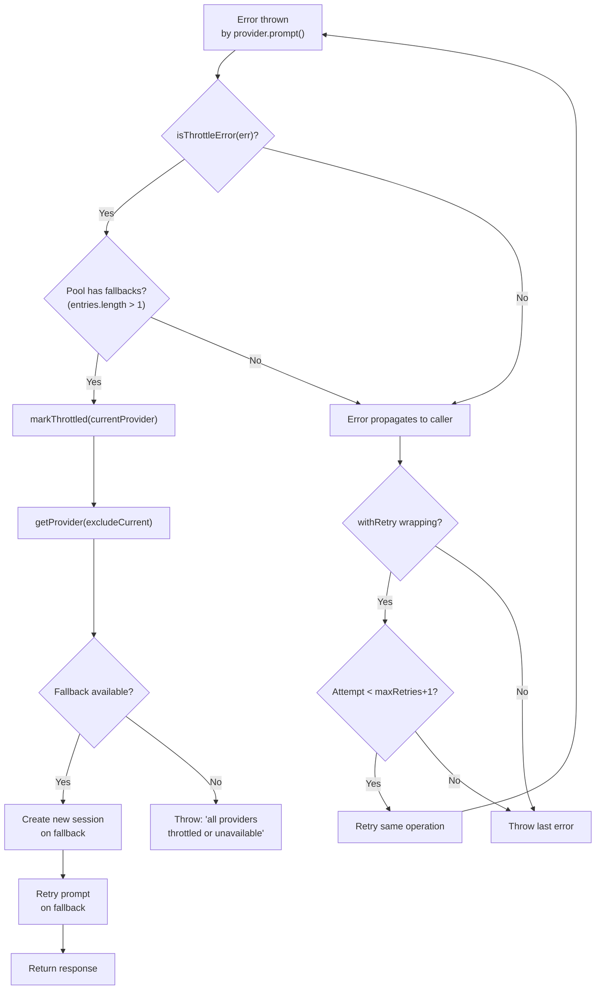

# Error Classification and Retry Layering

The provider system uses a two-layer error resilience strategy: pool-level
throttle detection (failover to a different provider) and pipeline-level
`withRetry` (retry the same operation). Understanding how errors flow through
these layers is essential for diagnosing failures and tuning reliability.

## Why this exists

Provider SDKs surface rate-limit and throttle errors as `throw new Error(msg)`
with messages containing HTTP status codes or human-readable throttle language.
There are no structured error codes. The `isThrottleError()` function provides
heuristic-based classification so the pool can distinguish throttle errors
(which benefit from failover) from other errors (which should propagate
normally).

## The `isThrottleError()` function

Defined in `src/providers/errors.ts:19-22`, this function performs regex
matching against the lowercased error message:

```
/rate.limit|429|503|throttl|capacity|overloaded|too many requests|service unavailable/
```

### Pattern coverage

| Pattern | What it catches |
|---------|----------------|
| `rate.limit` | "rate limit exceeded", "rate-limit", "rate_limit" |
| `429` | HTTP 429 Too Many Requests status codes embedded in error messages |
| `503` | HTTP 503 Service Unavailable responses |
| `throttl` | "throttled", "throttling", "throttle" |
| `capacity` | "capacity exceeded", "insufficient capacity" |
| `overloaded` | "server overloaded", "system overloaded" |
| `too many requests` | Literal "too many requests" text |
| `service unavailable` | Literal "service unavailable" text |

### How it avoids false positives

The function's doc comment (`src/providers/errors.ts:16-17`) explicitly states
the design tradeoff:

- **False positive** (non-throttle error classified as throttle): Causes
  unnecessary failover to a different provider. The prompt is retried on the
  fallback, which is a retry, not data loss. Acceptable.
- **False negative** (throttle error not detected): The error propagates
  normally. The existing `withRetry` wrapper (`src/helpers/retry.ts:33-57`)
  catches it as a generic error and retries up to 3 times on the same provider
  (see [Retry Utility](../shared-utilities/retry.md)).
  If the provider recovers within the retry window, the operation succeeds.

This means the system is designed to be **biased toward false positives** --
it is better to fail over unnecessarily than to miss a throttle error.

### Known limitations

1. **String matching is fragile**: If a provider SDK changes its error message
   format (e.g., wrapping the status code in a JSON object without including
   "429" in the message text), the heuristic will miss it.
2. **Non-English messages**: The regex assumes English error text.
3. **"503" false positives**: A non-throttle 503 error (e.g., deployment in
   progress) would trigger failover. In practice, this is benign.

## Error handling decision tree



## The two retry layers

### Layer 1: Pool-level failover (throttle-specific)

- **Trigger**: `isThrottleError()` returns true during `prompt()`.
- **Action**: Marks the current provider as throttled, boots a fallback provider
  (if not already booted), creates a new session, and retries the prompt.
- **Scope**: Only retries on a *different* provider. Does not retry on the same
  provider.
- **Limit**: One failover attempt per prompt call. If the fallback also throws a
  throttle error, that error propagates normally.

### Layer 2: Pipeline-level `withRetry` (generic)

- **Trigger**: Any error thrown by the operation (including "all providers
  throttled").
- **Action**: Retries the entire operation (which includes pool selection).
- **Scope**: Retries on the same operation, which may hit the same or a
  different provider depending on cooldown state.
- **Limit**: Configurable via `--retries` CLI flag; defaults to 3 retries
  (`DEFAULT_RETRY_COUNT` in `src/helpers/retry.ts:12`).

### Interaction between layers

Consider a three-provider pool (A, B, C) processing a prompt:

1. Pool routes to provider A (priority 0).
2. Provider A throws a 429 error.
3. **Layer 1**: Pool marks A as throttled, fails over to B, retries.
4. Provider B succeeds. Done.

Now consider if B also fails:

1. Pool routes to A. A throws 429.
2. **Layer 1**: Pool marks A, fails over to B. B throws 429.
3. B's 429 propagates out of the pool (Layer 1 only does one failover).
4. **Layer 2**: `withRetry` catches the error, retries the whole operation.
5. On retry, pool checks A (still in cooldown), B (still in cooldown), routes
   to C.
6. If C succeeds, done. If C also fails, `withRetry` retries again (up to
   `maxRetries` times).

### The "all providers throttled" error

When all providers are in cooldown, `getProvider()` throws:

```
"ProviderPool: all providers are throttled or unavailable"
```

This error message does **not** match the `isThrottleError()` regex, so it will
not trigger another pool failover. Instead, it propagates to `withRetry`, which
treats it as a generic error and retries after a delay. If the cooldown expires
before the retry, the provider becomes available again.

## Dispatcher-level rate limit detection

There is a separate rate-limit detection mechanism in the dispatcher
(`src/dispatcher.ts:19-24`). This checks the **response text** (not the error)
for rate-limit language:

```ts
const rateLimitPatterns = [
  /you[''\u2019]?ve hit your (rate )?limit/i,
  /rate limit exceeded/i,
  /too many requests/i,
  /quota exceeded/i,
];
```

This catches cases where a provider returns a rate-limit message as a
"successful" response rather than throwing an error. The dispatcher marks
these as failed tasks with a rate-limit flag. This is complementary to the
pool-level throttle detection, which operates on thrown errors.

## Troubleshooting

### How to diagnose throttle-related failures

1. **Enable debug logging**: Set `LOG_LEVEL=debug` or use `--verbose` to see
   pool debug messages. The pool logs:
   - `Pool: booting <provider>` -- when a fallback is lazily booted
   - `Pool: throttle detected on <key>, failing over...` -- when failover occurs
   - `Pool: marked <key> as throttled for <ms>ms` -- when cooldown starts

2. **Check the error message**: If the final error is "all providers are
   throttled or unavailable", all configured providers hit their rate limits
   within the cooldown window. Consider:
   - Reducing concurrency (`--concurrency`)
   - Adding more providers to the fallback pool
   - Increasing rate limits with the provider (if possible)

3. **Check for false negatives**: If a provider error containing throttle
   language is not triggering failover, the error message format may not match
   the regex in `isThrottleError()`. File a bug report with the exact error
   message.

### Tuning recommendations

| Scenario | Recommendation |
|----------|----------------|
| Frequent failovers | Reduce concurrency to lower request rate |
| All providers throttled simultaneously | Add providers with independent rate limits |
| False positive failovers | Check debug logs; the failover is benign |
| Provider-specific cooldown mismatch | Not configurable per-provider; the 60s default applies uniformly |

## Related documentation

- [Provider System Overview](./overview.md) -- architecture and interface
  contract
- [Pool and Failover](./pool-and-failover.md) -- how the pool manages failover
  and cooldowns
- [Core Helpers](../shared-utilities/overview.md) -- the `withRetry` utility
- [Dispatch Pipeline](../cli-orchestration/dispatch-pipeline.md) -- how the
  pipeline wraps agent calls with retry
