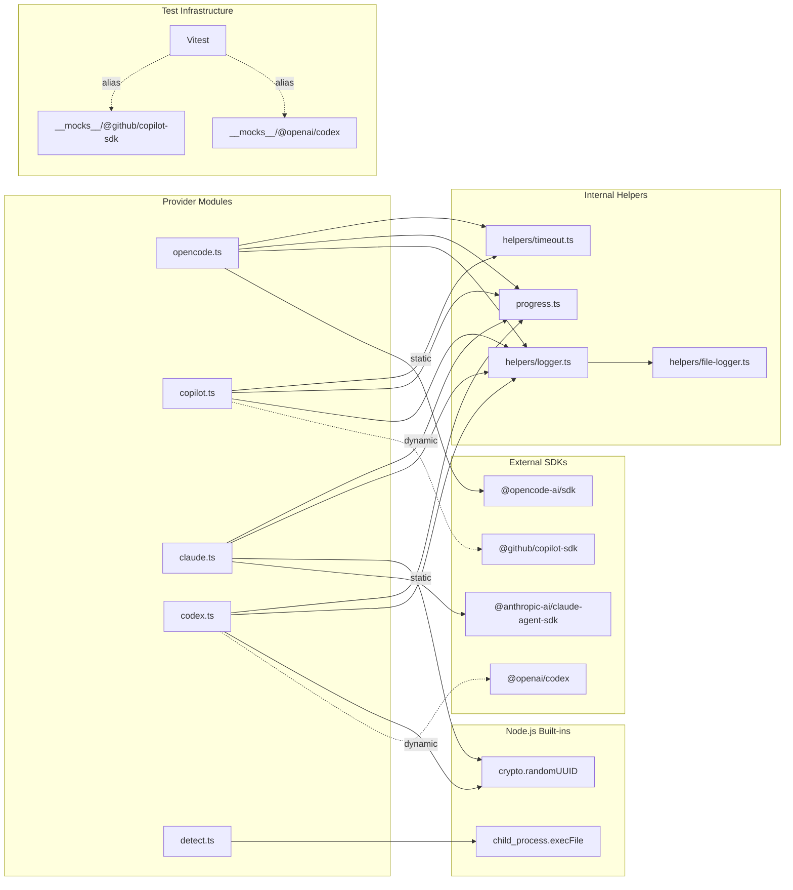

# Provider System Integrations

The provider system depends on seven external integrations: four provider SDK
packages, the Node.js `child_process` module for binary detection, the Vitest
test framework with mock aliases, and the internal logger. This document covers
how each integration is loaded, configured, authenticated, and tested from the
provider system's perspective.

For implementation details specific to each provider backend, see the
[provider implementations](../provider-implementations/overview.md)
documentation.

## Integration summary

| Integration | Used by | Load strategy | Purpose |
|-------------|---------|--------------|---------|
| `node:child_process` | `detect.ts` | Static import | CLI binary availability detection |
| `@opencode-ai/sdk` | `opencode.ts` | Static import | OpenCode server lifecycle and session management |
| `@github/copilot-sdk` | `copilot.ts` | Dynamic `import()` | Copilot CLI server lifecycle and session management |
| `@anthropic-ai/claude-agent-sdk` | `claude.ts` | Static import | Claude session-based V2 API |
| `@openai/codex` | `codex.ts` | Dynamic `import()` | Codex AgentLoop session management |
| Vitest | `provider-index.test.ts` | Test runner | Unit testing with module mocks and resolve aliases |
| `helpers/logger.ts` | All provider modules | Static import | Structured CLI and per-issue file logging |

## Node.js child_process

**File**: `src/providers/detect.ts:6-7`

The `execFile` function from `node:child_process` is used exclusively for
binary detection -- checking whether each provider's CLI binary is available on
PATH.

### How it works

`detect.ts` wraps `execFile` with `util.promisify` and calls it with:

- **Command**: The binary name from `PROVIDER_BINARIES` (e.g., `"opencode"`,
  `"copilot"`, `"claude"`, `"codex"`)
- **Args**: `["--version"]`
- **Options**: `{ shell: true }` on Windows (required for `.cmd`/`.bat` shims),
  `timeout: 5000` (kills the child process after 5 seconds)

### Timeout behavior

The 5-second timeout (`DETECTION_TIMEOUT_MS`) uses Node.js's built-in timeout
option for `execFile`. When the timeout fires:

1. Node.js sends `SIGTERM` to the child process on Unix (or terminates it on
   Windows)
2. The Promise rejects with an error whose `killed` property is `true`
3. `checkProviderInstalled()` catches the error and returns `false`

This means slow CI environments or overloaded machines may produce false
negatives -- the binary is installed but detection reports `false` because the
`--version` call took longer than 5 seconds. This is acceptable because
detection is advisory (used only by the config wizard's UI indicators), not
blocking.

### Platform considerations

The `shell: true` option on Windows is necessary because many CLI tools are
installed as `.cmd` or `.bat` wrapper scripts that `execFile` cannot execute
directly without a shell. On Unix, `execFile` runs the binary directly (no
shell), which is faster and avoids shell injection risks.

## @opencode-ai/sdk

**File**: `src/providers/opencode.ts:17-24`

The OpenCode SDK is imported statically at module load time. Unlike the Copilot
and Codex SDKs, it does not require dynamic import workarounds because it ships
with proper ESM entry points.

### Key SDK surface used

| SDK export | Usage |
|-----------|-------|
| `createOpencode()` | Spawn a local OpenCode server on a random port |
| `createOpencodeClient()` | Connect to an existing server by URL |
| `client.session.create()` | Create an isolated session |
| `client.session.promptAsync()` | Fire-and-forget prompt (returns 204 immediately) |
| `client.event.subscribe()` | SSE event stream for session lifecycle events |
| `client.session.messages()` | Fetch completed messages after session goes idle |
| `client.config.get()` | Retrieve the active model from config |
| `client.config.providers()` | List configured providers and models |

### Authentication

The OpenCode SDK manages its own credentials internally. It reads provider
API keys from its own config layer, filtering providers whose `source` is
`"env"`, `"config"`, or `"custom"`. No environment variable is set by Dispatch
itself -- users configure credentials through the OpenCode CLI
(`opencode config`).

### Server lifecycle

When no `--server-url` is provided, `boot()` calls `createOpencode({ port: 0 })`
to spawn a local server on a random port. The returned `server.close()` handle
is captured and called during `cleanup()`. When a URL is provided, only a
client is created (no server lifecycle to manage).

The SDK's `createOpencode` spawns the `opencode` binary via
`child_process.spawn()` without a `cwd` option -- the server inherits
`process.cwd()`. This means the `opts.cwd` boot option has no effect on where
the OpenCode server runs. The provider logs a debug warning when `cwd` is
specified and relies on prompt-level cwd set by the executor/dispatcher.

### What happens when the SDK import fails

Since the import is static, a missing `@opencode-ai/sdk` package causes a
module resolution error at startup that crashes the process. This is intentional
-- the OpenCode provider is always available in the dependency tree. Users who
only want other providers still have the package installed; it simply does not
get booted.

## @github/copilot-sdk

**File**: `src/providers/copilot.ts:13, 33-35`

The Copilot SDK is loaded lazily via a dynamic `import()` call in the
`loadCopilotSdk()` helper function.

### Why dynamic import

The `@github/copilot-sdk` package depends on `vscode-jsonrpc/node`, which uses
CommonJS `require()` calls that cannot be resolved under Vitest's ESM module
loader. A static import would cause every test file that transitively touches
the provider registry to fail at module resolution time, even tests that have
nothing to do with Copilot. The dynamic import defers resolution to runtime so
that only code paths that actually exercise the Copilot provider pay the cost.

### Key SDK surface used

| SDK export | Usage |
|-----------|-------|
| `CopilotClient` | Manages the Copilot CLI server lifecycle |
| `client.start()` | Start or connect to a Copilot CLI server |
| `client.stop()` | Stop the CLI server |
| `client.createSession()` | Create a session with optional model and cwd |
| `client.listModels()` | Fetch available models |
| `session.send()` | Send a prompt (fire-and-forget) |
| `session.on("session.idle")` | Listen for session completion |
| `session.on("session.error")` | Listen for session errors |
| `session.getMessages()` | Retrieve completed messages |
| `session.rpc.model.getCurrent()` | Detect the active model (best-effort) |
| `session.destroy()` | Tear down a single session |
| `approveAll` | Auto-approve all permission requests |

### Authentication

Copilot authentication is resolved in this precedence order:

1. `COPILOT_GITHUB_TOKEN` environment variable
2. `GH_TOKEN` environment variable
3. `GITHUB_TOKEN` environment variable
4. Logged-in Copilot CLI user (interactive login via `copilot auth login`)

Dispatch does not manage these credentials -- it passes them through to the SDK
via the environment.

### Session management

Unlike other providers, the Copilot provider maintains a `Map<string,
CopilotSession>` to track live sessions. This is necessary because the SDK
returns a `CopilotSession` object (not a plain string ID) from
`createSession()`, and subsequent `prompt()` and `send()` calls need the full
session object. During `cleanup()`, each session is individually destroyed
before the client is stopped.

### What happens when the dynamic import fails

If `@github/copilot-sdk` is not installed or cannot be resolved at runtime, the
dynamic `import()` rejects with a module resolution error. This error propagates
from `loadCopilotSdk()` through `boot()` or `listModels()` to the caller. The
pool catches this during `getProvider()` and can fail over to the next entry.
If Copilot is the only configured provider, the error propagates to the
dispatch pipeline, which logs it and fails the task.

## @anthropic-ai/claude-agent-sdk

**File**: `src/providers/claude.ts:12`

The Claude Agent SDK is imported statically. It uses the V2 preview API
(`unstable_v2_createSession`) for session-based interaction.

### Key SDK surface used

| SDK export | Usage |
|-----------|-------|
| `unstable_v2_createSession()` | Create a V2 session with model and permissions |
| `session.send()` | Send a prompt to the session |
| `session.stream()` | Async iterator for streaming response messages |
| `session.close()` | Tear down a session |
| `query()` | V1 API used only for `listModels()` |
| `query.supportedModels()` | Fetch supported model list |
| `query.close()` | Clean up the V1 query instance |

### Authentication

The Claude SDK reads `ANTHROPIC_API_KEY` from the environment. No additional
configuration is needed. Dispatch does not set or rotate this variable.

### Session ID generation

Unlike the Copilot and OpenCode SDKs, the Claude SDK's
`unstable_v2_createSession()` does not return a session ID. Instead, the
provider generates its own UUID via `crypto.randomUUID()` and maps it to the
`SDKSession` object in a local `Map<string, SDKSession>`. This means the
session ID used by the pool and agents is a Dispatch-generated UUID, not an
SDK-provided identifier.

### Model fallback in listModels

`listModels()` first attempts a dynamic query via the V1 `query()` API. If
that fails (e.g., no API key, network error), it falls back to a hardcoded
list of known models: `claude-haiku-3-5`, `claude-opus-4-6`, `claude-sonnet-4`,
`claude-sonnet-4-5`.

### V2 preview stability

The `unstable_v2_createSession` function name includes `unstable_` to indicate
it is a preview API. The project targets ES2022, which does not include the
`Disposable` lib required for `await using` syntax, so `session.close()` is
called manually in cleanup rather than relying on the SDK's disposable pattern.

## @openai/codex

**File**: `src/providers/codex.ts:29-31`

The Codex SDK (`@openai/codex`) is loaded lazily via a dynamic `import()` call
in the `loadAgentLoop()` helper function.

### Why dynamic import

The `@openai/codex` package ships as a CLI-only bundle without a proper library
entry-point (`main`, `module`, or `exports` fields are missing from its
`package.json`). A static import causes Vite's import analysis to fail at test
time for every test file that transitively touches the provider registry. The
dynamic import defers resolution to runtime.

### Key SDK surface used

| SDK export | Usage |
|-----------|-------|
| `AgentLoop` | The main class for running Codex agent sessions |
| `new AgentLoop({...})` | Create an agent with model, approval policy, and callbacks |
| `agent.run([text])` | Send a prompt and wait for completion (blocking) |
| `agent.terminate()` | Kill the agent loop |

### Authentication

The Codex SDK reads `OPENAI_API_KEY` from the environment. No additional
configuration is needed.

### Blocking run model

Unlike the other three providers, Codex uses a **blocking** prompt model. The
`agent.run()` method sends the prompt and returns only when the agent has
finished processing. This has two implications:

1. **No real-time progress**: The `onItem` callback provides incremental
   output during processing, and the `onLoading` callback signals that the
   agent is thinking. These are wired into the `ProgressReporter`.
2. **send() is a no-op**: Because `agent.run()` blocks the event loop for the
   duration of processing, there is no window to inject a follow-up message.
   The `send()` method logs a debug message and returns without doing anything.

### Model listing

The Codex SDK does not expose a model listing API. The `listModels()` function
returns a hardcoded list: `codex-mini-latest`, `o3-mini`, `o4-mini`.

## Vitest and test mocks

**Files**: `vitest.config.ts:6-9`, `src/__mocks__/@github/copilot-sdk.ts`,
`src/__mocks__/@openai/codex.ts`, `src/tests/provider-index.test.ts`

The provider system uses Vitest as its test framework, with two specialized
mechanisms to handle SDK packages that cannot be imported under ESM test
conditions.

### Resolve aliases in vitest.config.ts

The Vitest config defines resolve aliases that redirect problematic SDK imports
to lightweight test stubs:

```
resolve.alias["@openai/codex"]     → src/__mocks__/@openai/codex.ts
resolve.alias["@github/copilot-sdk"] → src/__mocks__/@github/copilot-sdk.ts
```

These aliases are applied globally to all test files. They ensure that any
test module that transitively imports the provider registry (which statically
imports `opencode.ts`, `copilot.ts`, `claude.ts`, and `codex.ts`) can resolve
the SDK packages without runtime errors.

### Mock stubs

The mock stubs provide minimal no-op implementations of the SDK classes:

- **`@github/copilot-sdk` stub**: Exports `CopilotClient` (with `start()`,
  `stop()`, `listModels()`, `createSession()`), `CopilotSession` (with
  `sendMessage()`), `approveAll` (a `vi.fn()`), and `defineTool`. The real
  package depends on `vscode-jsonrpc/node` which uses CJS `require()` that
  Vitest's ESM loader cannot resolve.

- **`@openai/codex` stub**: Exports `AgentLoop` with `run()` (returns empty
  array) and `terminate()` (no-op). The real package has no library
  entry-point.

### Module-level mocks in tests

The `provider-index.test.ts` file uses Vitest's `vi.mock()` with `vi.hoisted()`
to replace the four provider modules (`opencode.js`, `copilot.js`, `claude.js`,
`codex.js`) with mock boot and listModels functions. This pattern ensures the
mocks are hoisted above the test module's imports, preventing the real provider
implementations from being loaded.

### Running provider tests in isolation

To run only the provider registry tests:

```sh
npx vitest run src/tests/provider-index.test.ts
```

The mock aliases are always active during `vitest run`, so no additional
configuration is needed. The test coverage configuration excludes
`src/**/interface.ts`, `src/**/index.ts`, and `src/__mocks__/**` from coverage
metrics, focusing coverage on the implementation files.

### Coverage thresholds

The project enforces minimum coverage thresholds across the entire `src/`
directory:

| Metric | Threshold |
|--------|-----------|
| Lines | 85% |
| Branches | 80% |
| Functions | 85% |

## Internal logger

**File**: `src/helpers/logger.ts`

Every provider module imports the `log` singleton from `helpers/logger.ts` for
structured output during boot, session lifecycle, prompt handling, and
cleanup.

### Dual output destinations

Logger output goes to two destinations simultaneously:

1. **Console (stdout/stderr)**: Colorized output using `chalk`. Info-level and
   below go to `console.log`; warn and error go to `console.error`.

2. **Per-issue file log**: If an `AsyncLocalStorage<FileLogger>` context is
   active (set by the dispatch pipeline for each issue), log entries are also
   written to `.dispatch/logs/issue-{id}.log` with timestamps and ANSI codes
   stripped.

### Log level resolution

The log level is resolved at module load time from environment variables:

1. `LOG_LEVEL` environment variable (one of `debug`, `info`, `warn`, `error`)
2. `DEBUG` environment variable (any truthy value sets level to `debug`)
3. Default: `info`

At runtime, the `log.verbose` property (a getter/setter backed by the internal
`currentLevel` variable) can override the env-resolved level. The `--verbose`
CLI flag sets `log.verbose = true`, forcing `debug` level.

### How providers use the logger

All four providers follow the same logging pattern:

- **Boot phase**: `log.debug()` for connection/spawn details, server start
  confirmation, and model detection
- **Session lifecycle**: `log.debug()` for session creation, session ID, and
  model override parsing
- **Prompt handling**: `log.debug()` for prompt size, SSE event subscriptions,
  streaming progress, and response size
- **Error handling**: `log.debug()` with `log.formatErrorChain()` to surface
  the full `.cause` chain (important for Node.js network errors where the real
  reason is buried in nested causes)
- **Cleanup**: `log.debug()` for cleanup start and any teardown failures

Since all provider-level logging uses `debug`, provider details are invisible
at the default `info` level. Users see provider activity only when running with
`--verbose` or `LOG_LEVEL=debug`.

### Error chain formatting

The `log.formatErrorChain()` method traverses up to 5 levels of nested
`.cause` properties, formatting them as an indented chain. This is particularly
important for OpenCode and Copilot providers, where SDK errors from HTTP
failures often wrap the real network error in multiple cause layers:

```
Error: OpenCode promptAsync failed: {...}
  ⤷ Cause: fetch failed
  ⤷ Cause: ECONNREFUSED 127.0.0.1:3000
```

## Integration dependency diagram



## Related documentation

- [Provider System Overview](./overview.md) -- architecture, interface
  contract, and registry
- [Pool and Failover](./pool-and-failover.md) -- how the pool uses
  `bootProvider()` and handles SDK boot failures during failover
- [Error Classification](./error-classification.md) -- heuristic throttle
  detection across provider SDKs
- [Binary Detection](./binary-detection.md) -- `child_process` usage for CLI
  availability checks
- [Progress Reporting](./progress-reporting.md) -- ANSI sanitization consumed
  by all four provider SDKs
- [Adding a New Provider](./adding-a-provider.md) -- how to register a new SDK
  integration
- [Core Helpers](../shared-utilities/overview.md) -- logger, retry, and
  timeout utilities
- [Testing](../testing/provider-tests.md) -- provider test patterns and mock
  infrastructure
