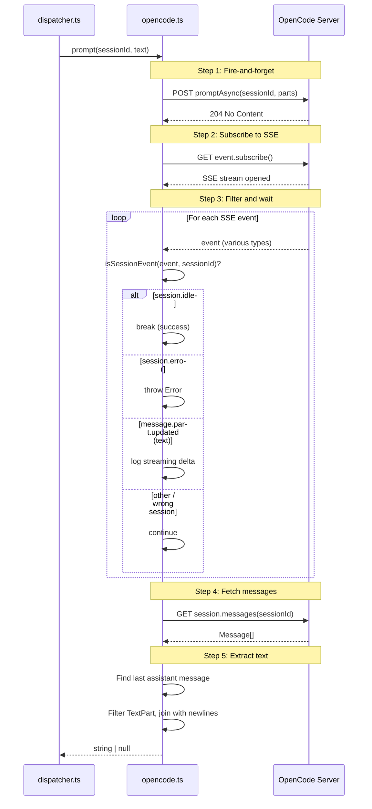

# OpenCode Backend

The OpenCode provider wraps the
[`@opencode-ai/sdk`](https://opencode.ai/docs/sdk/) to conform to the
[`ProviderInstance`](../shared-types/provider.md#providerinstance-interface) interface, enabling dispatch to use
[OpenCode](https://opencode.ai) as its AI agent runtime.

## Why use OpenCode

OpenCode is an open-source AI coding agent available as a terminal UI, desktop
app, or IDE extension. When used as a dispatch backend, it provides:

- Broad model support (Anthropic, OpenAI, and other LLM providers configured via
  OpenCode's provider system)
- Local server mode with an HTTP API (OpenAPI 3.1 spec)
- Session-based conversation isolation with multi-part responses
- Asynchronous prompt execution with real-time SSE streaming, avoiding HTTP
  timeout issues that affect long-running LLM calls

## Prerequisites

1. **Install the OpenCode CLI** using one of these methods:

    ```sh
    # Install script (recommended)
    curl -fsSL https://opencode.ai/install | bash

    # npm
    npm install -g opencode-ai

    # Homebrew (macOS/Linux)
    brew install anomalyco/tap/opencode
    ```

2. **Configure an LLM provider** by running `opencode`, executing the `/connect`
   command, and following the prompts. Alternatively, set API keys for your
   preferred provider in your environment. See the
   [OpenCode providers docs](https://opencode.ai/docs/providers/) for details.

3. **Verify installation**:

    ```sh
    opencode --version
    ```

## How the provider works

The boot function in `src/providers/opencode.ts:32-51` supports two modes:

### Spawn a local server (default)

When no [`--server-url`](../cli-orchestration/cli.md) is provided, the provider calls `createOpencode()` from
the SDK with `port: 0` (`src/providers/opencode.ts:43`), which:

1. Starts an OpenCode HTTP server on `127.0.0.1` with an **OS-assigned
   ephemeral port** (port 0 tells the OS to pick any available port).
2. Returns an object with `{ client, server }` -- the client is pre-connected to
   the spawned server.
3. The `server.close()` handle is stored for cleanup.

The SDK's `createOpencode()` has a default startup timeout of 5000ms. If the
OpenCode binary is not found or the server fails to bind, the promise rejects
and the dispatch run aborts (see
[error recovery](./overview.md#error-recovery-on-boot-failure)).

### Why port 0 instead of the default 4096

The provider passes `port: 0` to `createOpencode()` rather than using the SDK
default of 4096. This ensures each dispatch run gets an OS-assigned ephemeral
port, which:

- **Avoids port conflicts** when multiple dispatch runs execute concurrently or
  when port 4096 is already in use by an `opencode serve` instance.
- **Removes the need for manual port management** -- the OS guarantees the
  assigned port is available.
- **Trades off discoverability** -- the actual port is not known in advance and
  is not exposed via CLI output. This is acceptable because the spawned server is
  only used by the SDK client that created it.

### Connect to an existing server

When [`--server-url`](../cli-orchestration/cli.md) is provided (e.g., `--server-url http://localhost:4096`), the
provider calls `createOpencodeClient({ baseUrl: opts.url })` instead. This
creates a client that connects to an already-running OpenCode server without
spawning a new one.

This mode is useful when:

- You already have `opencode serve` running in another terminal.
- You want to share a single OpenCode server across multiple dispatch runs.
- You are running OpenCode on a remote machine.

When connecting to an existing server, the server may require authentication via
the `OPENCODE_SERVER_PASSWORD` environment variable. If this variable is set on
the server, all HTTP requests must include it as a bearer token. The SDK handles
this automatically when the variable is set in the client's environment. See the
[OpenCode server docs](https://opencode.ai/docs/server/) for authentication
details.

The distinction between `createOpencode()` (spawn + connect) and
`createOpencodeClient()` (connect only) is a design choice in the
`@opencode-ai/sdk`. The Copilot SDK uses a single `CopilotClient` class that
handles both cases via an optional `cliUrl` option. The OpenCode SDK separates
these concerns into distinct functions because the spawned server requires
lifecycle management (the `server` handle), while connecting to an existing
server does not.

### Working directory limitation

The `@opencode-ai/sdk`'s `createOpencodeServer` function spawns the `opencode`
process via `child_process.spawn()` without a `cwd` option — the server
inherits `process.cwd()`. There is no `ServerOptions.cwd` or configuration
field to control the working directory at spawn time
(`src/providers/opencode.ts:83-88`).

**Workaround:** When worktree isolation requires a specific working directory,
the prompt-level `cwd` (set by the executor/dispatcher in the prompt text)
ensures the AI agent operates in the correct directory. If a `cwd` option is
passed to `bootProvider`, the OpenCode provider logs a debug message noting
the limitation and relies on the prompt-level approach instead.

## Session management

Each call to `createSession()` (`src/providers/opencode.ts:56-69`) invokes
`client.session.create()`, which creates a new session on the OpenCode server.
The SDK returns a `Session` object with an `id` field that is used as the opaque
session identifier.

Sessions created via the SDK are managed server-side by the OpenCode process.
There is no client-side session map (unlike the [Copilot provider](./copilot-backend.md#session-management)). The OpenCode
server tracks all sessions and their message histories internally.

## Asynchronous prompt model

The provider uses an **asynchronous prompt + SSE streaming** pattern rather than
the SDK's blocking `prompt()` method. This is the most significant
implementation detail of the OpenCode backend.

### Why not use the blocking prompt() method

The OpenCode SDK offers a blocking `client.session.prompt()` that sends a single
long-lived HTTP request and waits for the LLM to finish. In practice, slow LLM
responses can exceed Node.js/undici's default headers timeout, causing the
request to fail with a timeout error even though the LLM is still processing.

The async approach avoids this by separating the request initiation from the
result retrieval, with SSE events providing the coordination signal.

### The 5-step async data flow

The `prompt()` method (`src/providers/opencode.ts:71-163`) follows a 5-step
sequence:



**Step 1 -- Fire-and-forget (`promptAsync`)**: The provider calls
`client.session.promptAsync()` with the session ID and prompt text wrapped in a
`parts` array (`[{ type: "text", text }]`). This returns a `204 No Content`
immediately, meaning the server has accepted the prompt and started LLM
processing but has not yet produced a result (`src/providers/opencode.ts:76-85`).

**Step 2 -- SSE subscription**: An `AbortController` is created and its signal
is passed to `client.event.subscribe()`, which opens a Server-Sent Events stream
to the OpenCode server's `GET /global/event` endpoint
(`src/providers/opencode.ts:90-93`).

**Step 3 -- Event filtering and waiting**: The provider iterates the SSE stream
with `for await (const event of stream)`. Each event is checked with
`isSessionEvent(event, sessionId)` to filter out events belonging to other
sessions. The provider watches for three event types
(`src/providers/opencode.ts:97-122`):

| Event type | Action |
|------------|--------|
| `message.part.updated` (text) | Log the streaming delta length; continue waiting |
| `session.error` | Throw an error with the error details |
| `session.idle` | Break out of the loop -- the LLM has finished |

**Step 4 -- Fetch messages**: After `session.idle`, the provider calls
`client.session.messages()` to retrieve all messages in the session
(`src/providers/opencode.ts:128-135`).

**Step 5 -- Extract text parts**: The provider finds the last message with
`role === "assistant"`, checks it for errors, then filters its `parts` array for
entries where `type === "text"`. The text content of these parts is joined with
newlines. If no text parts exist, `null` is returned
(`src/providers/opencode.ts:137-159`).

### SSE event filtering: the isSessionEvent helper

> The `isSessionEvent` helper uses the [`hasProperty`](../shared-utilities/guards.md) type guard for safe property access on unknown SSE payloads.

The SSE stream from `GET /global/event` delivers events for **all** sessions on
the server, not just the one being prompted. The `isSessionEvent()` function
(`src/providers/opencode.ts:182-207`) filters events to the target session by
checking three possible locations for the session ID:

- `event.properties.sessionID` -- used by `session.*` events (idle, error,
  status)
- `event.properties.info.sessionID` -- used by `message.updated` events
- `event.properties.part.sessionID` -- used by `message.part.updated` events

This is necessary because the OpenCode SDK uses different event schemas for
different event types, and there is no single canonical location for the session
ID across all event types.

### Stream disconnect handling

The SSE stream is closed in a `finally` block by calling `controller.abort()`
(`src/providers/opencode.ts:123-125`). This ensures the stream is closed whether
the prompt completes successfully, throws an error, or encounters a
`session.error` event.

If the SSE stream itself disconnects unexpectedly (e.g., the server crashes), the
`for await` loop will terminate, the `finally` block will run `controller.abort()`
(which is a no-op on an already-closed stream), and then the message fetch in
step 4 will fail with a connection error, which propagates as a thrown error.

## Response format

The OpenCode SDK returns prompt responses as multi-part arrays of `Part` objects.
Each part has a `type` field -- the provider filters for parts where
`type === "text"` and concatenates their `.text` fields with newlines
(`src/providers/opencode.ts:154-157`).

The multi-part design exists because OpenCode responses can include non-text
content (tool call results, images, structured output). The dispatch provider
only uses the text content, discarding other part types.

If the response contains no text parts, `prompt()` returns `null`. The provider
also checks for errors on the assistant message itself
(`src/providers/opencode.ts:147-151`) -- if the assistant message has an `error`
property, the provider throws rather than returning potentially incomplete
content.

## Model override format

When a model override is provided via `--model`, the OpenCode provider expects
the format `"providerID/modelID"` (e.g., `"anthropic/claude-sonnet-4"`). This
differs from the Copilot provider, which uses bare model IDs (e.g.,
`"claude-sonnet-4-5"`).

The validation logic at `src/providers/opencode.ts:107-116` checks for a `/`
character in the model string:

- **Valid format** (`"anthropic/claude-sonnet-4"`): The string is split into
  `providerID` and `modelID`, which are passed to `client.session.create()`.
- **Invalid format** (no `/`, e.g., `"claude-sonnet-4"`): The model override is
  **silently ignored** with a debug-level log warning. The session is created
  without a model override, defaulting to the OpenCode server's configured model.

This silent fallback means a user who passes a Copilot-style model name to an
OpenCode provider will not see an error -- the override simply won't take effect.
Check debug logs (`dispatch --verbose`) if a model override appears to be
ignored.

See the [Copilot backend](./copilot-backend.md) for the Copilot model format,
and `src/providers/interface.ts:22-28` for the `ProviderBootOptions.model`
documentation.

## Cleanup behavior

The `cleanup()` method (`src/providers/opencode.ts:166-171`) calls
`stopServer?.()` which invokes `oc.server.close()` on the spawned server. When
connected to an existing server (via `--server-url`), `stopServer` is `undefined`
and cleanup is a no-op -- the external server continues running.

### Idempotency guard

The OpenCode provider uses a `cleaned` boolean flag
(`src/providers/opencode.ts:35`) to ensure cleanup runs at most once:

```
if (cleaned) return;
cleaned = true;
```

This guard is important because cleanup can be triggered from two paths:

1. **Explicit call**: The orchestrator calls `instance.cleanup()` on the success
   path after all tasks complete (`src/agents/orchestrator.ts:165`).
2. **Safety net**: The orchestrator registers `instance.cleanup()` with the
   process-level [cleanup registry](../shared-types/cleanup.md) (`src/cleanup.ts`) at boot time
   (`src/agents/orchestrator.ts:151`). Signal handlers (SIGINT, SIGTERM) drain
   this registry on exit.

Without the idempotency guard, the server's `close()` method could be called
twice -- once explicitly and once via the cleanup registry. The guard prevents
this. Note that the [Copilot provider](./copilot-backend.md#cleanup-behavior)
does **not** have this guard, which is a minor inconsistency between the two
backends. See the
[provider overview](./overview.md#cleanup-idempotency-comparison) for a
comparison.

## Troubleshooting

### Connection failures

**Symptom**: `bootProvider` throws an error like "ECONNREFUSED" or the startup
timeout expires.

**Diagnosis**:

1. Verify the OpenCode CLI is installed and on PATH: `which opencode`
2. If using `--server-url`, verify the server is running:
   `curl http://localhost:4096/global/health`
3. When using the default (spawned) mode, port conflicts are unlikely because the
   provider uses `port: 0` (OS-assigned). If using `--server-url`, check that the
   specified port is correct.

**Resolution**:

- Install OpenCode if missing (see [Prerequisites](#prerequisites)).
- If using `--server-url` and the server is on a non-default port, ensure the URL
  matches: `--server-url http://localhost:<port>`.

### Server crash mid-session

If the OpenCode server process crashes while a session is active, the SSE stream
will terminate, the `for await` loop will exit, and the subsequent
`client.session.messages()` call will fail with a connection error. The
`@opencode-ai/sdk` does **not** provide automatic recovery or reconnection. The
dispatch task that was in progress will fail with an error, and the [orchestrator](../cli-orchestration/orchestrator.md)
will record it as a failed task.

**To recover**: Restart the dispatch run. The [orchestrator](../cli-orchestration/orchestrator.md) will re-parse the task
files and only dispatch unchecked (incomplete) tasks.

### SSE stream stalls

**Symptom**: A dispatch run appears to hang indefinitely after the prompt is
accepted.

**Diagnosis**: The `promptAsync` call succeeded (204), but the SSE stream never
delivers a `session.idle` or `session.error` event.

**Possible causes**:

- The LLM is still processing a very large or complex prompt.
- The OpenCode server is deadlocked or the LLM provider API is unresponsive.
- A network interruption silently broke the SSE connection without closing it.

**Resolution**: Kill the dispatch process (Ctrl+C). There is no per-prompt
timeout. The [timeout utility](../shared-utilities/timeout.md) is only applied
to the planning phase, not to executor prompts. See
[prompt timeouts](./overview.md#prompt-timeouts-and-cancellation) for
the broader discussion of timeout limitations.

### Monitoring sessions

To inspect active sessions on a running OpenCode server, use the server's HTTP
API:

```sh
# List all sessions
curl http://localhost:4096/session

# Get session details
curl http://localhost:4096/session/<session-id>

# Check server health
curl http://localhost:4096/global/health
```

The OpenCode server also exposes a Server-Sent Events stream at
`GET /global/event` for real-time session activity monitoring. See the
[OpenCode server docs](https://opencode.ai/docs/server/) for the full API
reference.

## External references

- [OpenCode SDK reference](https://opencode.ai/docs/sdk/) -- full SDK API
  documentation including all session and prompt methods
- [OpenCode server reference](https://opencode.ai/docs/server/) -- server HTTP
  API, authentication, and configuration
- [OpenCode troubleshooting](https://opencode.ai/docs/troubleshooting/) --
  general troubleshooting guide

## Related documentation

- [Provider Overview](./overview.md) -- how the provider abstraction
  layer works
- [GitHub Copilot Backend](./copilot-backend.md) -- the alternative provider
  backend
- [Adding a New Provider](./adding-a-provider.md) -- guide for implementing new
  backends
- [Provider Interface](../shared-types/provider.md) -- `ProviderInstance` type
  definition and lifecycle contract
- [Dispatcher](../planning-and-dispatch/dispatcher.md) -- how the dispatcher
  creates sessions and sends prompts
- [Planner](../planning-and-dispatch/planner.md) -- how the planner creates
  sessions for read-only exploration
- [CLI Options](../cli-orchestration/cli.md) -- `--provider opencode` and
  `--server-url` flags
- [Configuration System](../cli-orchestration/configuration.md) -- Persistent
  `--provider` and `--server-url` defaults
- [Cleanup Registry](../shared-types/cleanup.md) -- Process-level cleanup
  mechanism used for idempotent server shutdown
- [Orchestrator](../cli-orchestration/orchestrator.md) -- Boot, dispatch, and
  cleanup lifecycle that drives the OpenCode provider
- [CLI Integrations](../cli-orchestration/integrations.md) -- OpenCode SDK
  integration details and troubleshooting from the CLI perspective
- [Testing Overview](../testing/overview.md) -- test suite framework and
  coverage
- [Provider Tests](../testing/provider-tests.md) -- detailed breakdown of the
  OpenCode provider unit tests (`opencode.test.ts`)
- [Type Guards](../shared-utilities/guards.md) -- `hasProperty` function used
  for SSE event filtering in `isSessionEvent`
- [Timeout Utility](../shared-utilities/timeout.md) -- deadline enforcement
  applied to planning calls (note: executor prompts are not timeout-bounded)
