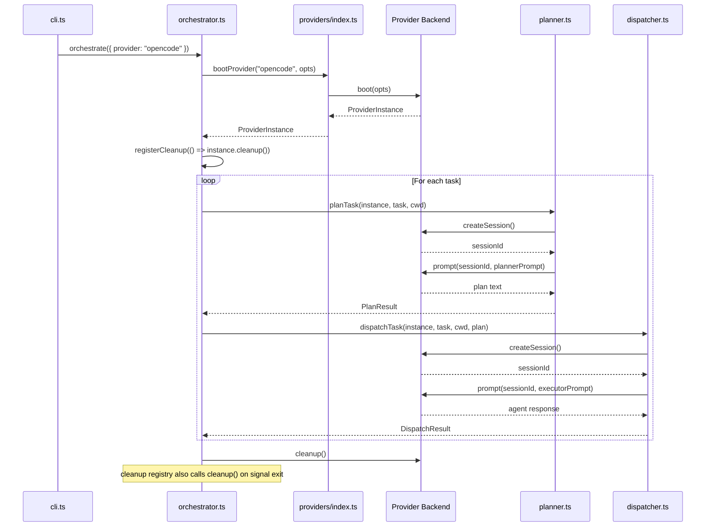
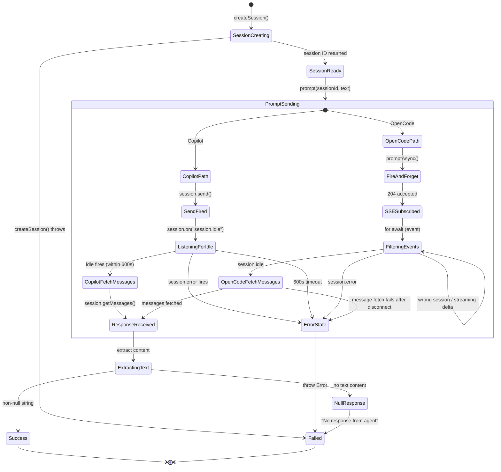
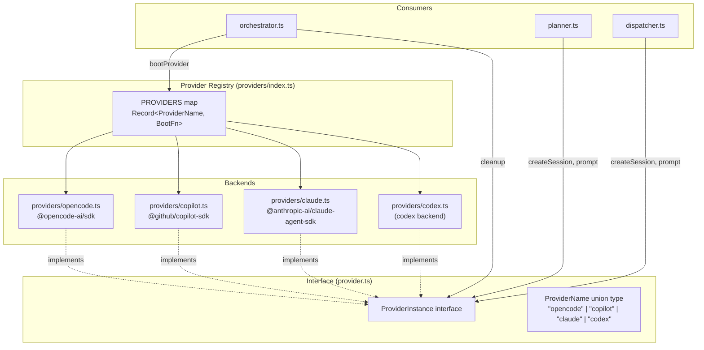

# Provider Abstraction Layer

The provider abstraction layer is the strategy pattern at the heart of dispatch
that decouples the orchestration pipeline from any specific AI agent runtime. It
allows the system to swap between OpenCode, GitHub Copilot, Claude, Codex, or
future backends through a single `ProviderInstance` interface without changing
the orchestrator, planner, or dispatcher code.

## Why this exists

dispatch orchestrates AI coding agents to complete [tasks parsed from
markdown files](../task-parsing/overview.md) (using the [checkbox syntax](../task-parsing/markdown-syntax.md)). Different teams use different agent runtimes -- some prefer
OpenCode, others use GitHub Copilot. Rather than hardcoding a single agent, the
provider layer lets users select their backend at the CLI level ([`--provider`](../cli-orchestration/cli.md)) or via [persistent configuration](../cli-orchestration/configuration.md)
while the rest of the pipeline remains agnostic.

## Key source files

| File | Role |
|------|------|
| `src/providers/interface.ts` | Defines the `ProviderInstance` interface and `ProviderName` union type |
| `src/providers/index.ts` | Provider registry -- maps names to boot functions |
| `src/providers/opencode.ts` | OpenCode backend implementation |
| `src/providers/copilot.ts` | GitHub Copilot backend implementation |
| `src/providers/claude.ts` | Claude backend implementation |
| `src/providers/codex.ts` | Codex backend implementation |
| `src/helpers/cleanup.ts` | Process-level cleanup registry for session leak prevention |

## The ProviderInstance interface

Every provider backend must implement the four-method lifecycle contract defined
in `src/providers/interface.ts:31-52`:

| Method | Purpose | Returns |
|--------|---------|---------|
| `createSession()` | Create an isolated session for a single task | `Promise<string>` (opaque session ID) |
| `prompt(sessionId, text)` | Send a prompt and wait for the agent response | `Promise<string \| null>` |
| `cleanup()` | Tear down server processes and release resources | `Promise<void>` |
| `name` (readonly) | Human-readable identifier for this provider | `string` |

### Lifecycle: boot, session, prompt, cleanup



### Prompt dispatch state machine

The following state machine shows the lifecycle of a single prompt dispatch
through the provider layer. Both Copilot and OpenCode use event-based
asynchronous patterns, though with different transport mechanisms:



## The provider registry

The registry in `src/providers/index.ts` uses a static `Record<ProviderName, BootFn>`
map that associates each provider name with its `boot()` function. It exports two
things the rest of the system consumes:

- **`PROVIDER_NAMES`** -- an array of all registered provider names, used by the
  CLI for `--provider` validation (`src/cli.ts:94`).
- **`bootProvider(name, opts)`** -- instantiates a provider by name; throws if the
  name is not in the registry.



## How the orchestrator selects a provider

Provider selection flows from the user through the CLI to the orchestrator:

1. The user passes `--provider copilot` (or omits it for the default `opencode`).
2. `src/cli.ts:91-98` validates the value against `PROVIDER_NAMES`. If the value
   is not recognized, the process exits with an error listing available providers.
3. The validated `ProviderName` is passed to `orchestrate()` in the options object
   (`src/orchestrator.ts:42`), which defaults to `"opencode"`.
4. The orchestrator calls `bootProvider(provider, { url: serverUrl, cwd })` at
   `src/orchestrator.ts:150`.

Users can override the default at the CLI level:

```sh
dispatch "tasks/**/*.md" --provider copilot
dispatch "tasks/**/*.md" --provider opencode --server-url http://localhost:4096
```

## Why ProviderName is a compile-time union

`ProviderName` is defined as `"opencode" | "copilot" | "claude" | "codex"` -- a
string literal union type rather than a runtime-discovered plugin set. This is a
deliberate design choice:

- **Type safety**: TypeScript can verify at compile time that only valid provider
  names flow through the CLI, orchestrator, and registry. Misspelled names are
  caught by `tsc`, not at runtime.
- **Simplicity**: The project has four providers. A plugin discovery system
  (dynamic `import()`, file scanning, or a plugin manifest) would add complexity
  without proportional benefit.
- **Explicitness**: All available providers are visible in a single union type and
  a single registry map, making the system easy to audit.

The tradeoff is that adding a new provider requires a code change and
recompilation. See the [adding a provider guide](./adding-a-provider.md) for the
complete checklist.

## Error recovery on boot failure

When `bootProvider()` fails (e.g., the backend executable is not found, the
server refuses to start, or a network connection fails), the error propagates
up through the orchestrator's `try/catch` block at `src/orchestrator.ts:171-173`.
The behavior is:

1. The TUI is stopped (`tui.stop()`).
2. The error is rethrown to the caller.
3. The CLI's top-level `.catch()` handler at `src/cli.ts:151-153` logs the error
   message and exits the process with code 1.

**There is no automatic retry.** If `bootProvider` fails, the entire dispatch run
aborts. This is intentional -- boot failures typically indicate a misconfiguration
(missing CLI tool, bad server URL, missing credentials) that would not resolve on
retry.

## Session isolation model

Each task gets its own session, created by the [planner](../planning-and-dispatch/planner.md) and the [dispatcher](../planning-and-dispatch/dispatcher.md)
independently (`src/planner.ts:38`, `src/dispatcher.ts:31`). These modules
receive the `ProviderInstance` as a parameter and create their own sessions --
they never share session IDs.

Session isolation guarantees:

- **Conversation isolation**: Each session has its own conversation history. The
  planner's exploration context does not bleed into the executor's context, and
  one task's session does not see another task's prompts.
- **Shared environment**: Sessions are *not* sandboxed at the OS level. All
  sessions within a provider share the same file system, working directory,
  environment variables, and network access. The isolation is at the
  agent-conversation level, not at the process or container level.

This model is appropriate for the dispatch use case, where tasks operate on the
same codebase but should not confuse the agent by mixing conversation contexts.

## Cleanup and resource management

### The cleanup registry

The process-level [cleanup registry](../shared-types/cleanup.md) (`src/helpers/cleanup.ts`) provides a safety net for
resource cleanup on abnormal exit. See also the [Logger](../shared-types/logger.md) for how cleanup events
are traced with `log.debug()`. It works as follows:

1. When the orchestrator boots a provider, it immediately registers the
   provider's `cleanup()` function with the registry:
   `registerCleanup(() => instance.cleanup())` (`src/agents/orchestrator.ts:151`).
2. On **normal completion**, the orchestrator calls `instance.cleanup()` directly
   on the success path.
3. On **signal exit** (SIGINT, SIGTERM, unhandled error), the CLI's signal
   handlers call `runCleanup()` from `src/helpers/cleanup.ts`, which drains the registry
   and invokes all registered cleanup functions.
4. After draining, the registry is cleared (`cleanups.splice(0)`), so repeated
   calls to `runCleanup()` are harmless.

This dual-path design (explicit cleanup + registry safety net) means provider
cleanup functions can be called twice: once explicitly by the orchestrator and
once by the signal handler. This is why idempotency matters.

### Session leak prevention

Without the cleanup registry, a SIGINT during task dispatch would kill the
process without stopping the spawned server (OpenCode) or the CLI child process
(Copilot). The registry ensures these external processes are terminated even on
abnormal exit.

The registry also handles the case where `bootProvider` succeeds but an error
occurs before the orchestrator reaches its explicit cleanup call. Since
registration happens immediately after boot, the safety net is active for the
entire dispatch run.

### Cleanup and in-flight sessions

**What happens if `cleanup()` is called while a prompt is in flight?**

- **Copilot provider** (`src/providers/copilot.ts:78-88`): Calls `destroy()` on
  all tracked sessions, then `client.stop()`. If a `send()` + event listener
  promise is pending on a session, destroying that session will cause the
  pending promise to reject (or resolve with no data, depending on the SDK's
  internal behavior). The `.catch(() => {})` on each destroy call swallows
  errors from sessions that may have already completed.
- **OpenCode provider** (`src/providers/opencode.ts:166-171`): Calls
  `stopServer?.()` (which invokes `oc.server.close()`). The underlying HTTP
  server shuts down, which will cause the SSE stream to disconnect and the
  subsequent message fetch to fail with a connection error.

In practice, `cleanup()` is only called after all task dispatches have completed
(`src/agents/orchestrator.ts:165`), so in-flight prompts during cleanup should
not occur under normal operation.

### Cleanup idempotency comparison

The two providers handle double-cleanup differently:

| Aspect | OpenCode | Copilot |
|--------|----------|---------|
| Idempotency guard | `cleaned` boolean flag (`src/providers/opencode.ts:35`) | None |
| Second call behavior | Returns immediately (no-op) | Re-iterates empty session map, calls `client.stop()` again |
| Safety of double-call | Guaranteed safe by guard | Safe in practice due to error swallowing (`.catch(() => {})`) |
| Resource at risk | Spawned HTTP server (`server.close()`) | CLI child process (`client.stop()`) |

The OpenCode provider's `cleaned` flag is a defensive pattern that prevents
calling `server.close()` on an already-closed server. The Copilot provider
achieves equivalent safety through error swallowing, though adding an explicit
guard would make the intent clearer.

Both approaches are safe for the current codebase. The difference is stylistic
rather than functional.

## Prompt model comparison

The two backends use event-based asynchronous prompt models with different
transport mechanisms:

| Aspect | OpenCode | Copilot |
|--------|----------|---------|
| Prompt method | `promptAsync()` + SSE events | `session.send()` + idle/error events |
| Execution model | Asynchronous (fire-and-forget + SSE stream) | Asynchronous (fire-and-forget + event listeners) |
| HTTP timeout risk | None (204 returns immediately) | None (send() returns immediately) |
| Progress visibility | Streaming deltas via SSE events | None until idle event fires |
| Failure detection | `session.error`, stream disconnect surfaced by the follow-up message fetch, and caller-level deadlines | `session.error` event, 600-second idle timeout, and caller-level deadlines |
| Prompt timeout / idle timeout | No provider-local timeout; caller-level deadlines still bound planning/spec attempts | 600 seconds via `withTimeout()` plus caller-level deadlines |
| Resource overhead | SSE connection + AbortController per prompt | Event listeners unsubscribed in `finally` block |

See [OpenCode async prompt model](./opencode-backend.md#asynchronous-prompt-model)
and [Copilot event-based model](./copilot-backend.md#event-based-prompt-model)
for implementation details.

## Prompt timeouts and cancellation

The `ProviderInstance` interface's `prompt()` signature returns
`Promise<string | null>` with no timeout parameter. However, individual
backends and calling pipelines layer resilience in different places:

- **Copilot provider** (`src/providers/copilot.ts:127`): Wraps the idle/error
  event listener in `withTimeout(promise, 600_000, "copilot session ready")`,
  imposing a **600-second (10-minute) hard timeout**. This value is hardcoded and
  not configurable via CLI flags. It is separate from the `--plan-timeout` flag,
  which controls the planner agent timeout at the orchestrator level. If the
  timeout fires, the promise rejects with a descriptive error message.
- **OpenCode provider** (`src/providers/opencode.ts:153`): Watches the SSE
  stream for `session.idle` and `session.error`, filters out events from other
  sessions, and always aborts the subscription in a `finally` block. Unexpected
  stream disconnects surface as prompt failures when the provider later tries to
  fetch session messages. The provider does **not** apply a hardcoded idle
  timeout for a silent but still-open stream.
- **Orchestrator-level deadlines**: The planning and spec pipelines own the
  overall wall-clock budget for one attempt. `--plan-timeout` bounds planner
  attempts, while `--spec-timeout` bounds each `specAgent.generate(...)`
  attempt before `--retries` logic runs.

This layering matters: provider-local guards catch transport-specific failures,
but pipeline-level deadlines are still the mechanism that turns a slow or stuck
attempt into a retryable, per-item failure.

## Response format differences

The two backends produce responses in different formats, which the provider
implementations normalize to `string | null`:

- **Copilot**: After the `session.idle` event fires, `session.getMessages()`
  retrieves the full conversation. The provider extracts the last event with
  `type === "assistant.message"` and returns `event.data?.content`
  (`src/providers/copilot.ts:138-142`), which is a plain string.
- **OpenCode**: The provider fetches session messages after `session.idle`, finds
  the last assistant message, filters its `parts` array for `TextPart` objects
  (those with `type: "text"`), and joins their `.text` fields with newlines
  (`src/providers/opencode.ts:154-157`). The multi-part design supports
  non-text parts (images, tool calls, structured output), but dispatch only uses
  the text content.

## Related documentation

- [OpenCode Backend](./opencode-backend.md) -- setup, configuration, and
  troubleshooting for the OpenCode provider
- [GitHub Copilot Backend](./copilot-backend.md) -- setup, authentication, and
  troubleshooting for the Copilot provider
- [Adding a New Provider](./adding-a-provider.md) -- step-by-step guide for
  implementing and registering a new backend
- [CLI & Orchestration](../cli-orchestration/overview.md) -- how the CLI parses arguments and
  drives the orchestrator
- [CLI Argument Parser](../cli-orchestration/cli.md) -- `--provider` flag
  documentation and argument validation
- [Planning & Dispatch Pipeline](../planning-and-dispatch/overview.md) -- how the planner
  and dispatcher consume `ProviderInstance`
- [Dispatcher](../planning-and-dispatch/dispatcher.md) -- How the dispatcher
  creates sessions and sends prompts via the provider interface
- [Shared Provider Types](../shared-types/provider.md) -- `ProviderName`,
  `ProviderBootOptions`, and `ProviderInstance` type definitions
- [Cleanup Registry](../shared-types/cleanup.md) -- Process-level cleanup
  registry that ensures provider sessions are terminated on exit
- [Logger](../shared-types/logger.md) -- Structured logging facade used for
  verbose debug tracing of provider boot, sessions, and cleanup
- [Spec Generation](../spec-generation/overview.md) -- How the spec pipeline
  boots and uses providers for AI-driven spec generation
- [Spec Generation Integrations](../spec-generation/integrations.md) -- Provider
  authentication, troubleshooting, and external server mode
- [Datasource System](../datasource-system/overview.md) -- The datasource
  abstraction that provides work items for provider-driven tasks
- [Markdown Syntax Reference](../task-parsing/markdown-syntax.md) -- Checkbox
  format and `(P)`/`(S)` mode prefixes that determine task execution order
- [Testing Overview](../testing/overview.md) -- Test suite framework and
  coverage including provider-related test patterns
- [Agent Framework](../agent-system/overview.md) -- The agent registry and
  boot lifecycle that consumes `ProviderInstance` via `AgentBootOptions`
- [Fix-Tests Pipeline](../cli-orchestration/fix-tests-pipeline.md) -- An
  alternative pipeline that boots providers for automated test repair
- [Provider Detection](../prereqs-and-safety/provider-detection.md) -- Binary
  detection used by the config wizard to show install status
- [Provider Tests](../testing/provider-tests.md) -- Detailed breakdown of
  provider unit tests for Claude, Copilot, OpenCode, and the registry
- [Prerequisites & Safety](../prereqs-and-safety/integrations.md) -- External
  CLI tool dependencies including provider binary checks
