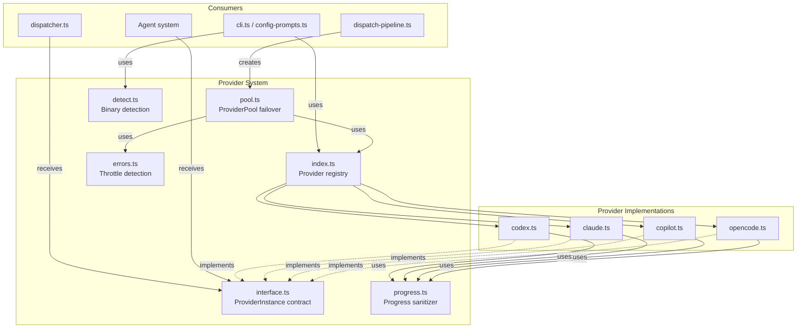

# Provider System

The provider system is the abstraction layer that decouples Dispatch's AI agent
orchestration from any specific AI coding assistant backend. It defines a uniform
`ProviderInstance` interface (session creation, prompting, cleanup), a registry
that maps provider names to boot functions, a binary-detection mechanism for CLI
availability checks, a failover pool that transparently routes requests across
multiple providers with cooldown-based throttle recovery, and shared utilities
for progress reporting and error classification.

## Why this exists

Dispatch orchestrates AI coding agents to complete
[tasks parsed from markdown files](../task-parsing/overview.md). Different teams
use different agent runtimes -- some prefer Claude, others use GitHub Copilot or
OpenCode. Rather than hardcoding a single agent, the provider layer lets users
select their backend at the CLI level
([`--provider`](../cli-orchestration/cli.md)) or via
[persistent configuration](../cli-orchestration/configuration.md) while the rest
of the pipeline remains agnostic.

The system also supports **failover pools** -- when a primary provider is
rate-limited, the pool transparently fails over to a fallback provider without
the calling agent knowing. This is critical for long-running dispatch runs that
process many issues in parallel.

## Architecture

The provider system has six modules, each with a distinct responsibility:

| Module | Role |
|--------|------|
| `src/providers/interface.ts` | Defines `ProviderInstance`, `ProviderName`, boot options, and progress types |
| `src/providers/index.ts` | Provider registry -- maps names to boot and listModels functions |
| `src/providers/pool.ts` | `ProviderPool` -- transparent failover wrapper with lazy boot, cooldowns, and session remapping |
| `src/providers/errors.ts` | Heuristic throttle/rate-limit error classification |
| `src/providers/detect.ts` | CLI binary availability detection via `child_process.execFile` |
| `src/providers/progress.ts` | ANSI-sanitized progress reporting with deduplication |

## The ProviderInstance interface

Every provider backend must implement the lifecycle contract defined in
`src/providers/interface.ts:50-88`:

| Member | Type | Contract |
|--------|------|----------|
| `name` | `readonly string` | Human-readable identifier (e.g., `"opencode"`, `"copilot"`) |
| `model` | `readonly string?` | Full model identifier in `provider/model` format, if available |
| `createSession()` | `() => Promise<string>` | Create an isolated session for a single task; return an opaque session ID |
| `prompt(sessionId, text, options?)` | See signature | Send a prompt, wait for the response; return text or `null` |
| `send?(sessionId, text)` | `(string, string) => Promise<void>` | Optional: inject a follow-up message without waiting for a response |
| `cleanup()` | `() => Promise<void>` | Release all resources; safe to call multiple times |

### The `send()` method

The optional `send()` method enables mid-session messaging without blocking for
a response. It is used by the spec agent to send time-warning nudges to the AI
during long-running spec generation. Providers that support non-blocking
follow-up messages implement this method; those that do not (like Codex, whose
`agent.run()` is blocking and non-interruptible) omit it.

### Boot options

From `src/providers/interface.ts:23-36`:

| Option | Type | Purpose |
|--------|------|---------|
| `url` | `string?` | Connect to an already-running server instead of spawning one |
| `cwd` | `string?` | Working directory for the agent |
| `model` | `string?` | Model override in provider-specific format |

Model format is provider-specific:
- **Copilot**: bare model ID (e.g., `"claude-sonnet-4-5"`)
- **OpenCode**: `"provider/model"` format (e.g., `"anthropic/claude-sonnet-4"`)

## The provider registry

The registry in `src/providers/index.ts` uses two static
`Record<ProviderName, Fn>` maps:

- **`PROVIDERS`** -- maps provider names to `boot()` functions
- **`LIST_MODELS`** -- maps provider names to `listModels()` functions

It exports:

- **`PROVIDER_NAMES`** -- the canonical array of all registered provider names,
  used by the CLI for `--provider` validation and by MCP tool schemas for Zod
  input validation.
- **`bootProvider(name, opts)`** -- instantiates a provider by name; throws if
  the name is not registered.
- **`listProviderModels(name, opts)`** -- starts a temporary provider, fetches
  available models, and tears down. Used by the interactive config wizard to
  populate the model selection menu.
- **`checkProviderInstalled(name)`** and **`PROVIDER_BINARIES`** -- re-exported
  from `detect.ts` for binary availability checks.

### How to add a new provider

See the [Adding a New Provider](./adding-a-provider.md) guide for the complete
three-step process: implement the interface, add to the `ProviderName` union,
and register in the provider map.

## Provider pool and failover

The `ProviderPool` class in `src/providers/pool.ts` implements the
`ProviderInstance` interface, wrapping multiple providers with transparent
failover. Agents receive a pool and interact with it exactly like a single
provider -- they never know about the pool or failover mechanics.

For full details on pool construction, failover order, cooldown timers, session
remapping, and the interaction with error classification, see the
[Pool and Failover](./pool-and-failover.md) documentation.

## Error classification

The `isThrottleError()` function in `src/providers/errors.ts` uses heuristic
pattern matching to detect rate-limit and throttle errors across all four
provider SDKs. This classification drives the pool's failover decision.

For the complete pattern list, false positive/negative analysis, and interaction
with the `withRetry` safety net, see the
[Error Classification](./error-classification.md) documentation.

## Binary detection

The `checkProviderInstalled()` function in `src/providers/detect.ts` verifies
whether a provider's CLI binary is available on PATH by running it with
`--version`. This is used by the interactive config wizard to show installation
status indicators.

For timeout behavior, platform considerations, and CI implications, see the
[Binary Detection](./binary-detection.md) documentation.

## Progress reporting

The `createProgressReporter()` function in `src/providers/progress.ts` provides
ANSI-sanitized, deduplicated progress snapshots that provider implementations
use to relay streaming output to the TUI.

For the sanitization pipeline, deduplication logic, and the problem it solves,
see the [Progress Reporting](./progress-reporting.md) documentation.

## Session isolation model

Each task gets its own session, created by the agent (planner, executor, spec,
commit) independently. These agents receive the `ProviderInstance` (or
`ProviderPool`) as a parameter and create their own sessions -- they never share
session IDs.

Session isolation guarantees:

- **Conversation isolation**: Each session has its own conversation history. One
  task's session does not see another task's prompts.
- **Context freshness**: Fresh sessions prevent "context rot" where accumulated
  conversation history degrades agent performance.
- **Shared environment**: Sessions are *not* sandboxed at the OS level. All
  sessions within a provider share the same file system, working directory, and
  network access. The isolation is at the agent-conversation level.

### Why fresh sessions, not session reuse

The `dispatcher.ts` header comment (line 2-3) explains the rationale: "creates a
fresh session per task to keep contexts isolated and avoid context rot." This
design means each task starts with a clean conversation, preventing earlier tasks
from polluting the context of later ones.

### Why failover creates a new session instead of replaying the conversation

When the pool fails over from a throttled provider to a fallback
(`src/providers/pool.ts:150-155`), it creates a **fresh session** on the fallback
rather than replaying the prior conversation. This works because:

1. Agents are stateless with respect to provider sessions -- each agent call
   builds a self-contained prompt with all necessary context (task description,
   environment info, plan if available).
2. The prompt sent to the fallback is the same prompt that was sent to the
   throttled provider, so no context is lost.
3. Replaying would require storing and retransmitting prior messages, adding
   complexity for minimal benefit in a system designed around single-prompt
   sessions.

## Provider credential management

Credentials are managed differently by each provider SDK:

| Provider | Credential mechanism |
|----------|---------------------|
| **OpenCode** | SDK-managed; reads from its own config layer (providers with `source: "env" | "config" | "custom"`) |
| **Copilot** | Environment variables: `COPILOT_GITHUB_TOKEN`, `GH_TOKEN`, or `GITHUB_TOKEN` (in that precedence order), or logged-in Copilot CLI user |
| **Claude** | SDK reads `ANTHROPIC_API_KEY` from the environment |
| **Codex** | SDK reads `OPENAI_API_KEY` from the environment |

No centralized credential rotation mechanism exists in Dispatch itself.
Credential lifecycle is owned by each provider's SDK.

## Cleanup and resource management

### The cleanup registry

The process-level [cleanup registry](../shared-types/cleanup.md)
(`src/helpers/cleanup.ts`) provides a safety net for resource cleanup on
abnormal exit:

1. When the pipeline boots a provider (or pool), it registers the provider's
   `cleanup()` function with the registry.
2. On **normal completion**, the pipeline calls `cleanup()` directly.
3. On **signal exit** (SIGINT, SIGTERM), the CLI's signal handlers call
   `runCleanup()`, which drains the registry.

The pool's `cleanup()` method (`src/providers/pool.ts:167-173`) calls
`cleanup()` on all booted provider instances via `Promise.allSettled()`, ensuring
one failing cleanup does not block others. It then clears all internal state
(instances, session owners, cooldowns).

## Configuration resolution

Provider and model selection flows through a three-tier resolution system:

1. **Per-agent overrides**: `config.agents.<role>.provider` and
   `config.agents.<role>.model`
2. **Fast tier** (planner and commit agents only): `config.fastProvider` and
   `config.fastModel`
3. **Top-level defaults**: `config.provider` and `config.model`

The `resolveAgentProviderConfig()` function in `src/config.ts:264-280` resolves
the effective provider and model for each agent role using this priority chain.
The dispatch pipeline then deduplicates provider+model combos and constructs
a `ProviderPool` for each agent with its configured provider as primary and all
other configured providers as fallbacks
(`src/orchestrator/dispatch-pipeline.ts:130-162`).

For full details on configuration, see the
[Configuration](../cli-orchestration/configuration.md) documentation.

## Related documentation

- [Pool and Failover](./pool-and-failover.md) -- failover mechanics, cooldown
  timers, session remapping, and the provider state machine
- [Error Classification](./error-classification.md) -- throttle error detection
  heuristics and interaction with retry layers
- [Binary Detection](./binary-detection.md) -- CLI binary availability checking
  and platform-specific behavior
- [Progress Reporting](./progress-reporting.md) -- ANSI sanitization and
  deduplicated progress snapshots
- [Integrations](./integrations.md) -- external SDK dependencies, authentication,
  lazy loading, test mocks, and the internal logger
- [Adding a New Provider](./adding-a-provider.md) -- step-by-step guide for
  implementing and registering a new backend
- [OpenCode Backend](./opencode-backend.md) -- OpenCode provider implementation
- [Copilot Backend](./copilot-backend.md) -- Copilot provider implementation
- [CLI & Configuration](../cli-orchestration/configuration.md) -- provider
  selection and per-agent overrides
- [Agent System](../agent-system/overview.md) -- agents that consume
  `ProviderInstance` via `AgentBootOptions`
- [Dispatch Pipeline](../cli-orchestration/dispatch-pipeline.md) -- how the
  pipeline constructs pools and routes agents to providers
- [Core Helpers](../shared-utilities/overview.md) -- logger, retry, and timeout
  utilities used by the provider system
- [Provider Tests](../testing/provider-tests.md) -- detailed breakdown of all
  provider unit tests covering pool, failover, and backend behavior
