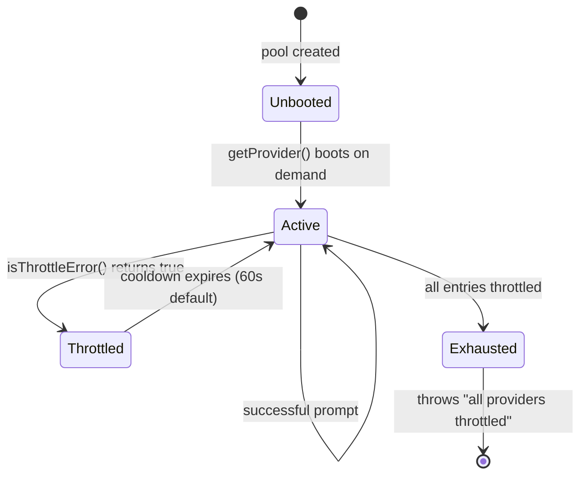
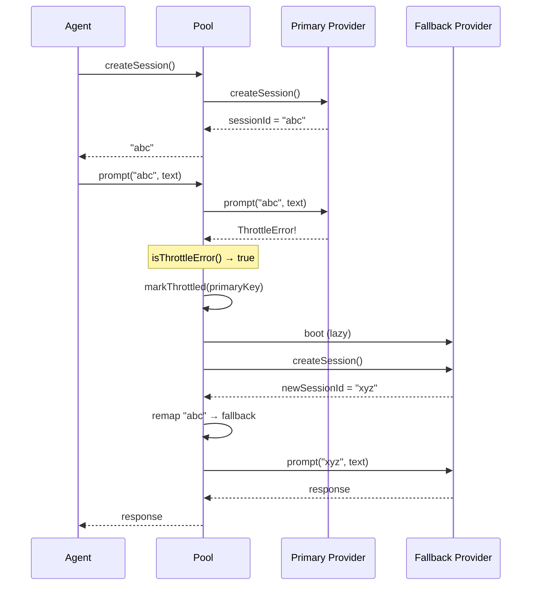

# Provider Pool and Failover

The `ProviderPool` class (`src/providers/pool.ts`) is a transparent failover
wrapper that implements `ProviderInstance`. Agents receive a pool instead of a
raw provider instance, and the pool routes requests to the best available
provider, automatically failing over to alternatives when throttling is detected.

## Why this exists

Long-running Dispatch operations (dispatching dozens of issues in parallel) are
susceptible to provider rate limits. Without failover, a rate-limited provider
would fail the entire dispatch run. The pool solves this by maintaining multiple
provider backends in priority order and transparently switching when one is
throttled.

## How the pool decides failover order

Pool entries are sorted by a numeric `priority` field (lower = preferred).
The pool itself does not read configuration -- it receives pre-sorted entries
from the dispatch pipeline.

The dispatch pipeline constructs the pool at
`src/orchestrator/dispatch-pipeline.ts:130-162`:

1. `resolveAgentProviderConfig()` resolves the effective provider+model for each
   agent role (planner, executor, commit) using the three-tier priority
   chain documented in the [overview](./overview.md#configuration-resolution).
2. All unique provider+model combinations are collected into an `allEntries`
   array, assigned incrementing priority values.
3. For each agent, `createPool()` builds a pool with that agent's configured
   provider as priority 0 (primary) and all other configured providers as
   fallbacks with incrementing priority.

**Can a user configure failover order?** Indirectly. The user configures
providers via `provider`, `fastProvider`, and `agents.<role>.provider` in
`.dispatch/config.json`. The pipeline deduplicates these and assigns priorities
in the order they appear. The user does not directly specify priorities, but the
configuration structure determines the order.

## Pool creation strategies

The dispatch pipeline uses two strategies depending on execution mode:

- **Shared pools** (non-worktree mode): Three pools are created once
  (executor, planner, commit) and shared across all issues. They are
  registered for cleanup via `registerCleanup()`.
- **Per-worktree pools** (worktree mode): Three pools are created per-worktree
  inside `processIssueFile()`, each with `bootCwd` set to the worktree path.
  Each pool gets its own cleanup registration.

## Pool construction

```ts
const pool = new ProviderPool({
  entries: [
    { provider: "claude", model: "claude-sonnet-4", priority: 0 },
    { provider: "copilot", model: "claude-haiku-4", priority: 1 },
  ],
  bootOpts: { url: serverUrl, cwd: workingDir },
  cooldownMs: 60_000,  // optional, default 60s
});
```

### Constructor behavior

- **Validation**: Throws if `entries` is empty.
- **Sorting**: Entries are sorted by `priority` (stable sort preserves insertion
  order for equal priorities).
- **Identity**: The pool's `name` and `model` properties reflect the primary
  (highest-priority) entry.
- **Cooldown**: Defaults to 60,000 ms (60 seconds). Configurable via
  `ProviderPoolOptions.cooldownMs` but not exposed to end-user configuration.

## Provider state machine

Each provider in the pool transitions through these states:



### State descriptions

| State | Description |
|-------|-------------|
| **Unbooted** | Entry is registered but the provider has not been instantiated. Only the primary provider is booted eagerly; fallbacks remain unbooted until first failover. |
| **Active** | Provider is booted and available for prompts. Not in cooldown. |
| **Throttled** | Provider received a throttle error. Skipped for `cooldownMs` milliseconds. |
| **Exhausted** | All entries are throttled simultaneously. The pool throws a hard error. |

## Lazy boot

Only the primary provider is booted when the pool first receives a request.
Fallback providers are booted on-demand during failover
(`src/providers/pool.ts:98-105`). This avoids wasting resources on providers
that may never be needed.

Boot is performed by calling `bootProvider()` from the registry
(`src/providers/index.ts`), which delegates to the provider-specific `boot()`
function.

## Throttle detection

Two independent layers detect throttling at different points in the pipeline.

### Layer 1 -- HTTP-level (`src/providers/errors.ts`)

The `isThrottleError()` function (`src/providers/errors.ts:19-22`) uses
heuristic pattern matching on error message text. Provider SDKs do not expose
structured error codes, so string matching is the only reliable approach.

The regex matches the following patterns (case-insensitive):

| Pattern | What it catches |
|---------|-----------------|
| `rate.limit` | "rate limit", "rate-limit", "rate_limit" |
| `429` | HTTP 429 Too Many Requests status code |
| `503` | HTTP 503 Service Unavailable status code |
| `throttl` | "throttle", "throttled", "throttling" |
| `capacity` | "capacity", "over capacity" |
| `overloaded` | "overloaded", "server overloaded" |
| `too many requests` | Literal "too many requests" text |
| `service unavailable` | Literal "service unavailable" text |

This function is called by `ProviderPool.prompt()` in its catch block to decide
whether the error warrants failover to a different provider.

#### Error tolerance design

The classification is intentionally biased toward false positives:

- **False positive** (non-throttle error classified as throttle): Causes an
  unnecessary failover. The cost is one extra session creation and retry --
  not data loss. The task still succeeds if the fallback provider works.
- **False negative** (throttle error not classified): The existing
  `withRetry` logic (3 retries on any error) handles it. The task may take
  longer but is not lost.

This design means the pool errs on the side of trying a fallback provider
rather than immediately failing the task.

### Layer 2 -- Response-text-level (`src/dispatcher.ts`)

Four regex patterns match rate limit signals embedded in the response text of
successful HTTP responses (not error messages):

1. `you've hit your (rate )?limit`
2. `rate limit exceeded`
3. `too many requests`
4. `quota exceeded`

These are checked by `dispatchTask()` after receiving a non-null response.

**The distinction matters:** Layer 1 triggers pool-level failover (switches to a
new provider instance). Layer 2 triggers task-level failure (returns
`{ success: false }` with a rate limit error message). They detect different
signals -- HTTP errors vs. textual rate limit messages in otherwise successful
HTTP responses.

## Cooldown mechanism

When a throttle error is detected, the pool marks that provider's entry with a
cooldown timestamp (`src/providers/pool.ts:114-117`):

```
cooldowns.set(key, Date.now() + cooldownMs)
```

Subsequent `getProvider()` calls skip entries whose cooldown has not expired
(`src/providers/pool.ts:94-95`).

### Is the 60-second default appropriate?

The 60-second default is a reasonable middle ground:

- **Anthropic API**: Rate limits typically use per-minute windows. A 60-second
  cooldown aligns with this.
- **OpenAI API**: Uses per-minute and per-day rate limits. 60 seconds is
  appropriate for per-minute limits.
- **GitHub Copilot**: Rate-limit windows are not publicly documented but
  60 seconds is a conservative backoff.
- **Provider-specific tuning**: The `cooldownMs` is configurable per-pool via
  `ProviderPoolOptions`, but this option is not exposed through end-user
  configuration (CLI flags or config file). To change it, you would need to
  modify the pool construction code in the dispatch pipeline.

## Session tracking and remapping

The pool maintains a `sessionOwner` map (`Map<string, { instance, key }>`) that
tracks which provider instance owns each session ID. This ensures `prompt()` and
`send()` calls route to the correct provider.

### Session remapping during failover

When a throttle error triggers failover (`src/providers/pool.ts:148-155`):

1. The pool gets the next available provider (excluding the throttled one).
2. A **new session** is created on the fallback provider.
3. The original session ID is remapped to point to the fallback provider.
4. The prompt is retried on the fallback's **new** session ID.



### Session ID mismatch after failover

After failover, the pool remaps the original session ID (`"abc"` in the diagram)
to point to the fallback provider. However, the fallback received a *different*
internal session ID (`"xyz"`). Subsequent `send()` calls use the original session
ID (`"abc"`) to look up the owner (the fallback), but pass `"abc"` to the
fallback's `send()` method -- which internally knows session `"xyz"`, not `"abc"`.

In practice, this is not a problem because:

1. `send()` is only used for time-warning nudges during spec generation, which
   are best-effort. If the `send()` silently fails due to a mismatched session
   ID, the agent continues without the nudge.
2. After failover, `prompt()` is called with the *new* session ID directly
   (`src/providers/pool.ts:155`), so the primary prompt path works correctly.
3. Most dispatch operations are single-prompt-per-session, so `send()` is rarely
   called after the initial prompt.

## What is NOT retried via failover

- **Non-throttle errors**: Authentication failures, invalid prompts, session
  errors, and other non-throttle errors propagate immediately without
  failover.
- **`createSession()` failures**: Only `prompt()` has failover logic. If
  session creation fails, the error propagates to the caller.
- **`send()` failures**: Follow-up messages do not trigger failover. If the
  owning provider does not support `send()`, the call is silently skipped
  (`src/providers/pool.ts:162-164`).

## What happens when all providers are throttled

When no provider passes the cooldown check, `getProvider()` throws:

```
"ProviderPool: all providers are throttled or unavailable"
```

This error is **not** automatically retried at the pool level. Whether it is
retried depends on the calling pipeline:

- The dispatch pipeline wraps agent calls in `withRetry()` from
  `src/helpers/retry.ts`, which retries up to 3 times on any error (including
  "all providers throttled"). However, if all providers remain throttled, the
  retries will also fail.
- The `isThrottleError()` heuristic does not match "all providers are throttled"
  (it matches terms like "429", "rate.limit", "throttl" but the pool's error
  message does not contain these patterns), so this error would not trigger
  another pool-level failover -- it propagates as a regular error.

## The `send()` method

The pool's `send()` implementation (`src/providers/pool.ts:159-165`) is
defensive:

- If the session ID is not found, it silently returns (no error).
- If the owning provider does not implement `send()`, it silently returns.
- Otherwise, it delegates to the provider's `send()` method.

This matches the optional nature of `send()` in the `ProviderInstance` interface.

## Cleanup

The pool's `cleanup()` method (`src/providers/pool.ts:167-173`):

1. Calls `cleanup()` on all booted provider instances via
   `Promise.allSettled()`, ensuring one failing cleanup does not block others.
2. Clears all internal maps: `instances`, `sessionOwner`, `cooldowns`.

This makes cleanup idempotent -- calling it twice has no effect after the first
call clears the maps.

## Single-entry pool behavior

When the pool has only one entry, it behaves identically to a bare
`ProviderInstance` with zero overhead. The failover path is skipped because
`this.entries.length <= 1` causes throttle errors to propagate normally rather
than attempting failover (`src/providers/pool.ts:140`).

## Observability

Failover events are logged at `log.debug()` level:

- `"Pool: throttle detected on {key}, failing over..."` -- when a throttle
  error triggers failover (`src/providers/pool.ts:144`)
- `"Pool: marked {key} as throttled for {cooldownMs}ms"` -- when a provider
  enters cooldown (`src/providers/pool.ts:116`)
- `"Pool: booting {provider} ({model})"` -- when a fallback provider is
  lazily booted (`src/providers/pool.ts:99`)

There is no structured telemetry, metric emission, or event bus for failover
events. To observe failover behavior, enable verbose logging:

```sh
dispatch "tasks/**/*.md" --verbose
```

### What is not observable

- **Which provider is currently active**: There is no API or log message that
  reports which provider is handling a given session after failover. The
  `sessionOwner` map is internal to the pool.
- **Cooldown status**: There is no way to query which providers are currently
  in cooldown or when they will become available again.
- **Failover count**: There is no counter for how many times failover has
  occurred during a run.

## Edge cases

### Session history loss after failover

When failover occurs, the pool creates a new session on the fallback provider
and remaps the original session ID. However, the new session has no
conversation history from the failed provider -- it starts fresh. This means
the retried prompt may produce different results than the original attempt
because it lacks the prior context.

### Cooldown expiry during a prompt

If a provider's cooldown expires while another prompt is being attempted on a
fallback, the next `createSession()` call will route back to the original
provider (now un-throttled). This is correct behavior -- the cooldown mechanism
is per-request, not sticky.

## Cross-group dependencies

- **provider-system** (`errors.ts`): Pool uses `isThrottleError()` for failover
  decisions. See [Error Classification](./error-classification.md).
- **provider-system** (`index.ts`): Pool uses `bootProvider()` for lazy provider
  instantiation.
- **helpers-core** (`helpers/logger.ts`): Pool logs boot, throttle, and failover
  events at debug level.
- **orchestrator** (`orchestrator/dispatch-pipeline.ts:130-162`): Constructs pool
  entries from resolved agent configurations.
- **cli-and-configuration** (`config.ts:264-280`): Resolves per-agent provider
  and model settings that feed into pool construction.

## Related documentation

- [Provider System Overview](./overview.md) -- architecture and interface
  contract
- [Error Classification](./error-classification.md) -- how throttle errors are
  detected
- [Core Helpers](../shared-utilities/overview.md) -- retry and timeout utilities
- [Dispatch Pipeline](../cli-orchestration/dispatch-pipeline.md) -- how the
  pipeline constructs and uses pools
- [Configuration](../cli-orchestration/configuration.md) -- per-agent provider
  and model configuration
