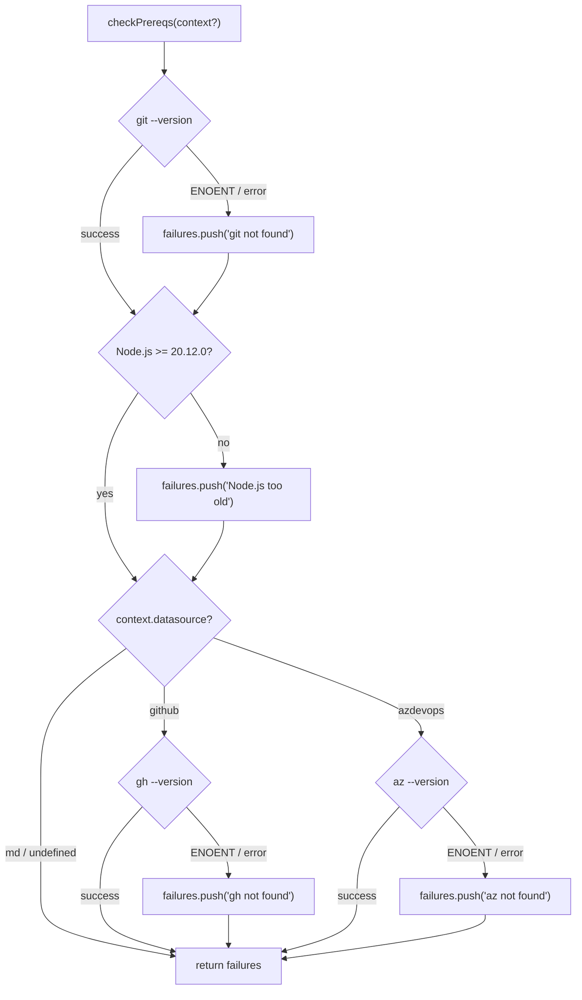

# Prerequisite Checker

The `checkPrereqs` function in
[`src/helpers/prereqs.ts`](../../src/helpers/prereqs.ts) verifies that
required external tools and runtime versions are available before any
pipeline logic runs.

## What it does

`checkPrereqs` performs a series of environment checks and returns an array
of human-readable failure message strings. An empty array means all checks
passed.

The checks are:

1. **git** -- Runs `git --version` to confirm git is on PATH. Always checked.
2. **Node.js version** -- Compares `process.versions.node` against
   `MIN_NODE_VERSION` (`20.12.0`) using semver comparison. Always checked.
3. **gh (GitHub CLI)** -- Runs `gh --version`. Only checked when
   `context.datasource` is `"github"`.
4. **az (Azure CLI)** -- Runs `az --version`. Only checked when
   `context.datasource` is `"azdevops"`.



## Why it exists

Dispatch depends on external CLI tools at runtime (`git`, `gh`, `az`). The
previous architecture had no pre-flight checks -- failures would surface as
cryptic `ENOENT` errors from `execFile` deep in the pipeline. The prereq
checker moves these failures to startup, providing clear diagnostic messages
with installation URLs before any work begins.

This addresses the gap documented in the
[architecture overview](../architecture.md#external-tool-dependencies), where
the "Failure mode" column previously showed raw error types for missing tools.

## Function signature

```
checkPrereqs(context?: PrereqContext): Promise<string[]>
```

### PrereqContext interface

```
interface PrereqContext {
    datasource?: DatasourceName;  // "github" | "azdevops" | "md"
}
```

The context parameter controls which conditional checks run. When omitted,
only git and Node.js version are verified.

## Node.js version check

The minimum version `MIN_NODE_VERSION` is `"20.12.0"`, which exactly matches
the `engines` field in
[`package.json`](../../package.json) (`"node": ">=20.12.0"`). The
version comparison uses a custom `semverGte` function that parses
major.minor.patch components and compares numerically.

Node.js 20.12.0 was chosen because it is the first LTS release with stable
ESM module support and the features the codebase depends on.

## What is NOT checked

The prereq checker has intentional limitations:

-   **Authentication status is not verified.** The `gh --version` and
    `az --version` checks confirm the CLI tools are installed, but do not
    check whether the user is authenticated (`gh auth status`,
    `az account show`). An unauthenticated user will pass prereqs but fail
    later during datasource operations.

-   **Extension availability is not checked.** The Azure DevOps datasource
    requires the `azure-devops` extension for `az`. The prereq checker does
    not verify this extension is installed.

-   **OpenCode and Copilot runtimes are not checked.** Provider availability
    is validated during the `bootProvider()` step, not during prereqs.

-   **Tool version requirements are not enforced.** The checks verify
    presence via `--version` but do not parse or validate the returned
    version numbers for `git`, `gh`, or `az`.

## How failures are consumed

The caller (orchestrator runner) receives the string array, displays each
message to the user via the logger, and exits with a non-zero code if the
array is non-empty. The checker itself does not log or exit -- it is a pure
diagnostic function that returns data for the caller to act on.

Each failure message includes:
- The tool name
- A description of the problem
- An installation URL for the missing tool

## Integration with Node.js child_process

The function uses `execFile` from `node:child_process` (promisified via
`node:util`) to spawn CLI tools. `execFile` is preferred over `exec` because
it does not invoke a shell, avoiding shell injection risks and
platform-specific shell behavior. Errors from missing tools surface as
`ENOENT` errors caught by the try/catch blocks.

## Test coverage

The test file
[`src/tests/prereqs.test.ts`](../../src/tests/prereqs.test.ts) contains
11 tests in a single `describe` block:

| Scenario | Tests | What is verified |
|----------|-------|------------------|
| All prerequisites pass | 1 | Empty array, git called |
| Git not found | 1 | Failure message matches |
| Node.js too old | 1 | Failure includes version numbers |
| Multiple failures | 1 | Git + Node.js both reported |
| gh not found (github datasource) | 1 | gh-specific failure |
| az not found (azdevops datasource) | 1 | az-specific failure |
| md datasource skips gh/az | 1 | No gh/az calls made |
| No context skips gh/az | 1 | No gh/az calls made |
| Cascading failures (git + Node + gh) | 1 | All three reported in order |
| gh available (github datasource) | 1 | Empty array, gh called |
| az available (azdevops datasource) | 1 | Empty array, az called |

The tests mock `node:child_process` and `node:util` using `vi.hoisted()` and
`vi.mock()`. The `process.versions.node` property is temporarily overridden
via `Object.defineProperty` to test Node.js version checking, and restored
in `afterEach`. See
[Shared Helpers Tests](../testing/shared-helpers-tests.md) for the mocking
pattern details.

## Source reference

-   [`src/helpers/prereqs.ts`](../../src/helpers/prereqs.ts) -- 98 lines

## Related documentation

-   [Shared Helpers Tests](../testing/shared-helpers-tests.md) -- Test suite
    covering this module
-   [Architecture](../architecture.md) -- External tool dependencies and
    runtime requirements
-   [Datasource System](../datasource-system/overview.md) -- Datasources
    whose CLI tools are validated by prereqs
-   [Datasource Integrations](../datasource-system/integrations.md) --
    `execFile` usage patterns in datasource implementations
-   [CLI & Orchestration](../cli-orchestration/overview.md) -- Where
    prereqs are invoked during startup
-   [Testing Overview](../testing/overview.md) -- Project-wide test framework
