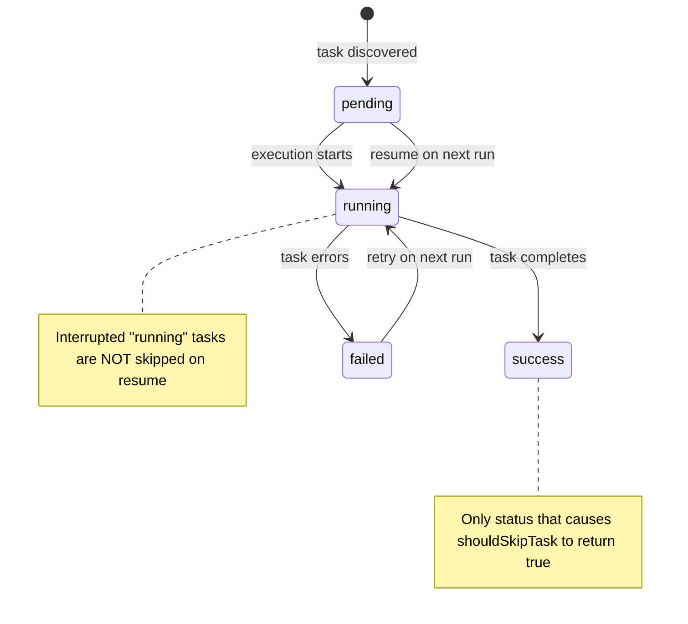

# Run State

The run-state module in
[`src/helpers/run-state.ts`](../../src/helpers/run-state.ts) provides
persistence for dispatch pipeline execution state, enabling resumable runs
after interruption or failure.

## What it does

The module manages a JSON file (`.dispatch/run-state.json`) that tracks the
status of each task across a dispatch run. It provides four functions:

| Function | Purpose |
|----------|---------|
| `loadRunState(cwd)` | Read and parse the state file; returns `null` if missing or malformed |
| `saveRunState(cwd, state)` | Write state to disk atomically |
| `buildTaskId(task)` | Generate a stable identifier for a task (`basename:line`) |
| `shouldSkipTask(taskId, state)` | Check if a task should be skipped (only skips `"success"` status) |

## RunState interface

```
interface RunState {
    runId: string;         // ISO timestamp identifying the run
    preRunSha: string;     // Git commit SHA before the run started
    tasks: RunStateTask[];
}

interface RunStateTask {
    id: string;            // Format: "filename.md:lineNumber"
    status: "pending" | "running" | "success" | "failed";
    branch?: string;       // Git branch associated with the task
}
```

### Task lifecycle state machine



The state machine is intentionally conservative: only `"success"` tasks are
skipped on resume. A task left in `"running"` status (from a crash or
`SIGKILL`) is **not** skipped because it may be incomplete. This ensures
partially-executed tasks are re-attempted rather than silently skipped.

## File location and storage

The state file is stored at `.dispatch/run-state.json` relative to the
project's working directory. The `.dispatch/` directory is created
automatically with `mkdir({ recursive: true })` if it does not exist.

This file **should be gitignored**. It contains transient execution state
specific to a local machine and run. Add `.dispatch/run-state.json` to your
`.gitignore` if the `.dispatch/` directory is not already excluded.

### Relationship to other .dispatch files

| Path | Purpose | Managed by |
|------|---------|------------|
| `.dispatch/specs/` | Generated spec files | Datasource layer |
| `.dispatch/specs/archive/` | Closed specs | Markdown datasource |
| `.dispatch/tmp/` | Temporary spec files during generation | Spec pipeline |
| `.dispatch/run-state.json` | Execution state for resumable runs | This module |

## Atomic write pattern

The `saveRunState` function uses a write-then-rename pattern to prevent
corruption if the process crashes mid-write:

1. `mkdir(.dispatch/, { recursive: true })` -- ensure directory exists
2. `writeFile(run-state.json.tmp, data)` -- write to a temporary file
3. `rename(run-state.json.tmp, run-state.json)` -- atomically replace the target

On POSIX systems, `rename()` is an atomic operation at the filesystem level.
If the process is killed between steps 2 and 3, the old state file remains
intact. If killed during step 2, neither file is corrupted -- the `.tmp`
file is simply incomplete and will be overwritten on the next save.

This pattern is standard for crash-safe file updates. It relies on
`node:fs/promises` `writeFile`, `rename`, and `mkdir`.

## Task identification

`buildTaskId(task)` generates a stable identifier from the task's file path
and line number:

```
buildTaskId({ file: "/some/path/to/123-feature.md", line: 42 })
// => "123-feature.md:42"
```

The function uses `basename()` to strip directory components, making IDs
portable across different working directory paths. The `file:line` format
is stable as long as the markdown file structure does not change between
runs.

### Limitations

-   If tasks are added or removed from a markdown file between runs,
    line numbers shift and previously-saved task IDs no longer match.
    The `shouldSkipTask` lookup will return `false` for unmatched IDs,
    so shifted tasks will re-execute rather than being incorrectly skipped.

-   If a file is renamed between runs, all task IDs for that file become
    stale and those tasks will re-execute.

## preRunSha -- stale state detection

The `preRunSha` field stores the Git commit SHA at the start of the run.
Callers can compare this against the current `HEAD` to detect whether the
codebase has changed since the last run. If the SHA differs, the saved state
may be stale and should be discarded rather than used for skip decisions.

The run-state module itself does not perform this comparison -- it is the
caller's responsibility to check `preRunSha` and decide whether to honor
the saved state.

## shouldSkipTask logic

```
shouldSkipTask(taskId, state) → boolean
```

| state | Task found? | Task status | Result |
|-------|-------------|-------------|--------|
| `null` | -- | -- | `false` |
| valid | no | -- | `false` |
| valid | yes | `"success"` | `true` |
| valid | yes | `"failed"` | `false` |
| valid | yes | `"pending"` | `false` |
| valid | yes | `"running"` | `false` |

The function performs a linear scan (`Array.find`) of the tasks array. For
typical run sizes (tens to hundreds of tasks), this is negligible. Only
`"success"` triggers a skip. This is a deliberate safety choice:

-   `"failed"` tasks should be retried.
-   `"pending"` tasks have not been attempted.
-   `"running"` tasks were interrupted and may be incomplete.

## loadRunState error handling

`loadRunState` returns `null` for any failure:

-   File does not exist (`ENOENT`)
-   File contains malformed JSON (`SyntaxError` from `JSON.parse`)
-   Any other filesystem error

There is no distinction between "no state file" and "corrupted state file"
from the caller's perspective. Both result in a fresh run with no task
skipping. This is intentionally conservative -- a corrupted state file
should never cause tasks to be incorrectly skipped.

## Test coverage

The test file
[`src/tests/run-state.test.ts`](../../src/tests/run-state.test.ts) contains
12 tests across 4 `describe` blocks:

| Block | Tests | What is verified |
|-------|-------|------------------|
| `loadRunState` | 3 | Returns `null` for missing file, parses valid JSON, returns `null` for malformed JSON |
| `saveRunState` | 1 | Creates directory, writes to `.tmp`, renames atomically (verified via mock call assertions) |
| `buildTaskId` | 2 | Produces `basename:line` format, handles paths with and without directories |
| `shouldSkipTask` | 6 | Skips only `"success"`, returns `false` for `"failed"`, `"pending"`, `"running"`, unknown task, and `null` state |

The tests mock `node:fs/promises` (`readFile`, `writeFile`, `rename`,
`mkdir`) using `vi.hoisted()` and `vi.mock()`. No real filesystem I/O
occurs. See
[Shared Helpers Tests](../testing/shared-helpers-tests.md) for the mocking
pattern details.

## Source reference

-   [`src/helpers/run-state.ts`](../../src/helpers/run-state.ts) -- 46 lines

## Related documentation

-   [Shared Helpers Tests](../testing/shared-helpers-tests.md) -- Test suite
    covering this module
-   [Architecture](../architecture.md) -- On-disk storage locations including
    `.dispatch/` directory
-   [Task Parsing](../task-parsing/overview.md) -- The `Task` interface used
    by `buildTaskId`
-   [CLI & Orchestration](../cli-orchestration/overview.md) -- Pipeline
    runner that uses run state for resumable execution
-   [Testing Overview](../testing/overview.md) -- Project-wide test framework
