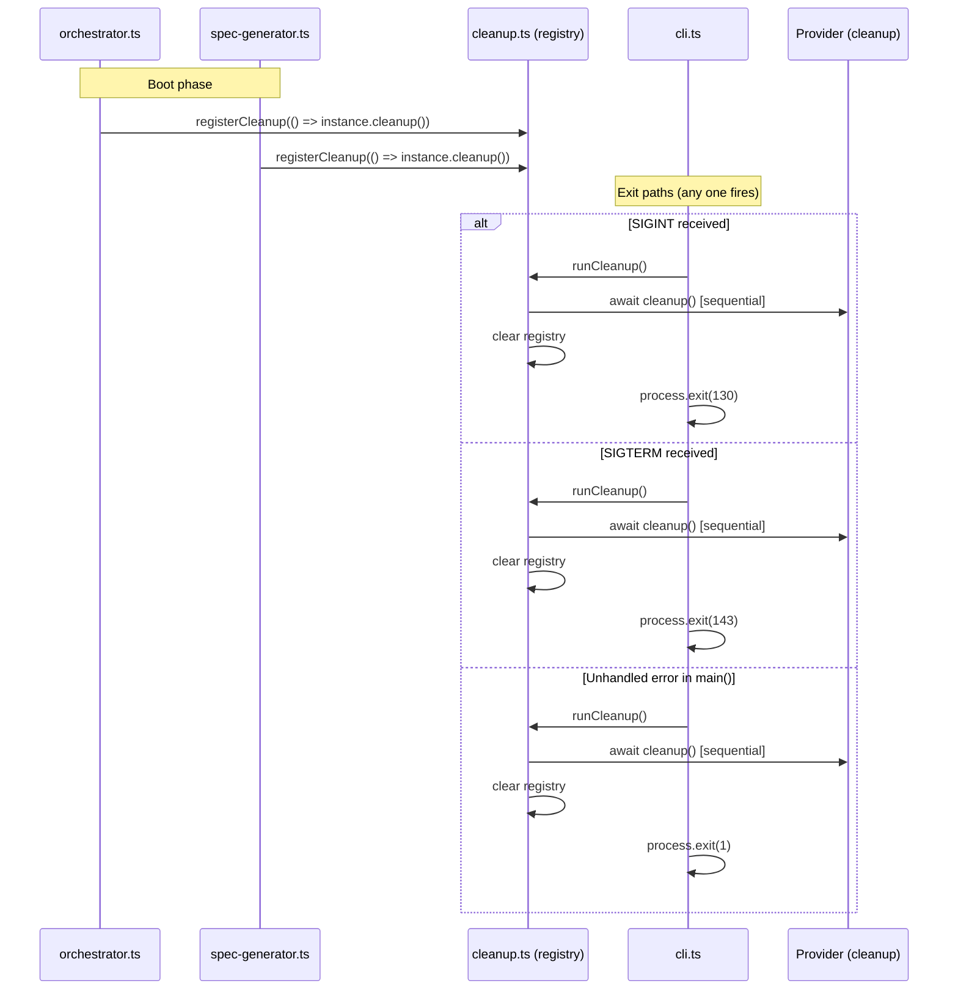

# Cleanup Registry

The cleanup registry (`src/cleanup.ts`) implements a process-level callback
registry that ensures AI [provider](../provider-system/provider-overview.md) resources are properly released before the
Dispatch process exits. Sub-modules register their provider's `cleanup()`
function at boot time, and the [CLI's](../cli-orchestration/cli.md) signal handlers and error handler drain
the registry before calling `process.exit()`.

## What it does

The module exports two functions:

| Function | Purpose |
|----------|---------|
| `registerCleanup(fn)` | Adds an async cleanup function to the registry |
| `runCleanup()` | Invokes all registered functions, then clears the registry |

The cleanup functions are stored in a module-level array. When `runCleanup()`
is called, it atomically splices all entries from the array, runs each one
sequentially, swallows any errors, and leaves the registry empty so repeated
calls are harmless.

## Why it exists

Dispatch spawns and manages AI provider server processes (OpenCode or Copilot
CLI servers). If the process exits without calling the provider's `cleanup()`
method, these child processes can be left as orphans consuming system
resources. The cleanup registry solves this by:

- **Centralizing teardown responsibility.** Registration happens in the modules
  that create resources ([orchestrator](../cli-orchestration/orchestrator.md), [spec-generator](../spec-generation/overview.md)), while draining happens
  in the CLI's exit paths (signal handlers, error handler). Neither side needs
  to know about the other's internals.
- **Making shutdown idempotent.** The `splice(0)` pattern empties the registry
  atomically, so a second `runCleanup()` call is a harmless no-op. This is
  important because signals and errors can race.
- **Preventing cascading failures during shutdown.** Errors in cleanup
  functions are swallowed so one failing teardown does not prevent others
  from running.

## Cleanup lifecycle flow

The following diagram shows how cleanup functions flow through the system:
providers register their teardown at boot, and the CLI drains the registry
from three distinct exit paths.



## Which modules register cleanup functions

Three call sites register cleanup functions, all wrapping provider
`instance.cleanup()`:

| Call site | Resource being cleaned up |
|-----------|--------------------------|
| `src/agents/orchestrator.ts:151` | AI provider server booted for dispatch mode |
| `src/spec-generator.ts:308` | AI provider server booted for issue-based spec generation |
| `src/spec-generator.ts:431` | AI provider server booted for file-based spec generation |

In every case, the registered function is `() => instance.cleanup()`, which
delegates to the provider's own teardown logic:

- **OpenCode provider**: Calls `server.close()` to stop the spawned OpenCode
  server process. See
  [OpenCode backend](../provider-system/opencode-backend.md).
- **Copilot provider**: Destroys all tracked sessions and calls
  `client.stop()` to stop the Copilot CLI server. See
  [Copilot backend](../provider-system/copilot-backend.md).

No other resource types (temp files, database connections, etc.) are currently
registered. The registry's design supports any `() => Promise<void>` function
if future modules need it.

## How signals coordinate with the cleanup registry

The CLI installs signal handlers at `src/cli.ts:242-252` that drain the
registry before exiting:

```
process.on("SIGINT", async () => {
    log.debug("Received SIGINT, cleaning up...");
    await runCleanup();
    process.exit(130);
});

process.on("SIGTERM", async () => {
    log.debug("Received SIGTERM, cleaning up...");
    await runCleanup();
    process.exit(143);
});
```

A third drain site is the top-level `.catch()` handler at `src/cli.ts:304-307`,
which catches unhandled errors from `main()`:

```
main().catch(async (err) => {
    log.error(err instanceof Error ? err.message : String(err));
    await runCleanup();
    process.exit(1);
});
```

### Exit codes

| Signal/Event | Exit code | Convention |
|-------------|-----------|------------|
| SIGINT (Ctrl+C) | 130 | 128 + signal number 2 |
| SIGTERM | 143 | 128 + signal number 15 |
| Unhandled error | 1 | General failure |

These follow standard POSIX conventions. CI/CD systems and wrapper scripts
interpret `130` as "terminated by SIGINT" and `143` as "terminated by SIGTERM."
Exit code `1` indicates an application error.

### Double-signal protection

When Node.js installs an async signal handler via `process.on("SIGINT", ...)`,
the default behavior of SIGINT (immediate termination) is replaced by the
custom handler. The `splice(0)` pattern in `runCleanup()` provides implicit
double-signal protection:

1. First SIGINT arrives: `runCleanup()` splices all entries out of the array
   and begins awaiting them.
2. Second SIGINT arrives while cleanup is still running: `runCleanup()` is
   called again, but `splice(0)` returns an empty array because the first
   call already removed all entries. The function returns immediately, and
   `process.exit(130)` terminates the process.

This means a rapid double Ctrl+C will not cause cleanup functions to be invoked
twice. The worst case is that the first invocation's in-progress `await` is
abandoned when `process.exit(130)` fires from the second handler invocation.

## Why cleanup errors are swallowed

The `try/catch` block in `runCleanup()` has an empty `catch` clause
(`src/cleanup.ts:31-33`). This is a deliberate design choice:

- **Cleanup runs in exit paths where the original error matters more.** If the
  process is shutting down because of a fatal error, a secondary error from
  cleanup would mask the root cause. Swallowing cleanup errors ensures the
  original error message reaches the user.
- **One failing cleanup must not block others.** If multiple providers are
  registered (unlikely in current usage, but architecturally possible), a
  failure in one provider's teardown must not prevent the next provider from
  being cleaned up.
- **The process is about to exit anyway.** After `runCleanup()` returns, the
  next statement is `process.exit()`. OS-level resource reclamation will handle
  anything that cleanup missed.

### Could this hide critical resource leaks?

In theory, yes -- if a cleanup function fails and the process does not exit
(e.g., because the signal handler's `await` keeps it alive), the failure would
be invisible. In practice, this risk is mitigated by:

1. Every drain site calls `process.exit()` immediately after `runCleanup()`.
2. The resources being cleaned up (provider server processes) are child
   processes that the OS will terminate when the parent exits.
3. If visibility into cleanup failures is needed for debugging, the
   `--verbose` flag enables `log.debug()` output in the signal handlers,
   showing that cleanup was attempted. Adding a `log.debug()` inside the
   `catch` block would surface specific failures without changing the
   error-swallowing behavior.

## Why cleanup functions run sequentially

The `runCleanup()` function uses a `for...of` loop with `await` on each
cleanup function rather than `Promise.all()`:

```typescript
for (const fn of fns) {
    try {
        await fn();
    } catch {
        // swallow
    }
}
```

Sequential execution is preferred for three reasons:

1. **Error isolation.** With `Promise.all()`, an unhandled rejection from one
   function would require `Promise.allSettled()` to prevent it from masking
   results of other functions. The sequential `try/catch` pattern provides
   per-function error isolation with simpler control flow.
2. **Resource ordering.** While the current codebase only registers one
   provider at a time, sequential teardown avoids potential issues with
   providers that share resources (e.g., the same port or socket).
3. **Deterministic shutdown.** Sequential execution ensures cleanup functions
   complete in registration order, making debugging and log output predictable.

The trade-off is that if a cleanup function is slow, subsequent functions must
wait. For a CLI tool that typically registers a single cleanup function, this
is not a concern.

## Timeout behavior: what if a cleanup function hangs

There is currently **no timeout mechanism** on individual cleanup functions. If
a provider's `cleanup()` method hangs indefinitely (e.g., the server process
does not respond to shutdown), the `await` in `runCleanup()` will block
indefinitely, preventing `process.exit()` from being reached.

In practice, this risk is mitigated by:

- **Provider cleanup implementations are lightweight.** The OpenCode provider
  calls `server.close()` (a local operation), and the Copilot provider calls
  `session.destroy()` and `client.stop()` (also local operations). Neither
  involves network round-trips to remote services.
- **Double-signal as a fallback.** If the user notices the process is not
  exiting after Ctrl+C, a second Ctrl+C will trigger the signal handler again.
  The second `runCleanup()` call returns immediately (registry already empty),
  and `process.exit(130)` terminates the process.
- **OS-level fallback.** `kill -9` (SIGKILL) always terminates the process and
  cannot be intercepted.

### Adding a timeout (future improvement)

If timeout behavior becomes necessary, the recommended approach is to wrap the
`await` in a `Promise.race()` with an `AbortSignal.timeout()`:

```typescript
for (const fn of fns) {
    try {
        await Promise.race([
            fn(),
            new Promise((_, reject) =>
                setTimeout(() => reject(new Error("cleanup timeout")), 5000)
            ),
        ]);
    } catch {
        // swallow — cleanup must not throw
    }
}
```

This would give each cleanup function 5 seconds before the loop moves on.

## Source reference

- `src/cleanup.ts` -- Full cleanup registry implementation (35 lines)
- `src/cli.ts:242-252` -- Signal handler installation
- `src/cli.ts:304-307` -- Error handler with cleanup drain
- `src/agents/orchestrator.ts:151` -- Dispatch-mode cleanup registration
- `src/spec-generator.ts:308, 431` -- Spec-mode cleanup registration

## Related documentation

- [Overview](./overview.md) -- Shared Interfaces & Utilities layer
- [Logger](./logger.md) -- Verbose debug output used in signal handlers
- [Integrations reference](./integrations.md) -- Node.js process signal
  handling details
- [CLI argument parser](../cli-orchestration/cli.md) -- Where signal handlers
  are installed
- [Orchestrator pipeline](../cli-orchestration/orchestrator.md) -- Where
  dispatch-mode cleanup is registered
- [Spec Generation](../spec-generation/overview.md) -- Where spec-mode
  cleanup is registered
- [Provider Abstraction](../provider-system/provider-overview.md) -- The
  `cleanup()` method on ProviderInstance
- [Provider Interface](./provider.md) -- The `ProviderInstance` type that
  defines the `cleanup()` method
- [Adding a Provider](../provider-system/adding-a-provider.md) -- Guide for
  implementing cleanup idempotency in new providers
- [Prerequisites — External Integrations](../prereqs-and-safety/integrations.md) --
  The `execFile` patterns and external CLI tool detection that run before cleanup
  registration; understanding the pipeline startup sequence helps contextualize
  when cleanup is registered
- [Testing Overview](../testing/overview.md) -- Test coverage (note: the
  cleanup registry is not unit tested)
