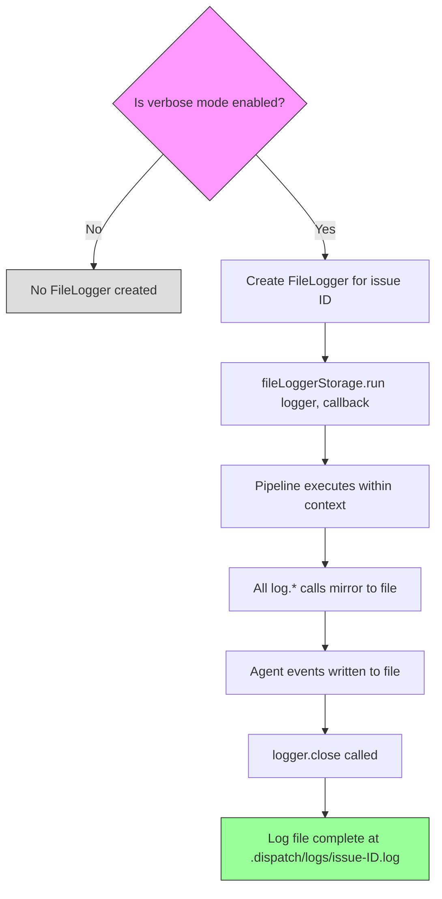

# File Logger

The file logger (`src/helpers/file-logger.ts`) writes timestamped, plain-text,
per-issue log files to `.dispatch/logs/issue-{id}.log`. It uses Node.js
`AsyncLocalStorage` to scope each log file to a specific issue being processed,
enabling parallel issue processing where each concurrent issue writes to its
own log file without explicit parameter threading.

## What it does

The `FileLogger` class provides structured logging methods (`info`, `warn`,
`error`, `debug`, `agentEvent`, `agentResponse`, `close`) that append
timestamped entries to an issue-specific log file. Every
[console logger](./logger.md) method automatically mirrors its output into
the active `FileLogger` context, so the log file captures everything the user
sees in the terminal, plus additional agent-level events that are not shown
on-screen.

## Why it exists

Dispatch processes multiple issues concurrently. When something goes wrong
with a specific issue, developers need a complete, ordered record of
everything that happened during that issue's processing — from initial
detection through planning, execution, and commit. The file logger provides
this by:

1. **Isolating output per issue** — each issue gets its own `.log` file,
   avoiding interleaved output from concurrent issues.
2. **Capturing the full picture** — agent events (prompts sent, responses
   received) are logged to the file even when they are not shown in the
   terminal.
3. **Stripping styling** — ANSI color codes are removed before writing, so
   log files are readable in any text editor.
4. **Adding timestamps** — every entry includes an ISO 8601 timestamp,
   enabling timeline reconstruction.

## How it works

### AsyncLocalStorage context scoping

The file logger uses Node.js
[`AsyncLocalStorage`](https://nodejs.org/api/async_context.html#class-asynclocalstorage)
to associate a `FileLogger` instance with the current async execution context.
This is exported as `fileLoggerStorage` from `src/helpers/file-logger.ts:18`:

```typescript
export const fileLoggerStorage = new AsyncLocalStorage<FileLogger>();
```

**Why `AsyncLocalStorage` instead of explicit parameter passing?**
`AsyncLocalStorage` was chosen because the file logger needs to be accessible
from deeply nested code paths — provider methods, agent handlers, datasource
helpers — without modifying every function signature in the call chain. When
processing 10 issues concurrently, each issue's async context carries its own
`FileLogger` instance. Any code that calls `fileLoggerStorage.getStore()`
gets the correct per-issue logger without any explicit parameter.

`AsyncLocalStorage` has been stable since Node.js v16.4.0 and introduces
negligible performance overhead. The Node.js documentation confirms it is
designed for exactly this use case: propagating context-specific data through
async call chains without explicit threading.

### Pipeline integration

Three orchestrator pipelines create `FileLogger` instances and establish
`AsyncLocalStorage` contexts:



| Pipeline | Source location | Context establishment |
|----------|----------------|----------------------|
| Dispatch pipeline | `src/orchestrator/dispatch-pipeline.ts:689` | Wraps per-issue processing in `fileLoggerStorage.run()` |
| Spec pipeline | `src/orchestrator/spec-pipeline.ts:417` | Wraps spec generation in `fileLoggerStorage.run()` |

Each pipeline follows the same pattern:

1. Check if verbose mode is enabled
2. If yes, create a `new FileLogger(issueId)`
3. Call `fileLoggerStorage.run(logger, async () => { /* pipeline logic */ })`
4. Within the callback, all `log.*()` calls and direct `fileLogger.*()` calls
   write to the issue's log file
5. Call `logger.close()` when pipeline processing completes

### Log file location and naming

Log files are written to:

```
.dispatch/logs/issue-{sanitizedId}.log
```

The `.dispatch/logs/` directory is created automatically by the `FileLogger`
constructor using `mkdirSync({ recursive: true })`.

### Issue ID sanitization

The `sanitizeIssueId()` method (`src/helpers/file-logger.ts:23-26`) ensures
safe filenames by replacing any character outside `[a-zA-Z0-9._-]` with
an underscore:

| Datasource | Example ID | Sanitized filename |
|------------|------------|-------------------|
| GitHub | `42` | `issue-42.log` |
| GitHub | `feature/login` | `issue-feature_login.log` |
| Azure DevOps | `12345` | `issue-12345.log` |
| Markdown | `path/to/task.md` | `issue-path_to_task_md.log` |

This sanitization is sufficient for all current datasource ID formats.
Non-ASCII characters (e.g., from internationalized branch names) would be
converted to underscores, which preserves uniqueness but reduces readability.

### Log file lifecycle

The `FileLogger` constructor (`src/helpers/file-logger.ts:28-33`) **truncates**
the log file on creation using `writeFileSync`. This means:

- **Same issue ID, same pipeline run**: Only one `FileLogger` exists per issue
  per pipeline invocation, so all writes are sequential appends.
- **Re-running dispatch for the same issue**: The log file is overwritten.
  Previous log contents are lost.
- **Different issue IDs**: Each issue gets a separate file. Old issue log
  files are **not** cleaned up automatically.

> **Note**: There is currently no automatic cleanup of old log files from
> `.dispatch/logs/`. Over time, log files from resolved issues will
> accumulate. To reclaim space, manually delete old files or the entire
> `.dispatch/logs/` directory. The directory is included in `.gitignore`
> and is not tracked by version control.

### Log entry format

Each log entry is a single line with an ISO 8601 timestamp prefix:

```
[2024-01-15T10:30:45.123Z] [INFO] Processing issue #42
[2024-01-15T10:30:45.456Z] [WARN] Rate limit approaching
[2024-01-15T10:30:46.789Z] [AGENT_EVENT] Sending prompt (2048 chars)
[2024-01-15T10:30:52.012Z] [AGENT_RESPONSE] Response received (1024 chars)
```

The `write()` method (`src/helpers/file-logger.ts:35-38`) appends each entry
using `appendFileSync`:

```typescript
private write(level: string, message: string): void {
    appendFileSync(this.logPath, `[${new Date().toISOString()}] [${level}] ${message}\n`);
}
```

### Available methods

| Method | Level tag | Purpose |
|--------|-----------|---------|
| `info(msg)` | `INFO` | General informational messages |
| `warn(msg)` | `WARN` | Non-fatal warnings |
| `error(msg)` | `ERROR` | Error messages |
| `debug(msg)` | `DEBUG` | Verbose debug output |
| `agentEvent(msg)` | `AGENT_EVENT` | Agent prompt dispatch, session creation |
| `agentResponse(msg)` | `AGENT_RESPONSE` | Agent response receipt, completion |
| `close()` | `CLOSE` | Marks the end of logging for this issue |

The `agentEvent` and `agentResponse` methods are called directly by the
[planner](../agent-system/planner-agent.md) and
[executor](../agent-system/executor-agent.md) agents, providing visibility
into AI provider interactions that do not appear in the console output.

## Operational concerns

### File I/O error handling

The `write()` method calls `appendFileSync` **without a try/catch wrapper**.
If the filesystem encounters an error (e.g., disk full, permission denied,
read-only mount), the exception will propagate up through the logging call
and crash the pipeline.

**Impact**: A disk-full condition during a dispatch run would cause an
unhandled exception in the logging layer, terminating the pipeline for the
affected issue. Other issues running concurrently in separate async contexts
would not be affected unless they also encounter I/O errors.

**Mitigation**: Ensure the `.dispatch/logs/` directory is on a filesystem
with adequate space. The log files are typically small (a few KB per issue).

### Synchronous writes and concurrency

All file operations use synchronous Node.js `fs` methods (`mkdirSync`,
`writeFileSync`, `appendFileSync`). While synchronous I/O blocks the event
loop, this is acceptable because:

1. Each `appendFileSync` call writes a single log line (typically under 200
   bytes), which completes in microseconds on modern filesystems.
2. `AsyncLocalStorage` ensures each issue writes to a different file, so
   there is no file-level contention between concurrent issues.
3. The alternative (async writes with buffering) would add complexity and
   risk out-of-order log entries.

For typical Dispatch runs (1-50 concurrent issues), synchronous file writes
introduce no measurable performance impact.

### AsyncLocalStorage overhead

`AsyncLocalStorage` adds a small amount of overhead to each async operation
(promise resolution, `setTimeout`, etc.) within the context. The Node.js
documentation states this overhead is negligible for most applications.
At the scale Dispatch operates (tens of concurrent issues, not thousands),
`AsyncLocalStorage` introduces no measurable latency.

To verify that `AsyncLocalStorage` contexts do not leak between issues,
the integration test at `src/tests/file-logger-integration.test.ts:291-295`
checks that after pipeline completion, `fileLoggerStorage.getStore()`
returns `undefined`.

## Dual-channel integration with console logger

The file logger and [console logger](./logger.md) form a dual-channel
system. The console logger handles terminal output; the file logger handles
persistent storage. The integration point is in each `log.*()` method body,
which calls `fileLoggerStorage.getStore()?.method(stripAnsi(msg))` to
mirror output.

See the [dual-channel logging section](./logger.md#dual-channel-logging-console--file)
in the console logger documentation for the full sequence diagram.

## Testing

The file logger has comprehensive test coverage across two test files:

- **`src/tests/file-logger.test.ts`** (259 lines) — Unit tests covering:
    - Constructor creates directory and truncates the log file
    - Timestamped entries with correct level tags
    - Sequential appends within a single session
    - `AsyncLocalStorage` context scoping (correct logger per context)
    - `close()` method writes a final entry

- **`src/tests/file-logger-integration.test.ts`** (297 lines) — Integration
  tests covering:
    - Full dispatch pipeline produces log files when verbose is enabled
    - Non-verbose mode does not create log files
    - `AsyncLocalStorage` context does not leak between issues
    - Log file content matches expected agent events

## Source reference

- `src/helpers/file-logger.ts` — `FileLogger` class and `fileLoggerStorage`
  `AsyncLocalStorage` instance (92 lines)
- `src/tests/file-logger.test.ts` — Unit tests (259 lines)
- `src/tests/file-logger-integration.test.ts` — Integration tests (297 lines)

## Related documentation

- [Console Logger](./logger.md) — The dual-channel partner that routes console
  output and mirrors to the file logger
- [Overview](./overview.md) — Shared Interfaces & Utilities layer
- [Dispatch Pipeline](../cli-orchestration/dispatch-pipeline.md) — Pipeline that
  establishes `FileLogger` contexts for issue processing
- [Dispatcher Agent](../planning-and-dispatch/dispatcher.md) — Task execution
  agent that writes to the file logger context
- [Spec Generation](../spec-generation/overview.md) — Pipeline that
  establishes `FileLogger` contexts for spec generation
- [Planner Agent](../agent-system/planner-agent.md) — Uses `agentEvent()`
  and `agentResponse()` for prompt tracing
- [Executor Agent](../agent-system/executor-agent.md) — Uses `agentEvent()`
  and `agentResponse()` for execution tracing
- [Commit Agent](../agent-system/commit-agent.md) — Logs prompt and response
  events through the file logger context
