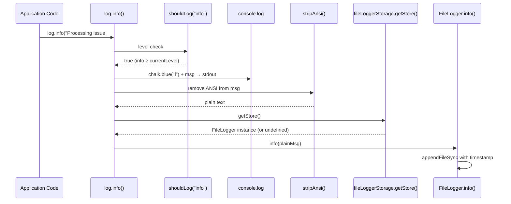

# Logger

The logger (`src/helpers/logger.ts`) provides a dual-channel logging facade for
CLI output. It is a plain object with seven output methods, a `verbose`
property, an error-chain formatter, and an error-message extractor. Console
output is styled via [chalk](https://github.com/chalk/chalk), and every log
call is automatically mirrored — with ANSI codes stripped — into the active
[file logger](./file-logger.md) context if one exists.

## What it does

The `log` object is the single logging interface for non-TUI contexts in
Dispatch. It is imported by the [CLI entry point](../cli-orchestration/cli.md)
(`src/cli.ts`), the [orchestrator](../cli-orchestration/orchestrator.md)
(`src/orchestrator/runner.ts`), the
[dispatcher](../planning-and-dispatch/dispatcher.md) (`src/dispatcher.ts`),
all [provider backends](../provider-system/overview.md)
(`src/providers/opencode.ts`, `src/providers/copilot.ts`, etc.), the
[spec generator](../spec-generation/overview.md) (`src/spec-generator.ts`),
and the [datasource helpers](../datasource-system/datasource-helpers.md)
(`src/orchestrator/datasource-helpers.ts`).
When the full [TUI](../cli-orchestration/tui.md) is active, the TUI module
renders its own output directly; the logger is used for simpler output modes
and for verbose debug tracing that runs alongside the TUI.

Every log method simultaneously writes to the per-issue
[file logger](./file-logger.md) when one is active in the current
`AsyncLocalStorage` context. This dual-channel design provides both real-time
terminal feedback and a persistent, timestamped audit trail per issue. See
[dual-channel logging](#dual-channel-logging-console--file) for details.

## Why it exists

The [TUI](../cli-orchestration/tui.md) provides rich real-time output during
normal dispatch, but several scenarios require simpler output:

- **Dry-run mode**: Lists discovered tasks without starting the TUI
  (see [CLI `--dry-run`](../cli-orchestration/cli.md)).
- **Error reporting**: The CLI uses `log.error()` for argument validation
  errors before the TUI exists.
- **Warnings**: The [orchestrator](../cli-orchestration/orchestrator.md) uses
  `log.warn()` when no files or tasks are found.
- **Debug tracing**: With `--verbose`, `log.debug()` provides detailed
  internal tracing of provider boot, session creation, prompt dispatch, and
  cleanup operations across every module in the pipeline.
- **Non-TTY environments**: When stdout is not a terminal, the logger's
  line-by-line output is appropriate (though the caller must opt into it via
  `--dry-run`; there is no automatic fallback).
- **Per-issue audit trail**: When a [file logger](./file-logger.md) context
  is active, all log output is mirrored to a per-issue `.log` file in
  `.dispatch/logs/`, providing a complete, timestamped record for
  post-mortem debugging.

## Usage in the codebase

The logger is used across the entire pipeline:

1. **CLI** (`src/cli.ts`): Error reporting for argument validation, signal
   handler debug messages, verbose flag initialization.
2. **Orchestrator** (`src/agents/orchestrator.ts`): Warnings for empty results,
   dry-run task listing via `log.task()`.
3. **Dispatcher** (`src/dispatcher.ts`): Debug tracing of prompt construction,
   dispatch results, and error chains.
4. **Provider backends** (`src/providers/opencode.ts`,
   `src/providers/copilot.ts`): Debug tracing of server boot, session creation,
   prompt sending, response receipt, and cleanup.
5. **Spec generator** (`src/spec-generator.ts`): Info/success/error for
   pipeline stages, debug tracing of fetch timing, prompt size, and response
   processing.

The TUI replaces the logger's user-facing output during normal (non-dry-run)
execution. However, `log.debug()` messages still fire when `--verbose` is
enabled, even while the TUI is active -- they write to stdout alongside the
TUI's ANSI rendering, which can produce interleaved output.

## Method reference

| Method | Stream | Prefix | Color | Usage |
|--------|--------|--------|-------|-------|
| `log.info(msg)` | stdout | `ℹ` | blue | General informational messages |
| `log.success(msg)` | stdout | `✔` | green | Completion confirmations |
| `log.warn(msg)` | stderr | `⚠` | yellow | Non-fatal warnings |
| `log.error(msg)` | stderr | `✖` | red | Error messages |
| `log.task(index, total, msg)` | stdout | `[n/total]` | cyan | Task progress in dry-run mode |
| `log.dim(msg)` | stdout | *(none)* | dim | Subtle hints and examples |
| `log.debug(msg)` | stdout | `⤷` | dim | Verbose debug output (gated by log level) |

All seven methods mirror their output — with ANSI escape codes stripped — to
the [file logger](./file-logger.md) if a `FileLogger` context is active in
`AsyncLocalStorage`. This happens via
`fileLoggerStorage.getStore()?.method(stripAnsi(msg))` at the end of each
method body (`src/helpers/logger.ts:65-104`).

### `log.task()` -- zero-based index convention

The `task()` method accepts a **zero-based** `index` parameter and displays it
as **one-based** to the user (`src/helpers/logger.ts:96`):

```
console.log(chalk.cyan(`[${index + 1}/${total}]`), msg);
```

This means all callers must pass a zero-based index. The single call site in
the current codebase (`src/orchestrator/runner.ts`) uses a zero-based array
index — so the convention is followed correctly. If you add new callers, pass
the zero-based position from the task array, not a one-based counter.

### `log.debug()` -- level-gated output

The `debug()` method is gated by the current log level via the `shouldLog()`
function (`src/helpers/logger.ts:50-52`):

```typescript
function shouldLog(level: LogLevel): boolean {
    return LOG_SEVERITY[level] >= LOG_SEVERITY[currentLevel];
}
```

Messages are prefixed with a dim arrow (`⤷`) and indented two spaces to
visually nest them under the preceding info/error line.

#### How the verbose flag is toggled

The `--verbose` CLI flag sets `log.verbose = true` at startup in
`src/cli.ts`, before any other operations. See
[Configuration](../cli-orchestration/configuration.md) for how `--verbose`
is persisted and merged with CLI flags. The `verbose` property is a
getter/setter defined via `Object.defineProperty`
(`src/helpers/logger.ts:148-157`):

- **Setting `verbose = true`** overrides the current level to `"debug"`,
  enabling all output including debug messages.
- **Setting `verbose = false`** overrides the current level to `"info"`,
  which suppresses debug output but allows all other methods.

> **Important**: Setting `verbose` **discards** any prior `LOG_LEVEL`
> environment variable value. For example, if `LOG_LEVEL=warn` was set, then
> `log.verbose = false` resets the level to `"info"`, not back to `"warn"`.
> This is by design — the verbose toggle provides a simple boolean override,
> not a stack-based level mechanism.

#### What verbose mode reveals

When `--verbose` is active, `log.debug()` calls throughout the pipeline
produce output including:

| Module | Example debug messages |
|--------|-----------------------|
| Provider boot | `"Connecting to existing OpenCode server at ..."`, `"No --server-url, will spawn local server"` |
| Session lifecycle | `"Creating OpenCode session..."`, `"Session created: <id>"` |
| Prompt dispatch | `"Sending async prompt to session <id> (N chars)..."`, `"Prompt response received (N chars)"` |
| Spec generation | `"Spec prompt built (N chars)"`, `"Post-processed spec (N → M chars)"` |
| Error details | Full error cause chains via `log.formatErrorChain()` |
| Signal handling | `"Received SIGINT, cleaning up..."` |

### `log.formatErrorChain()` -- error cause chain formatter

The `formatErrorChain()` method (`src/helpers/logger.ts:108-130`) extracts the
full `Error.cause` chain from nested Node.js errors and formats it as a
human-readable multi-line string:

```
Error: fetch failed
  ⤷ Cause: connect ECONNREFUSED 127.0.0.1:4096
  ⤷ Cause: ECONNREFUSED
```

This is critical for diagnosing Node.js network errors. When `fetch()` or an
SDK call fails, Node.js wraps the root cause in a `TypeError: fetch failed`
with the actual network error (like `ECONNREFUSED` or `ETIMEDOUT`) buried in
nested `.cause` properties. Without this formatter, only the outer
"fetch failed" message would be visible.

#### Depth limit

The formatter walks the `.cause` chain up to a **maximum depth of 5**
(`MAX_CAUSE_CHAIN_DEPTH` at `src/helpers/logger.ts:60`). This prevents infinite
loops if an error object has a circular `.cause` reference, and bounds the
output length.

**Could real-world error chains exceed 5 levels?** In practice, Node.js
network error chains are typically 2-3 levels deep:

1. `TypeError: fetch failed` (fetch API wrapper)
2. `Error: connect ECONNREFUSED ...` (Node.js net layer)
3. System-level error code (optional, e.g., `ECONNREFUSED`)

The SDK wrappers used by Dispatch ([OpenCode SDK](../provider-system/opencode-backend.md), [Copilot SDK](../provider-system/copilot-backend.md)) may add one
additional layer. A depth of 5 provides comfortable headroom for current and
foreseeable error chains. If a chain is truncated, the deepest visible cause
still provides significant diagnostic value.

#### Where formatErrorChain is called

The method is called in error handlers throughout the pipeline:

- `src/dispatcher.ts:46` -- task dispatch failures
- `src/providers/opencode.ts:48, 66, 161` -- server boot, session, and
  prompt failures
- `src/providers/copilot.ts:31, 49, 73` -- CLI boot, session, and prompt
  failures
- `src/spec-generator.ts:288, 362, 462` -- issue fetch and spec generation
  failures

## Why chalk for terminal styling

Chalk was chosen over raw ANSI escape codes or alternatives for several reasons:

1.  **Automatic color support detection.** Chalk uses the
    [supports-color](https://github.com/chalk/supports-color) package internally
    to detect the terminal's color capability level (none, 16, 256, or 16
    million colors). Raw ANSI codes provide no such detection and would require
    implementing this logic manually.

2.  **Composable, readable API.** Calls like `chalk.blue("text")` and
    `chalk.cyan(`[${n}/${total}]`)` are self-documenting. The equivalent ANSI
    escape sequences (`\x1b[34m...\x1b[0m`) are opaque and error-prone.

3.  **No dependencies.** Chalk v5+ has zero runtime dependencies, so the cost of
    adoption is minimal.

4.  **Wide ecosystem trust.** Chalk is used by over 100,000 npm packages. Its
    maturity and active maintenance make it a low-risk dependency.

Smaller alternatives like [yoctocolors](https://github.com/sindresorhus/yoctocolors)
exist but lack chalk's automatic color detection and composable chaining API.

## Why `warn` and `error` use `console.error` (stderr)

The `warn` and `error` methods write to `console.error`, which outputs to
**stderr**. All other methods use `console.log`, which outputs to **stdout**.
This follows the Unix convention of separating normal program output from
diagnostic messages:

- **stdout** carries the program's primary output — task listings, progress
  indicators, success messages. It can be piped to other tools or redirected to
  files for processing.
- **stderr** carries diagnostic and error output. When stdout is piped, stderr
  still appears on the terminal so warnings and errors remain visible.

This separation matters for Dispatch because dry-run output (task listings) goes
to stdout and can be captured, while warnings and errors always surface in the
terminal regardless of redirection.

## Behavior in non-TTY environments (CI, piped output)

When Dispatch runs in a CI pipeline or when stdout is redirected to a file,
chalk's behavior changes automatically:

| Environment | Chalk behavior | Logger output |
|-------------|----------------|---------------|
| TTY terminal | Colors enabled | Colored icons and text |
| Piped to another process | Colors disabled (auto-detected) | Plain text without escape codes |
| Redirected to file | Colors disabled (auto-detected) | Plain text without escape codes |
| `FORCE_COLOR=1` set | Colors forced on | Colored output even in non-TTY |
| `NO_COLOR` set | Colors forced off | Plain text in all environments |

This means the logger's output is safe for piping and redirection — chalk
gracefully degrades to plain text when it detects a non-TTY stdout.

The `log.error()` method writes to `console.error` (stderr), which has
independent color detection from stdout. This means error messages may have
different color behavior than info/warn messages if stdout and stderr are
routed differently.

### Color detection details

1.  **Color detection.** Chalk checks `process.stdout.isTTY` (and the equivalent
    for stderr) via the supports-color package. When the stream is not a TTY —
    as in CI environments, piped commands, or file redirects — chalk detects
    level 0 (no color) and outputs plain text without ANSI escape codes.

2.  **Forcing color on or off.** The `FORCE_COLOR` environment variable overrides
    detection:
    - `FORCE_COLOR=0` disables all colors
    - `FORCE_COLOR=1` enables basic 16 colors
    - `FORCE_COLOR=2` enables 256 colors
    - `FORCE_COLOR=3` enables truecolor (16 million)

    The `--color` and `--no-color` CLI flags (recognized by supports-color) also
    work, though Dispatch does not expose these directly in its own argument
    parser.

3.  **Unicode symbols.** The emoji-style prefix characters (`ℹ`, `✔`, `⚠`, `✖`)
    are Unicode, not ANSI codes. They will appear in the output regardless of
    color support. In environments where Unicode is not supported, they may
    render as replacement characters. This is generally acceptable in modern CI
    systems.

## Console logging limitations

The console logger writes to `console.log` and `console.error`. There is
**no mechanism** for:

- **Structured output** (JSON logging): All console output is human-readable
  strings with ANSI color codes. You cannot pipe console logger output to a
  JSON parser.
- **Contextual metadata**: There is no way to attach task IDs, file paths, or
  other structured data beyond what is embedded in the message string.

For persistent, timestamped, plain-text logging, see the
[file logger](./file-logger.md), which automatically captures all console log
output per issue.

For debugging and production monitoring, consider:

- **Verbose mode**: `dispatch "tasks/**/*.md" --verbose` enables detailed debug
  output from every module in the pipeline.
- **Piping to a file**: `dispatch "tasks/**/*.md" --dry-run 2>&1 | tee dispatch.log`
  captures all output. Note that chalk will likely disable colors for piped
  output (see [Integrations](./integrations.md)), making the file more
  readable.

## Log-level filtering

The logger supports four severity levels, resolved at module load time:

| Level | Severity | Methods gated |
|-------|----------|---------------|
| `debug` | 0 | None — all methods emit |
| `info` | 1 (default) | `debug()` is suppressed |
| `warn` | 2 | `debug()` and `info()`, `success()`, `task()`, `dim()` are suppressed |
| `error` | 3 | Only `error()` emits |

### Level resolution order

The initial log level is determined by `resolveLogLevel()`
(`src/helpers/logger.ts:31-40`) at module load:

1. **`LOG_LEVEL` environment variable** — if set to a valid level string
   (`"debug"`, `"info"`, `"warn"`, `"error"`), it is used directly.
2. **`DEBUG` environment variable** — if set (to any truthy value), the level
   is set to `"debug"`. This provides compatibility with the common `DEBUG=*`
   convention used by many Node.js libraries.
3. **Default** — `"info"`.

### The `verbose` property override

The `verbose` getter/setter (`src/helpers/logger.ts:148-157`) provides a
simple boolean override on top of the resolved level:

- `log.verbose = true` → sets level to `"debug"`
- `log.verbose = false` → sets level to `"info"`

This **discards** the previously resolved level. For example, if
`LOG_LEVEL=warn` was set, `log.verbose = false` resets the level to `"info"`,
not `"warn"`. The CLI sets `log.verbose` at startup based on the `--verbose`
flag, which means the environment variable level only survives if `--verbose`
is not passed.

### `extractMessage()` utility

The `extractMessage()` function (`src/helpers/logger.ts:132-146`) safely
extracts a string message from an unknown error value. It handles:

- `Error` instances → returns `error.message`
- Strings → returns the string directly
- Objects with a `.message` property → returns that property
- All other values → returns `String(value)`

This is used throughout error handlers to safely convert caught values
(which may not be `Error` instances) into log-friendly strings.

## Dual-channel logging (console + file)

Every `log.*()` method performs two operations:

1. **Console output** — styled with chalk, written to stdout or stderr
2. **File logger mirroring** — the message (with ANSI codes stripped via
   `stripAnsi()`) is forwarded to the active `FileLogger` if one exists in
   the current `AsyncLocalStorage` context

This dual-channel behavior is implemented at the end of each method body in
`src/helpers/logger.ts:65-104`. The pattern is:

```
fileLoggerStorage.getStore()?.info(stripAnsi(msg));
```

The `stripAnsi()` function (`src/helpers/logger.ts:54-57`) removes ANSI escape
sequences using a regex, ensuring file logs contain only plain text.



If no `FileLogger` context is active (e.g., during CLI startup before any
pipeline runs), the `getStore()` call returns `undefined` and the optional
chaining (`?.`) silently skips the file write. This means the dual-channel
behavior is completely transparent to callers.

For details on the file logger side of this integration, see the
[File Logger documentation](./file-logger.md).

## Source reference

- `src/helpers/logger.ts` — Console logger with dual-channel output, level
  filtering, error chain formatting, and message extraction (158 lines)
- `src/tests/logger.test.ts` — Unit tests covering all methods, level
  resolution, verbose override, and `formatErrorChain` depth (372 lines)

## Related documentation

- [File Logger](./file-logger.md) — Per-issue file logging with
  `AsyncLocalStorage` context scoping
- [Overview](./overview.md) — Shared Interfaces & Utilities layer
- [Cleanup registry](./cleanup.md) — How signal handlers use `log.debug()`
  before draining cleanup
- [Format utilities](./format.md) — The `elapsed()` helper used alongside
  logger output for timing
- [Format Tests](../testing/format-tests.md) — Test suite covering the
  `elapsed()` function that the logger displays
- [Integrations reference](./integrations.md) — Chalk color detection, CI
  behavior, and Node.js process signal details
- [TUI](../cli-orchestration/tui.md) — The alternative rich output mode that
  replaces the logger during normal dispatch
- [CLI & Orchestration](../cli-orchestration/overview.md) — Where the logger
  is consumed and verbose mode is initialized
- [Configuration](../cli-orchestration/configuration.md) — How `--verbose`
  is persisted and merged with CLI flags
- [Spec Generation](../spec-generation/overview.md) — How the spec pipeline
  uses logger for progress reporting and error diagnostics
- [Spec Generation Integrations](../spec-generation/integrations.md) — Chalk
  behavior in non-TTY environments during spec generation
- [Dispatcher](../planning-and-dispatch/dispatcher.md) — Debug tracing of
  prompt dispatch and error chain formatting
- [Provider Overview](../provider-system/overview.md) — Debug
  tracing of provider boot, session creation, and cleanup
- [Provider Detection](../prereqs-and-safety/provider-detection.md) — The
  config wizard that uses chalk-styled indicators informed by logger output
- [Datasource Helpers](../datasource-system/datasource-helpers.md) — How
  datasource helper functions use `log.warn()` and `log.success()`
- [Troubleshooting](../dispatch-pipeline/troubleshooting.md) — Common issues
  where logger output provides diagnostic clues
