# Shared Interfaces & Utilities

The shared layer defines the foundational contracts and utilities that every
other module in the Dispatch CLI depends on. Seven files compose this layer:

| File | Purpose |
|------|---------|
| `src/cleanup.ts` | Process-level [cleanup registry](./cleanup.md) for graceful shutdown of provider resources |
| `src/format.ts` | Duration [formatting helper](./format.md) (`elapsed()`) for progress reporting |
| `src/logger.ts` | Minimal chalk-based structured [logger](./logger.md) for CLI output with verbose/debug support |
| `src/parser.ts` | [Task/TaskFile data types](./parser.md) and pure + async helpers for markdown checkbox parsing |
| `src/provider.ts` | [ProviderName, ProviderBootOptions, and ProviderInstance](./provider.md) abstractions for AI agent runtimes |
| `src/slugify.ts` | Pure function to convert arbitrary text into URL/filesystem-safe identifiers ([slugify](../shared-utilities/slugify.md)) |
| `src/timeout.ts` | Promise deadline wrapper ([`withTimeout`](../shared-utilities/timeout.md)) and `TimeoutError` for bounded async execution |

## Why this layer exists

Dispatch is a multi-module CLI that coordinates markdown task parsing, AI agent
planning, task dispatch, and git commits. Without a shared contract layer, every
module would need direct knowledge of every other module's internals. The shared
types and utilities decouple:

- The **CLI entry point** (`src/cli.ts`) from the provider implementation details
- The **task parsing pipeline** from the planning and dispatch logic
- The **orchestrator** from specific AI backends (OpenCode, Copilot)
- The **planner** from raw file I/O concerns
- The **signal handlers** from individual provider teardown mechanics (via the
  [cleanup registry](./cleanup.md))
- The **TUI and logger** from raw time arithmetic (via
  [`elapsed()`](./format.md))
- The **datasources** from slug-generation details (via
  [`slugify()`](../shared-utilities/slugify.md))
- The **orchestrator** from timeout mechanics (via
  [`withTimeout()`](../shared-utilities/timeout.md))

## How modules depend on this layer

```mermaid
graph TD
    CLI["cli.ts"] --> Logger["logger.ts"]
    CLI --> ProviderTypes["provider.ts"]
    CLI --> Cleanup["cleanup.ts"]
    Orchestrator["orchestrator.ts"] --> Logger
    Orchestrator --> Parser["parser.ts"]
    Orchestrator --> ProviderTypes
    Orchestrator --> Cleanup
    Orchestrator --> Timeout["timeout.ts"]
    Datasources["datasources/*"] --> Slugify["slugify.ts"]
    SpecPipeline["spec-pipeline.ts"] --> Slugify
    SpecGen["spec-generator.ts"] --> Cleanup
    SpecGen --> Format["format.ts"]
    SpecGen --> Logger
    Planner["planner.ts"] --> Parser
    Planner --> ProviderTypes
    Dispatcher["dispatcher.ts"] --> Parser
    Dispatcher --> ProviderTypes
    Dispatcher --> Logger
    TUI["tui.ts"] --> Parser
    TUI --> Format
    ProvidersIndex["providers/index.ts"] --> ProviderTypes
    OpenCode["providers/opencode.ts"] --> ProviderTypes
    OpenCode --> Logger
    Copilot["providers/copilot.ts"] --> ProviderTypes
    Copilot --> Logger
```

## Detailed documentation

- [Cleanup registry](./cleanup.md) -- Process-level cleanup for graceful
  shutdown and signal handling
- [Format utilities](./format.md) -- Duration formatting for progress reporting
- [Logger](./logger.md) -- Structured terminal output with chalk styling,
  verbose mode, and error-chain formatting
- [Parser utilities](./parser.md) -- Task extraction, context filtering, and
  completion marking
- [Provider interface](./provider.md) -- AI agent runtime abstraction and
  lifecycle contract
- [Integrations reference](./integrations.md) -- chalk, Node.js fs/promises,
  and Node.js process signals operational details
- [Shared Utilities](../shared-utilities/overview.md) -- Slugify and timeout
  utilities that complement this shared layer

## Related documentation

- [CLI & Orchestration](../cli-orchestration/overview.md) -- How the CLI and
  orchestrator consume these types
- [Task Parsing & Markdown](../task-parsing/overview.md) -- In-depth parser
  behavior and test coverage
- [Planning & Dispatch Pipeline](../planning-and-dispatch/overview.md) -- How
  planner and dispatcher use the provider and parser contracts
- [Provider Abstraction & Backends](../provider-system/provider-overview.md) --
  Concrete implementations of the ProviderInstance interface
- [Spec Generation](../spec-generation/overview.md) -- The `--spec` pipeline
  that uses cleanup, provider, and logger utilities
- [Datasource System](../datasource-system/overview.md) -- Datasource
  interface and registry that consumes shared types
- [Adding a Provider](../provider-system/adding-a-provider.md) -- Guide for
  implementing the `ProviderInstance` interface
- [Deprecated Compatibility Layer](../deprecated-compat/overview.md) -- Legacy
  `IssueFetcher` shims that re-export shared types
- [Testing Overview](../testing/overview.md) -- Project-wide test suite
  covering config, format, parser, spec-generator, slugify, and timeout
  modules
- [Format Tests](../testing/format-tests.md) -- Tests for the `elapsed()`
  duration formatting utility
- [Spec Generator Tests](../testing/spec-generator-tests.md) -- Tests for
  spec generation pipeline utilities that consume shared types
- [Git & Worktree Management](../git-and-worktree/overview.md) -- Worktree
  context in which shared types (Task, TaskFile, ProviderInstance) are used
