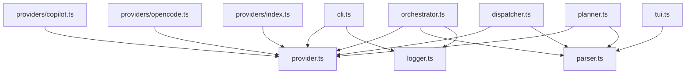

# Shared Interfaces & Utilities

The shared layer defines the foundational contracts and utilities that every
other module in the Dispatch CLI depends on. Three files compose this layer:

| File | Purpose |
|------|---------|
| `src/logger.ts` | Minimal chalk-based structured logger for CLI output |
| `src/parser.ts` | Task/TaskFile data types and pure + async helpers for markdown checkbox parsing |
| `src/provider.ts` | ProviderName, ProviderBootOptions, and ProviderInstance abstractions for AI agent runtimes |

## Why this layer exists

Dispatch is a multi-module CLI that coordinates markdown task parsing, AI agent
planning, task dispatch, and git commits. Without a shared contract layer, every
module would need direct knowledge of every other module's internals. The shared
types decouple:

- The **CLI entry point** (`src/cli.ts`) from the provider implementation details
- The **task parsing pipeline** from the planning and dispatch logic
- The **orchestrator** from specific AI backends (OpenCode, Copilot)
- The **planner** from raw file I/O concerns

## How modules depend on this layer

## Detailed documentation

- [Logger](./logger.md) -- Structured terminal output with chalk styling
- [Parser utilities](./parser.md) -- Task extraction, context filtering, and completion marking
- [Provider interface](./provider.md) -- AI agent runtime abstraction and lifecycle contract
- [Integrations reference](./integrations.md) -- chalk and Node.js fs/promises operational details

## Related documentation

- [CLI & Orchestration](../cli-orchestration/overview.md) -- How the CLI and orchestrator consume these types
- [Task Parsing & Markdown](../task-parsing/overview.md) -- In-depth parser behavior and test coverage
- [Planning & Dispatch Pipeline](../planning-and-dispatch/overview.md) -- How planner and dispatcher use the provider and parser contracts
- [Provider Abstraction & Backends](../provider-system/provider-overview.md) -- Concrete implementations of the ProviderInstance interface
