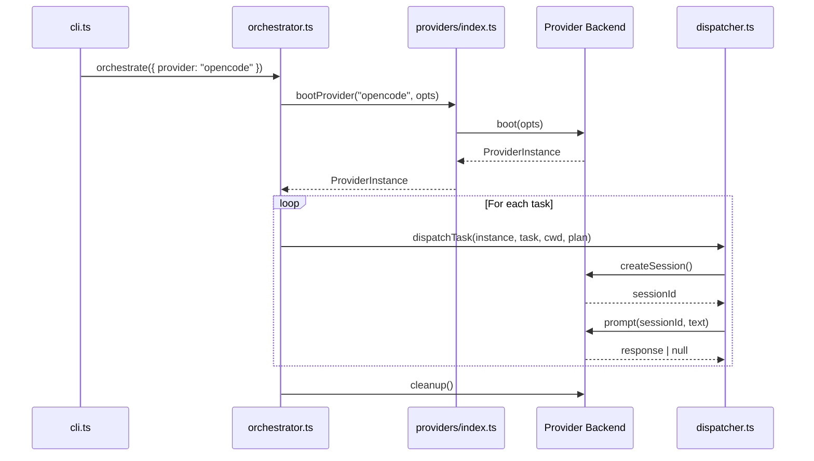

# Provider Interface

The provider module (`src/provider.ts`) defines the `ProviderName`,
`ProviderBootOptions`, and `ProviderInstance` types that abstract the AI agent
runtime. This abstraction enables the orchestrator to interact with OpenCode,
GitHub Copilot, or any future backend through a uniform lifecycle contract.

## What it defines

The module exports three types and no runtime code:

| Export | Kind | Description |
|--------|------|-------------|
| `ProviderName` | Type (string literal union) | `"opencode" \| "copilot"` |
| `ProviderBootOptions` | Interface | Options passed when booting a provider |
| `ProviderInstance` | Interface | The lifecycle contract for a booted AI agent |

## Why it exists

Dispatch supports multiple AI agent backends. Without a shared interface, the
[orchestrator](../cli-orchestration/orchestrator.md), [dispatcher](../planning-and-dispatch/dispatcher.md), and [planner](../planning-and-dispatch/planner.md) would each need provider-specific branches.
The `ProviderInstance` interface acts as a **strategy pattern** boundary: the
orchestrator calls `createSession()`, `prompt()`, and `cleanup()` without
knowing whether the underlying agent is OpenCode, Copilot, or something else.

## Provider lifecycle

### Phase 1: Boot

The [CLI](../cli-orchestration/cli.md) parses arguments to determine the `ProviderName`, then the [orchestrator](../cli-orchestration/orchestrator.md)
calls `bootProvider(name, opts)` from the registry (`src/providers/index.ts`).
The registry looks up the boot function and calls it with `ProviderBootOptions`.

**When boot is called:** Exactly once, at the start of the orchestrate function,
after task discovery and parsing but before any dispatch work begins
(`src/orchestrator.ts:100`).

### Phase 2: Create sessions and prompt

For each task, the [dispatcher](../planning-and-dispatch/dispatcher.md) creates a fresh session via `createSession()` and
sends a prompt via `prompt(sessionId, text)`. Sessions are isolated — each task
gets its own session to prevent context contamination between tasks.

### Phase 3: Cleanup

After all tasks are processed (success or failure), the [orchestrator](../cli-orchestration/orchestrator.md) calls
`cleanup()` to stop servers and release resources
(`src/orchestrator.ts:165`).

**Cleanup guarantees:** The `cleanup()` method is documented as safe to call
multiple times. However, in the current orchestrator code, cleanup is called
once in the success path. If an error is thrown during dispatch, the catch block
at `src/orchestrator.ts:171-173` stops the TUI but does **not** call
`instance.cleanup()`. This means provider servers may be left running on
unhandled errors. The process exit at `src/cli.ts:148` will terminate the Node.js
process, which implicitly cleans up child processes, but resources on remote
servers would not be released.

## ProviderBootOptions

| Field | Type | Required | Description |
|-------|------|----------|-------------|
| `url` | `string` | No | Connect to an already-running server instead of spawning one |
| `cwd` | `string` | No | Working directory for the agent |

### What the `url` field enables

The `url` option allows providers to connect to a **pre-existing agent server**
rather than spawning a new one. This enables several operational modes:

- **Shared development servers:** Multiple Dispatch runs can share a single
  OpenCode or Copilot server, avoiding repeated startup costs.
- **Remote servers:** The agent server can run on a different machine, enabling
  distributed setups where the Dispatch CLI runs locally but the AI agent runs
  on a GPU-equipped server.
- **Pre-warmed servers:** In CI environments, a long-lived agent server can be
  started once and reused across builds.

**How each provider uses `url`:**

- **OpenCode** (`src/providers/opencode.ts:23-24`): When `url` is provided,
  creates a client via `createOpencodeClient({ baseUrl: url })` instead of
  calling `createOpencode()` which spawns a new server.
- **Copilot** (`src/providers/copilot.ts:20-22`): When `url` is provided,
  passes it as `{ cliUrl: url }` to the `CopilotClient` constructor.

## ProviderInstance interface

### `name: string` (readonly)

Human-readable provider identifier. Used in TUI display and logging. Examples:
`"opencode"`, `"copilot"`.

### `createSession(): Promise<string>`

Creates a new isolated session for a single task. Returns an opaque session
identifier string.

**Session isolation:** How sessions are isolated depends on the backend:

- **OpenCode** (`src/providers/opencode.ts:34-40`): Calls the [OpenCode SDK's](./opencode-backend.md)
  `session.create()` API, which creates a new conversation context on the
  OpenCode server. Each session is a separate API-level entity.
- **Copilot** (`src/providers/copilot.ts:32-36`): Calls [`client.createSession()`](../provider-system/copilot-backend.md#session-management)
  which creates a new Copilot CLI session. The session object is stored in a
  local `Map` for later prompt routing. Each session maps to a separate
  conversation on the Copilot backend.

Both implementations create **server-side session state** — these are not merely
namespaced API calls but distinct session entities with their own conversation
history.

### `prompt(sessionId: string, text: string): Promise<string | null>`

Sends a prompt to an existing session and waits for the agent to finish. Returns
the agent's text response, or `null` if no response was produced.

**Timeout and retry behavior:** The `ProviderInstance` interface defines no
timeout or retry contract. Each backend implementation handles this differently:

- **OpenCode**: The SDK call `client.session.prompt()` blocks until the agent
  finishes. There is no built-in timeout — if the agent hangs, the promise
  never resolves. The orchestrator does not add a timeout wrapper.
- **Copilot**: The SDK call `session.sendAndWait()` similarly blocks until
  completion, with no explicit timeout.

**If the underlying agent crashes mid-session:** The SDK client will typically
reject the promise with an error. The dispatcher (`src/dispatcher.ts:39-41`)
catches this in a try/catch and returns a [`DispatchResult`](../planning-and-dispatch/dispatcher.md) with
`success: false` and the error message. The orchestrator marks the task as
failed and continues with remaining tasks.

**Null responses:** A `null` return indicates the agent produced no output. The
dispatcher treats this as a failure: `"No response from agent"`
(`src/dispatcher.ts:34-35`).

### `cleanup(): Promise<void>`

Tears down the provider — stops servers, releases resources.

**Idempotency:** Documented as safe to call multiple times. Both current
implementations handle this:

- **OpenCode**: Calls `stopServer?.()` which closes the spawned server process.
  The optional chaining means subsequent calls are no-ops.
- **Copilot**: Destroys all tracked sessions (ignoring errors), clears the
  session map, and calls `client.stop()` (ignoring errors). The `catch(() => {})`
  calls ensure repeated cleanup does not throw.

## Why ProviderName is a string literal union

`ProviderName` is defined as `"opencode" | "copilot"` — a TypeScript string
literal union rather than an enum or runtime registry key.

**Advantages of this approach:**

1.  **Compile-time exhaustiveness.** TypeScript ensures switch statements and
    Record types cover all provider names. Adding a new provider without updating
    all consuming code produces a compile error.
2.  **Zero runtime overhead.** String literal unions are erased at compile time.
    There is no enum object or registry lookup structure to maintain.
3.  **Simple serialization.** The values are plain strings, so they work directly
    as CLI arguments and configuration values without mapping.

**Trade-offs:**

- Adding a new provider requires editing `src/provider.ts` to extend the union.
  This is a **compile-time change**, not a runtime plugin. Third-party providers
  cannot register themselves without modifying the source.
- The registry in `src/providers/index.ts` must also be updated, creating two
  places that need changes for each new provider. The docstring on
  `ProviderInstance` documents this as a three-step process.

An alternative approach — an extensible registry with `Map<string, BootFn>` —
would allow runtime registration but lose compile-time exhaustiveness checking.
The current design prioritizes safety over extensibility, which suits a tool
with a small, known set of backends.

## Adding a new provider backend

For a complete step-by-step guide to implementing and registering a new backend,
see [Adding a New Provider](../provider-system/adding-a-provider.md).

## Source reference

- `src/provider.ts` — Type definitions (52 lines)
- `src/providers/index.ts` — Registry (42 lines)
- `src/providers/opencode.ts` — OpenCode implementation (67 lines)
- `src/providers/copilot.ts` — Copilot implementation (62 lines)

## Related documentation

- [Overview](./overview.md) — Shared Interfaces & Utilities layer
- [Provider Abstraction & Backends](../provider-system/provider-overview.md) — Concrete implementations
- [OpenCode Backend](../provider-system/opencode-backend.md) — OpenCode-specific setup and behavior
- [Copilot Backend](../provider-system/copilot-backend.md) — Copilot-specific setup and authentication
- [Adding a provider](../provider-system/adding-a-provider.md) — Step-by-step guide
- [Planning & Dispatch Pipeline](../planning-and-dispatch/overview.md) — How the provider is consumed
- [CLI & Orchestration](../cli-orchestration/overview.md) — Provider boot and cleanup lifecycle
