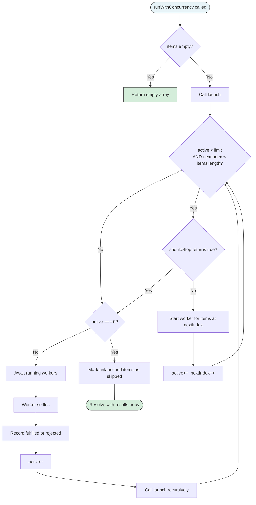
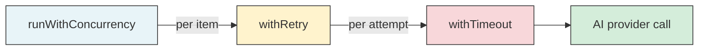

# Concurrency

The `runWithConcurrency` function in
[`src/helpers/concurrency.ts`](../../src/helpers/concurrency.ts) processes an
array of work items through an async worker function with a sliding-window
concurrency limit. Unlike batch-then-await approaches (`Promise.all` on
N-item chunks), it starts a new task the moment any running task completes,
keeping the number of active tasks pinned to `min(limit, remaining)` at all
times.

## What it does

The module exports three symbols:

| Export | Kind | Purpose |
|--------|------|---------|
| `ConcurrencyOptions<T, R>` | Interface | Configuration for items, concurrency limit, worker function, and optional early-stop signal |
| `ConcurrencyResult<R>` | Discriminated union | Per-item outcome: `fulfilled` with a value, `rejected` with a reason, or `skipped` |
| `runWithConcurrency` | Generic async function | Sliding-window executor that returns results in input order |

The function accepts a generic `ConcurrencyOptions<T, R>` object:

| Property | Type | Required | Purpose |
|----------|------|----------|---------|
| `items` | `T[]` | Yes | Work items to process |
| `concurrency` | `number` | Yes | Maximum number of concurrent workers (clamped to minimum 1) |
| `worker` | `(item: T, index: number) => Promise<R>` | Yes | Async function invoked once per item |
| `shouldStop` | `() => boolean` | No | When true, prevents new items from launching; running tasks complete normally |

## Why it exists

Dispatch processes multiple issues in parallel during both the
[dispatch pipeline](../cli-orchestration/dispatch-pipeline.md) and the
[spec pipeline](../spec-generation/overview.md). Without a concurrency
limiter, launching all issues simultaneously would overwhelm AI provider
backends, exhaust system resources (open file descriptors, memory for
concurrent git worktrees), and produce unpredictable rate-limiting failures.

A batch-and-wait approach (split items into groups of N, run each group with
`Promise.all`, wait for the entire group to finish before starting the next)
wastes time when tasks have variable duration — one slow task in a batch
blocks the launch of the next batch even when other workers are idle.

The sliding-window model solves this:

- **Maximum utilization** — a new task starts as soon as any active task
  completes, keeping all worker slots occupied until the queue drains.
- **Bounded resource usage** — the concurrency limit caps the number of
  concurrent AI provider sessions, worktrees, and file handles.
- **Graceful early termination** — the `shouldStop` callback allows the
  pipeline to stop launching new work (e.g., on user cancellation or fatal
  error) while still awaiting already-running tasks.

## How it works

### Sliding-window mechanics

1. The `launch()` function fills worker slots up to the concurrency limit.
2. Each worker's `.then()` handler records the result, decrements the active
   count, and calls `launch()` again to fill the freed slot.
3. When `active` reaches 0 and no more items are queued, the outer promise
   resolves.

This creates a self-scheduling loop where worker completions drive the
launch of new work, maintaining the concurrency invariant without polling or
external scheduling.

### Result ordering

Results are stored in a pre-allocated array indexed by each item's position
in the input. This guarantees that results appear in the same order as the
input items, regardless of the order in which workers complete.

### Early termination with `shouldStop`

When `shouldStop` returns `true`:

1. The `launch()` loop breaks immediately, launching no new workers.
2. Already-running workers continue to completion (they cannot be cancelled).
3. Once all active workers settle, any items that were never launched receive
   a `{ status: "skipped" }` result.

This design avoids aborting in-flight AI provider sessions, which could leave
worktrees in an inconsistent state.

### Edge cases

| Scenario | Behavior |
|----------|----------|
| Empty items array | Returns `[]` immediately, no workers launched |
| `concurrency` less than 1 | Clamped to 1 via `Math.max(1, concurrency)` |
| `concurrency` exceeds item count | All items launch immediately |
| Worker throws | Result recorded as `{ status: "rejected", reason }`, other workers continue |
| `shouldStop` returns true before any launch | All items marked `skipped` |

### Why individual worker failures do not abort the run

The function uses a `Promise.allSettled`-style result model. Each worker's
success or failure is recorded independently, and remaining workers continue
regardless. This is critical for Dispatch's pipelines: if one issue fails
(e.g., an AI provider timeout), other issues should still be processed. The
caller inspects the results array to determine per-item outcomes and aggregate
success/failure counts.

## Composition with retry and timeout

In production pipelines, `runWithConcurrency` wraps workers that internally
use [`withRetry`](./retry.md) and [`withTimeout`](./timeout.md) to add
resilience:

The concurrency limiter controls **how many items** run in parallel. The retry
wrapper controls **how many attempts** each item gets. The timeout wrapper
controls **how long** each attempt can take. This three-layer resilience stack
is assembled by the orchestrator pipelines, not by the concurrency module
itself — each layer is independently testable and composable.

## Current usage

| Consumer | Source | Concurrency value | `shouldStop` used? |
|----------|--------|-------------------|-------------------|
| Dispatch pipeline (execution phase) | [`src/orchestrator/dispatch-pipeline.ts:741`](../../src/orchestrator/dispatch-pipeline.ts) | User-configured `concurrency` from CLI/config | No |
| Dispatch pipeline (commit phase) | [`src/orchestrator/dispatch-pipeline.ts:959`](../../src/orchestrator/dispatch-pipeline.ts) | User-configured `concurrency` | No |
| Spec pipeline | [`src/orchestrator/spec-pipeline.ts:516`](../../src/orchestrator/spec-pipeline.ts) | User-configured `concurrency` | No |

The concurrency value is provided by the user via the `--concurrency` CLI flag
or `.dispatch/config.json`. See
[Configuration](../cli-orchestration/configuration.md) for details.

None of the current consumers use the `shouldStop` callback. It was designed as
an extension point for future features such as interactive cancellation or
budget-based stopping (e.g., stop after N failures).

## Test coverage

The test file
[`src/tests/concurrency.test.ts`](../../src/tests/concurrency.test.ts)
covers:

- Basic execution with items smaller and larger than the concurrency limit
- Concurrency limit enforcement (verifying active count never exceeds limit)
- Result ordering matches input ordering
- Worker failures recorded as `rejected` without aborting other workers
- `shouldStop` callback prevents new launches and marks remaining as `skipped`
- Empty input returns empty array
- Concurrency of 0 is clamped to 1
- Mixed fulfilled/rejected results in the correct positions

## Related documentation

- [Shared Utilities overview](./overview.md) -- Context for all shared utility
  modules
- [Retry](./retry.md) -- The `withRetry` wrapper used inside concurrency
  workers for per-attempt resilience
- [Timeout](./timeout.md) -- The `withTimeout` wrapper used inside retry
  attempts for deadline enforcement
- [Dispatch Pipeline](../cli-orchestration/dispatch-pipeline.md) -- Primary
  consumer for parallel task execution and commit phases
- [Spec Generation](../spec-generation/overview.md) -- Uses concurrency for
  parallel spec generation across multiple issues
- [Configuration](../cli-orchestration/configuration.md) -- Where the
  `--concurrency` CLI flag and config key are documented
- [Architecture overview](../architecture.md) -- System-wide context for the
  concurrency model
- [Testing](./testing.md) -- How to run the concurrency tests
- [Planner Agent](../agent-system/planner-agent.md) -- Uses concurrency
  indirectly through the dispatch pipeline's batch execution
- [Architecture & Concurrency](../task-parsing/architecture-and-concurrency.md) --
  Read-modify-write patterns and concurrent file I/O considerations
