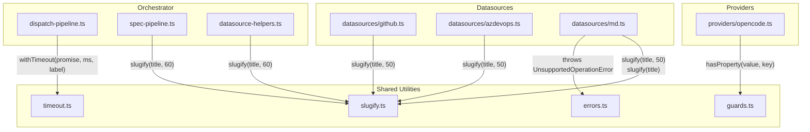

# Shared Utilities

The shared utilities layer provides pure, focused modules consumed across
multiple subsystems in the Dispatch CLI. Key capabilities include
string-to-identifier conversion, promise deadline enforcement, runtime type
guards, custom error types, and startup prerequisite validation.

| File | Purpose |
|------|---------|
| [`src/helpers/slugify.ts`](../../src/helpers/slugify.ts) | Convert arbitrary text into URL/filesystem-safe identifiers |
| [`src/helpers/timeout.ts`](../../src/helpers/timeout.ts) | Wrap any promise with a configurable deadline and labeled error |
| [`src/helpers/errors.ts`](../../src/helpers/errors.ts) | Custom `UnsupportedOperationError` for datasource operations that are structurally unsupported |
| [`src/helpers/guards.ts`](../../src/helpers/guards.ts) | Runtime `hasProperty` type guard for safely narrowing `unknown` values |
| [`src/helpers/prereqs.ts`](../../src/helpers/prereqs.ts) | Startup prerequisite checker validating git, Node.js, and datasource-specific CLIs |
| [`src/helpers/index.ts`](../../src/helpers/index.ts) | Barrel re-export aggregating all helper modules into a single import surface |

## Why these utilities exist

Dispatch generates git branch names and spec filenames from user-supplied
issue titles, runs AI agent planning steps that can hang indefinitely, and
processes loosely-typed data from external AI providers. These operations
need small, well-tested building blocks:

- **slugify** ensures that titles like `"Add dark-mode support!"` produce
  consistent, portable identifiers (`add-dark-mode-support`) regardless of
  casing, punctuation, or Unicode content. These identifiers are used for
  [branch naming](../datasource-system/overview.md#branch-naming-convention)
  and [temp file naming](../datasource-system/datasource-helpers.md#writeitemstotempdir).
- **withTimeout** ensures that a planning step that exceeds its deadline is
  interrupted with a descriptive `TimeoutError`, enabling the retry loop in
  the [orchestrator](../cli-orchestration/orchestrator.md) to attempt recovery.
- **UnsupportedOperationError** lets datasource implementations signal that
  an interface method is structurally unsupported (e.g., the markdown
  datasource cannot create git branches). See [Errors](./errors.md).
- **hasProperty** provides a composable, type-safe way to inspect `unknown`
  values from SSE events and JSON payloads without `as` casts. See
  [Guards](./guards.md).
- **checkPrereqs** validates the host environment at startup before any
  pipeline logic runs. See
  [Prerequisite Checker](../prereqs-and-safety/prereqs.md).

## How modules depend on these utilities

## Two maxLength conventions

Consumers have settled on two truncation limits:

| maxLength | Context | Rationale |
|-----------|---------|-----------|
| **50** | Git branch names (`<username>/dispatch/<number>-<slug>`) | Practical limit for branch name portability across Git hosts |
| **60** | Spec filenames (`<id>-<slug>.md`) | Keeps filenames readable while accommodating longer titles |
| *(none)* | Markdown datasource `create()` | No truncation needed for internal identifiers |

## The helpers barrel (`helpers/index.ts`)

The barrel file at `src/helpers/index.ts` re-exports 14 sub-modules through
a single import surface. Every module listed below is public -- there is no
internal vs. external distinction. Any module in the codebase can import from
`"../helpers/index.js"` to access any of these exports.

| Re-exported module | Primary export(s) |
|--------------------|-------------------|
| `format` | String formatting utilities |
| `slugify` | `slugify()` -- identifier conversion |
| `timeout` | `withTimeout()` -- promise deadline enforcement |
| `retry` | Retry logic for transient failures |
| `logger` | `log` -- structured console logger |
| `cleanup` | `registerCleanup()`, `runCleanup()` -- shutdown registry |
| `prereqs` | `checkPrereqs()` -- startup environment validation |
| `confirm-large-batch` | User confirmation for large task batches |
| `worktree` | Git worktree creation and management |
| `run-state` | Pipeline run-state tracking |
| `errors` | `UnsupportedOperationError` |
| `guards` | `hasProperty()` -- runtime type guard |
| `branch-validation` | Branch name validation |
| `file-logger` | `fileLoggerStorage` -- AsyncLocalStorage-based file logging |

### Adding a new helper module

To add a new helper, create the module under `src/helpers/` and add a
re-export line to `src/helpers/index.ts`. No other registration or
configuration is required -- the barrel pattern makes the new export
immediately available to all consumers.

## Detailed documentation

- [Slugify](./slugify.md) -- String-to-identifier conversion, Unicode
  behavior, truncation edge cases, and cross-codebase usage
- [Timeout](./timeout.md) -- Promise deadline enforcement, TimeoutError,
  retry strategy, memory considerations, and configuration
- [Errors](./errors.md) -- `UnsupportedOperationError` custom error class
  for datasource operations that are structurally unsupported
- [Guards](./guards.md) -- `hasProperty` runtime type guard for safe
  property access on `unknown` values
- [Testing](./testing.md) -- Vitest integration, fake timers, test
  organization, and how to run the shared utility tests

## Related documentation

- [Prerequisite Checker](../prereqs-and-safety/prereqs.md) -- Startup
  environment validation (git, Node.js, datasource CLIs)
- [Prerequisites & Safety overview](../prereqs-and-safety/overview.md) --
  The prereqs subsystem and its integration with the CLI flow
- [Shared Interfaces & Utilities](../shared-types/overview.md) -- The broader
  shared layer (cleanup, format, logger, parser, provider) that these
  utilities complement
- [CLI & Orchestration](../cli-orchestration/overview.md) -- How the
  orchestrator consumes `withTimeout` for plan deadlines
- [Orchestrator Pipeline](../cli-orchestration/orchestrator.md) -- The
  dispatch pipeline that uses `withTimeout` for planning timeouts
- [Datasource System](../datasource-system/overview.md) -- How datasources
  use `slugify` for branch name generation
- [Datasource Helpers](../datasource-system/datasource-helpers.md) -- How
  `slugify` is used for temp file naming in `writeItemsToTempDir()`
- [Spec Generation](../spec-generation/overview.md) -- How spec pipelines use
  `slugify` for spec filenames
- [Planner Agent](../planning-and-dispatch/planner.md) -- The planning phase
  that is subject to `withTimeout` deadline enforcement
- [Testing Overview](../testing/overview.md) -- Project-wide test suite
  including slugify and timeout test coverage
- [Config Tests](../testing/config-tests.md) -- Tests covering `planTimeout`
  and `planRetries` validation, which are consumed by the timeout utility
- [GitHub Datasource](../datasource-system/github-datasource.md) -- Where
  `slugify` is used for branch naming
- [Markdown Datasource](../datasource-system/markdown-datasource.md) -- Where
  `UnsupportedOperationError` is thrown for unsupported git lifecycle methods
- [Architecture overview](../architecture.md) -- System-wide context
- [Testing Overview](../testing/overview.md) -- Project-wide test suite
  including slugify, timeout, and guard utility test coverage
