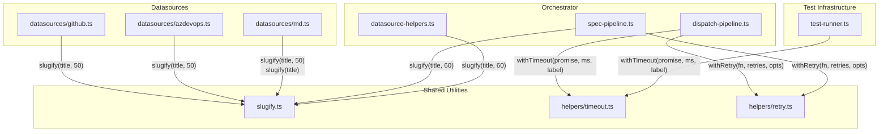

# Shared Utilities

The shared utilities layer provides three pure, dependency-light modules that
are consumed across multiple subsystems in the Dispatch CLI: **slugify** for
deterministic string-to-identifier conversion, **timeout** for promise-level
deadline enforcement, and **retry** for automatic retry of failing async
operations.

| File | Purpose |
|------|---------|
| [`src/slugify.ts`](../../src/slugify.ts) | Convert arbitrary text into URL/filesystem-safe identifiers |
| [`src/helpers/timeout.ts`](../../src/helpers/timeout.ts) | Wrap any promise with a configurable deadline and labeled error |
| [`src/helpers/retry.ts`](../../src/helpers/retry.ts) | Wrap any async function with configurable retry count and labeled diagnostics |

## Why these utilities exist

Dispatch generates git branch names and spec filenames from user-supplied
issue titles, and it runs AI agent operations that can hang indefinitely or
fail transiently. All three operations need small, well-tested building blocks:

- **slugify** ensures that titles like `"Add dark-mode support!"` produce
  consistent, portable identifiers (`add-dark-mode-support`) regardless of
  casing, punctuation, or Unicode content. These identifiers are used for
  [branch naming](../datasource-system/overview.md#branch-naming-convention)
  and [temp file naming](../datasource-system/datasource-helpers.md#writeitemstotempdir).
- **withTimeout** ensures that a planning step that exceeds its deadline is
  interrupted with a descriptive `TimeoutError`, enabling the retry loop in
  the [orchestrator](../cli-orchestration/orchestrator.md) to attempt recovery.
- **withRetry** wraps executor and spec generation calls with automatic
  retry logic, so transient AI backend failures do not cause immediate task
  failure. Retries are immediate with no backoff.

## How modules depend on these utilities

## Two maxLength conventions

Consumers have settled on two truncation limits:

| maxLength | Context | Rationale |
|-----------|---------|-----------|
| **50** | Git branch names (`dispatch/<number>-<slug>`) | Practical limit for branch name portability across Git hosts |
| **60** | Spec filenames (`<id>-<slug>.md`) | Keeps filenames readable while accommodating longer titles |
| *(none)* | Markdown datasource `create()` | No truncation needed for internal identifiers |

## Detailed documentation

- [Slugify](./slugify.md) -- String-to-identifier conversion, Unicode
  behavior, truncation edge cases, and cross-codebase usage
- [Timeout](./timeout.md) -- Promise deadline enforcement, TimeoutError,
  retry strategy, memory considerations, and configuration
- [Retry](./retry.md) -- Automatic retry wrapper, logging behavior, pipeline
  consumers, error type preservation
- [Resilience overview](./resilience.md) -- How cleanup, retry, and timeout
  compose in the dispatch pipeline
- [Testing](./testing.md) -- Vitest integration, fake timers, test
  organization, and how to run the shared utility tests

## Related documentation

- [Shared Interfaces & Utilities](../shared-types/overview.md) -- The broader
  shared layer (cleanup, format, logger, parser, provider) that these
  utilities complement
- [Cleanup Registry](../shared-types/cleanup.md) -- Process-level resource
  teardown, part of the resilience trio with timeout and retry
- [CLI & Orchestration](../cli-orchestration/overview.md) -- How the
  orchestrator consumes `withTimeout` and `withRetry`
- [Orchestrator Pipeline](../cli-orchestration/orchestrator.md) -- The
  dispatch pipeline that uses `withTimeout` for planning timeouts and
  `withRetry` for executor retries
- [Datasource System](../datasource-system/overview.md) -- How datasources
  use `slugify` for branch name generation
- [Datasource Helpers](../datasource-system/datasource-helpers.md) -- How
  `slugify` is used for temp file naming in `writeItemsToTempDir()`
- [Spec Generation](../spec-generation/overview.md) -- How spec pipelines use
  `slugify` for spec filenames and `withRetry` for generation retries
- [Planner Agent](../planning-and-dispatch/planner.md) -- The planning phase
  that is subject to `withTimeout` deadline enforcement
- [Testing Overview](../testing/overview.md) -- Project-wide test suite
  including slugify, timeout, and retry test coverage
- [Architecture overview](../architecture.md) -- System-wide context
