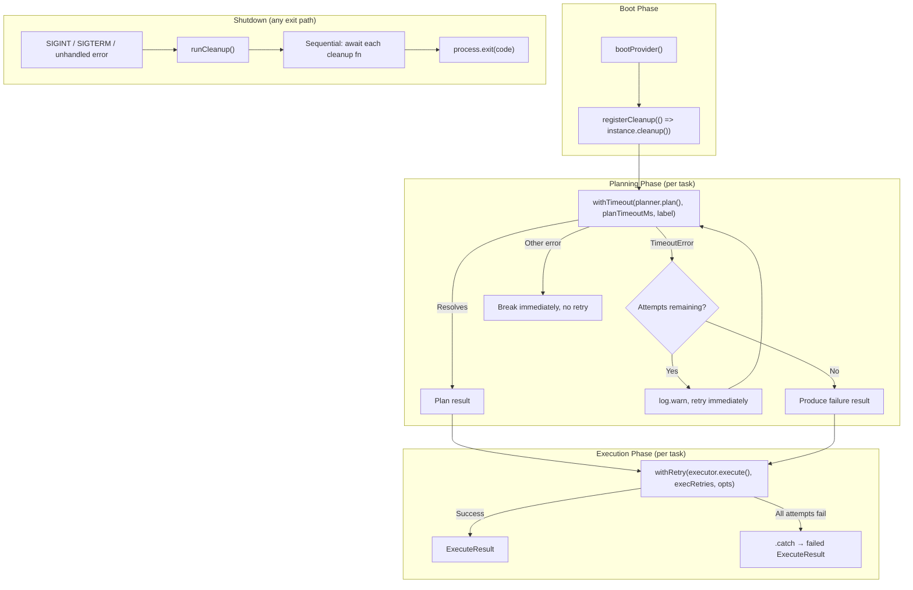

# Resilience Utilities -- Composition Overview

The Dispatch CLI uses three resilience utilities -- **cleanup**, **timeout**,
and **retry** -- to handle resource teardown, deadline enforcement, and
transient failure recovery. Each utility is a small, single-purpose module,
but they compose together in the pipeline orchestrators to provide end-to-end
resilience for AI agent operations.

## What each utility does

| Utility | File | Purpose |
|---------|------|---------|
| Cleanup registry | [`src/helpers/cleanup.ts`](../../src/helpers/cleanup.ts) | Process-level callback registry for resource teardown on exit |
| Timeout | [`src/helpers/timeout.ts`](../../src/helpers/timeout.ts) | Promise deadline enforcement with labeled `TimeoutError` |
| Retry | [`src/helpers/retry.ts`](../../src/helpers/retry.ts) | Automatic retry of failing async functions with logging |

## Why they are separate modules

Each utility addresses a distinct failure mode:

- **Cleanup** handles the "process is exiting" case -- ensuring spawned AI
  server processes are terminated regardless of how the CLI exits (signal,
  error, or normal completion).
- **Timeout** handles the "operation is hanging" case -- converting an
  indefinitely-blocked promise into a catchable `TimeoutError` after a
  deadline.
- **Retry** handles the "operation failed transiently" case -- re-invoking a
  failed function immediately without requiring the caller to implement loop
  logic.

Keeping them separate means each can be used independently. Not every
consumer needs all three: the fix-tests pipeline uses only cleanup, the
test runner uses only timeout, and the spec pipeline uses cleanup + retry
but not timeout.

## How they compose in the dispatch pipeline

The dispatch pipeline (`src/orchestrator/dispatch-pipeline.ts`) is the only
module that uses all three utilities together. The following diagram shows how
they layer:

### Planning: timeout + manual retry

The planning phase wraps `localPlanner.plan()` with `withTimeout` and
implements its own retry loop (it does **not** use `withRetry`). This is
because planning retries are selective:

| Error type | Action |
|------------|--------|
| `TimeoutError` | Retry immediately (up to `maxPlanAttempts`) |
| Any other error | Break immediately, no retry |

The `withRetry` utility retries on **all** errors unconditionally, which does
not match this selective requirement.

**Configuration:**

| Parameter | CLI flag | Config key | Default | Formula |
|-----------|----------|------------|---------|---------|
| Plan timeout | `--plan-timeout` | `planTimeout` | 10 minutes | `(planTimeout ?? 10) * 60_000` ms |
| Plan retries | `--plan-retries` | `planRetries` | 1 | `(planRetries ?? retries ?? 1) + 1` total attempts |

### Execution: withRetry

The execution phase wraps `localExecutor.execute()` with `withRetry`:

- `execRetries = 2` (hardcoded), giving 3 total attempts
- Retries on **any** error (unconditional)
- The outer `.catch()` converts the final error into a failed `ExecuteResult`

### Cleanup: register at boot, drain on exit

Cleanup functions are registered immediately after `bootProvider()` and
drained from three exit paths:

| Exit path | Location | Exit code |
|-----------|----------|-----------|
| SIGINT handler | `src/cli.ts:289` | 130 |
| SIGTERM handler | `src/cli.ts:295` | 143 |
| `main().catch()` | `src/cli.ts:321-324` | 1 |

The `splice(0)` pattern in `runCleanup()` makes drain calls idempotent --
a rapid double-signal scenario is safe because the second call finds an
empty registry.

## Pipeline comparison

| Pipeline | Cleanup | Timeout | Retry |
|----------|---------|---------|-------|
| **Dispatch** (`dispatch-pipeline.ts`) | Provider + worktree cleanup | Planning deadline | Executor retry (withRetry) + planning retry (manual) |
| **Spec** (`spec-pipeline.ts`) | Provider cleanup | -- | Spec generation retry (withRetry) |
| **Fix-tests** (`fix-tests-pipeline.ts`) | Provider cleanup | -- | -- |
| **Test runner** (`test-runner.ts`) | -- | Test execution deadline | -- |

## Design trade-offs

### No timeout on cleanup functions

Individual cleanup functions have no timeout. If a provider's `cleanup()`
hangs, `process.exit()` is never reached. Mitigation: double-signal (second
Ctrl+C) triggers a second `runCleanup()` that returns immediately (empty
registry) and calls `process.exit()`.

### No backoff on retry

Both `withRetry` and the planning retry loop retry immediately with no delay.
This is appropriate for AI backend transient failures but would be
inappropriate for rate-limited APIs. If rate limiting becomes a concern,
`RetryOptions` could be extended with a `delay` or `backoff` parameter.

### No cancellation on timeout

`withTimeout` does not cancel the underlying operation when the timer fires.
The `.then()` handler remains attached to the original promise, and a
`settled` flag prevents it from taking effect. The original promise may
continue consuming resources until it eventually settles or the process exits.

### Planning uses manual retry instead of withRetry

The planning phase needs error-type-selective retry (only `TimeoutError`),
which `withRetry` does not support. A future enhancement could add an
optional `shouldRetry(error)` predicate to `RetryOptions`.

## Related documentation

- [Cleanup Registry](../shared-types/cleanup.md) -- Detailed cleanup
  registry behavior, signal coordination, error swallowing rationale
- [Timeout](./timeout.md) -- Promise deadline enforcement, TimeoutError,
  memory considerations
- [Retry](./retry.md) -- Automatic retry wrapper, logging behavior, error
  type preservation
- [Shared Utilities overview](./overview.md) -- All shared utility modules
- [Configuration](../cli-orchestration/configuration.md) -- `planTimeout`,
  `planRetries`, and related CLI flags
- [Orchestrator](../cli-orchestration/orchestrator.md) -- The dispatch
  pipeline that composes all three utilities
- [Architecture overview](../architecture.md) -- System-wide context
  including cross-cutting concerns
