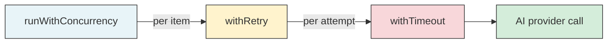

# Retry

The `withRetry` function in
[`src/helpers/retry.ts`](../../src/helpers/retry.ts) retries an async function
on failure up to a configurable number of times. It provides a generic,
label-aware retry wrapper used by the orchestrator pipelines to add resilience
to AI provider calls and spec generation attempts.

## What it does

The module exports three symbols:

| Export | Kind | Purpose |
|--------|------|---------|
| `DEFAULT_RETRY_COUNT` | Constant (`3`) | Default retry count used by pipeline consumers |
| `RetryOptions` | Interface | Optional label for log output identifying the operation |
| `withRetry` | Generic async function | Retry wrapper that re-throws the last error on exhaustion |

### Function signature

```
withRetry<T>(fn: () => Promise<T>, maxRetries: number, options?: RetryOptions): Promise<T>
```

- `fn` -- the async function to execute (called with no arguments)
- `maxRetries` -- number of retry attempts (0 = no retries, just one attempt;
  3 = one initial attempt plus three retries = four total attempts)
- `options.label` -- optional string included in log messages to identify
  the operation being retried

## Why it exists

Dispatch orchestrates calls to external AI provider backends (OpenCode,
Copilot, Claude, Codex) that can fail transiently due to:

- **Network timeouts** -- provider API calls crossing the internet
- **Rate limiting** -- provider-side throttling under load
- **Backend transients** -- temporary provider outages or restarts
- **Session expiration** -- provider sessions timing out during long runs

A simple retry wrapper with logging provides resilience against these
transient failures without requiring complex circuit-breaker or backoff
infrastructure.

## How it works

The retry logic is a straightforward loop:

1. Execute `fn()` and return its result on success.
2. On failure, log a warning with the attempt number and error message.
3. Log a debug message indicating the next retry attempt.
4. Repeat until `maxRetries` additional attempts are exhausted.
5. If all attempts fail, re-throw the last error.

### No backoff delay

The retry loop contains **no delay between attempts** -- retries are
immediate. This is an intentional design decision:

- **AI provider failures are typically binary** -- the provider is either
  temporarily overloaded (and recovers within seconds) or is persistently
  down. A short backoff delay would not meaningfully improve success rates
  for either case.
- **Pipeline-level timeouts bound total duration** -- each retry attempt
  is typically wrapped in [`withTimeout`](./timeout.md), so the total
  wall-clock time is bounded regardless of retry speed.
- **Simplicity** -- avoiding backoff logic (exponential, jitter, etc.)
  keeps the retry utility minimal and predictable.

If future use cases require backoff, it can be added via a `delay` option
without changing the existing API.

### Logging behavior

Each failed attempt (except the last) produces two log messages:

| Log level | Message pattern | Example |
|-----------|----------------|---------|
| `warn` | `Attempt N/M failed [label]: message` | `Attempt 1/4 failed [planner.plan()]: fetch failed` |
| `debug` | `Retrying [label] (attempt N/M)` | `Retrying [planner.plan()] (attempt 2/4)` |

The final failed attempt does **not** produce a warning -- it simply
re-throws the error for the caller to handle. This avoids duplicate error
reporting when the caller has its own error handling.

### Total attempts vs. retries

The `maxRetries` parameter specifies **retry** count, not total attempts.
With `maxRetries = 3`, the function makes up to 4 total attempts (1 initial +
3 retries). This convention matches the `DEFAULT_RETRY_COUNT = 3` constant.

The internal implementation uses `maxAttempts = maxRetries + 1` and loops
from 1 to `maxAttempts`.

## Composition with timeout and concurrency

In production pipelines, `withRetry` is composed with
[`withTimeout`](./timeout.md) and
[`runWithConcurrency`](./concurrency.md) to form a three-layer resilience
stack:



- **Concurrency** controls how many items run in parallel.
- **Retry** controls how many attempts each item gets.
- **Timeout** controls how long each attempt can run.

### Spec pipeline composition example

The [spec pipeline](../spec-generation/overview.md) at
[`src/orchestrator/spec-pipeline.ts:363`](../../src/orchestrator/spec-pipeline.ts)
composes these layers:

1. `runWithConcurrency` processes all spec items in parallel.
2. Each item's worker wraps the generation call in `withRetry`.
3. Inside each retry attempt, `withTimeout` bounds the AI call duration.
4. If `withTimeout` throws a `TimeoutError`, `withRetry` catches it and
   retries immediately.
5. If all retries are exhausted, only that item fails -- other items
   continue via the concurrency executor's `allSettled`-style semantics.

### Dispatch pipeline composition

The [dispatch pipeline](../cli-orchestration/dispatch-pipeline.md) at
[`src/orchestrator/dispatch-pipeline.ts:650`](../../src/orchestrator/dispatch-pipeline.ts)
uses `withRetry` for the execution phase. The retry wraps the full
agent-dispatch cycle including prompt construction, provider dispatch, and
result handling.

## Current usage

| Consumer | Source | `maxRetries` value | Label |
|----------|--------|--------------------|-------|
| Dispatch pipeline (execution) | [`src/orchestrator/dispatch-pipeline.ts:650`](../../src/orchestrator/dispatch-pipeline.ts) | User-configured `retries` (default `DEFAULT_RETRY_COUNT = 3`) | Task-specific label |
| Spec pipeline (generation) | [`src/orchestrator/spec-pipeline.ts:363`](../../src/orchestrator/spec-pipeline.ts) | User-configured `retries` (default `DEFAULT_RETRY_COUNT = 3`) | `specAgent.generate(#42)` or file path |

Both consumers allow the retry count to be configured via the `--retries`
CLI flag or `.dispatch/config.json`. See
[Configuration](../cli-orchestration/configuration.md) for details. The
`DEFAULT_RETRY_COUNT` constant is used as the fallback when no configuration
is provided.

## Test coverage

The test file
[`src/tests/retry.test.ts`](../../src/tests/retry.test.ts)
covers:

- Successful execution on the first attempt (no retries needed)
- Retry on transient failures with eventual success
- All attempts exhausted, last error re-thrown
- `maxRetries = 0` means a single attempt with no retries
- Warning and debug log output on intermediate failures
- No log output on the final failed attempt
- Label inclusion in log messages when provided
- Non-Error thrown values (strings, custom error classes) handled correctly
- Successful return value preserved through retries

## Related documentation

- [Shared Utilities overview](./overview.md) -- Context for all shared utility
  modules
- [Timeout](./timeout.md) -- The `withTimeout` wrapper used inside retry
  attempts for deadline enforcement
- [Concurrency](./concurrency.md) -- The `runWithConcurrency` wrapper that
  processes multiple items in parallel, each potentially using `withRetry`
- [Console Logger](../shared-types/logger.md) -- The `log` object used for
  warning and debug output during retries
- [Dispatch Pipeline](../cli-orchestration/dispatch-pipeline.md) -- Primary
  consumer for execution-phase retry logic
- [Spec Generation](../spec-generation/overview.md) -- Uses retry for
  per-item spec generation resilience
- [Configuration](../cli-orchestration/configuration.md) -- Where the
  `--retries` CLI flag and config key are documented
- [Testing](./testing.md) -- How to run the retry tests
- [Helpers & Utilities Tests](../testing/helpers-utilities-tests.md) -- Tests
  covering retry, timeout, concurrency, and other utility functions
