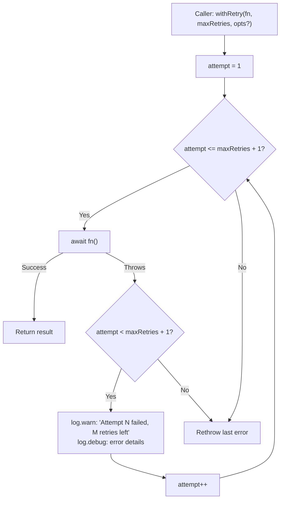

# Retry

## What it does

The `withRetry<T>` function in
[`src/helpers/retry.ts`](../../src/helpers/retry.ts) wraps any async function
with automatic retry logic. If the function throws, `withRetry` re-invokes it
up to `maxRetries` additional times. On success at any attempt, the result is
returned immediately. If all attempts are exhausted, the last error is
rethrown.

The module exports one function and one options interface:

| Export | Kind | Purpose |
|--------|------|---------|
| `withRetry` | Generic async function | Wraps `() => Promise<T>` with configurable retry count and optional label for log messages |
| `RetryOptions` | Interface | Optional `label` string included in log output to identify which operation is being retried |

## Why it exists

The Dispatch CLI orchestrates AI agent operations that can fail transiently
-- network timeouts, rate limits, or temporary backend unavailability. Without
retry logic, a single transient failure would cause the entire task to fail.
`withRetry` provides:

- **Configurable retry budget.** Callers specify how many additional attempts
  are allowed via `maxRetries`. Total attempts = `maxRetries + 1`.
- **Labeled diagnostics.** The optional `label` parameter is included in
  `log.warn()` and `log.debug()` messages so operators can identify which
  operation failed and how many attempts remain.
- **Minimal overhead.** There is no backoff, jitter, or delay between retries.
  Retries are immediate. This is appropriate for the current use case where
  failures are typically resolved by a fresh attempt against the same backend.

## How it works

The function runs a simple loop from attempt 1 through `maxRetries + 1`:



Key behaviors:

1. **Immediate retry.** There is no `setTimeout`, exponential backoff, or
   delay between attempts. The next `await fn()` call happens synchronously
   after the catch.
2. **Last error rethrown.** When all attempts are exhausted, the error from
   the final attempt is rethrown with its original type preserved (including
   custom error classes and non-Error thrown values).
3. **Non-final failures are logged, not thrown.** Intermediate failures
   produce a `log.warn()` message (always visible) and a `log.debug()` message
   (visible only with `--verbose`).

### Retry count semantics

The `maxRetries` parameter means **additional** attempts beyond the first:

| `maxRetries` | Total attempts | Behavior |
|-------------|----------------|----------|
| `0` | 1 | No retry -- equivalent to calling `fn()` directly |
| `1` | 2 | One retry after initial failure |
| `2` | 3 | Two retries after initial failure |
| `3` | 4 | Three retries after initial failure |

This convention matches the parameter name: "max retries" counts retries, not
total attempts.

## Logging behavior

`withRetry` imports from `src/helpers/logger.ts` and produces two log levels
on non-final failures:

| Level | Method | Visibility | Content |
|-------|--------|-----------|---------|
| Warning | `log.warn()` | Always visible (stdout) | `"Attempt N failed for <label>, M retries left"` |
| Debug | `log.debug()` | Only with `--verbose` flag | Error message or stringified thrown value |

Both messages are written to **stdout** via `console.log`. Only `log.error()`
uses `console.error` (stderr). There is no structured JSON logging and no log
file output.

When a `label` is provided (e.g., `"planner.plan()"`), the warn message
includes it for identification. When no label is provided, the message uses a
generic format.

On the **final** failed attempt, no warning is logged -- the error is rethrown
to the caller, which is responsible for logging or handling it.

## Pipeline consumers

### Dispatch pipeline -- executor retry

The dispatch pipeline (`src/orchestrator/dispatch-pipeline.ts:385`) wraps
executor calls with `withRetry`:

```
const execResult = await withRetry(
    () => localExecutor.execute(task, plan, ...),
    execRetries,
    { label: "executor.execute()" }
);
```

The `execRetries` value defaults to `2` (hardcoded), giving 3 total execution
attempts per task. If all attempts fail, the `.catch()` converts the error
into a failed `ExecuteResult` rather than propagating the exception.

### Spec pipeline -- spec generation retry

The spec pipeline (`src/orchestrator/spec-pipeline.ts:273`) wraps spec
generation with `withRetry`:

```
const result = await withRetry(
    () => specAgent.generate(...),
    retries,
    { label: "spec generation" }
);
```

The `retries` parameter defaults to `2`, giving 3 total spec generation
attempts per issue.

### Planning phase -- manual retry (does NOT use withRetry)

The planning phase in `dispatch-pipeline.ts` implements its **own** retry loop
rather than using `withRetry`. This is because planning retries are
conditional on the error type:

- On `TimeoutError`: retry up to `maxPlanAttempts`
- On any other error: break immediately (no retry)

The `withRetry` function retries on **all** errors unconditionally, which does
not match the planning phase's selective retry requirement.

## Why there is no backoff

The retry implementation has no delay, exponential backoff, or jitter between
attempts. This is a deliberate design choice:

- **AI backend failures are typically transient.** The most common failure mode
  is a momentary backend hiccup that resolves immediately on retry.
- **The CLI is interactive.** Adding delays between retries would increase
  wall-clock time for the user with minimal benefit.
- **Operations are already slow.** AI agent calls take seconds to minutes.
  Adding a few seconds of backoff delay is negligible compared to the operation
  duration, and the benefit of spacing retries is minimal when the failure is
  not rate-limit related.

If rate limiting or thundering-herd scenarios become a concern, backoff could
be added via an optional `delay` or `backoff` parameter in `RetryOptions`
without changing the existing API.

## Error type preservation

`withRetry` preserves the original error type on rethrow. The `catch` clause
captures whatever the function throws (Error subclasses, plain strings,
objects) and rethrows the same value if all attempts are exhausted. This means:

- Custom error classes (e.g., `TimeoutError`) retain their `instanceof` chain
- Non-Error thrown values (strings, numbers) are rethrown as-is
- The caller can use `instanceof` checks on the rethrown error

## Test coverage

The test file
[`src/tests/retry.test.ts`](../../src/tests/retry.test.ts)
contains tests covering:

- Success on first attempt (no retry needed)
- Success after intermediate failures
- All attempts exhausted (error rethrown)
- Correct attempt count (`maxRetries + 1` total calls)
- Logging behavior: `log.warn()` call count, `log.debug()` call count, label
  inclusion in messages, attempt number accuracy
- Edge cases: `maxRetries = 0` (single attempt), custom error types
  (`instanceof` preservation), non-Error thrown values (string)

The tests mock `log.warn` and `log.debug` from `src/helpers/logger.ts` to
verify log output without producing console noise. No fake timers are needed
because retries are immediate.

## Related documentation

- [Shared Utilities overview](./overview.md) -- Context for all shared
  utility modules
- [Timeout](./timeout.md) -- Promise deadline enforcement, used alongside
  retry in the dispatch pipeline
- [Resilience overview](./resilience.md) -- How cleanup, retry, and timeout
  compose in the dispatch pipeline
- [Testing](./testing.md) -- How to run retry tests and test patterns
- [Orchestrator](../cli-orchestration/orchestrator.md) -- The dispatch
  pipeline that consumes `withRetry` for executor calls
- [Spec Generation](../spec-generation/overview.md) -- The spec pipeline
  that consumes `withRetry` for spec generation
- [Cleanup Registry](../shared-types/cleanup.md) -- Process-level resource
  teardown, the third resilience utility
- [Logger](../shared-types/logger.md) -- Log routing for retry warn/debug
  messages
- [Configuration](../cli-orchestration/configuration.md) -- `--retries` and
  `--plan-retries` CLI options
