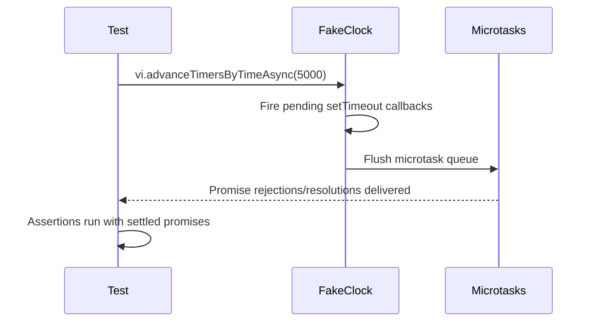

# Shared Utilities -- Testing

This document covers the test infrastructure and patterns specific to the
slugify, timeout, and retry utility modules.

## Test files

| Test file | Production module | Tests | Lines (test) | Lines (source) | Category |
|-----------|-------------------|-------|-------------|----------------|----------|
| [`src/tests/slugify.test.ts`](../../src/tests/slugify.test.ts) | [`src/slugify.ts`](../../src/slugify.ts) | 24 | 113 | 31 | Pure logic |
| [`src/tests/timeout.test.ts`](../../src/tests/timeout.test.ts) | [`src/helpers/timeout.ts`](../../src/helpers/timeout.ts) | ~12 | 190 | 79 | Async + fake timers |
| [`src/tests/retry.test.ts`](../../src/tests/retry.test.ts) | [`src/helpers/retry.ts`](../../src/helpers/retry.ts) | ~14 | 164 | 55 | Async + mocked logger |

## Running the tests

### All project tests

```
npm test
```

### Shared utility tests only

```
npx vitest run src/tests/slugify.test.ts src/tests/timeout.test.ts src/tests/retry.test.ts
```

### Single file

```
npx vitest run src/tests/slugify.test.ts
npx vitest run src/tests/timeout.test.ts
npx vitest run src/tests/retry.test.ts
```

### Watch mode

```
npx vitest src/tests/slugify.test.ts
```

## Framework details

The project uses [Vitest](https://vitest.dev/) **v4.0.18** with a
`vitest.config.ts` that configures v8 coverage (80% line threshold), a
module alias for `@openai/codex`, and test exclusions. See the
[Testing Overview](../testing/overview.md) for framework-wide details
including debugging and CI integration.

## Test patterns

### Pure function testing (slugify)

The slugify tests are straightforward input/output assertions with no mocking
or setup. Each test calls `slugify(input, maxLength?)` and asserts the
returned string with `expect(...).toBe(...)`. Tests are organized into
`describe` blocks by category:

- Basic transformations
- Unicode handling
- Truncation behavior
- Edge cases (empty input, already-valid input)
- Real-world patterns with specific maxLength values

No `beforeEach` or `afterEach` hooks are needed because the function is pure
and stateless.

### Fake timer testing (timeout)

The timeout tests need to control the passage of time to test deadline
behavior deterministically. They use Vitest's built-in fake timer API:

**Setup and teardown:**

```
beforeEach → vi.useFakeTimers()
afterEach  → vi.useRealTimers()
```

Every test in the file runs with fake timers active, and real timers are
restored after each test to prevent cross-test contamination.

**Advancing time:**

The tests use `vi.advanceTimersByTimeAsync(ms)` (the async variant) to
advance the fake clock. The async variant is required because `withTimeout`
creates real microtask chains via `Promise.then()` -- the synchronous
`vi.advanceTimersByTime()` would advance the clock but not flush the promise
microtask queue, leading to assertions running before the timeout rejection
propagates.

**Why `advanceTimersByTimeAsync` matters:**



Using the synchronous variant would skip the microtask flush step, causing
tests to see unsettled promises.

**The `p.catch(() => {})` pattern:**

The production code in `timeout.ts` includes a no-op `.catch()` on the
internal wrapper promise. When fake timers advance synchronously within a
test, the wrapper promise may reject before the test has attached its own
`.catch()` or `await`. Without the no-op handler, Node.js would emit an
unhandled rejection warning. This pattern is documented in the
[Vitest fake timers guide](https://vitest.dev/guide/mocking#timers) as a
known consideration when testing promise-based timeout logic.

### Logger mock testing (retry)

The retry tests verify logging behavior without producing console noise by
mocking the logger module. Tests use `vi.mock()` to replace `log.warn` and
`log.debug` with Vitest spy functions:

**Setup:**

```
vi.mock("../helpers/logger.js", () => ({
    log: { warn: vi.fn(), debug: vi.fn() }
}));
```

This replaces the logger with controlled spies for the entire test file.
Tests then assert on call counts and argument patterns:

- `log.warn` is called once per non-final failed attempt
- `log.debug` is called once per non-final failed attempt (for error details)
- The label string appears in warn messages when provided
- Attempt numbers and remaining retry counts are accurate

**No fake timers needed:**

Unlike the timeout tests, retry tests do not use `vi.useFakeTimers()` because
`withRetry` has no delay between attempts. The async functions used in tests
resolve or reject immediately, making the tests straightforward `await`-based
assertions.

**Error type coverage:**

The retry tests verify error type preservation through three scenarios:

- Standard `Error` instances: rethrown with `instanceof Error` intact
- Custom error subclasses: rethrown with `instanceof CustomError` intact
- Non-Error thrown values (strings): rethrown as-is and catchable

### What is NOT tested

The following edge case is not covered by the current test suite:

- **Trailing hyphen after truncation** in slugify: When `.slice(0, maxLength)`
  lands immediately after a character that was replaced by a hyphen, the
  result ends with a trailing hyphen. The trim step runs before truncation,
  not after. This is cosmetically imperfect but functionally harmless.

## Related documentation

- [Slugify](./slugify.md) -- Slugify function behavior and cross-codebase
  usage
- [Timeout](./timeout.md) -- Timeout function behavior, retry strategy, and
  memory considerations
- [Retry](./retry.md) -- Retry function behavior, logging, pipeline consumers
- [Resilience overview](./resilience.md) -- How cleanup, retry, and timeout
  compose in the dispatch pipeline
- [Shared Utilities overview](./overview.md) -- Context for the shared
  utility group
- [Testing Overview](../testing/overview.md) -- Project-wide test framework,
  patterns, and coverage map
- [Parser Tests](../testing/parser-tests.md) -- Parser test suite for
  comparison of pure-function and I/O testing patterns
- [Task Parsing Testing Guide](../task-parsing/testing-guide.md) -- Parser-specific
  testing patterns including temporary file cleanup
- [Configuration Tests](../testing/config-tests.md) -- Config test suite
  demonstrating similar pure-logic and I/O testing patterns
- [Datasource Integrations](../datasource-system/integrations.md) -- Slug
  construction in branch naming that depends on the slugify function
- [Shared Helpers Tests](../testing/shared-helpers-tests.md) -- Additional
  test suites for helpers (confirm-large-batch, logger, prereqs, run-state)
  using `vi.hoisted()` and `vi.mock()` patterns
