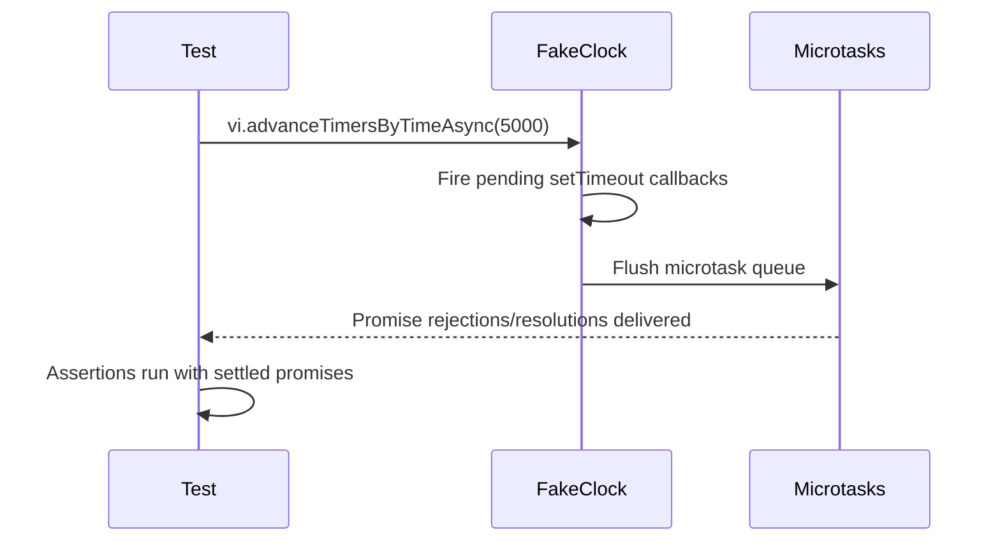

# Shared Utilities -- Testing

This document covers the test infrastructure and patterns specific to the
shared utility modules: slugify, timeout, and prerequisite checker.

## Test files

| Test file | Production module | Tests | Lines (test) | Lines (source) | Category |
|-----------|-------------------|-------|-------------|----------------|----------|
| [`src/tests/slugify.test.ts`](../../src/tests/slugify.test.ts) | [`src/slugify.ts`](../../src/slugify.ts) | 24 | 113 | 31 | Pure logic |
| [`src/tests/timeout.test.ts`](../../src/tests/timeout.test.ts) | [`src/timeout.ts`](../../src/timeout.ts) | ~12 | 190 | 79 | Async + fake timers |
| [`src/tests/prereqs.test.ts`](../../src/tests/prereqs.test.ts) | [`src/helpers/prereqs.ts`](../../src/helpers/prereqs.ts) | 17 | 267 | 98 | Mocking + platform |

## Running the tests

### All project tests

```
npm test
```

### Shared utility tests only

```
npx vitest run src/tests/slugify.test.ts src/tests/timeout.test.ts
```

### Single file

```
npx vitest run src/tests/slugify.test.ts
npx vitest run src/tests/timeout.test.ts
```

### Watch mode

```
npx vitest src/tests/slugify.test.ts
```

## Framework details

The project uses [Vitest](https://vitest.dev/) **v4.0.18**. There is no
`vitest.config.ts` -- Vitest runs with its defaults, discovering `*.test.ts`
files automatically and executing them in Node.js mode with file-level
parallelism.

See the [Testing Overview](../testing/overview.md) for framework-wide details
including debugging and CI integration.

## Test patterns

### Pure function testing (slugify)

The slugify tests are straightforward input/output assertions with no mocking
or setup. Each test calls `slugify(input, maxLength?)` and asserts the
returned string with `expect(...).toBe(...)`. Tests are organized into
`describe` blocks by category:

- Basic transformations
- Unicode handling
- Truncation behavior
- Edge cases (empty input, already-valid input)
- Real-world patterns with specific maxLength values

No `beforeEach` or `afterEach` hooks are needed because the function is pure
and stateless.

### Fake timer testing (timeout)

The timeout tests need to control the passage of time to test deadline
behavior deterministically. They use Vitest's built-in fake timer API:

**Setup and teardown:**

```
beforeEach → vi.useFakeTimers()
afterEach  → vi.useRealTimers()
```

Every test in the file runs with fake timers active, and real timers are
restored after each test to prevent cross-test contamination.

**Advancing time:**

The tests use `vi.advanceTimersByTimeAsync(ms)` (the async variant) to
advance the fake clock. The async variant is required because `withTimeout`
creates real microtask chains via `Promise.then()` -- the synchronous
`vi.advanceTimersByTime()` would advance the clock but not flush the promise
microtask queue, leading to assertions running before the timeout rejection
propagates.

**Why `advanceTimersByTimeAsync` matters:**



Using the synchronous variant would skip the microtask flush step, causing
tests to see unsettled promises.

**The `p.catch(() => {})` pattern:**

The production code in `timeout.ts` includes a no-op `.catch()` on the
internal wrapper promise. When fake timers advance synchronously within a
test, the wrapper promise may reject before the test has attached its own
`.catch()` or `await`. Without the no-op handler, Node.js would emit an
unhandled rejection warning. This pattern is documented in the
[Vitest fake timers guide](https://vitest.dev/guide/mocking#timers) as a
known consideration when testing promise-based timeout logic.

### What is NOT tested

The following edge case is not covered by the current test suite:

- **Trailing hyphen after truncation** in slugify: When `.slice(0, maxLength)`
  lands immediately after a character that was replaced by a hyphen, the
  result ends with a trailing hyphen. The trim step runs before truncation,
  not after. This is cosmetically imperfect but functionally harmless.

### Prerequisite checker testing (prereqs)

The prerequisite checker tests are covered in detail in the
[Prerequisite Checker](../prereqs-and-safety/prereqs.md#testing) documentation.
Key patterns used in this test file:

-   **`vi.mock("node:child_process")`** stubs `execFile` to simulate
    tool-not-found and tool-available scenarios without executing real
    binaries.
-   **`Object.defineProperty(process.versions, "node", ...)`** overrides the
    Node.js version string to simulate version-too-old and version-ok
    scenarios.
-   **Platform-specific assertions:** Six tests verify that all `execFile`
    calls pass `shell: true` on Windows (via
    `process.platform === "win32"` detection). See the
    [Windows shell option](../prereqs-and-safety/prereqs.md#windows-shell-option)
    section for why this is required.

The test suite does not cover `errors.ts` or `guards.ts` directly -- the
`UnsupportedOperationError` class is tested through the markdown datasource
tests (`src/tests/md-datasource.test.ts`) and the `hasProperty` function
is tested through the OpenCode provider tests
(`src/tests/opencode.test.ts`).

## Related documentation

- [Slugify](./slugify.md) -- Slugify function behavior and cross-codebase
  usage
- [Timeout](./timeout.md) -- Timeout function behavior, retry strategy, and
  memory considerations
- [Errors](./errors.md) -- UnsupportedOperationError class (tested via
  datasource tests)
- [Guards](./guards.md) -- hasProperty type guard (tested via provider tests)
- [Prerequisite Checker](../prereqs-and-safety/prereqs.md) -- Detailed
  prereqs documentation including the full test matrix
- [Shared Utilities overview](./overview.md) -- Context for the shared
  utility group
- [Testing Overview](../testing/overview.md) -- Project-wide test framework,
  patterns, and coverage map
- [Parser Tests](../testing/parser-tests.md) -- Parser test suite for
  comparison of pure-function and I/O testing patterns
- [Task Parsing Testing Guide](../task-parsing/testing-guide.md) -- Parser-specific
  testing patterns including temporary file cleanup
- [Configuration Tests](../testing/config-tests.md) -- Config test suite
  demonstrating similar pure-logic and I/O testing patterns
- [Datasource Integrations](../datasource-system/integrations.md) -- Slug
  construction in branch naming that depends on the slugify function
- [Format Utility Tests](../testing/format-tests.md) -- Another example of
  pure-function testing patterns (similar to slugify tests)
- [Spec Generator Tests](../testing/spec-generator-tests.md) -- Test suite
  demonstrating pure-logic validation testing patterns
- [Git & Worktree Testing](../git-and-worktree/testing.md) -- Related test
  suite using similar mocking patterns for `execFile` and `fs/promises`
