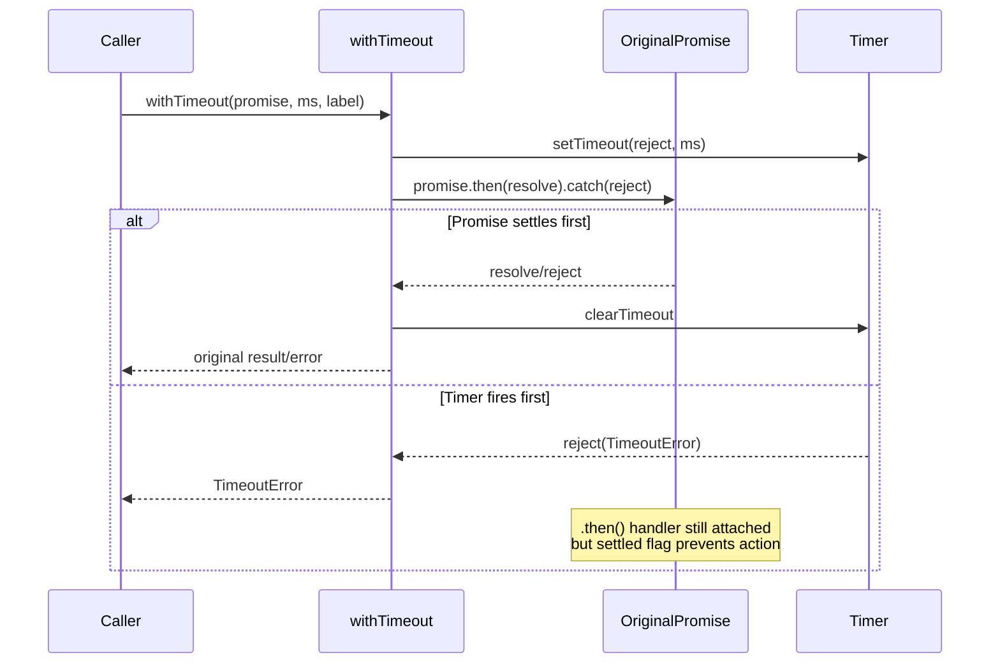

# Timeout

## What it does

The `withTimeout<T>` function in
[`src/helpers/timeout.ts`](../../src/helpers/timeout.ts) wraps any `Promise<T>` with a
deadline. If the wrapped promise does not settle within the specified number
of milliseconds, `withTimeout` rejects with a `TimeoutError` that includes a
human-readable label identifying which operation timed out.

The module exports two symbols:

| Export | Kind | Purpose |
|--------|------|---------|
| `TimeoutError` | Class (extends `Error`) | Typed error with a descriptive message, used by callers to distinguish timeouts from other failures |
| `withTimeout` | Generic async function | Wraps a promise with a deadline and cleanup logic |

## Why it exists

The Dispatch CLI orchestrates long-running async work at multiple boundaries:
planner calls, spec generation attempts, datasource fetches, and provider-side
event waits. Without a timeout mechanism, a single stalled operation could block the entire
[dispatch pipeline](../cli-orchestration/orchestrator.md) with no feedback.

`withTimeout` provides:

- **Bounded execution** -- the orchestrator can enforce a maximum wall-clock
  time per planning attempt, spec attempt, or provider readiness wait.
- **Labeled errors** -- the `TimeoutError` message includes the operation
  label (e.g., `"Plan generation"`) so log output identifies which step
  timed out.
- **Clean resource management** -- the internal `setTimeout` timer is cleared
  as soon as the wrapped promise settles, preventing timer leaks.

## How it works

The function creates a race between the original promise and an internal
`setTimeout`-based rejection:

A `settled` boolean flag ensures that whichever branch fires first prevents
the other from taking effect. This avoids double-resolution and ensures
`clearTimeout` is called when the promise wins the race.

### The no-op `.catch(() => {})` handler

The source includes a `p.catch(() => {})` call on the wrapper promise. This
is a defensive measure to suppress Node.js unhandled rejection warnings that
can occur when fake timers in the test suite advance time synchronously. In
production, the caller always awaits the returned promise, so the handler has
no practical effect.

## Configuration and retry strategy

`withTimeout` itself is a low-level primitive with no configuration. The
timeout duration and retry behavior are configured at the orchestrator level:

| Parameter | CLI flag | Config key | Default | Effect |
|-----------|----------|------------|---------|--------|
| Plan timeout | [`--plan-timeout`](../cli-orchestration/cli.md) | `planTimeout` | **15 minutes** | Converted to ms via `(planTimeout ?? 15) * 60_000` |
| Plan retries | [`--plan-retries`](../cli-orchestration/cli.md) | `planRetries` | **falls back to `--retries`, then shared default 3** (4 total attempts) | Loop runs `(planRetries ?? resolvedRetries) + 1` iterations |
| Spec timeout | [`--spec-timeout`](../cli-orchestration/cli.md) | `specTimeout` | **10 minutes** | Converted to ms via `(specTimeout ?? DEFAULT_SPEC_TIMEOUT_MIN) * 60_000` |
| Spec retries | [`--retries`](../cli-orchestration/cli.md) | `retries` | **3** (4 total attempts) | `withRetry()` wraps the timeout-bounded generation attempt |

The planner retry loop in
[`src/orchestrator/dispatch-pipeline.ts`](../../src/orchestrator/dispatch-pipeline.ts)
(lines 205-241) implements a simple strategy:

1. Call the planning function wrapped in `withTimeout`.
2. On `TimeoutError`, log a warning and **retry immediately** (no backoff).
3. On any other error, **break immediately** without retrying.
4. If all attempts are exhausted, produce a failure result.

There is no exponential backoff, jitter, or circuit-breaker pattern. The
rationale is that planning timeouts are typically caused by transient AI
backend slowness, and an immediate retry is usually sufficient.

The spec pipeline uses the same primitives in a slightly different composition:

1. Build a per-item label such as `specAgent.generate(#42)` or
   `specAgent.generate(/abs/path/to/file.md)`.
2. Wrap `specAgent.generate(...)` in `withTimeout(..., specTimeoutMs, label)`.
3. Wrap that timed call in `withRetry(() => ..., retries, { label })`.
4. Retry immediately on thrown errors, including `TimeoutError`.
5. If retries are exhausted, mark only that item as failed and continue the
   rest of the batch.

This timeout-driven retry loop is intentionally planner-specific for the planning path. It does not
introduce retries for unrelated planner failures.

## Memory considerations

When the timer fires before the original promise settles, the `.then()`
handler attached to the original promise retains a reference to the timer
closure (the timer ID and the `settled` flag). If the original promise never
settles, these references persist for the lifetime of that promise object.

In practice the risk is low:

- The retained references are lightweight (a numeric timer ID and a boolean).
- The `setTimeout` timer has already been cleared by the timeout branch, so
  no timer resource is leaked.
- The real concern would be the original promise itself leaking, which is
  outside the scope of `withTimeout` -- it is the caller's responsibility to
  ensure the underlying operation can be cancelled or will eventually settle.

## Current usage

Current in-repo consumers include:

| Operation | Location | Behavior |
|-----------|----------|----------|
| Plan generation | [`src/orchestrator/dispatch-pipeline.ts`](../../src/orchestrator/dispatch-pipeline.ts) | Bounds planner attempts and feeds retry logic |
| Spec generation attempt | [`src/orchestrator/spec-pipeline.ts`](../../src/orchestrator/spec-pipeline.ts) | Bounds `specAgent.generate(...)` per item before retry |
| Tracker datasource fetch | [`src/orchestrator/spec-pipeline.ts`](../../src/orchestrator/spec-pipeline.ts) | Applies the hardcoded `FETCH_TIMEOUT_MS = 30_000` per fetch |
| Copilot session-ready wait | [`src/providers/copilot.ts`](../../src/providers/copilot.ts) | Fails stalled idle/error waits after 600 seconds |

Other potentially long-running async operations that are **not** timeout-bounded include:

| Operation | Location | Risk |
|-----------|----------|------|
| OpenCode SSE wait loop | [`src/providers/opencode.ts`](../../src/providers/opencode.ts) | Silent but still-open stream can wait until the caller's outer deadline fires |
| Executor dispatch | [`src/orchestrator/dispatch-pipeline.ts`](../planning-and-dispatch/dispatcher.md) | AI agent call, can hang |
| Datasource list operations | [`src/datasources/*.ts`](../datasource-system/overview.md) | Network I/O, can stall |

Adding timeout wrapping to these operations would improve resilience but
would also require corresponding retry logic and error handling.

## Test coverage

The test file
[`src/tests/timeout.test.ts`](../../src/tests/timeout.test.ts)
contains tests covering:

- Successful resolution within the deadline
- Rejection propagation (original promise rejects before timeout)
- Timeout firing and `TimeoutError` construction
- Custom labels in error messages
- Edge cases: already-resolved promises, already-rejected promises, zero
  timeout
- Verification that `clearTimeout` is called on normal resolution

The tests use Vitest fake timers (`vi.useFakeTimers()` /
`vi.useRealTimers()`) to control time deterministically. See
[Testing](./testing.md) for details on the fake timer setup and how to run
these tests.

## Related documentation

- [Shared Utilities overview](./overview.md) -- Context for both shared
  utility modules
- [Slugify](./slugify.md) -- The other shared utility module
- [Testing](./testing.md) -- How to run slugify and timeout tests, fake
  timer details
- [Configuration](../cli-orchestration/configuration.md) -- `planTimeout`,
  `planRetries`, `specTimeout`, and `retries` configuration reference
- [Orchestrator](../cli-orchestration/orchestrator.md) -- The dispatch and spec
  pipelines that consume `withTimeout`
- [Planner](../planning-and-dispatch/planner.md) -- The planning phase
  subject to `withTimeout` deadline enforcement
- [Spec Generation](../spec-generation/overview.md) -- The spec pipeline's
  per-attempt timeout and retry layering
- [Dispatcher](../planning-and-dispatch/dispatcher.md) -- Consumes providers
  whose internal prompt waits may use `withTimeout`
- [Provider Interface](../shared-types/provider.md) -- The `ProviderInstance`
  whose `prompt()` calls may be bounded by provider-local or pipeline-level
  timeout wrappers
- [Provider Tests](../testing/provider-tests.md) -- Unit tests for provider
  implementations that exercise the prompt interface
- [Dispatch Pipeline](../cli-orchestration/dispatch-pipeline.md) -- The
  execution engine that uses `withTimeout` for plan generation deadlines
- [Prerequisite Checker](../prereqs-and-safety/prereqs.md) -- Startup validation
  that runs before timeout-wrapped pipeline operations
- [Architecture & Concurrency](../task-parsing/architecture-and-concurrency.md) --
  Concurrency concerns in the task processing pipeline
