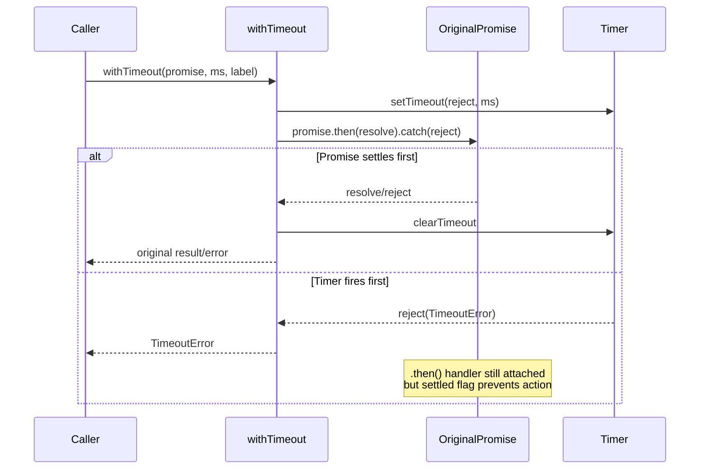

# Timeout

## What it does

The `withTimeout<T>` function in
[`src/timeout.ts`](../../src/timeout.ts) wraps any `Promise<T>` with a
deadline. If the wrapped promise does not settle within the specified number
of milliseconds, `withTimeout` rejects with a `TimeoutError` that includes a
human-readable label identifying which operation timed out.

The module exports two symbols:

| Export | Kind | Purpose |
|--------|------|---------|
| `TimeoutError` | Class (extends `Error`) | Typed error with a descriptive message, used by callers to distinguish timeouts from other failures |
| `withTimeout` | Generic async function | Wraps a promise with a deadline and cleanup logic |

## Why it exists

The Dispatch CLI orchestrates AI agent planning steps that can take minutes
to complete -- or hang indefinitely if the AI backend is unresponsive. Without
a timeout mechanism, a stuck planning call would block the entire
[dispatch pipeline](../cli-orchestration/orchestrator.md) with no feedback.

`withTimeout` provides:

- **Bounded execution** -- the orchestrator can enforce a maximum wall-clock
  time per planning attempt.
- **Labeled errors** -- the `TimeoutError` message includes the operation
  label (e.g., `"Plan generation"`) so log output identifies which step
  timed out.
- **Clean resource management** -- the internal `setTimeout` timer is cleared
  as soon as the wrapped promise settles, preventing timer leaks.

## How it works

The function creates a race between the original promise and an internal
`setTimeout`-based rejection:

A `settled` boolean flag ensures that whichever branch fires first prevents
the other from taking effect. This avoids double-resolution and ensures
`clearTimeout` is called when the promise wins the race.

### The no-op `.catch(() => {})` handler

The source includes a `p.catch(() => {})` call on the wrapper promise. This
is a defensive measure to suppress Node.js unhandled rejection warnings that
can occur when fake timers in the test suite advance time synchronously. In
production, the caller always awaits the returned promise, so the handler has
no practical effect.

## Configuration and retry strategy

`withTimeout` itself is a low-level primitive with no configuration. The
timeout duration and retry behavior are configured at the orchestrator level:

| Parameter | CLI flag | Config key | Default | Effect |
|-----------|----------|------------|---------|--------|
| Plan timeout | [`--plan-timeout`](../cli-orchestration/cli.md) | `planTimeout` | **10 minutes** | Converted to ms via `(planTimeout ?? 10) * 60_000` |
| Plan retries | [`--plan-retries`](../cli-orchestration/cli.md) | `planRetries` | **1** (2 total attempts) | Loop runs `(planRetries ?? 1) + 1` iterations |

The retry loop in
[`src/orchestrator/dispatch-pipeline.ts`](../../src/orchestrator/dispatch-pipeline.ts)
(lines 205-241) implements a simple strategy:

1. Call the planning function wrapped in `withTimeout`.
2. On `TimeoutError`, log a warning and **retry immediately** (no backoff).
3. On any other error, **break immediately** without retrying.
4. If all attempts are exhausted, produce a failure result.

There is no exponential backoff, jitter, or circuit-breaker pattern. The
rationale is that planning timeouts are typically caused by transient AI
backend slowness, and an immediate retry is usually sufficient.

## Memory considerations

When the timer fires before the original promise settles, the `.then()`
handler attached to the original promise retains a reference to the timer
closure (the timer ID and the `settled` flag). If the original promise never
settles, these references persist for the lifetime of that promise object.

In practice the risk is low:

- The retained references are lightweight (a numeric timer ID and a boolean).
- The `setTimeout` timer has already been cleared by the timeout branch, so
  no timer resource is leaked.
- The real concern would be the original promise itself leaking, which is
  outside the scope of `withTimeout` -- it is the caller's responsibility to
  ensure the underlying operation can be cancelled or will eventually settle.

## Operations that could benefit from timeout wrapping

Currently only the plan generation step in
[`dispatch-pipeline.ts`](../planning-and-dispatch/planner.md) uses
`withTimeout`. Other potentially long-running async operations that are
**not** timeout-bounded include:

| Operation | Location | Risk |
|-----------|----------|------|
| Spec agent generation | `src/orchestrator/spec-pipeline.ts` | AI agent call, can hang |
| Executor dispatch | [`src/orchestrator/dispatch-pipeline.ts`](../planning-and-dispatch/dispatcher.md) | AI agent call, can hang |
| Datasource fetch/list | [`src/datasources/*.ts`](../datasource-system/overview.md) | Network I/O, can stall |

Adding timeout wrapping to these operations would improve resilience but
would also require corresponding retry logic and error handling.

## Test coverage

The test file
[`src/tests/timeout.test.ts`](../../src/tests/timeout.test.ts)
contains tests covering:

- Successful resolution within the deadline
- Rejection propagation (original promise rejects before timeout)
- Timeout firing and `TimeoutError` construction
- Custom labels in error messages
- Edge cases: already-resolved promises, already-rejected promises, zero
  timeout
- Verification that `clearTimeout` is called on normal resolution

The tests use Vitest fake timers (`vi.useFakeTimers()` /
`vi.useRealTimers()`) to control time deterministically. See
[Testing](./testing.md) for details on the fake timer setup and how to run
these tests.

## Related documentation

- [Shared Utilities overview](./overview.md) -- Context for both shared
  utility modules
- [Slugify](./slugify.md) -- The other shared utility module
- [Testing](./testing.md) -- How to run slugify and timeout tests, fake
  timer details
- [Configuration](../cli-orchestration/configuration.md) -- `planTimeout` and
  `planRetries` configuration reference
- [Orchestrator](../cli-orchestration/orchestrator.md) -- The dispatch
  pipeline that consumes `withTimeout`
- [Planner](../planning-and-dispatch/planner.md) -- The planning phase
  subject to `withTimeout` deadline enforcement
- [Dispatcher](../planning-and-dispatch/dispatcher.md) -- Uses `Promise.race()`
  pattern similar to timeout wrapping
- [Provider Interface](../shared-types/provider.md) -- The `ProviderInstance`
  whose `prompt()` calls are timeout-wrapped
- [Architecture & Concurrency](../task-parsing/architecture-and-concurrency.md) --
  Concurrency concerns in the task processing pipeline
