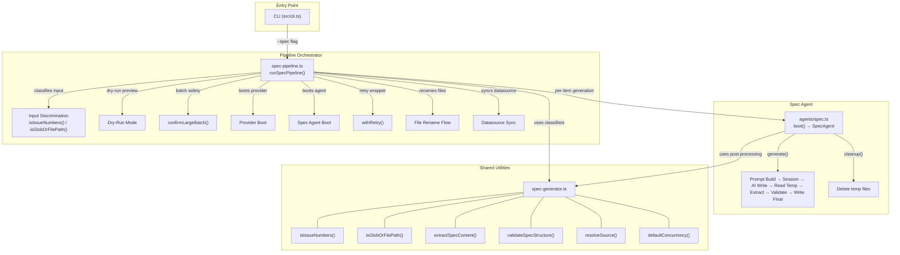
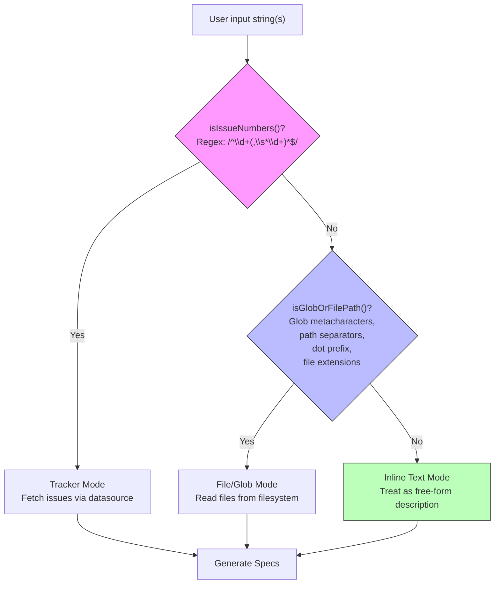
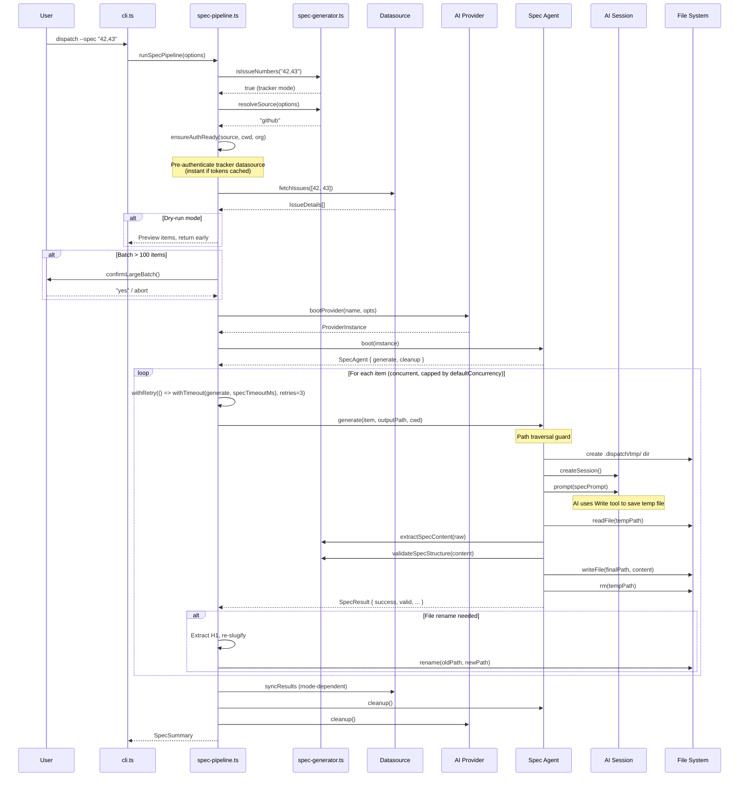
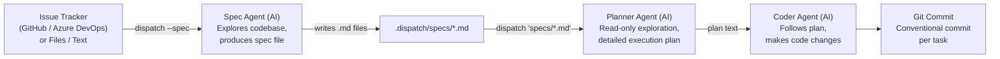

# Spec Generation

The spec generation pipeline converts issue tracker work items, inline text
descriptions, or existing files into high-level markdown specification files
that drive the automated implementation pipeline. It is the `--spec` mode of
the dispatch CLI — a front-end that transforms inputs into structured task
lists suitable for consumption by the main `dispatch` command.

## What it does

The pipeline accepts three distinct input modes and produces structured
markdown specs:

```bash
# Tracker mode — fetch issues from GitHub / Azure DevOps
dispatch --spec 42,43,44

# File/glob mode — transform existing files into specs
dispatch --spec "docs/requirements/*.md"

# Inline text mode — generate a spec from a text description
dispatch --spec "Add user authentication with OAuth2 support"
```

Regardless of input mode, the pipeline:

1. **Discriminates input type** using pattern matching (see
   [Input mode discrimination](#input-mode-discrimination)).
2. **Resolves the datasource** via explicit `--source` flag, git remote
   auto-detection, or fallback heuristics. See
   [Datasource Auto-Detection](../datasource-system/overview.md#auto-detection).
3. **Boots an AI provider** (OpenCode or Copilot) through the
   [provider abstraction](../provider-system/overview.md).
4. **Boots a spec agent** that wraps the provider with spec-specific prompt
   construction, temp-file orchestration, and post-processing.
5. **Generates specs concurrently** in batches, with per-attempt timeout and retry on failure.
6. **Post-processes output** — extracts spec content from AI response,
   validates structure, renames files based on generated H1 title.
7. **Syncs with datasource** — updates tracker issues or manages local files
   depending on mode and datasource type.
8. **Writes spec files** to `.dispatch/specs/` (or a custom `--output-dir`).

## Why it exists

The spec generation pipeline bridges the gap between issue tracking and
automated implementation. Without it, a user would manually translate an
issue's requirements into a structured task file. The spec generator automates
this translation by:

- **Reading the issue context** — description, acceptance criteria, comments,
  labels, and state — so nothing is missed.
- **Accepting multiple input formats** — tracker issues, existing requirement
  files, or free-form text descriptions — giving flexibility in how work is
  defined.
- **Exploring the codebase** — the AI agent reads files, searches for symbols,
  and understands the project's architecture, conventions, and tech stack
  before writing the spec.
- **Staying high-level intentionally** — the spec describes WHAT needs to
  change, WHY it needs to change, and HOW it fits into the existing project,
  but deliberately avoids low-level implementation specifics (exact code, line
  numbers, diffs). This is because a separate
  [planner agent](../planning-and-dispatch/planner.md) runs during `dispatch`
  to produce detailed, line-level implementation plans for each individual
  task.

## Key source files

| File | Role |
|------|------|
| [`src/agents/spec.ts`](../../src/agents/spec.ts) | Spec agent — boot, prompt builders, temp-file orchestration, post-processing |
| [`src/orchestrator/spec-pipeline.ts`](../../src/orchestrator/spec-pipeline.ts) | Pipeline orchestrator — input discrimination, batching, retry, datasource sync |
| [`src/spec-generator.ts`](../../src/spec-generator.ts) | Shared utilities — types, input classifiers, content extraction, validation, concurrency |
| [`src/helpers/retry.ts`](../../src/helpers/retry.ts) | Retry utility — immediate retry with configurable attempts |
| [`src/helpers/confirm-large-batch.ts`](../../src/helpers/confirm-large-batch.ts) | Large batch safety — confirmation prompt for batches over 100 items |
| [`src/helpers/cleanup.ts`](../../src/helpers/cleanup.ts) | Process-level cleanup registry |
| [`src/helpers/slugify.ts`](../../src/helpers/slugify.ts) | Slug generation for spec filenames |

## Architecture overview

The spec generation pipeline is split across three source files with clear
responsibility boundaries:



## Input mode discrimination

The pipeline determines which input mode to use through a three-way
discrimination chain in `src/orchestrator/spec-pipeline.ts`:



### Tracker mode

Triggered when input matches `/^\d+(,\s*\d+)*$/` (comma-separated numbers).

- Fetches issue details via the [datasource system](../datasource-system/overview.md).
- Concurrent batched fetching for multiple issues.
- Filenames: `{id}-{slug}.md` (e.g., `42-add-user-authentication.md`).
- Datasource sync: updates existing issues and deletes local spec files after
  sync (for non-md datasources).

### File/glob mode

Triggered when input contains glob metacharacters (`*`, `?`, `{`, `[`), path
separators (`/`, `\`), dot-prefix (`.`), or common file extensions (`.md`,
`.txt`, etc.). Array inputs always classify as file/glob mode.

- Resolves globs using the [`glob`](https://github.com/isaacs/node-glob)
  package with `{ cwd, absolute: true }`.
- Reads file content from the filesystem.
- With non-md datasource: creates new tracker issues and deletes local files.
- With md datasource: keeps files in-place.

### Inline text mode

Fallback when input matches neither issue numbers nor file/glob patterns.

- Constructs an `IssueDetails` object from the raw text string.
- Generates a slug-based filename: `{slug}.md`.
- No tracker interaction — the text is the entire input.

### Edge cases in input classification

- `isIssueNumbers()` returns `false` for array inputs — arrays always go
  through the glob/file path.
- `isGlobOrFilePath()` returns `true` for arrays — even if array elements
  look like issue numbers.
- A string like `"42"` matches as an issue number. A string like `"42.md"`
  matches as a file path.
- Empty string passes through to inline text mode (the spec agent will return
  an error for missing input).

## End-to-end pipeline flow

The spec generation pipeline involves multiple interacting services. The
following sequence diagram shows the complete data flow from CLI invocation
through all processing stages:



## Two-stage pipeline: spec agent, planner agent, coder agent

The spec generator is the first stage of a three-stage pipeline that converts
issue tracker items into committed code changes:



| Stage | Command | Agent | Output |
|-------|---------|-------|--------|
| 1. Spec | `dispatch --spec 42,43` | Spec agent (this pipeline) | Markdown spec files with `- [ ]` tasks |
| 2. Plan | `dispatch "specs/*.md"` | [Planner agent](../planning-and-dispatch/planner.md) | Detailed execution plan per task |
| 3. Execute | (same command) | [Coder agent](../planning-and-dispatch/dispatcher.md) | Code changes + conventional commits |

**Why stay high-level in the spec?** The spec agent explores the codebase and
understands the architecture, but it intentionally produces strategic guidance
rather than tactical code-level instructions. This is because the planner agent
will re-explore the codebase with the specific context of each individual task,
producing a detailed plan with file paths, code patterns, and step-by-step
implementation guidance that the coder agent follows.

Running the pipeline end-to-end:

```bash
# Stage 1: Generate specs from issues
dispatch --spec 42,43,44

# Stage 2+3: Execute the generated specs
dispatch ".dispatch/specs/*.md"
```

## The spec agent

The spec agent (`src/agents/spec.ts`) is the core AI interaction layer. It
wraps the provider instance with spec-specific behavior.

### Boot and lifecycle

The `boot()` function accepts a `ProviderInstance` and returns a `SpecAgent`
object with two methods:

- **`generate(item, outputPath, cwd)`** — generates a single spec.
- **`cleanup()`** — removes the `.dispatch/tmp/` directory.

### Generation flow

Each call to `generate()` follows this sequence:

1. **Path traversal guard** — validates that `outputPath` is contained within
   `cwd` using `resolve()` + `startsWith(resolvedCwd + sep)`. This guard does
   **not** follow symlinks, so a symlink pointing outside `cwd` would pass
   validation.
2. **Create temp directory** — ensures `.dispatch/tmp/` exists.
3. **Build prompt** — selects one of three prompt builders based on input type:
    - `buildSpecPrompt()` for tracker issues
    - `buildInlineTextSpecPrompt()` for inline text
    - `buildFileSpecPrompt()` for file content
4. **Create AI session** — fresh session per spec.
5. **Send prompt** — all prompts instruct the AI to use its Write tool to save
   the spec to a temp file path within `.dispatch/tmp/`.
6. **Read temp file** — reads the AI-written temp file from disk.
7. **Extract spec content** — `extractSpecContent()` performs 3-stage cleanup:
   strip code fences → remove preamble before H1 → remove postamble after
   last recognized H2 section.
8. **Validate spec structure** — `validateSpecStructure()` checks 3 things:
   starts with H1, has `## Tasks` (exact match), has `- [ ]` after Tasks.
9. **Write final output** — writes post-processed content to the final path.
10. **Delete temp file** — removes the temp file.

### Why a temp file?

The AI writes to a temp file via its Write tool rather than returning content
in its response. This allows the spec agent to apply post-processing
(extraction, validation) before writing the final output file. If the AI were
to write directly to the final path, the post-processing step would require
reading, modifying, and rewriting the file.

### Input validation

If none of the three input modes provides content (no issue details, no inline
text, no file content), the agent returns an error result immediately without
creating an AI session.

### Error diagnostics

If the AI fails to write the expected temp file, the error message includes
the first 300 characters of the AI's response text. This helps diagnose
whether the AI misunderstood the instructions or encountered an error.

For detailed spec agent documentation, see
[Spec Agent](./spec-agent.md).

## Concurrency model

The pipeline processes specs **concurrently** using a capped concurrency model:

### Default concurrency calculation

The `defaultConcurrency()` function (`src/spec-generator.ts`) calculates:

```
Math.max(1, Math.min(cpus().length, Math.floor(freemem() / 1024 / 1024 / 500)))
```

- Minimum: 1 concurrent task.
- Maximum: CPU count OR available memory / 500 MB, whichever is lower.
- The `MB_PER_CONCURRENT_TASK = 500` constant estimates memory usage per AI
  session.

On a machine with 8 CPUs and 4 GB free memory:
`Math.min(8, Math.floor(4096 / 500))` = `Math.min(8, 8)` = 8.

On a machine with 8 CPUs and 2 GB free memory:
`Math.min(8, Math.floor(2048 / 500))` = `Math.min(8, 4)` = 4.

### Throughput and latency expectations

Spec generation throughput depends on the AI provider's response latency,
which dominates the overall time per spec. Typical ranges:

| Factor | Estimate |
|--------|----------|
| AI prompt + response (per spec) | 30 seconds – 5 minutes (model- and issue-complexity-dependent) |
| Datasource fetch (per issue) | < 5 seconds (30-second timeout enforced) |
| Post-processing + file I/O | Negligible (< 100 ms) |
| Provider boot (one-time) | 5–30 seconds |

**Batch throughput formula:**
With concurrency `C` and `N` items, the pipeline processes `ceil(N / C)`
sequential batches. Total wall-clock time is approximately:

```
boot_time + (ceil(N / C) × average_spec_time) + cleanup_time
```

**Large batch interaction:** For batches exceeding 100 items, the
[large batch confirmation](#large-batch-safety) prompt adds an interactive
gate. Beyond the confirmation, there is no special handling — the same
batch-sequential loop runs. Very large batches (500+ items) may encounter:

- **Memory pressure:** Each concurrent AI session consumes memory. The
  `defaultConcurrency()` formula accounts for this, but explicit
  `--concurrency` values that exceed available memory can cause swap thrashing.
- **Provider rate limits:** Some providers throttle concurrent sessions or
  per-minute prompt volume. Rate-limited requests surface as generation
  failures (retried up to `--retries` times).
- **Long running times:** At 2 minutes per spec with concurrency 4, a batch
  of 200 specs takes approximately 100 minutes.

### Retry strategy

Each spec generation is wrapped in `withRetry()` (`src/helpers/retry.ts`) with
`retries = 3` (default). Key characteristics:

- **Immediate retry** — no exponential backoff or delay between attempts.
- Retries `maxRetries` additional times (so up to 4 total attempts with
  `retries = 3`).
- The last error is re-thrown if all attempts fail.
- Applies to each individual spec, not the entire batch.
- Configurable via the `--retries` CLI flag or `retries` option.
- Retry attempts are logged with a `[specAgent.generate(...)]` label for
  diagnostics.

### Spec-generation timeout

Each generation attempt is wrapped in [`withTimeout()`](../shared-utilities/timeout.md)
before `withRetry()` runs. The timeout surface is:

| Setting | CLI flag | Config key | Default |
|---------|----------|------------|---------|
| Spec timeout | `--spec-timeout` | `specTimeout` | 10 minutes |
| Spec warn-phase timeout | `--spec-warn-timeout` | `specWarnTimeout` | 10 minutes |
| Spec kill-phase timeout | `--spec-kill-timeout` | `specKillTimeout` | 10 minutes |

When both warn and kill timeouts are configured, spec generation uses a **two-phase timebox**: the warn-phase timer fires first and sends a time-warning nudge to the running agent via the provider's optional `send()` method; the kill-phase timer fires later and aborts the attempt with a `TimeoutError`. This gives the agent a chance to wrap up before being forcibly terminated.

Implementation details in `src/orchestrator/spec-pipeline.ts`:

- The pipeline computes `specTimeoutMs = (specTimeout ?? DEFAULT_SPEC_TIMEOUT_MIN) * 60_000` once at startup.
- Each item attempt is labeled as `specAgent.generate(#<id>)` in tracker mode or
  `specAgent.generate(<filepath>)` in file/inline mode.
- The orchestration order is `withRetry(() => withTimeout(specAgent.generate(...), specTimeoutMs, label), retries, { label })`.

That ordering gives spec generation its resilience model:

- **Per-attempt deadline** -- every retry gets its own full timeout budget.
- **Per-item failure semantics** -- if all attempts time out or throw, only that
  item becomes a failure.
- **Batch continuation** -- other items in the same batch keep running and later
  batches still execute.
- **Partial progress preservation** -- completed specs still write, sync, and
  appear in the final summary even when some items exhaust their retries.

### Fetch timeout

Datasource fetch operations in tracker mode are wrapped in [`withTimeout()`](../shared-utilities/timeout.md)
with a hardcoded `FETCH_TIMEOUT_MS = 30000` (30 seconds). This prevents a
single slow or hung datasource call from blocking the entire pipeline. If a
fetch exceeds 30 seconds, it is aborted and the item is marked as failed.
This timeout is **not configurable** via CLI flags and is separate from the
user-configurable generation timeout above.

## Dry-run mode

When `--dry-run` is passed, the pipeline previews what would be generated
without booting the provider, creating AI sessions, or writing files:

- Lists all items that would be processed.
- Shows filenames that would be generated.
- Returns early before provider boot — no AI costs or side effects.

This is useful for verifying input classification and issue fetching before
committing to a full generation run.

## Large batch safety

The `confirmLargeBatch()` function (`src/helpers/confirm-large-batch.ts`,
see also [Batch Confirmation](../prereqs-and-safety/confirm-large-batch.md))
provides a safety gate for large batches:

- **Threshold:** `LARGE_BATCH_THRESHOLD = 100` items.
- If the batch size exceeds 100, the user must type `"yes"` at an interactive
  prompt (via `@inquirer/prompts` `input()` function).
- Returns `true` immediately if count ≤ threshold.
- This prevents accidental processing of massive batches that could consume
  significant AI resources.

## File rename flow

After a spec is generated, the pipeline extracts the H1 title from the output
and re-slugifies it. If the resulting filename differs from the original
(which was based on the issue title or input slug), the file is renamed:

1. Read the generated spec file.
2. Extract the first H1 heading (`# Title`) using the [`extractTitle()`](../datasource-system/markdown-datasource.md#title-extraction) function.
3. Generate a new slug from the H1 title using [`slugify()`](../shared-utilities/slugify.md).
4. If the new path differs from the original path, rename the file.

This ensures filenames reflect the AI-generated title (which may be more
descriptive than the original issue title).

### Filename collision risk

The pipeline does **not** check for existing files before writing or renaming.
Collisions can occur in two scenarios:

1. **Tracker mode:** Two issues with different IDs but identical AI-generated
   H1 titles would produce the same renamed filename. The second rename
   overwrites the first. In practice this is unlikely because the issue ID
   prefix (`{id}-`) is part of the original name, and the rename only changes
   the slug portion.
2. **Inline text mode:** Two inline text inputs that slugify to the same
   string (e.g., `"Add auth"` and `"add auth!"`) would produce the same
   filename. The second write overwrites the first.

**Mitigation:** Use distinct input text, or use tracker mode where issue IDs
provide natural uniqueness. The `--output-dir` flag can also separate runs.

## Content extraction and validation

### `extractSpecContent()` — 3-stage cleanup

The extraction function (`src/spec-generator.ts`) processes raw AI output
through three stages:

1. **Strip code fences** — removes markdown code block wrappers (`` ```markdown
   ... ``` ``) that some models add around the entire output.
2. **Remove preamble** — strips any text before the first H1 heading (`# ...`).
   The AI sometimes generates conversational text before the actual spec.
3. **Remove postamble** — strips any text after the last recognized H2 section.
   The recognized H2 headings are: Context, Why, Approach, Integration Points,
   Tasks, References, Key Guidelines (the `RECOGNIZED_H2` set in
   `src/spec-generator.ts`).

### `validateSpecStructure()` — 3-check validation

Validation checks (`src/spec-generator.ts`):

1. **Starts with H1** — the spec must begin with a `# ` heading.
2. **Has `## Tasks`** — exact heading match required.
3. **Has `- [ ]` after Tasks** — at least one checkbox task item must follow
   the Tasks heading.

**Important:** Validation failures are **warnings, not errors**. A failed
validation produces `valid: false` in the result but `success: true`. The
spec file is still written. This design choice avoids discarding otherwise
useful AI output due to minor formatting issues.

## Datasource sync

After all specs are generated, the pipeline syncs results with the datasource:

### Tracker mode sync

- **Non-md datasource** (GitHub, Azure DevOps): Updates existing tracker
  issues with spec content, then deletes the local spec file.
- **Md datasource**: Keeps the local file in place.

### File mode sync

- **Non-md datasource**: Creates new tracker issues from the generated specs,
  then deletes the local spec files.
- **Md datasource**: Keeps files in-place (no sync needed).

## Spec file output

### Output directory

Generated spec files are written to `.dispatch/specs/` relative to the working
directory by default. The directory is created automatically via
`mkdir(outputDir, { recursive: true })` if it does not exist.

To change the output location, use `--output-dir`:

```bash
dispatch --spec 42,43 --output-dir ./my-specs
```

### Directory structure created by spec generation

Spec generation creates and uses up to three subdirectories within
`.dispatch/`:

| Directory | Purpose | Lifecycle |
|-----------|---------|-----------|
| `.dispatch/specs/` | Final generated spec files (default output) | Persists until consumed by `dispatch` or manually deleted |
| `.dispatch/tmp/` | Temporary AI-written files (UUID-named, e.g., `spec-a1b2c3d4.md`) | Cleaned per-spec by `rm()`; directory removed by `cleanup()` at pipeline end |
| `.dispatch/logs/` | Per-issue log files (e.g., `issue-42.log`) when `--verbose` is set | Persists indefinitely; no automatic cleanup |

The `.dispatch/tmp/` directory may accumulate orphaned files if the process
crashes before cleanup runs. These can be safely deleted manually.

### File naming convention

Naming varies by input mode:

| Mode | Pattern | Example |
|------|---------|---------|
| Tracker | `{id}-{slug}.md` | `42-add-user-authentication.md` |
| Inline text | `{slug}.md` | `add-user-authentication-with-oauth2.md` |
| File/glob | Varies | Based on source filename |

The [`slugify()`](../shared-utilities/slugify.md) utility generates slugs by:
- Converting to lowercase
- Replacing non-alphanumeric characters with hyphens
- Removing leading/trailing hyphens
- Truncating to `MAX_SLUG_LENGTH = 60` characters

## AI prompt structure

The spec agent builds prompts via three specialized functions in
`src/agents/spec.ts`:

### `buildSpecPrompt()` — tracker issues

Includes issue number, title, state, URL, labels, description, acceptance
criteria, and discussion comments. Sections are conditionally included only
when data is present.

### `buildInlineTextSpecPrompt()` — inline text

Constructs a prompt from the raw text string, treating it as the issue
description.

### `buildFileSpecPrompt()` — file content

Includes both the file path and its content in the prompt.

### Common prompt elements

All three prompt builders share:

1. **Role definition:** "You are a spec agent."
2. **Pipeline context:** Explains the downstream planner + coder agents.
3. **Working directory:** The `cwd` path for codebase exploration.
4. **Write instruction:** Instructs the AI to use its Write tool to save
   the spec to a specific temp file path.
5. **Output format template:** The expected markdown structure (Context, Why,
   Approach, Integration Points, Tasks, References).
6. **Task execution tags:** `(P)` for parallel, `(S)` for sequential, `(I)`
   for independent — defined at lines 318-348 of `src/agents/spec.ts`.
7. **Key guidelines:** Stay high-level, respect the project stack, explain
   WHAT/WHY/HOW strategically, keep tasks atomic.

### Output format

The generated spec follows this structure:

```markdown
# <Title>

> <One-line summary>

## Context
<Relevant codebase modules, architecture, patterns>

## Why
<Motivation and user/system benefit>

## Approach
<High-level implementation strategy>

## Integration Points
<Modules, interfaces, conventions to align with>

## Tasks
- [ ] (P) First task (parallelizable)
- [ ] (S) Second task (sequential, depends on first)
- [ ] (I) Third task (independent)

## References
- <Links to docs, related issues, resources>
```

The `## Tasks` section contains GitHub-style checkbox items (`- [ ] ...`) with
optional execution tags that the main `dispatch` command treats as individual
units of work.

## Cleanup

The pipeline performs cleanup in two stages at the end of processing:

1. **Spec agent cleanup** — `specAgent.cleanup()` removes the `.dispatch/tmp/`
   directory. Wrapped in try/catch — failures are logged but do not throw.
2. **Provider cleanup** — `instance.cleanup()` shuts down the AI provider
   server. Also wrapped in try/catch.

The [cleanup registry](../shared-types/cleanup.md) provides a safety net:
even if an unhandled error occurs after the provider is booted, the top-level
error handler will drain the registry before exiting.

### Lazy model detection

The pipeline logs the AI model name once it becomes available. At header time,
the model may not yet be known (before the first AI interaction). The pipeline
checks at lines 352-355 of `src/orchestrator/spec-pipeline.ts` and logs the
model once detected.

## Error handling and exit codes

### Per-item error accumulation

The spec generator uses a "catch and continue" pattern. Each item is processed
independently, and failures do not block subsequent items:

- **Fetch failures:** If an issue cannot be fetched, it is recorded with an
  error message. Processing continues.
- **Generation failures:** If the AI returns empty content, the session fails,
  the temp file is not written, or the per-attempt spec timeout fires, the
  error is caught, retried up to 3 times by default, then recorded as failed.
  Processing continues.
- **Path traversal failures:** If the output path resolves outside `cwd`, the
  generation returns an error immediately without creating an AI session.
- **All fetches fail:** If no items could be prepared at all, the pipeline
  aborts before booting the AI provider.

### Exit code behavior

| Outcome | Exit code |
|---------|-----------|
| All specs generated successfully | `0` |
| Some specs generated, some failed | `1` |
| All specs failed | `1` |
| Dry-run mode | `0` |

### Validation failures do not affect exit codes

Since validation failures produce `success: true` with `valid: false`, they
do **not** contribute to the failed count and do not affect the exit code.
Validation warnings are logged but treated as informational.

## Source detection

The `resolveSource()` function (`src/spec-generator.ts`) determines the
datasource through a priority chain:

1. **Explicit `--source` flag** — used directly if provided.
2. **Auto-detect from git** — reads `git remote get-url origin` and matches
   against known hostname patterns (github.com, dev.azure.com,
   visualstudio.com).
3. **Fallback for non-issue inputs** — returns `"md"` for file/glob and
   inline text inputs (no tracker needed).
4. **Null for issue inputs** — returns `null` if auto-detection fails for
   issue inputs, causing the pipeline to abort.

See [Datasource Auto-Detection](../datasource-system/overview.md#auto-detection)
for the full pattern table, URL format support, and limitation details.

## Security considerations

### Path traversal guard

The spec agent validates output paths at `src/agents/spec.ts:90-102`:

```
resolve(outputPath).startsWith(resolvedCwd + sep)
```

**Limitation:** This check uses `resolve()` which does **not** follow
symlinks. A symlink within `cwd` that points outside it would pass the
validation. For most use cases this is acceptable since spec output paths
are programmatically generated, not user-supplied directory traversal strings.

### Temp file security

Temp files are written to `.dispatch/tmp/` within the project directory, not
to the system temp directory (`/tmp`). This avoids cross-user temp file
attacks but means the project directory must be writable.

## Related documentation

- [Spec Agent](./spec-agent.md) — Detailed spec agent implementation
  (boot, prompt builders, temp-file orchestration, post-processing)
- [Integrations & Troubleshooting](./integrations.md) — External dependencies,
  auth, and troubleshooting for the spec pipeline
- [Issue Fetching](../issue-fetching/overview.md) — How issues are retrieved
  and normalized from GitHub and Azure DevOps
- [Azure DevOps Fetcher (Deprecated)](../issue-fetching/azdevops-fetcher.md) —
  Legacy shim for Azure DevOps work item fetching
- [Datasource System](../datasource-system/overview.md) — Datasource
  interface, registry, and auto-detection
- [Azure DevOps Datasource](../datasource-system/azdevops-datasource.md) —
  Azure DevOps work item CRUD operations consumed by spec generation
- [Markdown Datasource](../datasource-system/markdown-datasource.md) —
  Local-first datasource for managing generated spec files
- [Datasource Integrations](../datasource-system/integrations.md) — How
  datasource integrations consume generated specs
- [Provider Abstraction & Backends](../provider-system/overview.md) —
  AI provider setup and session model
- [Adding a Provider](../provider-system/adding-a-provider.md) — How new
  providers integrate with the spec pipeline
- [Cleanup Registry](../shared-types/cleanup.md) — How provider cleanup is
  registered and drained on exit
- [CLI Argument Parser](../cli-orchestration/cli.md) — Full CLI option reference
  including `--spec` mode
- [Planning & Dispatch Pipeline](../planning-and-dispatch/overview.md) — How
  generated spec files are consumed downstream
- [Dispatcher](../planning-and-dispatch/dispatcher.md) — How the dispatcher
  executes tasks from generated specs
- [Slugify Utility](../shared-utilities/slugify.md) — The `slugify()` function
  used for spec filename generation
- [Timeout Utility](../shared-utilities/timeout.md) — `withTimeout` deadline
  wrapper used across the pipeline
- [Shared Interfaces & Utilities](../shared-types/overview.md) — Shared types
  used by the spec pipeline (provider, cleanup, logger, format)
- [Task Parsing & Markdown](../task-parsing/overview.md) — How the generated
  `- [ ]` task items are parsed by the dispatch pipeline
- [Markdown Syntax Reference](../task-parsing/markdown-syntax.md) — Exact
  checkbox syntax and `(P)`/`(S)`/`(I)` mode prefixes produced by spec generation
- [Configuration](../cli-orchestration/configuration.md) — Persistent config
  defaults that affect `--spec` mode (provider, source)
- [Architecture Overview](../architecture.md) — System-wide design and
  pipeline topology
- [Spec Generator Tests](../testing/spec-generator-tests.md) — Unit and
  integration tests for the spec generation pipeline
- [Prerequisites & Safety Checks](../prereqs-and-safety/overview.md) —
  Environment validation (Node.js version, git, CLI tools) that runs before
  the spec pipeline boots
- [Batch Confirmation](../prereqs-and-safety/confirm-large-batch.md) —
  The safety prompt for large batches referenced by `confirmLargeBatch()`
  in the pipeline
- [Planner Agent](../planning-and-dispatch/planner.md) — The downstream
  planner that consumes generated specs in the two-phase
  planner-then-executor architecture
