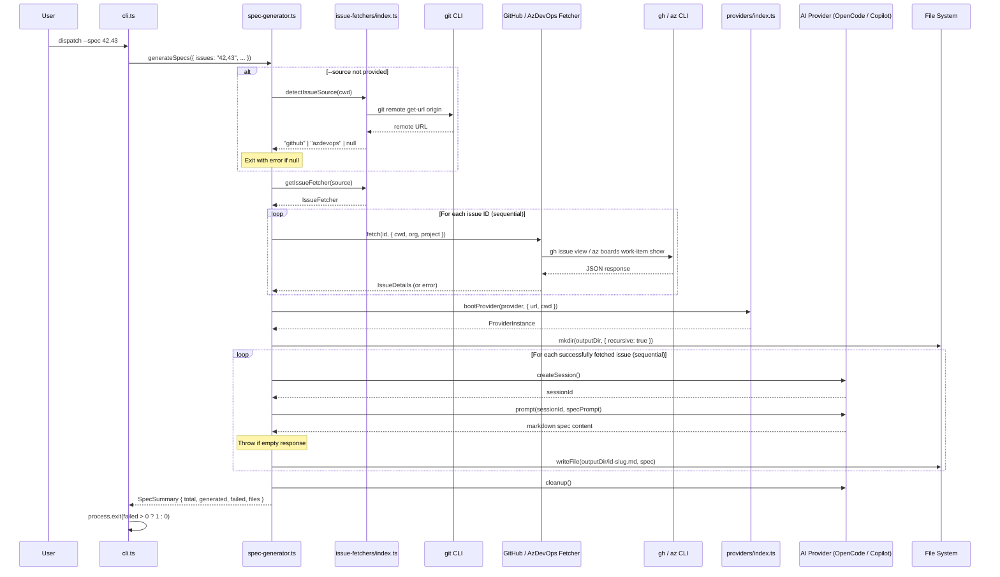
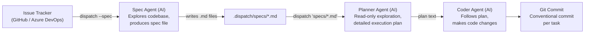
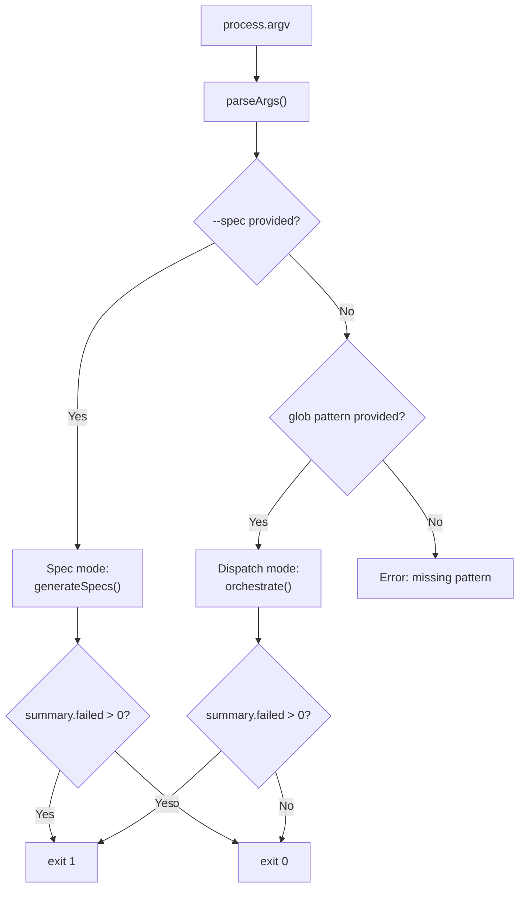

# Spec Generation

The spec generation pipeline converts issue tracker work items into high-level
markdown specification files that drive the automated implementation pipeline.
It is the `--spec` mode of the dispatch CLI -- a front-end that transforms
issue descriptions into structured task lists suitable for consumption by the
main `dispatch` command.

## What it does

When a user runs `dispatch --spec 42,43,44`, the pipeline:

1. **Detects the issue source** from the git remote URL, or accepts an explicit
   `--source` flag.
2. **Fetches each issue's details** via a pluggable
   [issue fetcher](../issue-fetching/overview.md) (`gh` CLI for GitHub,
   `az` CLI for Azure DevOps).
3. **Boots an AI provider** (OpenCode or Copilot) through the
   [provider abstraction](../provider-system/provider-overview.md).
4. **Prompts the AI** in a fresh session per issue, instructing it to explore
   the codebase and produce a strategic spec file.
5. **Writes the spec files** to `.dispatch/specs/` (or a custom `--output-dir`).

The generated specs follow a structured markdown format (Context, Why,
Approach, Integration Points, Tasks, References) and are designed to be
consumed directly by `dispatch "path/to/specs/*.md"` to drive the full
implementation pipeline.

## Why it exists

The spec generation pipeline bridges the gap between issue tracking and
automated implementation. Without it, a user would manually translate an
issue's requirements into a structured task file. The spec generator automates
this translation by:

- **Reading the issue context** -- description, acceptance criteria, comments,
  labels, and state -- so nothing is missed.
- **Exploring the codebase** -- the AI agent reads files, searches for symbols,
  and understands the project's architecture, conventions, and tech stack
  before writing the spec.
- **Staying high-level intentionally** -- the spec describes WHAT needs to
  change, WHY it needs to change, and HOW it fits into the existing project,
  but deliberately avoids low-level implementation specifics (exact code, line
  numbers, diffs). This is because a separate
  [planner agent](../planning-and-dispatch/planner.md) runs during `dispatch`
  to produce detailed, line-level implementation plans for each individual
  task.

## Key source files

| File | Role |
|------|------|
| `src/cli.ts` | CLI entry point -- parses `--spec` and related flags, delegates to `generateSpecs()` |
| `src/spec-generator.ts` | Core pipeline -- orchestrates detection, fetching, AI prompting, and file output |
| `src/issue-fetcher.ts` | `IssueDetails`, `IssueFetcher`, and `IssueSourceName` type definitions |
| `src/issue-fetchers/index.ts` | Fetcher registry, auto-detection, `ISSUE_SOURCE_NAMES` |

## End-to-end pipeline flow

The spec generation pipeline involves multiple interacting services. The
following sequence diagram shows the complete data flow from CLI invocation
through issue fetching, AI prompting, and file output:



## Two-stage pipeline: spec agent, planner agent, coder agent

The spec generator is the first stage of a three-stage pipeline that converts
issue tracker items into committed code changes:



| Stage | Command | Agent | Output |
|-------|---------|-------|--------|
| 1. Spec | `dispatch --spec 42,43` | Spec agent (this pipeline) | Markdown spec files with `- [ ]` tasks |
| 2. Plan | `dispatch "specs/*.md"` | [Planner agent](../planning-and-dispatch/planner.md) | Detailed execution plan per task |
| 3. Execute | (same command) | [Coder agent](../planning-and-dispatch/dispatcher.md) | Code changes + conventional commits |

**Why stay high-level in the spec?** The spec agent explores the codebase and
understands the architecture, but it intentionally produces strategic guidance
rather than tactical code-level instructions. This is because the planner agent
will re-explore the codebase with the specific context of each individual task,
producing a detailed plan with file paths, code patterns, and step-by-step
implementation guidance that the coder agent follows.

Running the pipeline end-to-end:

```bash
# Stage 1: Generate specs from issues
dispatch --spec 42,43,44

# Stage 2+3: Execute the generated specs
dispatch ".dispatch/specs/*.md"
```

## Issue source detection

When `--source` is not provided, the spec generator calls
`detectIssueSource(cwd)` to determine which issue tracker to use. This
function:

1. Runs `git remote get-url origin` in the working directory.
2. Tests the returned URL against patterns in order (first match wins):

| Pattern | Detected source | Example URLs |
|---------|----------------|-------------|
| `/github\.com/i` | `github` | `https://github.com/owner/repo`, `git@github.com:owner/repo.git` |
| `/dev\.azure\.com/i` | `azdevops` | `https://dev.azure.com/org/project` |
| `/visualstudio\.com/i` | `azdevops` | `https://org.visualstudio.com/project` |

3. Returns `null` if no pattern matches.

**Both HTTPS and SSH URLs are supported.** The regex tests for the hostname
string anywhere in the URL, so `git@github.com:owner/repo.git` matches
`github.com` just as `https://github.com/owner/repo` does.

### What happens when detection fails

If the git remote URL does not match any known pattern and `--source` is not
specified, `generateSpecs()` at `src/spec-generator.ts:88-95`:

1. Logs a descriptive error message listing supported sources and suggesting
   `--source`.
2. Returns immediately with all issues marked as failed
   (`{ total: N, generated: 0, failed: N, files: [] }`).
3. The CLI exits with code `1`.

Detection also fails (returns `null`) if:
- The working directory is not a git repository.
- No `origin` remote is configured.
- The `git` command is not available on PATH.

In all these cases, the same error message is displayed. Use `--source` to
bypass auto-detection entirely.

## Spec file output

### Output directory

Generated spec files are written to `.dispatch/specs/` relative to the working
directory by default. The directory is created automatically via
`mkdir(outputDir, { recursive: true })` if it does not exist.

To change the output location, use `--output-dir`:

```bash
dispatch --spec 42,43 --output-dir ./my-specs
```

The `--output-dir` value is resolved to an absolute path by the CLI argument
parser (`src/cli.ts:127`).

### File naming convention

Each spec file is named `<issue-id>-<slug>.md` where:

1. `<issue-id>` is the issue number (e.g., `42`).
2. `<slug>` is derived from the issue title by:
    - Converting to lowercase
    - Replacing non-alphanumeric characters with hyphens
    - Removing leading/trailing hyphens
    - Truncating to 60 characters

**Example:** Issue #42 titled "Add user authentication flow" produces
`42-add-user-authentication-flow.md`.

**Collision risk:** The issue ID prefix mitigates collisions. Two issues with
similar titles (e.g., "Fix login bug" and "Fix login bug (part 2)") produce
different filenames because their IDs differ (`42-fix-login-bug.md` vs
`43-fix-login-bug-part-2.md`). The only collision scenario is processing the
same issue ID twice in a single invocation, which would overwrite the first
file.

### Filesystem permissions

The output directory requires write permission for the current user. The
`mkdir` call needs permission to create directories in the parent path (or the
directory must already exist). Individual spec files are written with
`writeFile(filepath, spec, "utf-8")`.

## Sequential processing

The spec generator processes issues **sequentially** in two places:

1. **Issue fetching** (`src/spec-generator.ts:109`): A `for` loop fetches
   issues one at a time.
2. **Spec generation** (`src/spec-generator.ts:137`): Another `for` loop
   generates specs one at a time.

**Why not parallel?** Sequential processing is a deliberate choice:

- **Issue fetching:** The `gh` and `az` CLI tools may not handle concurrent
  invocations gracefully. Both tools read from the same credential store, and
  concurrent `execFile` calls could produce interleaved JSON output in error
  scenarios. Sequential fetching also provides clear, ordered log output.
- **Spec generation:** Each spec generation creates a fresh AI session and
  sends a large prompt. Sequential processing avoids overwhelming the provider
  with concurrent sessions, prevents context window exhaustion across
  simultaneous sessions, and produces clear per-issue log output. The AI agent
  also explores the filesystem during spec generation, and concurrent sessions
  could interfere with each other's exploration.
- **Error accumulation:** Both loops use a try/catch pattern that records
  failures and continues with the remaining issues. Sequential processing makes
  error accumulation straightforward -- each issue is either fetched/generated
  or it is not, and the final summary counts are accurate.

## AI prompt structure

The `buildSpecPrompt()` function (`src/spec-generator.ts:219-333`) constructs
a detailed prompt that instructs the AI to explore the codebase and produce a
structured spec file.

### Prompt sections

1. **Role definition:** "You are a **spec agent**" -- establishes the agent's
   identity and purpose.
2. **Pipeline context:** Explains the two-stage downstream pipeline (planner
   agent + coder agent) so the AI understands why its output should stay
   high-level.
3. **Issue details:** Includes issue number, title, state, URL, labels,
   description, acceptance criteria, and discussion comments. Sections are
   conditionally included only when data is present (e.g., acceptance criteria
   is omitted for GitHub issues).
4. **Working directory:** The `cwd` path so the AI knows where to explore.
5. **Instructions:** A five-step process:
    1. Explore the codebase (read files, search symbols, understand structure)
    2. Understand the issue (description, criteria, comments)
    3. Research the approach (docs, libraries, patterns)
    4. Identify integration points (modules, interfaces, conventions)
    5. DO NOT make any changes
6. **Output format:** A template showing the exact markdown structure the AI
   should produce (Context, Why, Approach, Integration Points, Tasks,
   References).
7. **Key guidelines:** Constraints on staying high-level, respecting the
   project's stack, explaining WHAT/WHY/HOW strategically, keeping tasks
   atomic, and outputting only markdown content.

### Why the prompt stays high-level

The prompt explicitly instructs the AI to avoid code snippets, exact line
numbers, and step-by-step coding instructions. This is because:

- The planner agent will re-explore the codebase with the context of each
  individual `- [ ]` task and produce detailed plans.
- The spec agent sees the entire issue, while the planner sees only one task
  at a time (with filtered context). Detailed line-level instructions in the
  spec would duplicate work and potentially conflict with the planner's
  findings.
- High-level specs are more resilient to codebase changes between spec
  generation and execution.

### Output format

The generated spec follows this structure:

```markdown
# <Issue title> (#<number>)

> <One-line summary>

## Context
<Relevant codebase modules, architecture, patterns>

## Why
<Motivation and user/system benefit>

## Approach
<High-level implementation strategy>

## Integration Points
<Modules, interfaces, conventions to align with>

## Tasks
- [ ] First task
- [ ] Second task
- [ ] ...

## References
- <Links to docs, related issues, resources>
```

The `## Tasks` section contains GitHub-style checkbox items (`- [ ] ...`) that
the main `dispatch` command treats as individual units of work.

## Provider interaction

The spec generator interacts with the AI provider through the same
`ProviderInstance` interface used by the
[dispatch pipeline](../planning-and-dispatch/overview.md):

1. **Boot:** `bootProvider(provider, { url: serverUrl, cwd })` at
   `src/spec-generator.ts:129`.
2. **Create session:** `instance.createSession()` per issue at
   `src/spec-generator.ts:197`.
3. **Prompt:** `instance.prompt(sessionId, prompt)` at
   `src/spec-generator.ts:199`.
4. **Cleanup:** `instance.cleanup()` at `src/spec-generator.ts:163`.

The `--server-url` option works the same way as in dispatch mode -- it
connects to an already-running provider server instead of spawning one. See
the [Provider overview](../provider-system/provider-overview.md) for backend
setup and connection details.

### Supported AI providers

Two backends are currently supported:

| Provider | Flag | Default |
|----------|------|---------|
| OpenCode | `--provider opencode` | Yes (default) |
| Copilot | `--provider copilot` | No |

The `--provider` flag is validated against `PROVIDER_NAMES` at
`src/cli.ts:144-148`. For adding a new provider, see the
[Adding a Provider guide](../provider-system/adding-a-provider.md).

### Empty response handling

If the AI provider returns an empty response (null, undefined, or
whitespace-only), `generateSingleSpec()` throws an error:
`"AI returned an empty spec"` (`src/spec-generator.ts:202-204`).

This error is caught by the per-issue try/catch at
`src/spec-generator.ts:140-158`, which logs the failure, increments the
`failed` counter, and continues processing remaining issues. The failed
issue does not produce an output file.

### Token limits and large prompts

The spec prompt can be large -- it includes the full issue description,
acceptance criteria, discussion comments, and detailed instructions. There is
**no size validation or truncation** of the prompt before it is sent to the
provider.

If the prompt exceeds the provider's context window:
- **OpenCode:** Behavior depends on the underlying model configuration.
- **Copilot:** Behavior depends on the GitHub Copilot backend model.

The provider may truncate, return an error, or produce degraded output.
Dispatch does not detect or handle this condition. If issues have extremely
long descriptions or many comments, consider splitting them or summarizing
before using `--spec`.

## Error handling and exit codes

### Per-issue error accumulation

The spec generator uses a "catch and continue" pattern. Each issue is
processed independently, and failures do not block subsequent issues:

- **Fetch failures:** If an issue cannot be fetched (auth error, issue not
  found, CLI tool missing), it is recorded with `details: null` and an error
  message. Processing continues with remaining issues.
- **Generation failures:** If the AI returns an empty response or the session
  fails, the error is caught and the `failed` counter is incremented.
  Processing continues.
- **All fetches fail:** If no issues could be fetched at all, the pipeline
  aborts before booting the AI provider to avoid unnecessary resource usage.

### Exit code behavior

The CLI at `src/cli.ts:194` exits with code `1` if `summary.failed > 0`:

| Outcome | Exit code |
|---------|-----------|
| All specs generated successfully | `0` |
| Some specs generated, some failed | `1` |
| All specs failed | `1` |
| No issue numbers provided | `0` (empty summary, no failures) |

There is no distinction between partial failure and total failure in the exit
code. Use the log output to determine which specific issues failed and why.

### Provider cleanup

Unlike the [dispatch orchestrator's cleanup gap](../cli-orchestration/orchestrator.md#the-cleanup-gap),
the spec generator calls `instance.cleanup()` on the success path at
`src/spec-generator.ts:163`. However, if an unhandled error occurs after the
provider is booted (e.g., `mkdir` fails), the cleanup call may be skipped.
The top-level `.catch()` handler in `src/cli.ts:218-220` will catch the error
and exit, potentially leaving orphaned provider processes.

## CLI spec mode vs dispatch mode

The CLI determines which mode to run based on the presence of the `--spec`
flag (`src/cli.ts:182-216`):



When `--spec` is present, the glob pattern is not required. All dispatch-specific
options (`--dry-run`, `--no-plan`, `--concurrency`) are accepted by the parser
but ignored in spec mode. The shared options (`--provider`, `--server-url`,
`--cwd`) apply to both modes.

## Related documentation

- [Issue Fetching](../issue-fetching/overview.md) -- How issues are retrieved
  and normalized from GitHub and Azure DevOps
- [GitHub Fetcher](../issue-fetching/github-fetcher.md) -- GitHub CLI
  integration, setup, and troubleshooting
- [Azure DevOps Fetcher](../issue-fetching/azdevops-fetcher.md) -- Azure CLI
  integration, setup, and troubleshooting
- [Integrations & Troubleshooting](./integrations.md) -- External dependencies,
  auth, and troubleshooting for the spec pipeline
- [Provider Abstraction & Backends](../provider-system/provider-overview.md) --
  AI provider setup and session model
- [CLI Argument Parser](../cli-orchestration/cli.md) -- Full CLI option reference
  including `--spec` mode
- [Planning & Dispatch Pipeline](../planning-and-dispatch/overview.md) -- How
  generated spec files are consumed downstream
- [Architecture Overview](../architecture.md) -- System-wide design and
  pipeline topology
